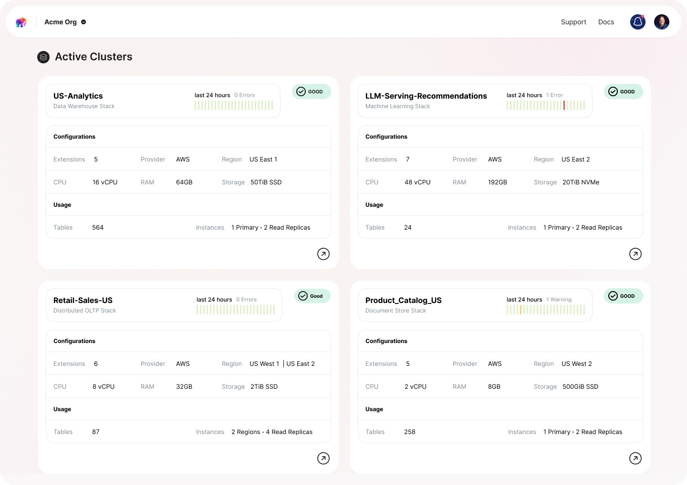

Hello, world :) We are thrilled to announce the launch of our new startup, Tembo, and our mission to build a game-changing managed Postgres service.

## Background

While wrapping up my involvement in my previous company, I learned about the rich Postgres extension ecosystem, and was drawn to an idea that these extensions represent a big opportunity to expand the use cases for Postgres—maybe even collapse the modern data stack into a Postgres-centric platform, and eliminate a lot of unnecessary and expensive data movement.The vast majority of developers and companies primarily use "Vanilla" Postgres. This is partly because the current user experience of discovering, installing, and gaining proficiency in Postgres extensions is subpar—especially compared to other ecosystems. This has been voiced by many community members. As such, most existing managed services offer only a sliver of the potential value that extensions could provide.

## We've started a company

Tembo’s mission is to continuously improve the dev experience of Postgres, especially in the area of expanded use cases that rely on community extensions.Postgres is the most loved database by a long shot, and all Postgres users (including me) owe a huge debt of gratitude to all the companies and people who have invested into Postgres over the past 26 years. Our goal is to serve the Postgres community in an increasingly valuable manner.Our mission is to empower developers and businesses worldwide with the full power of Postgres and its extensions ecosystem, enabling users to use Postgres for a growing number of use cases.

## We've raised some money

We have raised a $6.5M seed round led by Venrock, with participation from CincyTech and Wireframe Ventures, and other influential tech angel investors, and we've already got a team of 10 working on our SaaS product and related open-source projects.
We've been building a product

We are building what we hope will be a world-class managed Postgres service:

* Use any extension, even custom or private extensions
* Provide UI for popular extensions, and a framework to include the community in those efforts
* Stacks - packaging of extensions, tools and configurations, to make it easy to get started using Postgres for specific new use cases
* An intelligent advisor that helps you to better use the features that you’re already using in Postgres

The Tembo team is incredibly excited to share our platform with you as we enter our closed beta period, and support your journey towards data-driven success. 

We invite you to join our waitlist to access the future of database management.