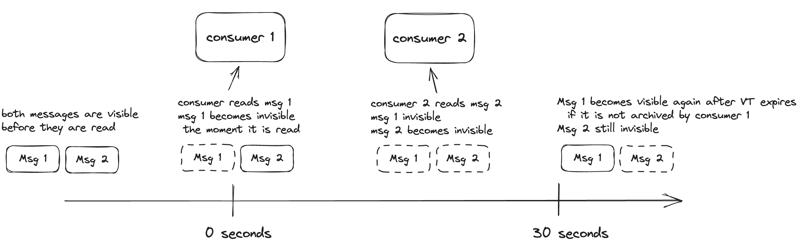

# Introducing PGMQ: Simple Message Queues built on Postgres

We’ve released a packaged extension for message queues on Postgres. People have been implementing queues on Postgres in many different ways and we’re excited about combining lessons learned from those projects into a simple, feature-rich extension named PGMQ. Some of the exciting features of the project include:

* Guaranteed exactly-once delivery of messages within a visibility timeout
* Optional archival of messages retention for replayability and retention
* Familiar SQL interface
* Single and Batch read of messages
* Client SDKs in both Rust and Python for an ORM-like feel

## The need for message queues

Message queues are a very common architectural feature to manage operational pipelines, particularly within the context of asynchronous tasks and distributed systems. There are several messaging queue solutions available in the market (Kafka, RSMQ, RabbitMQ, SQS); however, when adopting one of these technologies, you increase your cognitive load, required skills and production support overhead.

## Build your queues on Postgres

As a Postgres startup, we had the same issue, and we decided to build our own Message Queue based on Postgres. We are not the first: others have implemented queues on Postgres, and many have written about it including [Dagster](https://dagster.io/blog/skip-kafka-use-postgres-message-queue), [CrunchyData](https://www.crunchydata.com/blog/message-queuing-using-native-postgresql), and [PostgresFM](https://postgres.fm/episodes/queues-in-postgres) dedicated an entire podcast episode to them.

At Tembo, we needed a job queue to manage tasks between our control-plane and data-plane in our managed cloud offering. Our control-plane publishes tasks like “create postgres cluster”, or “update postgres cluster”. To keep our architecture simple and reduce technology sprawl, we built a Postgres extension that we call PGMQ so that we could run queues for our cloud and more easily share the implementation with the community.

## Queues Implemented with best practices

PGMQ was implemented on Postgres and follows industry best practices. One of the most important practices is the use of Postgres’s SKIP LOCKED, which is similar to NOWAIT in other databases. SKIP LOCKED helps ensure that messages are not duplicated on read. PGMQ also supports partitioning, which is particularly beneficial for large queues and can be used to tackle bloat.

PGMQ also provides exactly once delivery semantics within a visibility timeout. Similar to Amazon’s SQS and RSMQ, PGMQ consumers set the period of time during which Postgres will prevent all consumers from receiving and processing a message. This is done by the consumer on read, and once the visibility timeout expires the message becomes available for consumption once again. That way, if a consumer crashes, there is no data loss, however messages are read by only a single consumer during the specified visibility timeout. This effectively means at-least-once delivery semantics once the first visibility timeout has expired.



## Using PGMQ

To get started, check out our project’s [README](https://github.com/tembo-io/pgmq/blob/main/README.md#installation) for a guide on installing the extension.

You can create a new queue by simply calling

```sql
SELECT pgmq_create('my_queue');
```

Then, send a couple messages to the queue. The message id is returned from the send() function.

```sql
SELECT * from pgmq_send('my_queue', '{"foo": "bar1"}');
SELECT * from pgmq_send('my_queue', '{"foo": "bar2"}');
```

```text
 pgmq_send
-----------
         1
(1 row)

 pgmq_send
-----------
         2
(1 row)
```

Read `2` messages from the queue. Make them invisible for `30` seconds. If the messages are not deleted or archived within 30 seconds, they will become visible again and can be read by another consumer.

```sql
SELECT * from pgmq_read('my_queue', 30, 2);
```

```text
 msg_id | read_ct |              vt               |          enqueued_at          |    message
--------+---------+-------------------------------+-------------------------------+---------------
      1 |       1 | 2023-02-07 04:56:00.650342-06 | 2023-02-07 04:54:51.530818-06 | {"foo":"bar1"}
      2 |       1 | 2023-02-07 04:56:00.650342-06 | 2023-02-07 04:54:51.530818-06 | {"foo":"bar2"}
```

If the queue is empty, or if all messages are currently invisible, no rows will be returned.

```sql
SELECT * from pgmq_read('my_queue', 30, 1);
```

```text
 msg_id | read_ct | vt | enqueued_at | message
--------+---------+----+-------------+---------
```

`Archiving` removes the message from the queue and inserts it to the queue’s archive table. This provides you with an opt-in retention mechanism for messages, and is an excellent way to debug applications.

Archive the message with id 2.

```sql
SELECT * from pgmq_archive('my_queue', 2);
```

Then inspect the message on the archive table.

```sql
SELECT * from pgmq_my_queue_archive;
```

```text
 msg_id | read_ct |         enqueued_at          |          deleted_at           |              vt               |     message     
--------+---------+------------------------------+-------------------------------+-------------------------------+-----------------
      2 |       1 | 2023-04-25 00:55:40.68417-05 | 2023-04-25 00:56:35.937594-05 | 2023-04-25 00:56:20.532012-05 | {"foo": "bar2"}```
```

Alternatively, you can delete a message forever.

```sql
SELECT * from pgmq_send('my_queue', '{"foo": "bar3"}');
```

```text
 pgmq_send
-----------
         3
(1 row)
```

```sql
SELECT pgmq_delete('my_queue', 3);
```

```text
 pgmq_delete
-------------
 t
 ```

## Stay tuned

Give us a [star](https://github.com/tembo-io/pgmq) and try out PGMQ by cloning the [repo](https://github.com/tembo-io/pgmq) and following the example in the README. Please use Github issues if you run into any issues or have any feedback. We’ve also built client side libraries in [Rust](https://github.com/tembo-io/pgmq/tree/main/core) and [Python](https://github.com/tembo-io/pgmq/tree/main/tembo-pgmq-python), which will give you an ORM-like experience.

You can install PGMQ in your own Postgres instance or run it in the [Tembo Cloud](https://tembo.io/) as part of the [Message Queue Stack](https://tembo.io/docs/stacks/message-queue). Tembo Cloud’s Message Queue Stack is powered by PGMQ, but also ships with Postgres configurations optimized for message queue workloads. We’re also working on adding metrics specific to message queues.

Interested in learning more about Postgres extensions? Stay tuned for our upcoming post [pg_later](https://github.com/tembo-io/pg_later), an extension we built on top of PGMQ as well as benchmarks comparing PGMQ to [SQS](https://aws.amazon.com/sqs/) and [Redis](https://redis.com/).
