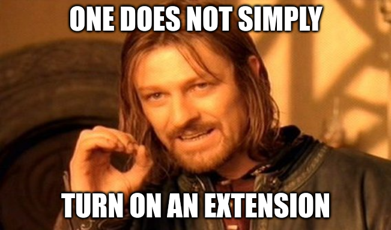

Before working for a Postgres company, I had never used extensions.

Now, I'm part of a team working to fully automate turning on any extension. I didn't find great resources to explain the process of turning on an extension, and why it varies between different extensions.

**I want to share my mental model for the different types of extensions, how to know what type of extension you're working with, and how to get it turned on.**

## Turn on an extension



**Turning on an extension:**

- Find the extension you want
- Figure out how to build it
- Sometimes, installation of dependencies (for example with *apt-get* or *yum*)
- Sometimes, installation of other extensions (*goto* ‘figure out how to build it’)
- Install your extension
- Sometimes, configuring `LOAD` (for example, with `shared_preload_libraries` - more on this later)
- Sometimes, provide extension-specific configurations
- Sometimes, run `CREATE EXTENSION` to enable it

Building and installing extensions is well covered by other resources. In this blog, I want to focus on steps to get an extension up and running after it's installed, and how **I believe that all extensions fit into four mostly-neat categories.**

### Terminology

Extensions consist of **SQL** and / or **libraries**.

A **library** simply means compiled code, for example written in [C](https://www.postgresql.org/docs/current/xfunc-c.html) or [Rust](https://github.com/pgcentralfoundation/pgrx).

**[SQL objects](https://www.postgresql.org/docs/current/extend-extensions.html#:~:text=A%20useful%20extension%20to%20PostgreSQL,package%20to%20simplify%20database%20management.)**, let's just call it SQL, are extensions of SQL, for example new functions and data types. These are often implemented by a library, but can also be implemented in other ways, for example using a procedural language like [PL/pgSQL](https://www.postgresql.org/docs/current/plpgsql.html).

**Hooks:** A Postgres feature informally called *hooks* can be used to connect into Postgres' existing functionality. Hooks allow for overwriting default Postgres functionality, or calling back into an extension's code at the appropriate time. For example, a hook modifying Postgres start up behavior can launch a background worker.

:::note
On the note of terminology, sometimes extensions are instead referred to as 'modules', but I like to simply refer to everything as an 'extension', but feel free to @ me on X to tell me I am wrong ([@sjmiller609](https://twitter.com/sjmiller609)).
:::

## Four buckets

A big part of what I have been working on is fully automating enabling any extension. In order to do that, we have to understand exactly how extensions vary. I think that we can break it down into a 2x2 matrix by defining two boolean categories.

Requires [LOAD](https://www.postgresql.org/docs/current/sql-load.html) true or false and requires [CREATE EXTENSION](https://www.postgresql.org/docs/current/sql-createextension.html) true or false:

|                             | Requires `CREATE EXTENSION`                                                 | Does not require `CREATE EXTENSION`                           |
|-----------------------------|-----------------------------------------------------------------------------|---------------------------------------------------------------|
| **Requires `LOAD`**         | Extensions that use SQL and their libraries have hooks that require restart | Extensions that do not use SQL, may or may not have hooks     |
| **Does not require `LOAD`** | SQL-only extensions, and SQL + libraries without hooks that require restart | Output plugins                                                |

*Perhaps it's not so bad after all...*


### LOAD

 [LOAD](https://www.postgresql.org/docs/current/sql-load.html) is the command that tells Postgres to **load** a library, meaning make the code accessible to Postgres by loading the compiled code on disk into memory.

For example, if you installed the extension [auto explain](https://pgt.dev/extensions/auto_explain), then you may have a library file called `auto_explain.so` in your library directory, which can be found with [pg_config --pkglibdir](https://pgpedia.info/d/dynamic_library_path.html). Libraries are not always named exactly the same as the extension.

```
$ trunk install auto_explain

Using pkglibdir: /var/lib/postgresql/data/tembo/15/lib

[+] auto_explain.so => /var/lib/postgresql/data/tembo/15/lib
```

```
$ ls $(pg_config --pkglibdir) | grep auto_explain
auto_explain.so
```

Auto explain can be loaded into your session like `LOAD 'auto_explain';`. This command will always match exactly the name of the library file, less the file type, in this example `.so`. With a [couple of configurations](https://www.postgresql.org/docs/current/auto-explain.html#AUTO-EXPLAIN-EXAMPLE), now this extension will automatically log the [EXPLAIN ANALYZE](https://www.postgresql.org/docs/current/sql-explain.html) output for log-running queries.

```
postgres=# LOAD 'auto_explain';
LOAD
```

However, the `LOAD` command is not typically used directly, and many extensions require you do not load them in this way. Instead, typically a Postgres configuration like [shared_preload_libraries](https://pgpedia.info/s/shared_preload_libraries.html) is used.
```
postgres=# LOAD 'pg_cron';
ERROR:  pg_cron can only be loaded via shared_preload_libraries
HINT:  Add pg_cron to the shared_preload_libraries configuration variable in postgresql.conf.
```

:::info
Extensions that require a `LOAD` can always be configured in `shared_preload_libraries`, but this configuration requires a restart to take effect. Some extensions can be loaded without a restart using `LOAD` directly, but in this case it's better to use the `session_preload_libraries` configuration, and [reload Postgres configuration](https://pgpedia.info/p/pg_reload_conf.html) with `SELECT pg_reload_conf();`.
:::

### CREATE EXTENSION

When you run [CREATE EXTENSION](https://www.postgresql.org/docs/current/sql-createextension.html), this basically just runs an extension's SQL script. The script will typically create new SQL objects such as functions, data types, operators and so on.

`CREATE EXTENSION` looks at the extension's **control file**, which is installed to the `extension` directory of **sharedir**.

```
$ trunk install pg_jsonschema;

Using pkglibdir: "/var/lib/postgresql/data/tembo/15/lib"
Using sharedir: "/var/lib/postgresql/data/tembo"

[+] pg_jsonschema.so => /var/lib/postgresql/data/tembo/15/lib
[+] extension/pg_jsonschema--0.1.4.sql => /var/lib/postgresql/data/tembo
[+] extension/pg_jsonschema.control => /var/lib/postgresql/data/tembo
```

**sharedir** can be located with `pg_config --sharedir`
```
$  ls $(pg_config --pkglibdir) | grep pg_jsonschema
pg_jsonschema.so

$ ls $(pg_config --sharedir)/extension | grep pg_jsonschema
pg_jsonschema--0.1.4.sql
pg_jsonschema.control
```

The information in a control file is used to determine what start up or upgrade scripts to run. We'll cover upgrades in-depth in a future blog, so let's focus on first-time enabling. For example, in the above installation output, we notice a file `pg_jsonschema--0.1.4.sql`. Postgres knows to run this because the name of the control file matches the name of the script suffixed by the `default_version` defined in the control file.

```
$ cat $(pg_config --sharedir)/extension/pg_jsonschema.control
comment = 'JSON schema validation on json and jsonb data types'
default_version = '0.1.4'
module_pathname = '$libdir/pg_jsonschema'
relocatable = false
superuser = true
```

When running `CREATE EXTENSION`, the extension name always matches exactly the name of a control file, less the `.control` file type.
```
postgres=# CREATE EXTENSION pg_jsonschema;
CREATE EXTENSION
```

I mentioned that a startup script creates new SQL, including new funcitons. For example in the case of [pg_jsonschema](https://pgt.dev/extensions/pg_jsonschema), the startup script `pg_jsonschema--0.1.4.sql` includes the following SQL to create a new function called `jsonb_matches_schema`. Even though we have a library file, we don't need `LOAD` because `CREATE FUNCTION` is another way to load code from a file.

[CREATE FUNCTION ... AS 'obj_file' documentation](https://www.postgresql.org/docs/current/sql-createfunction.html)
> obj_file is the name of the shared library file containing the compiled [code]

```
CREATE FUNCTION "jsonb_matches_schema"(
        "schema" json,
        "instance" jsonb
) RETURNS bool
IMMUTABLE STRICT
LANGUAGE c
AS 'MODULE_PATHNAME', 'jsonb_matches_schema_wrapper';
```

:::info
You can always know whether or not an extension requires `CREATE EXTENSION` by the presence of a control file in `$(pg_config --sharedir)/extension`
:::

### How do I know if I need a LOAD?

**You only need to do both `CREATE EXTENSION` and `LOAD` when an extension uses hooks that require restart.**

You have to discover this for each extension by reading the documentation for that extension, and sometimes by an error message or hint if you run `CREATE EXTENSION` before you loaded the library.

For example, in the case of both `pg_cron` and `pg_partman`, there are a background workers. These are examples of extensions using hooks in the startup process of Postgres. So, in both of these cases the user is expected to configure `shared_preload_libraries` to start the background worker, then run `CREATE EXTENSION` on a cluster where that background worker is already running.

:::info
The only reason an extension would require both `CREATE EXTENSION` and `LOAD` is if the load has to be performed when Postgres starts, in other words using hooks that require restart. These are configured in `shared_preload_libraries`.
:::

**`LOAD` is also sometimes required just because there isn't a control file.**

In some cases it's simpler to omit the control file. This is when there is no need for SQL or version upgrade handling.

In the case of `auto_explain`, it does not use hooks that require a restart. In this case, there is no control file and no extra SQL objects to be created. So `LOAD` is required simply because we have to load it into memory somehow. To demonstrate, it is possible to make a control file for auto_explain to allow for `CREATE EXTENSION` behavior instead of `LOAD`:

**auto_explain.control:**
```
comment = 'auto explain'
default_version = '0.0.1'
module_pathname = '$libdir/auto_explain'
relocatable = false
superuser = true
```

**auto_explain--0.0.1.sql**
```
LOAD 'auto_explain';
```

```
postgres=# CREATE EXTENSION auto_explain;
CREATE EXTENSION

postgres=# \dx
                     List of installed extensions
      Name       | Version |   Schema   |         Description
-----------------+---------+------------+------------------------------
 auto_explain    | 0.0.1   | public     | auto explain
 plpgsql         | 1.0     | pg_catalog | PL/pgSQL procedural language
(2 rows)

postgres=# SET auto_explain.log_min_duration = 0;
SET
postgres=# SET auto_explain.log_analyze = true;
SET
```
After running the above, now my subsequent queries have their `EXPLAIN ANALYZE` logged.

So, if that could work, **why not just have control files for all extensions**? This sort of comes back to 'modules' versus 'extensions' for some people. Other than terminology, when you have a control file, you also have to write upgrade scripts for every new version. In the case of pg_cron, we can find all these files in **sharedir**. When enabling version 1.5, it will run `pg_cron--1.0.sql`, then each migration script up to 1.5.
```
pg_cron--1.0--1.1.sql
pg_cron--1.0.sql
pg_cron--1.1--1.2.sql
pg_cron--1.2--1.3.sql
pg_cron--1.3--1.4.sql
pg_cron--1.4-1--1.5.sql
pg_cron--1.4--1.4-1.sql
pg_cron.control
```

Since that's not really applicable on auto_explain, since it's just logging outputs and there is nothing to migrate or handle between versions, it's just cleaner to not have a control file. Upgrading auto_explain only involves replacing the library, then loading it again.

:::info
Upgrade logic is not applicable for extensions that do not require `CREATE EXTENSION`. These cases just involve re-loading a new version of the library.
:::

### Output plugins

There are some extensions, for example [wal2json](https://pgt.dev/extensions/wal2json) that require neither `CREATE EXTENSION` or `LOAD`. In all known cases so far, these are [output plugins](https://www.postgresql.org/docs/current/logicaldecoding-output-plugin.html). I think it's more of a stretch to call these 'extensions', but since they provide additional functionality to Postgres, that counts in my book.

In the case of output plugins, the library is loaded when a replication slot is created:

[Postgresql documentation](https://www.postgresql.org/docs/current/logicaldecoding-example.html)
```
SELECT * FROM pg_create_logical_replication_slot('regression_slot', 'test_decoding', false, true);
```

## Installing extensions

Some of the above examples use the free and open source [Trunk project](https://pgt.dev) that Tembo created, which allows us to skip the build process. Also, I am starting from one of Tembo’s container images to handle the system dependencies installation. I wrote [this guide for trying out extensions locally](https://tembo.io/docs/tembo-cloud/try-extensions-locally). If you have any issues just reach out on our [community Slack channel](https://join.slack.com/t/tembocommunity/shared_invite/zt-20v3m8pwz-pPjeFaWSM~Bt3KUqDXff2A) and we can help.

## Automate everything

We want to make it possible to automatically install and turn on any Postgres extension. For this reason, we are seeking to qualify all known extensions by these two dimensions: `CREATE EXTENSION` true or false, and requires `LOAD` true or false. To enable the community, that metadata is being published on Trunk. On [Tembo Cloud](https://cloud.tembo.io), we leverage that information to automatically enable extensions.

## Dear experts, tell me how I'm wrong (seriously!)

I'm serious that I want you to tell me where this is incorrect! If you're a Postgres extensions expert, please reach out on X [@sjmiller609](https://twitter.com/sjmiller609) and tell me what you think, even if it's just minor correction or subjective information. I hope we can help make a simple and comprehensive explaination of what it takes to get extensions turned on.
