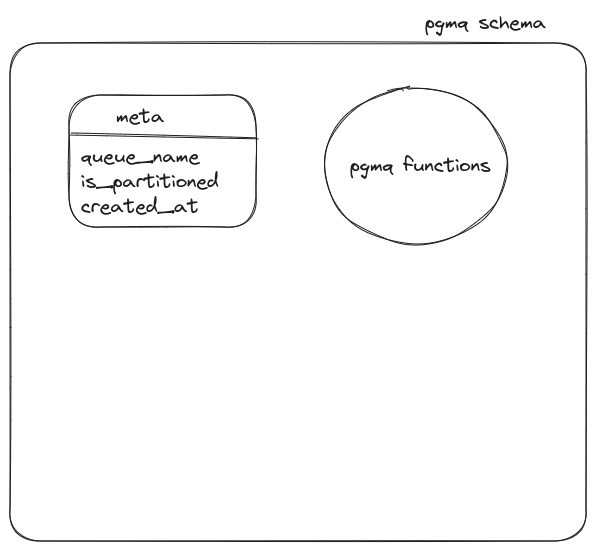
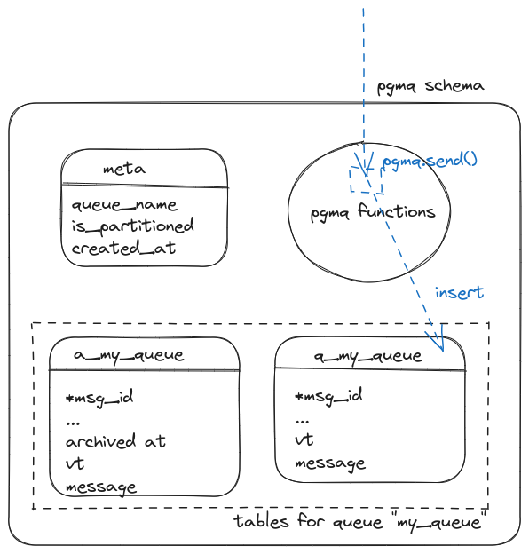
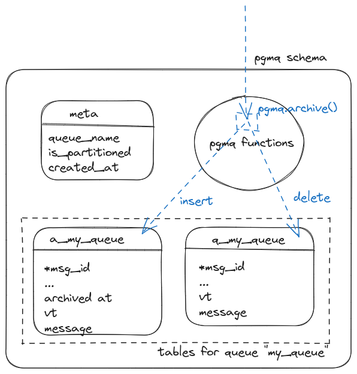

In my [previous submission](https://tembo.io/blog/pgmq-with-python) to this space, I described my experience with [pgmq](https://github.com/tembo-io/pgmq) while using the Python library. In this post, I'll share what I found after inspecting the code.

So, first, I'll describe the general structure of the project. Then, I'll explain what happens when we install the pgmq extension. Finally, I'll describe how some of its functions work.

In this post, I'll be using version v0.25.0, which you can find [here](https://github.com/tembo-io/pgmq/releases/tag/v0.25.0).


## Project structure
After cloning the appropriate tag, we can see that the repository contains the following files:

```bash
$ ls -1
Cargo.lock
Cargo.toml
CONTRIBUTING.md
core
Dockerfile.build
examples
images
LICENSE
Makefile
pgmq.control
pgmq-rs
README.md
sql
src
tembo-pgmq-python
tests
```

The project uses [pgrx](https://github.com/pgcentralfoundation/pgrx). From pgrx's [README](https://github.com/pgcentralfoundation/pgrx/blob/develop/README.md), we know that the relevant files for the extension are `Cargo.toml`, `pgmq.control` and the `src` and `sql` directories:

```bash
$ tree sql src
sql
├── pgmq--0.10.2--0.11.1.sql
├── pgmq--0.11.1--0.11.2.sql
...
├── pgmq--0.8.0--0.8.1.sql
├── pgmq--0.8.1--0.9.0.sql
└── pgmq--0.9.0--0.10.2.sql
src
├── api.rs
├── errors.rs
├── lib.rs
├── metrics.rs
├── partition.rs
├── sql_src.sql
└── util.rs

0 directories, 7 files
```

## Installing the pgmq extension

:::note 
This section assumes that you have successfully installed the pre-requisites as described in [CONTRIBUTING.md](https://github.com/tembo-io/pgmq/blob/main/CONTRIBUTING.md)
:::

To build the pgmq extension, we can do the following:

```bash
cargo build
```

Alternatively, to build and install the pgmq extension, we can do:

```bash
cargo pgrx install
```

In either case, we can see a shared library `pgmq.so` being created. The installation process also places the shared library in the `lib` directory of the postgres installation; and the sql files and the control file in the `extensions` directory. In my case:

```
$ ls -1 /opt/postgres/share/extension/pgmq*
/opt/postgres/share/extension/pgmq--0.10.2--0.11.1.sql
...
/opt/postgres/share/extension/pgmq--0.9.0--0.10.2.sql
/opt/postgres/share/extension/pgmq.control

$ ls -1 /opt/postgres/lib/pgmq*
/opt/postgres/lib/pgmq.so
```
To test the extension, we can do:

```bash
cargo pgrx run
```
and it'll start a `psql` prompt. In the prompt, we can execute the `create extension` statement to start using pgmq:

```sql
-- List installed extensions
\dx

-- Enable pgmq
create extension pgmq;

-- List installed extensions again
\dx
```

The output will look something like:
```
pgmq=# \dx
                 List of installed extensions
  Name   | Version |   Schema   |         Description
---------+---------+------------+------------------------------
 plpgsql | 1.0     | pg_catalog | PL/pgSQL procedural language
(1 row)

pgmq=# create extension pgmq;
CREATE EXTENSION

pgmq=# \dx
                                     List of installed extensions
  Name   | Version |   Schema   |                             Description
---------+---------+------------+---------------------------------------------------------------------
 pgmq    | 0.25.0  | public     | A lightweight message queue. Like AWS SQS and RSMQ but on Postgres.
 plpgsql | 1.0     | pg_catalog | PL/pgSQL procedural language
(2 rows)
```

We can also list the available functions:

```sql
-- List available functions under pgmq schema
\df pgmq.*
```

```
pgmq=# \df pgmq.*
                                                                         List of functions
 Schema |          Name          |                                                                         Result data type                                                                         |                                                 Argument data types                                                  | Type 
--------+------------------------+------------------------------------------------------------------------------------------------------------------------------------------------------------------+----------------------------------------------------------------------------------------------------------------------+------
 pgmq   | archive                | boolean                                                                                                                                                          | queue_name text, msg_id bigint                                                                                       | func
 pgmq   | archive                | TABLE(archive boolean)                                                                                                                                           | queue_name text, msg_ids bigint[]                                                                                    | func
 pgmq   | create                 | void                                                                                                                                                             | queue_name text                                                                                                      | func
 pgmq   | create_non_partitioned | void                                                                                                                                                             | queue_name text                                                                                                      | func
 pgmq   | create_partitioned     | void                                                                                                                                                             | queue_name text, partition_interval text DEFAULT '10000'::text, retention_interval text DEFAULT '100000'::text       | func
 pgmq   | delete                 | boolean                                                                                                                                                          | queue_name text, msg_id bigint                                                                                       | func
 pgmq   | delete                 | TABLE(delete boolean)                                                                                                                                            | queue_name text, msg_ids bigint[]                                                                                    | func
 pgmq   | drop_queue             | boolean                                                                                                                                                          | queue_name text, partitioned boolean DEFAULT false                                                                   | func
 pgmq   | list_queues            | TABLE(queue_name text, created_at timestamp with time zone)                                                                                                      |                                                                                                                      | func
 pgmq   | metrics                | TABLE(queue_name text, queue_length bigint, newest_msg_age_sec integer, oldest_msg_age_sec integer, total_messages bigint, scrape_time timestamp with time zone) | queue_name text                                                                                                      | func
 pgmq   | metrics_all            | TABLE(queue_name text, queue_length bigint, newest_msg_age_sec integer, oldest_msg_age_sec integer, total_messages bigint, scrape_time timestamp with time zone) |                                                                                                                      | func
 pgmq   | pop                    | TABLE(msg_id bigint, read_ct integer, enqueued_at timestamp with time zone, vt timestamp with time zone, message jsonb)                                          | queue_name text                                                                                                      | func
 pgmq   | purge_queue            | bigint                                                                                                                                                           | queue_name text                                                                                                      | func
 pgmq   | read                   | TABLE(msg_id bigint, read_ct integer, enqueued_at timestamp with time zone, vt timestamp with time zone, message jsonb)                                          | queue_name text, vt integer, "limit" integer                                                                         | func
 pgmq   | read_with_poll         | TABLE(msg_id bigint, read_ct integer, enqueued_at timestamp with time zone, vt timestamp with time zone, message jsonb)                                          | queue_name text, vt integer, "limit" integer, poll_timeout_s integer DEFAULT 5, poll_interval_ms integer DEFAULT 250 | func
 pgmq   | send                   | bigint                                                                                                                                                           | queue_name text, message jsonb, delay integer DEFAULT 0                                                              | func
 pgmq   | send_batch             | TABLE(msg_id bigint)                                                                                                                                             | queue_name text, messages jsonb[], delay integer DEFAULT 0                                                           | func
 pgmq   | set_vt                 | TABLE(msg_id bigint, read_ct integer, enqueued_at timestamp with time zone, vt timestamp with time zone, message jsonb)                                          | queue_name text, msg_id bigint, vt_offset integer                                                                    | func
(18 rows)
```

With this, we can now explore the extension from the inside. And, if needed, recompile and reinstall the extension to play with it.


## The internals

We know that when an extension is created with pgrx, it generates a `lib.rs` file. Let us explore it.

One of the first thing we can see, is that the other five files in the `src/` directory are included:

```rust
pub mod api;
pub mod errors;
pub mod metrics;
pub mod partition;
pub mod util;
```

After reviewing these files a little bit, we can notice that there's also some relevant code in another module, the one in `core/`. For example, in `src/partition.rs`:

```rust
use pgmq_core::{
    errors::PgmqError,
    query::{
        assign_archive, assign_queue, create_archive, create_archive_index, create_index,
        create_meta, grant_pgmon_meta, grant_pgmon_queue, grant_pgmon_queue_seq, insert_meta,
    },
    types::{PGMQ_SCHEMA, QUEUE_PREFIX},
    util::CheckedName,
};
```

So, at this point we know that we can find the source code in two places: `src/` and `core/`. 

If we continue exploring `lib.rs`, we can see that a sql file (`sql_src.sql`) is executed when the extension is enabled:

```rust
CREATE TABLE pgmq.meta (
    queue_name VARCHAR UNIQUE NOT NULL,
    is_partitioned BOOLEAN NOT NULL,
    created_at TIMESTAMP WITH TIME ZONE DEFAULT now() NOT NULL
);
...
```

We can actually see that table with `psql`:

```sql
-- List tables in the pgmq schema
\dt pgmq.*

-- List contents of pgmq.meta
select * from pgmq.meta;
```
```
pgmq-# \dt pgmq.*
           List of relations
 Schema | Name | Type  |  Owner
--------+------+-------+----------
 public | meta | table | binidxaba
(1 row)

pgmq=# select * from pgmq.meta;
 queue_name | created_at
------------+------------
(0 rows)
```

The following diagram shows what the pgmq schema looks like right after `CREATE EXTENSION` is executed:



From this point, we can suspect that every time we create a queue, a new row is inserted into this table.

Let us see what `pgmq.create()` does...


### pgmq.create()

Most of the functions provided by pgmq are defined in `src/api.rs`. In that file, we can find the function `pgmq_create(queue_name: &str)`, and if we chase the call sequence, we can discover that the interesting function is `init_queue(name: &str)` in `core/src/query.rs`:

```rust
pub fn init_queue(name: &str) -> Result<Vec<String>, PgmqError> {
    let name = CheckedName::new(name)?;
    Ok(vec![
        create_queue(name)?,
        assign_queue(name)?,
        create_index(name)?,
        create_archive(name)?,
        assign_archive(name)?,
        create_archive_index(name)?,
        insert_meta(name)?,
        grant_pgmon_queue(name)?,
    ])
}
```
This function generates several sql statements that are later executed in `pgmq_create_non_partitioned` using an [`Spi` client](https://docs.rs/pgx/latest/pgx/spi/struct.SpiClient.html).

I'll skip the details, but the sql statements basically do:
1. Create a table `pgmq.q_<queue_name>`.
2. Assign the table to the pqmg extension.
3. Create an index on the `pgmq.q_<queue_name>` table.
4. Create a table `pgmq.a_<queue_name>`.
5. Assign the table to the pgmq extension.
6. Create an index on the `pgmq.a_<queue_name>` table.
7. Insert a row on the `pgmq.meta` table.
8. Grant privileges to `pg_monitor`.

We can see the effects of this in psql using the following lines:
```sql
-- Create a queue
select pgmq.create('my_queue');

-- List tables
\dt pgmq.*

-- List indexes
\di pgmq.*

-- See the contents of pgmq_meta
select * from pgmq.meta;
```

The output will show something like:
```
pgmq=# select pgmq_create('my_queue');
 create
--------

(1 row)

pgmq=# \dt pgmq.*;
           List of relations
 Schema |    Name    | Type  |  Owner
--------+------------+-------+-----------
 pgmq   | a_my_queue | table | binidxaba
 pgmq   | meta       | table | binidxaba
 pgmq   | q_my_queue | table | binidxaba
(3 rows)

pgmq=# \di pgmq.*
                         List of relations
 Schema |           Name           | Type  |   Owner   |   Table
--------+--------------------------+-------+-----------+------------
 pgmq   | a_my_queue_pkey          | index | binidxaba | a_my_queue
 pgmq   | archived_at_idx_my_queue | index | binidxaba | a_my_queue
 pgmq   | meta_queue_name_key      | index | binidxaba | meta
 pgmq   | q_my_queue_pkey          | index | binidxaba | q_my_queue
 pgmq   | q_my_queue_vt_idx        | index | binidxaba | q_my_queue
(5 rows)

pgmq=# select * from pgmq.meta;
 queue_name | is_partitioned |          created_at           
 ------------+----------------+-------------------------------
  my_queue   | f              | 2023-09-18 23:35:38.163096-06
  (1 row)
```

The following diagram shows what the pgmq schema looks like at this point:


For the queue `my_queue`, we can see the underlying table and the corresponding archive table. Each table has an index associated with the primary key. The `pgmq.q_my_queue` table also has an index on the `vt` column, and `pgmq.a_my_queue` has an index on the `archived_at` column.

We can suspect that the `pgmq.q_my_queue` table is used in the send and read operations. Let us look at those two functions.


### pgmq.send()

We can explore the send operation in a similar way. The relevant SQL is straightforward. It just inserts a new row in the the underlying table:

```sql
INSERT INTO {PGMQ_SCHEMA}.{QUEUE_PREFIX}_{name} (vt, message)
VALUES {values}
RETURNING msg_id; 
```



:::note 
At this point, we can see the following pattern in the pgmq project: 
  - the exposed SQL functions are defined in `src/api.rs`, and 
  - the underlying SQL statements are defined in `core/src/query.rs`
:::


### pgmq.read()


So, let's see. If I were the one programming `pgmq.read()`, I would perhaps do something like "get the first `{limit}` rows from the queue table whose `{vt}` has already expired, and for those rows, also update the visibility timeout to `now() + {vt}`." Naively, maybe something like:

```sql
update pgmq.q_my_queue
SET      
    vt = clock_timestamp() + interval '10 seconds',                                            
    read_ct = read_ct + 1                                                                      
WHERE  
    msg_id in (select msg_id from pgmq.q_my_queue where vt <= clock_timestamp()                                                      
        ORDER BY msg_id ASC                                                                            
        LIMIT 1);  
```

In reality, `pgmq.read` is more interesting than that :sweat_smile:. It performs the following DML:

```sql
WITH cte AS
    (
        SELECT msg_id
        FROM {PGMQ_SCHEMA}.{QUEUE_PREFIX}_{name}
        WHERE vt <= clock_timestamp()
        ORDER BY msg_id ASC
        LIMIT {limit}
        FOR UPDATE SKIP LOCKED
    )
UPDATE {PGMQ_SCHEMA}.{QUEUE_PREFIX}_{name} t
SET
    vt = clock_timestamp() + interval '{vt} seconds',
    read_ct = read_ct + 1
FROM cte
WHERE t.msg_id=cte.msg_id
RETURNING *;
```


Firstly, in pgmq's version, there is a CTE (Common Table Expression) to obtain the first `{limit}` message IDs whose `vt` has expired. (It would be interesting to discuss why pgmq developers used a CTE, but we can explore that in another post.)

There are two crucial things to notice in the CTE. One is the `order by` clause that ensures the FIFO ordering. The other one is the `FOR UPDATE SKIP LOCKED` clause, claiming the rows no one else has claimed. This part is essential because it ensures correctness in the case of concurrent  `pgmq.read()` operations. 

The next step in the DML is to update the corresponding rows with a new vt value by adding the supplied `{vt}` to the current timestamp. Additionally, the `read_ct` value is incremented by 1. What is the use of this counter? In general, we can suspect that there is a problem processing a given message if it has a high `read_ct` value because users usually archive the message after successfully processing it. So, ideally, a message is only read once. 


### pgmq.archive()

The next stage in the lifecycle of a message is archiving it. For that, pgmq uses the following insert statement:

```sql
WITH archived AS (
    DELETE FROM {PGMQ_SCHEMA}.{QUEUE_PREFIX}_{name}
    WHERE msg_id = ANY($1)
    RETURNING msg_id, vt, read_ct, enqueued_at, message
)
INSERT INTO {PGMQ_SCHEMA}.{ARCHIVE_PREFIX}_{name} (msg_id, vt, read_ct, enqueued_at, message)
SELECT msg_id, vt, read_ct, enqueued_at, message
FROM archived
RETURNING msg_id;
```

Essentially, it deletes the message with the provided `msg_id` from the queue table, and then the message is placed in the corresponding archive table.



One interesting thing to notice is that `pgmq.archive()` can be used to archive a batch of messages too:

```sql
select pgmq.archive('my_queue', ARRAY[3, 4, 5]);
```

```
pgmq=# select pgmq.archive('my_queue', ARRAY[3, 4, 5]);
 pgmq_archive
--------------
 t
 t
 t
(3 rows)

```


That is achieved in pgrx by declaring two functions using the [same name in the `pg_extern`](https://github.com/pgcentralfoundation/pgrx/blob/047b1d1fc9e9c4007c871e226fa81e294f8bf5e6/pgrx-macros/src/lib.rs#L462) derive macro as follows:

```rust
#[pg_extern(name = "archive")]
fn pgmq_archive(queue_name: &str, msg_id: i64) -> Result<Option<bool>, PgmqExtError> {
//...
}

#[pg_extern(name = "archive")]
fn pgmq_archive_batch(
    queue_name: &str,
    msg_ids: Vec<i64>,
) -> Result<TableIterator<'static, (name!(archive, bool),)>, PgmqExtError> {
//...
}
```


### pgmq.drop\_queue()

Finally, let's talk about `pgmq.drop_queue()`. It essentially executes multiple statements:

1. Unassign the `pgmq.q_<queue_name>` table from the extension.
2. Unassign the `pgmq.a_<queue_name>` table from the extension.
3. Drop the table `pgmq.q_<queue_name>`.
4. Drop the table `pgmq.a_<queue_name>`.
5. Delete the corresponding row from the `pgmq.meta` table.

Nothing surprising in this one, and with it, we conclude our tour.


## Conclusion

In this post, we explored how the pgrx tool is used to generate the pgmq extension. We explored how the metadata objects are created and how they are used in the basic send, read and archive operations. At least from an explorer perspective, the internals of the extension are currently easy to read and understand.

I invite everyone to explore how the other pgmq functions work. You can explore the code at https://github.com/tembo-io/pgmq. And you can learn more about pgrx at: https://github.com/pgcentralfoundation/pgrx.
