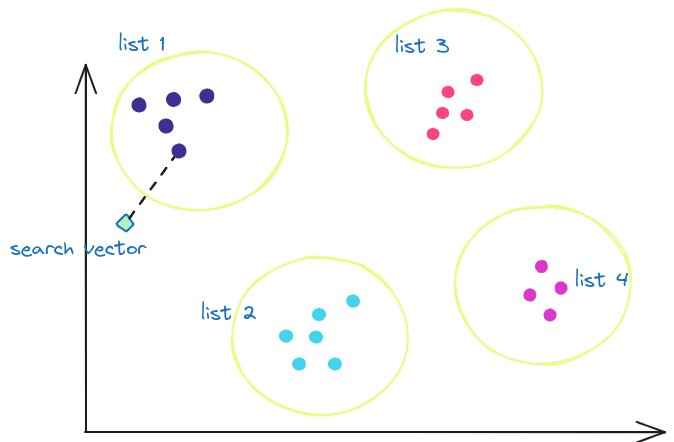

<p align="right" style={{color: 'grey'}}><em>
Image credit: Generated with Bing Image Creator
</em></p>

Indexes are data structures that make database searches more efficient. Specifically, they speed up finding specific values in a database column. So, instead of having to scan a complete table to find a `Student` with `ID=9876`, having an index on the ID column could locate said student in fewer operations.

When deciding whether to create one or more indexes on a table, several factors need to be considered, for example, the size of the tables, whether the table is modified frequently, how the table is used in queries, etc. 

These considerations and some others apply also to vector databases and vector indexes. 

Consider the typical example of [finding text similar to a query](https://tembo.io/blog/pgvector-and-embedding-solutions-with-postgres) to generate possible answers. One approach would be to scan the whole table that contains the related knowledge base and use a `LIKE` query. 

A second approach would be to transform the knowledge base and the query into embedding vectors. Then, the database could calculate the distance to all the vectors in the table and find the closer K vectors. This approach works well for small datasets but becomes expensive and impractical for [large ones](https://en.wikipedia.org/wiki/Curse_of_dimensionality).

A third approach would be to generate an index for the vectors column and use it to find the closest neighbors. But how can we decide what's the appropriate index for our data? 

In today's post, let us explore this question for the case of Postgres and pgvector. 


## Indexes in Pgvector

[Pgvector](https://github.com/pgvector/pgvector) is an open-source Postgres extension for similarity search. It allows for exact and approximate nearest-neighbor search. In particular, for ANN it offers two types of indexes: **IVFFlat** and **HNSW**.


## IVFFlat

The IVFFlat (Inverted File with Flat Compression) index works by dividing the vectors in the table into multiple lists: the algorithm calculates a number of ‘centroids’ (let’s call it C) and groups vectors in the dataset according to the centroid that is closest to them. The result is C clusters of vectors, and the elements of these clusters correspond to the groups I described previously.

When searching for the K nearest vectors, instead of calculating the distance to all vectors, the search space is narrowed to only a subset of the lists, thus reducing the number of computations. Which lists are the candidates? The ones whose centroid is closer to the search vector.


<p align="right" style={{color: 'grey'}}><em>
IVFFlat generates lists based on clusters.
</em></p>

From the previous description, we can derive that the effectiveness of the index depends on two parameters: the number/size of the lists and the number of lists that need to be examined during the search (aka probes).

In pgvector, these two parameters are selected in two moments. As mentioned earlier, the number of lists is chosen when creating the index, for example:

```sql
CREATE INDEX ON items USING ivfflat (embedding vector_cosine_ops) WITH (lists = 1000)
``` 

In contrast, the number of lists to be explored is indicated during execution, e.g.:

```sql
SET ivfflat.probes = 32
```

The [pgvector documentation](https://github.com/pgvector/pgvector#ivfflat) suggests the following:

> Choose an appropriate number of lists - a good place to start is rows / 1000 for up to 1M rows and sqrt(rows) for over 1M rows
> 
> When querying, specify an appropriate number of probes (higher is better for recall, lower is better for speed) - a good place to start is sqrt(lists)


So, imagine that we have a dataset of 1M vectors. With the parameters above, pgvector would generate 1 000 lists of approximately 1 000 vectors. When executing a query, it would only query 32 of such lists and execute 32 000 comparisons to find the closest neighbors to a search vector. That is, only 0.032X compared to a full scan.

Of course, you can choose different parameters to achieve the desired recall. More on that later in this post.


## HNSW

The [Hierarchical Navigable Small Worlds (HNSW)](https://arxiv.org/pdf/1603.09320.pdf) index creates a graph with multiple layers. The nodes in the graph represent vectors, and the links represent distances. Finding the kNN consists of traversing the graph and looking for the shorter distances. 

We can think of these layers as different zoom levels of the graph. Zooming out, we see a few nodes (vectors) and links. But as we zoom in, we see more and more nodes and more and more links. 

The traversal of the graph resembles a [skip list](https://en.wikipedia.org/wiki/Skip_list) in that if no more candidate nodes are found in the current layer of the graph, the search continues in the next layer (zoom in), where more links should exist. 


<p align="right" style={{color: 'grey'}}><em>
HNSW creates a graph with multiple layers
</em></p>


For HNSW, there are two tuning parameters: the maximum number of connections per layer (`m`) and the size of the dynamic candidate list for constructing the graph (`ef_construction`). These settings are decided when creating the index:

```sql
CREATE INDEX ON items USING hnsw (embedding vector_cosine_ops) WITH (m = 16, ef_construction = 64)
```

A bigger value for `m` means that each node would have more links in each layer of the graph. A big `m` affects negatively during query time since more connections need to be checked, but it also improves recall.

`ef_construction` is also used during the build phase of the index, and it indicates the entry points in layer i+1. That means that bigger values would lead to heavier indexes. 

In contrast with IVFFlat, Pgvector does not mention any particular [recommendation for HNSW](https://github.com/pgvector/pgvector#hnsw), but the defaults are `m=16`  and `ef_construction=64`.


## Why are they approximate?

In the previous sections, I mentioned a couple of times that the build parameters affect recall. What do we mean by that?

`Recall` measures how many retrieved neighbors are indeed in the true kNN group. A recall of 1.0 means that all calculated neighbors are really the closest. Whereas a recall of 0.5 means that only half of the computed neighbors are in fact the closest.

Recall is an important metric for IVFFlat and HNSW because they are approximate indexes that work with heuristics. That means that there could be errors. Knowing the recall helps in tuning the index parameters.

Take IVFFlat as an example. When deciding which lists to scan, the decision is taken based on the distance to the centroid of the list. Depending on the data and the tuning parameters, the closest vector to the search vector could correspond to a list that was not selected for probing, thus reducing the accuracy of the result.

One way to mitigate this problem and boost recall is to increase the number of lists to probe. But that, of course, would incur a performance penalty. Improving the recall is not free, and careful evaluation and tuning of the parameters is paramount. 


## IVFFlat vs HNSW in the pgvector arena

Now, let us examine the two types of indexes quantitatively. We will use the [ANN benchmark](https://github.com/erikbern/ann-benchmarks/), which we modified to have [both algorithms available](https://github.com/binidxaba/ann-benchmarks).

For pgvector, the benchmark creates a table with a vector column, taking the chosen dataset and inserting the items into the table. Then, it builds the selected type of index, and after that, it executes a bunch of queries. The dataset contains both train and test data. The benchmarking program uses the test data to evaluate the recall for each algorithm.

For this comparison, let us use a [small dataset](https://github.com/erikbern/ann-benchmarks/#data-sets) of around 1M vectors of 50 dimensions. The test set consists of 10K queries, and we want to obtain the 10 nearest neighbors.

The aspects that we want to evaluate are:

- Build Time
- Size
- Recall
- Speed

For these experiments, let us ask ourselves: How are the different parameters affected if I want a recall of X? In particular, let us set a recall of 0.998.

In pgvector, such recall is achieved with the following settings:


| Index type | Parameters |
| ------- | ------------------------- |
| **IVFFlat** | Lists = 200, Probes = 100 |
| **HNSW**    | m = 24, ef_construction = 200, ef_search = 800   |


### Build Time

For the chosen parameters, IVFFlat indexes can be created quicker (128 seconds) compared to HNSW (4065 seconds). HNSW creation is almost 32X slower.


### Size

In terms of index size, IVFFlat is again the winner. For a recall of 0.998, IVFFlat requires around 257MB, whereas HNSW requires about 729MB. HNSW requires 2.8X more space.


### Speed

:::note 
The benchmark uses one thread to execute the vector queries.
:::

It is in speed where HNSW shines. With a recall of 0.998, HNSW can achieve a throughput of 40.5 QPS, whereas IVFFlat can only execute 2.6 QPS. HNSW is 15.5X better in this aspect.


## General Guidelines

With the results above, we can then make the following recommendations:

- If you care more about index size, then choose IVFFlat
- If you care more about index build time, then select IVFFlat
- If you care more about speed, then choose HNSW


## Wrapping up…
 
In this post, we discussed the two types of indexes currently available in pgvector: IVFFlat and HNSW. We discussed their build parameters and how they affect recall.

With the help of a benchmark, we compared the indexes quantitatively in terms of build time, index size, QPS, and recall. We derived some general guidelines for choosing the appropriate index type based on our results.

I invite everyone to try out the benchmarking program, which can be found [here](https://github.com/erikbern/ann-benchmarks/), and our modified version, which is [here](https://github.com/binidxaba/ann-benchmarks).

What other elements should we consider when choosing a vector index? Let us know your thoughts at [@tembo_io](https://twitter.com/tembo_io). 


## Appendix

The experiments in this post were carried out using a machine with the following characteristics:

| | |
| ---------------- | ------------------------------------------------------------------------------ |
| **CPU**              | Intel(R) Core(TM) i7-8565U CPU @ 1.80GHz 8th Generation                        |
| **Number of Cores**  | 4 (8 threads)                                                                  |
| **Cache**            | Level 1: 256KiB write-back, Level 2: 1MiB write-back, Level 3: 8MiB write-back |
| **Memory**           | 16 GB SODIMM DDR4 2400MHz                                                      |
| **Disk**             | 150GB SSD                                                                      |
| **Operating System** | Ubuntu 22.04.3 LTS, Linux 5.15.0-79-generic (x86_64)                           |
| **Postgres**         | 14                                                                             |

