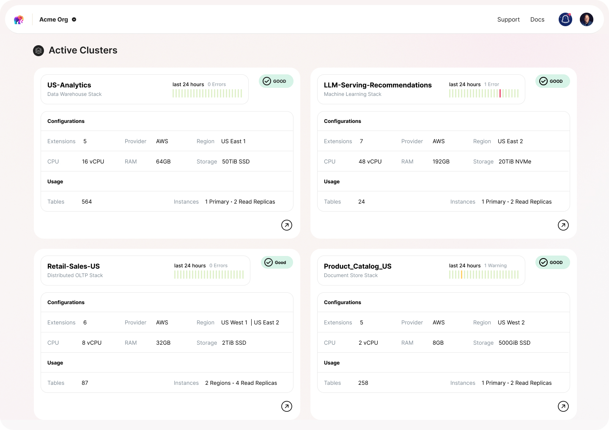

## The Database Market

The global database market is expected to grow to $100+ billion in the coming years due to enterprises generating, storing, and leveraging more data, and the need for applications to operate at a global scale. 

Enterprises typically store data across various databases, grouped into transactional and analytical systems. There's roughly 10x more transactional than analytical data, mostly in Oracle, MySQL, and Postgres.

1. The first major shift in the data stack involved analytical workloads moving to the cloud, triggering the big data era and the rise of platforms like Snowflake and Databricks. 
2. The second shift involves transactional workloads moving to streaming and real-time data, requiring hybrid transactional and analytical processing platforms that are managed by application developers, not database experts.
3. The third shift entails abstracting application infrastructure, allowing developers to build and scale applications efficiently. However, while services like Vercel and Netlify streamline the software development lifecycle, they focus more on building on top of databases rather than the databases themselves.

## Postgres

Postgres, the world's favorite database with millions of deployments, features a liberal OSS license and a large community. It efficiently manages SQL and JSON queries across diverse workloads due to its growing, decade-old ecosystem of add-ons and extensions.

Now the #2 database, Postgres is popular for its open-source, standards-compliant, extensible nature, and ACID compliance, making it a reliable, cost-effective system. It handles low latency, high throughput analytical cases, offering HTAP-lite capabilities through window functions and foreign data wrappers.

Its extensibility resulted in numerous add-ons and plugins for GIS data, image processing, and more, with some extensions evolving into companies like CitusDB and Timescale. The extension ecosystem plays a crucial role in Postgres's growth and self-managed usage.

Source: [Stack Overflow Developer Survey 2023](https://survey.stackoverflow.co/2023/#section-admired-and-desired-databases)

## Problem

Companies are hesitant to adopt new databases due to costs and complexity. The need to adapt to new architectures, configurations, and optimizations makes the transition value often negligible. Hence, costly Oracle instances remain in use for critical applications.

Postgres, favored by DBAs and Data Engineers, is widely adopted for transactional systems. However, deploying and managing it is complicated.

To create a self-managed Postgres cluster, DBAs have to consider infrastructure, environment, security, data management, backups, and workload-specific tuning. Further, maintaining and scaling Postgres involves meeting high availability requirements, managing data storage, updating schemas, optimizing query performance, and managing failover protection and caching.

## Market Gap

Numerous solutions aim to ease deployment and management of self-managed Postgres.

1. Some, like EnterpriseDB and CrunchyData, designed as Oracle replacements, target enterprises migrating from Oracle to Postgres for better cost-effectiveness, adaptability, and performance in complex environments. However, their focus on building Oracle-like capabilities resulted in proprietary versions of Postgres, limiting access to its rich ecosystem.
2. The next wave, including Amazon Aurora and Google Alloy, modified native Postgres for enhanced performance and resilience. These turnkey, managed offerings handle infrastructure setup, patching, backup, failover, and high availability. They provide power and scale but can be expensive, complicated to migrate to, and have limited plugin compatibility due to their divergence from actual Postgres.
3. Another approach, exemplified by Supabase and Heroku, intends to replace 'backend as a service' (BaaS) platforms like Firebase with more scalable, performance-oriented solutions. BaaS platforms simplify backend services, but their scalability struggles have forced developers to traditional databases like Postgres. Supabase and similar platforms build on the features of Firebase, designed for enterprise-scale, security, and rapid deployment. However, their focus on building atop databases rather than the databases themselves often omits full Postgres capabilities required by many deployments.

## Our Vision

Many developers aren't served by current commercial Postgres solutions due to migration costs, reliance on open-source ecosystem, mismatched needs, complexity, and a lack of developer-first focus.

Tembo aims to enhance developers' Postgres experience by allowing full functionality, including custom extensions, and promoting developer-first workflows. It simplifies deploying Postgres with a virtualized runtime experience, enabling one-click migrations and access to the Postgres ecosystem.

Developers can control the data model lifecycle, and deploy to multiple zones and clouds. Advanced options will include autoscaling, hybrid transactional and analytical processing (HTAP), and edge caching.

Additionally, Tembo invests in the Postgres extension ecosystem, aiming to standardize and simplify the use and creation of extensions. By unbundling and decoupling the database into services and abstraction layers, Tembo enables new simplicity and capability.

## Product

We are productizing Postgres and the extended Postgres OSS ecosystem of add-ons and extensions, into one grand managed cloud offering.

### Tembo Cloud

We are building a dev-first, fully-extensible, fully-managed, secure, and scalable Postgres service. Available on all clouds and bare metal providers. Tembo Cloud provides the largest library of easily-installed extensions and “flavored Postgres” **Tembo Stacks**, allowing our customers to expand their use cases of Postgres.

### Tembo Stacks

“Postgres for Everything” delivered as highly-polished “flavored” Postgres — Tembo Stacks. We help teams avoid new databases, and the pains associated with that, reducing database sprawl.

| Name | Components | “North Star” Competition |
| --- | --- | --- |
| Tembo OLTP | Feature-Rich, Optimized Postgres | Other managed Postgres providers |
| Tembo Vector | Optimized Postgres + pgVector | Pinecone |
| Tembo OLAP | Optimized Postgres + columnar | Snowflake |
| Tembo Documents | Optimized Postgres + FerretDB | MongoDB, AWS DocumentDB |
| Tembo ML | Optimized Postgres + PostgresML | MindsDB |
| Tembo Messaging | Optimized Postgres + pgmq | Redis |
| Tembo Search | Optimized Postgres + ZomboDB + ElasticSearch | Elastic |
| Tembo Timeseries | Optimized Postgres + Timescale | InfluxDB |

## What is a Tembo Stack?

Stacks are pre-built, use case-specific configurations and pre-built packages of Postgres, enabling you to quickly deploy specialized data services that can replace external, non-Postgres data services.

Stack Spec includes:

- Name
- Description
- Version
- Docker Base Image (Postgres Container)
- Pre-Installed Extensions
- Stack-Specific additional metrics, alerts + recommendations
- Stack-Optimized Postgres Configs
- Dynamic Config Engine
- Sidecars (Kubernetes Services - i.e. nearby workloads)
- Infrastructure and hardware configuration options - things like the HA setup, pgbouncer/pgcat (server-side connection pooling), etc.

## GTM

The developer-led GTM strategy prioritizes the Postgres community. 

Initial ICP targets application developers using or intending to use self-managed Postgres deployments, specifically those interested in maintaining the native open-source version. Tembo replaces self-managed Postgres clusters in the cloud or on-prem.

Our market entry focuses on two key propositions:

1. Developer-first workflows, facilitating complete data model lifecycle control.
2. Prioritizing the expansive Postgres extension ecosystem for add-on integration and usage.

Fast database deployment and automatic migration enable high developer satisfaction and swift value realization. The product’s alignment with Postgres open-source principles appeals to the Postgres community.

The revenue model is based on a fully-managed cloud service, providing enterprise-level hybrid multi-cloud solutions.

## Advantages

- Large market continues to grow rapidly with a significant gap in a developer-first database.
- Impressive team with world-class open source & Postgres cred.
- Replaces self-managed & home grown solutions with a 10x better experience.
- Expect the offering to have a very fast TTV and high level of developer love.
- A large and passionate open-source community could lead to strong growth.

## Risks

- Lots of Postgres alternatives/competition. Need to break through the noise of the competition.
- Banking on (1) a radically simpler Postgres DX and (2) extending out the extensions framework and capabilities will become a catalyst for initial usage and growth.
- Need to recruit top Postgres committers to the company in order to obtain legitimacy within the Postgres community.
- Databases are the most complex layer of the stack; takes more time than traditional developer/data services.

## Bottom Line

Postgres is the most universally loved databases for developers, teams, and enterprises of all sizes. Tembo can become the new de facto standard for deploying and managing databases for developers and companies of all sizes, changing the paradigm of how developers interact and build databases, and unlocking the power of Postgres to all developers.