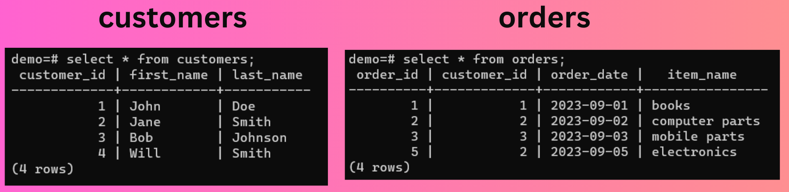
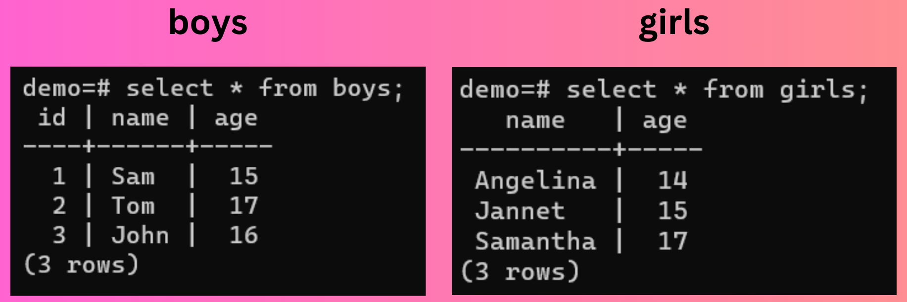

# All possible joins in Postgres (Inner, Outer, Left, Right, etc)

Postgres offers a collection of useful Join methods that a user can perform to extract the logical relationships in their data. In this guide, we will discuss 6 Join methods - Inner Join, Left Join, Right Join, Full Outer Join, Cross Join, and Self Join.

:::note
Do connect your terminal with your desired Postgres database to try out every join in Postgres. Follow our guide to see the whole process, [click here](https://tembo.io/docs/postgres_guides/how-to-connect-to-postgres/)
:::

Now, let’s discuss each join with the help of examples where we can see a use case for them.

## Inner Join

It returns rows from both tables where there is a match followed by a specified join condition.

```
SELECT * FROM table1 INNER JOIN table2 ON table1.column = table2.column;
```

Make sure to replace `table1` and `table2` with the names of your tables in command.

### Example

Suppose there are two tables - customers and orders



We want the list of customers who have placed an order. To do that, we will use `Inner Join`.

```
SELECT o.order_id, c.first_name, c.last_name, o.order_date
FROM orders o
INNER JOIN customers c ON o.customer_id = c.customer_id;
```


## Left Join

It return all rows from left table and maching rows from the right table. Null values will be returned for the right table if there are no matching rows.

```
SELECT * FROM table1 LEFT JOIN table2 ON table1.column = table2.column;
```

### Example

Suppose there are two tables - employees and projects


and we want to get the list of all employees with the project they are assigned to, even if they haven’t been assigned any project. To do that, we will use `Left Join`.

```
SELECT employees.employee_id, employees.employee_name, projects.project_name
FROM employees
LEFT JOIN projects ON employees.employee_id = projects.employee_id;

```


## Right Join

It return all rows from right table and maching rows from the left table. Null values will be returned for the left table if there are no matching rows.

```
SELECT * FROM table1 RIGHT JOIN table2 ON table1.column = table2.column;
```

### Example

Now, suppose we want to get the list of all projects with the employees they are assigned to, even if no employee has been assigned to that project. For that, we can use `Right Join`

```
SELECT employees.employee_id, employees.employee_name, projects.project_name
FROM employees
RIGHT JOIN projects ON employees.employee_id = projects.employee_id;
```


## Full Outer Join

It returns all the rows where there is match in both the left and the right table. Null values are returned for the columns where there is not any match.

```
SELECT * FROM table1 FULL OUTER JOIN table2 ON table1.column = table2.column;
```

### Example

Supppose, now we want to see the full list of employees and projects along with the employees that does not have any projects assigned and projects that are not assigned to any employees. In such case, we can use `Full Outer Join`

```
SELECT e.employee_id, e.employee_name, p.project_name
FROM employees e
FULL OUTER JOIN projects p
ON e.employee_id = p.employee_id;
```


## Cross Join

It returns the result of Cartersian multiplication between the both tables. It combines the every row of left table to the every row of right table and gives the final result

It does not require any condition.

```
SELECT * FROM table1 CROSS JOIN table2;
```

### Example

Suppose there are two tables - boys and girls



For a prom night, we want to see how many couples can be formed by this list of boys and girls. For that, we can use `Cross Join`

```
SELECT * FROM boys CROSS JOIN girls;
```


## Self Join

It joins the table with itself and returns the final output. Self joins is commonly used to compare rows within the same table.

```
SELECT * FROM table_alias_1 JOIN table_alias_2 ON table_alias_1.column_1 = table_alias_2.column_2;
```

### Example

Suppose is a table employees consisting of employee id, employee names and their manager id


We want to get the list of employees along with the name of their respective managers. We can get the manager name by matching the manager_id with the corresponding employee_id. To do that, we will use `Self Join`

```
SELECT e.employee_name AS employee, m.employee_name AS manager
FROM employees e
LEFT JOIN employees m ON e.manager_id = m.employee_id;
```


## Conclusion

In this guide, we covered the all types of Join methods that a user can perform on data stored in tabular format

For further exploration of valuable information regarding Postgres, we encourage you to explore our informative [blog posts](https://tembo.io/blog).

You can check out our [guides page](https://tembo.io/docs/category/postgres-guides) to know more about basic operations you can perform on Postgres

## Appendix

Here is a database dump so you can duplicate the database, and try the joins yourself:

```
CREATE TABLE IF NOT EXISTS…. etc
```
