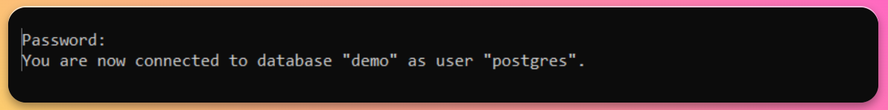
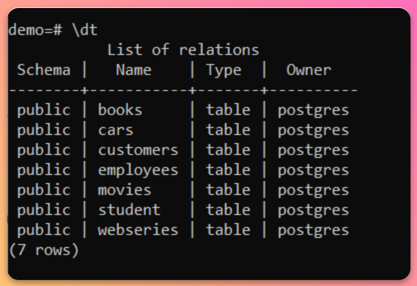
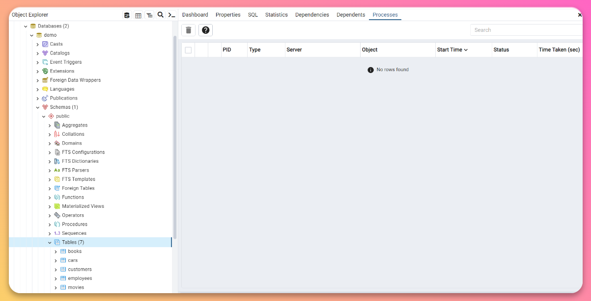
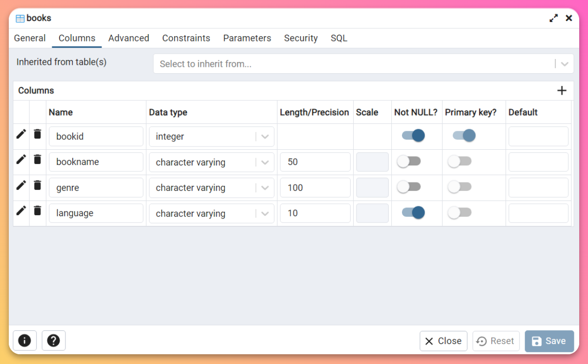
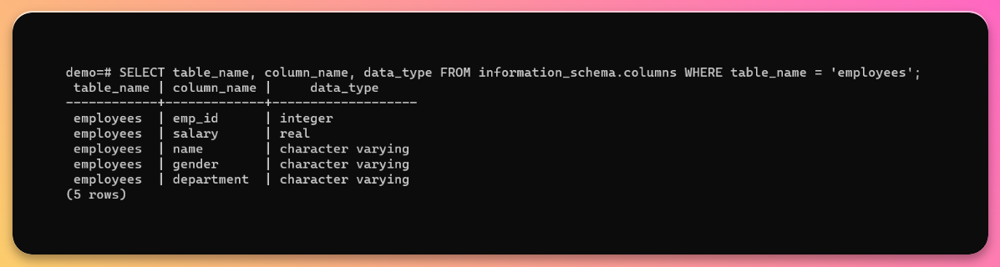

# How to describe tables in Postgres

In this guide, we'll show you two different ways to describe tables: using the psql command-line tool, using the PgAdmin graphical interface, and through SQL queries. We'll walk you through the entire process step by step, using a practical example to make it easy to follow along.

## Using psql

**Step 1** - Open the terminal on your device and connect it to your desired Postgres database. Follow our guide to see the whole process, [click here](https://tembo.io/docs/postgres_guides/postgres-basics/how-to-connect-to-postgres)



Step 2 - To display the list of tables present in the database, run `\dt` command

```
\dt
```



**Step 3** - To describe a specific table from the database, run `\d table_name` command

```
\d table_name
```


Make sure to replace **table_name** with the name of table whose details you want to see

## Using PgAdmin

Step 1 - Open the PgAdmin tool on your device


**Step 2** - In the left sidebar, expand the _Servers_ folder and direct to your desired database. In that database, expand the Schemas folder and go the Tables folder.

It wil display the list of all tables present in your database.



**Step 3** - Right click on any table and select _Properties_. Properties dialog will appear containing _Columns_ tab.

Columns tab will display the details of all columns present in that table.



## Using SQL query

There is a SQL query which uses Postgres’ information_schema tables, which contain metadata about tables in Postgres can be executed in the terminal to display a comprehensive list of columns along with their respective data-types present in that tables.

**Step 1** - Open your terminal and connect it to your desired Postgres database. Follow our guide to see the whole process, [click here](https://tembo.io/docs/postgres_guides/postgres-basics/how-to-connect-to-postgres)

**Step 2** - Now run this SQL query to get the list of all tables present in the database

```
SELECT table_name, column_name, data_type FROM information_schema.columns WHERE table_name = tableName;
```



Do replace **tableName** with the name of table whose details you wish to display

# Conclusion

In this guide we have discussed two most commonly practiced methods to describe each individual table present in a Postgres database.

To explore some amazing Tembo’s extension, we highly suggest you to read our very insightful documentation [pgAdmin](https://www.pgadmin.org/docs/pgadmin4/latest/index.html) and [psql](https://www.postgresql.org/docs/current/app-psql.html)

Do check our other [guides](https://tembo.io/docs/) present on guides page to know more about Postgres
