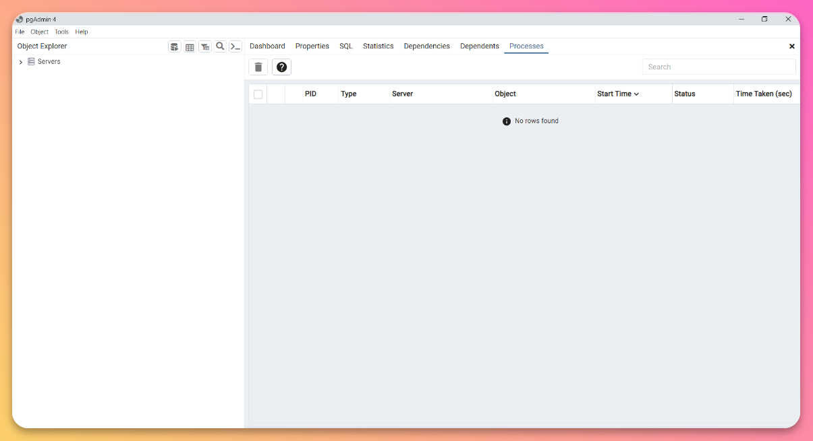
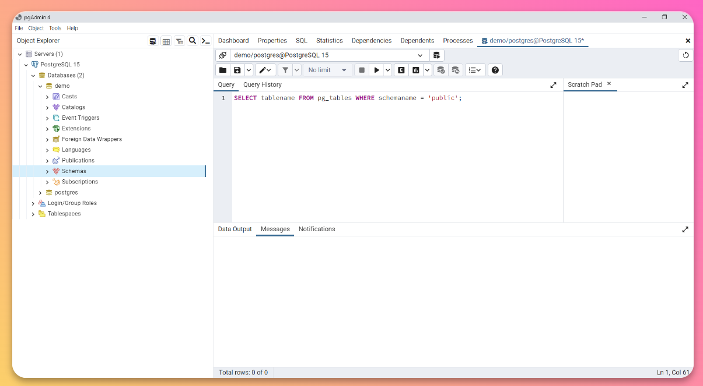

# How to show tables in Postgres

Tables are an extremely crucial part of Postgres. All the data stored in Postgres is in the form of a table. However, the main tools to interact with Postgres are not always the most intuitive, and we should study the different methods to navigate our database.

There are different ways to view the list of all tables. In this guide, we will study three different ways to view the tables - Using psql command, using SQL query, and Using PgAdmin tool. We will understand the whole step-by-step process with the help of an example

Let’s get started

## Using psql command

**Step 1** - Connect the terminal to your desired Postgres database. Follow our guide to see the whole process, [click here](https://tembo.io/docs/postgres_guides/how-to-connect-to-postgres/)


**Step 2** - To display the list of tables present in the database, run `\dt` command

```
\dt
```

:::note
The commands to show list of tables is same for both Windows and iOS
:::


It will show the list of all tables present in that database along with the _Schema_, _Type_, and _Owner_ of that tables.

To get more information about tables, use `\dt+` command

```
\dt+
```


That’s how you can show tables in Postgres

This command will give the details of Persistence, Access method, Size, and Description of tables

## Using PgAdmin

PgAdmin software can also serve as a tool to list down the tables present in database. Let’s take a look at the steps

**Step 1** - Open PgAdmin tool on your device



**Step 2** - In the _Object Explorer_ present on the left sidebar, expand the _Servers_ and direct to your desired database


**Step 3** - Right click on the _Schemas_ option and select the _Query Tool_ feature


**Step 4** - You can type and run SQL queries in the _Query tool_. To list down all the tables present in the desired database, run this query -

```
SELECT tablename FROM pg_tables WHERE schemaname = 'public';
```



**Step 5** - Click _Execute_ (present on the top horizontal menu), or you can press _F5_ key to execute the query

It will list down all the tables present in that database and the output will be displayed in the Data Output section.


Make sure to replace the name of schema from **public** to any of your desired schema if the tables are present in a different schema.

## Using SQL query

There is a SQL query which uses Postgres’ information_schema views. These views contain metadata about tables in Postgres, and you can query them to enumerate and display a comprehensive list of tables.

**Step 1** - Open your terminal and connect it to your desired Postgres database. Follow our guide to see the whole process, click here


**Step 2** - Now run this SQL query to get the list of all tables present in the database

```
SELECT table_name FROM information_schema.tables WHERE table_schema = 'public';
```


You can replace **public** with the another schema name if applicable

# Conclusion

In this guide we have discussed three popular methods to display the list of all tables present in a Postgres database.

To keep learning more interesting stuff, check out our well-structured documentation of [pgAdmin](https://www.pgadmin.org/docs/pgadmin4/latest/index.html) and [psql](https://www.postgresql.org/docs/current/app-psql.html)

If you want to enhance your knowledge of Postgres even more, we highly encourage you to check out our others guides present on the website.
