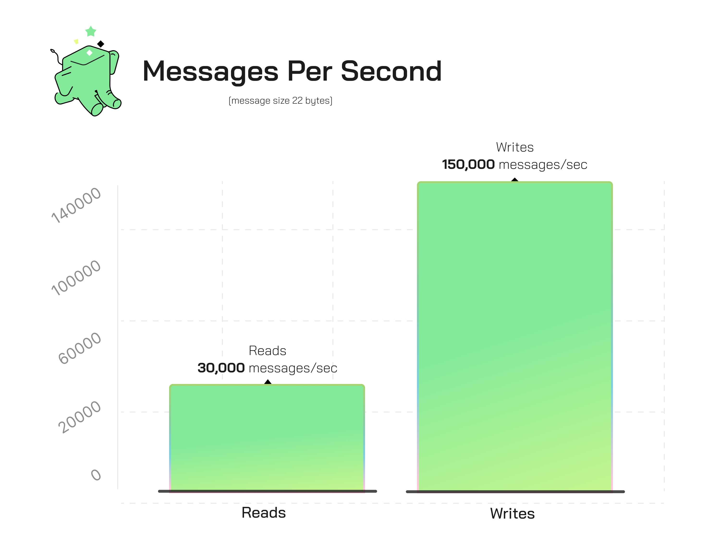

_“Could we build a message queue that can scale to Twitter...on Postgres?”_

At Tembo, we want to do _everything_ on Postgres. And to us, the message queue workload is an OLTP workload in disguise. And while we're excited about our recent release of PGMQ v1.0, we're not getting ahead of ourselves. We know the truth—nobody gets all _that_ excited about a message queue...which got us wondering: “What _could_ you do to make it interesting?” The overwhelming answer?

Make it fast. Like...Twitter-scale. (Sorry, X.)

So what would that look like? Let’s take a look.

**[VIDEO HERE]**

Before we get into the rest of that story, it’s worth calling out what’s in [PGMQ v1.0](https://github.com/tembo-io/pgmq):

* **Stable API**: Main API functions have matured to support backwards compatibility.
* **Object Membership Model**: All PGMQ objects now live in the PGMQ schema.
* **Relaxed Compiling Requirements**: Improved portability by moving some functions to PL/PGSQL.
* **Added Unlogged Queue Type**: Introduced unlogged queue type which significantly improves performance at the expense of durability.
* **Updated Documentation**: All SQL API functions are now documented in public docs.

So back to the test–let’s have a look at what happened.

## Postgres is Faster Than You’d Think

The concept is simple: we built a notification system that triggers events based on tweets on X. For each tweet, the application will receive a minimal payload (something like `{"username": "elvis"}`). On average, there are approximately 6,000 tweets per second; but at peak, traffic can hit nearly 150,000 messages per second.

(That’s a lot of hot takes.)

We then set up a queue to buffer those events, and attached consumers to process the messages in the queue and send our notifications. Many publishers writing small messages in batches of 100. Many consumers each processing messages, also in batches of 100. Massive throughput. Can Postgres handle 6,000 messages per second with peaks over 150,000?

In short, Twitter-scale.

*large batch, micro message size throughput*

## How Did We Build It?

Using the Tembo Cloud Message Queue Stack, we were able to write over **150k messages per second**, by running 20 concurrent writers each publishing batches of 100 messages. On a single Postgres instance running 16vCPU and 32GB of memory, and sustain **reading up to 30k messages per second**, by running 10 concurrent consumers each reading 100 messages per batch.

We made several [configuration changes](https://github.com/tembo-io/tembo/blob/702802a4627539c13654414def423c6b9f9b3b79/tembo-operator/src/stacks/templates/message_queue.yaml#L95-L121) to Postgres itself to achieve this, including aggressive autovacuum settings and scaling shared_buffers to 60% of system memory.

Obviously, this is an absurdly large amount of volume that most users do not need to support, and the conditions in this benchmark are specifically tuned for this workload:

* Message size is very small at 22 bytes
* Producers are writing in batches of 100, which is close to optimal for the amount of system memory, and shared_buffers configuration
* Consumers are reading in batches of 100

## It’s Not Just Twitter Scale

Message queues are a common need, though most of the time we’re dealing with less volume and larger message sizes. 1000 bytes is a more reasonable measure and is what has been [recommended](https://www.galiglobal.com/blog/2021/20210430-Three-Kafka-good-practices.html) when using Apache Kafka. So what happens to the benchmark when we try it with larger messages? Short version–it’s still surprisingly speedy, especially when we tune for this new workload.

Larger messages means more time to transmit data across the network, and more memory usage in Postgres, particularly on the batch inserts. As expected, the write throughput (using the same compute level) drops off as the message size increases. We decreased write batch size from 100 to 10, and unsurprisingly saw write throughput decrease from 160k/s to 30k/s. However, at this level of messages incoming to the queue, 10 consumers each reading 100 messages at a time can keep queue size down and process at roughly the same rate, 30k/s.

*batch throughput for 1kb messages per second*

## Single Message Throughput

What about the non-batch use case? Most user applications start by consuming and producing single messages at a time (or their clients provide a single message API)—let’s try concurrent producers each sending one message at a time paired with many consumers each reading one message at a time.

With 50 producers each sending 1 message at a time and 100 consumers each reading 1 message at a time, Postgres will be able to clear the queue at a rate of over 7k messages per second (even on a relatively small compute node 16vCPU and 32GB RAM), which is still higher than the average volume seen by Twitter in 2023. 7k messages per second is higher than most use cases/

*single message throughput for 1kb messages per second*

## Resource constrained

But what if you’re resource constrained? Turns out we can go even smaller.

For a similar benchmark on a Tembo MQ instance running on 1vCPU and 4GB of memory, with messages sizes of about 1KB, 10 x producers and 10 x consumers each processes messages in batches of 5. Even with these constraints, Postgres is still able to process thousands of messages per second.

*micro batches on 1vCPU and 4GB memory*

## Your Turn

The best part? Thanks to the Message Queue stack on cloud.tembo.io, this kind of performance can be at your fingertips today. No external services or complicated sprawl necessary—just a few key principles to set you up for success:

* **Proper indexes** - [PGMQ](https://github.com/tembo-io/pgmq) sets these up for every queue it creates.
* **Working Memory** - Configure Postgres to keep the entire queue in memory. `shared_buffers` is a big part of this; [Tembo Cloud](http://cloud.tembo.io) dynamically configures this for you.
* **Manage table bloat** - aggressive auto vacuum configurations are set on all Tembo Message Queue Stacks
* **Balance** - It’s important to find the right balance of batch size and concurrency. We recommend starting with a single message read/write to help you get an initial benchmark.
* **CPU and Memory**- This should be tailored to the workload size. A 16vCPU goes a very long way.
* **Queue Operations** - For best results, the queue operations should be OLTP in nature. PGMQ’s write, read, delete and archive commands do exactly this.

Try the MQ Stack on [cloud.tembo.io](https://cloud.tembo.io) today and reach out to us in Slack, or on twitter.

## The Hardware

For the above benchmarks, Tembo MQ runs on Postgres 15.3 running in [Tembo Cloud](http://cloud.tembo.io), configured as the Tembo Message Queue stack. The message queue stack consists of several configuration changes to optimize for performance. The complete specification can be found in the [tembo-operator repository](https://github.com/tembo-io/tembo/blob/702802a4627539c13654414def423c6b9f9b3b79/tembo-operator/src/stacks/templates/message_queue.yaml#L95-L121). The most impactful configuration changes are to the autovacuum configurations (far more aggressive than default) and shared_buffers (75% of system memory) about 3x higher than recommended for most workloads. The intention is to keep the working set in Postgres memory so that we never have synchronous writes to disk. There is no connection pooler deployed between the benchmark client and Postgres, however there is AWS and Kubernetes network infrastructure. We’ve optimized Postgres for the Message Queue workload, which comes with the tradeoff that it will be less performant for other workloads. At Tembo, that's why we provide Stacks for every workload, and make it easy for you to move data in between your Postgres clusters.

The client executing our benchmark scripts runs on an EC2 instance c5.2xlarge in the same region as Tembo’s Postgres instance, `us-east-1`. Network latency is real, and we will measure with “select 1” latency in our plots. This is meant to provide a more realistic evaluation of Tembo’s MQ Stack. The benchmarks were conducted on two separate Tembo Message Queue instances, 1vCPU/4GB memory and 16vCPU and 32GB memory, and are noted in the benchmark results. Both instances run in Tembo Cloud, running on AWS EKS, and gp3 EBS volumes, all with 3000 provisioned IOPS. Benchmarks were conducted using a combination of `pgbench` and the Python benchmark application that lives in the PGMQ [project repo](https://github.com/tembo-io/pgmq/blob/293f6e93f3799ee17016b07f4834f7bd01f7387a/tembo-pgmq-python/benches/runner.py#L22).
