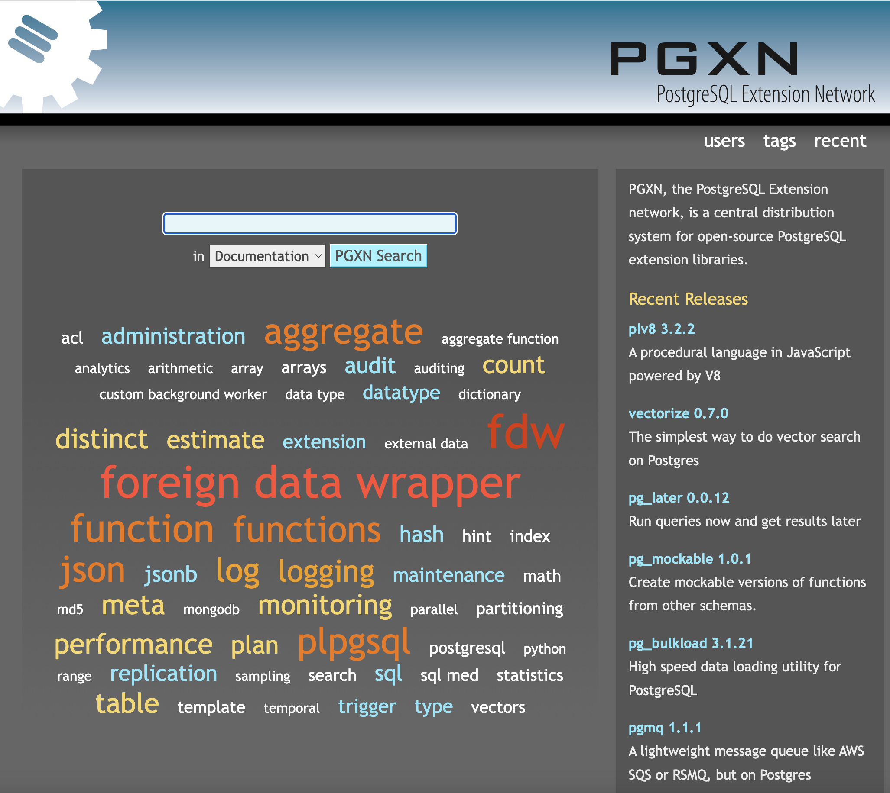

# PGXN creator David Wheeler joins Tembo

We’re excited to welcome David Wheeler, a long-time PostgreSQL contributor to Tembo. David has made significant contributions to Postgres, including [CITEXT2](https://www.postgresql.org/docs/current/citext.html), the case-insensitive data type; [pgTAP](https://pgtap.org/), a database test framework; and [Sqitch](https://sqitch.org/), a database change management system. While an Associate at [PostgreSQL Experts](https://pgexperts.com/) in 2011, he created [PGXN](https://pgxn.org/), the original extension distribution system. His most recent stint was designing and building [a searchable, encrypted data store on PostgreSQL](https://justatheory.com/2023/10/cipherdoc/) for [The New York Times](https://nytimes.com/).

David will be focusing on **evaluating the challenges of Postgres extension discovery and distribution and work towards a community solution to address them**.

## Challenges of the Postgres Extension Ecosystem

Extensions are arguably the most powerful capability of Postgres.

<iframe
	border={0}
	frameborder={0}
	height={300}
	width={600}
	src='https://twitframe.com/show?url=https%3A%2F%2Ftwitter.com%2Fadamhendel%2Fstatus%2F1734877766334456052'
></iframe>

They allow you to add to and replace critical components of the database without changing a single line in core. In terms of functionality, they range from simple [data types](https://www.postgresql.org/docs/current/uuid-ossp.html) and functions to [distributed databases](https://github.com/citusdata/citus) and [MLOps platforms](https://github.com/postgresml/postgresml). But why don’t more developers use extensions?

Among many reasons, a noteworthy few stand out:

* Extensions are hard to find and discover: There isn’t a single easily searchable and navigable place for developers to easily find all extensions.
* Extension maturity is difficult to judge: Developers have to rely on heuristics such as GitHub stars, name recognition, binary packaging distribution, and so on.
* There is no centralized binary package repository for all platforms: Some extensions have no binary packaging while others are available via yum or apt. Managed services allow easy installation but most only support a limited number of extensions.
* There is insufficient documentation and metadata on how to get an extension working successfully. Some require updates to `shared_preload_libraries`, some depend on other extensions or binary libraries, while others require specific configurations to be usable.

## Trunk: Binary packaging and metadata capture for extensions

To solve this problem, we built [Trunk](https://pgt.dev/). Trunk has a registry of 190+ extensions, their binary packages (for Ubuntu / Debian) and metadata that allows us to deploy them programmatically on [Tembo Cloud](https://cloud.tembo.io). We’ve also built a website at pgt.dev to let developers explore a categorized catalog of extensions and discover new ones.

While this works well for Tembo Cloud, we see a need for a better solution for the Postgres community in general. Extension developers should be able to upload their extensions, and we should support binary packaging and testing for different architectures and operating systems, and capture more metadata and have documentation and guides for all extensions.

## PGXN and collaboration with David

PGXN is the original Postgres extension registry. It distributes ~375 extensions and 400+ developers already publish extension source code distributions via PGXN. It also hosts extension documentation, allowing for comprehensive search. Still, PGXN lacks some features we believe to be important, including binary packaging (which is even more important in the era of Rust extensions), automated indexing of extensions from GitHub, and a more modern user interface.

When David gave feedback on Trunk in its early days, we recognized his enduring passion to build on the PGXN foundation and take it to completion. David was also inspired by newer patterns exemplified by pkg.go.dev and crates.io, and driving a community project to improve the extension ecosystem.

Today, we’re pleased to announce that David has joined Tembo to work on this initiative full time.

## What are we working on?

To start with, we’re not immediately changing anything in PGXN or Trunk. Rather, the goal is to build a community-driven Postgres extension management solution that leverages components and learning from both. Our goals for the project are:

* Be the canonical source of record for all Postgres extensions
* Be super easy for developers to publish their extensions in the ecosystem
* Make extensions easy to find and understand
* Make extension documentation consistent, standardized, and comprehensive
* Provide stable, easy-to-use, and comprehensive APIs that downstream developers can use to build other tools and products
* Provide automatic binary packaging for wide variety of platforms
* Provide intuitive, powerful interfaces for managing extensions

It’s been 3 weeks since David joined and we’ve already drafted a comprehensive vision document, which we will share in upcoming days. We’ve also initiated conversations with maintainers of other Postgres extension registries, to get their input and collaborate with them to work toward extension nirvana. If you’re interested in learning more about this or want to be involved, please reach out to us and we’d be happy to collaborate! It’s a big undertaking and we need all the help and feedback we can get 🙂

We’re excited for what’s to come.
