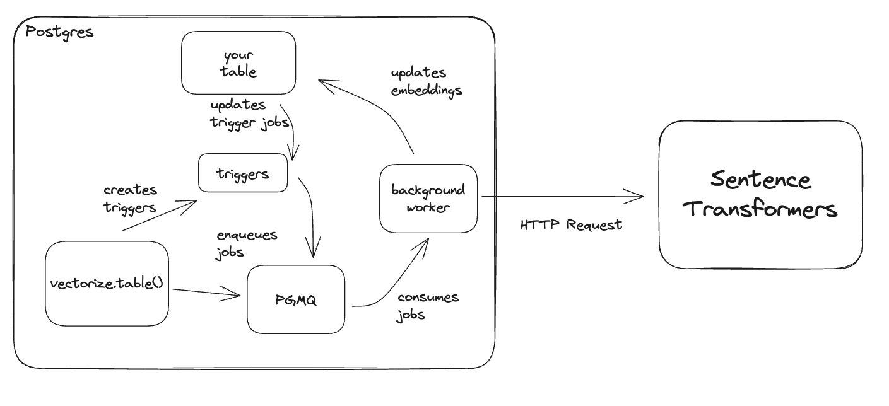

Sentence transformers have revolutionized text processing in machine learning and AI by converting raw text into numerical vectors, enabling applications like vector similarity searches and semantic search. With [pg_vectorize](https://github.com/tembo-io/pg_vectorize), an open source extension for Postgres, you have a seamless link to do vector search using over 120 open-source [Sentence Transformers](https://huggingface.co/sentence-transformers) from [Hugging Face](https://huggingface.co), directly from Postgres.

pg_vectorize is completely open source, and you can run it locally or in your own environment by following the project’s [quick-start guide](https://github.com/tembo-io/pg_vectorize?tab=readme-ov-file#pg_vectorize). It is also available by default on the Tembo [VectorDB Stack](https://tembo.io/docs/tembo-stacks/vector-db) in [Tembo Cloud](https://tembo.io) and can be added to any Tembo Postgres instance.

## What are sentence-transformers?

Machine learning and artificial intelligence models ultimately perform mathematical operations. So if you have raw text and want to build a machine learning or AI application, you need to find a way to transform text to numbers. There has been detailed [research](https://arxiv.org/abs/1908.10084) in this field, and  the resulting transformer models encode the meaning behind the raw text data into an array of floats. Once you have the array of floats (also called vectors or embeddings), now you can perform efficient mathematical operations such as vector similarity search and other forms of machine learning. [SentenceTransformers](https://www.sbert.net/) is also the name of a popular open-source Python library that provides a simple interface to transformer models, and it is used in this project.

## Picking the right sentence transformer for your use case

While OpenAI’s embedding API endpoint is commonly used, there are over [120 open-source](https://huggingface.co/sentence-transformers) sentence transformers available on Hugging Face. The right model to use depends on your data and your use case. For example, the [all-MiniLM-L12-v2](https://huggingface.co/sentence-transformers/all-MiniLM-L12-v2) model is a general purpose transformer useful for a wide variety of use cases such as training a supervised classification model or performing similarity search. Conversely, the [multi-qa-MiniLM-L6-dot-v1](https://huggingface.co/sentence-transformers/multi-qa-MiniLM-L6-dot-v1) model was built specifically for semantic search.

Model selection is a large area of research, so experimenting with transformers is highly recommended. Different models have different constraints on inputs, and produce different dimensionality of outputs. Theoretically, larger outputs can encode more information, but that is an area of active research. The tradeoff with larger dimensionality embeddings is that they require more storage and longer query times. Read more in [sbert's list of pre-trained models](https://www.sbert.net/docs/pretrained_models.html).

## Direct SQL hooks to Hugging Face sentence transformers via pg_vectorize

pg_vectorize allows you to use any of Hugging Face’s sentence transformer models via SQL. It can be configured by simply changing the `model_name` parameter in the `transform_embeddings` function. For example, to use this the [all-MiniLM-L12-v2](https://huggingface.co/sentence-transformers/all-MiniLM-L12-v2) model:

```sql
SELECT * FROM vectorize.transform_embeddings(
   input => 'the quick brown fox jumped over the lazy dogs',
   model_name => 'sentence-transformers/all-MiniLM-L12-v2'
);
```

```text
{-0.0028378579299896955,0.055683549493551254,-0.025058165192604065,0.02842593938112259, ..., 0.0828385129570961}
```

To use the [all-mpnet-base-v2](https://huggingface.co/sentence-transformers/all-mpnet-base-v2) model, just change the value of the `model_name` parameter.

```sql
SELECT * FROM vectorize.transform_embeddings(
   input => 'the quick brown fox jumped over the lazy dogs',
   model_name => 'sentence-transformers/all-mpnet-base-v2'
);
```

```text
{-0.028050078079104424,-0.004174928646534681,-0.001258305972442031,-0.017915889620780945, ..., 0.011784635484218596}
```

## Automate vector search workflow with just 2 SQL functions

Generating embeddings is one thing, but conducting vector search requires many steps:

* Transform, store, and index existing data in a table
* Handle refreshes for any inserts or updates during the lifecycle of your application.
* Transform raw text search queries into embeddings, using precisely the same transformer model.
* And lastly, conduct a similarity search on the fly.

This logic is typically left up to application developers and requires many tools to implement, but pg_vectorize enables it with just two function calls: `vectorize.table()` and `vectorize.search()`.

### Simplify vector creation and refresh via vectorize.table

`vectorize.table()` is how you set up a vector search job. pg_vectorize keeps track of the transformer model you use, and continuously monitors your table for changes. You can select the model to use for embedding transformation by setting the `transformer` parameter. pg_vectorize, then creates a vector column on your table to store embeddings for each row.

```sql
SELECT vectorize.table(
   job_name => 'my_search_job',
   table => 'mytable',
   primary_key => 'record_id',
   transformer => 'paraphrase-MiniLM-L6-v2',
   schedule => 'realtime'
);
```

By default, inserts and updates trigger an immediate transform of the new data using Postgres’s built-in [triggers](https://www.postgresql.org/docs/current/sql-createtrigger.html). However, pg_vectorize provides the flexibility to schedule updates by changing the cron-syntax `schedule` parameter. For example, `schedule -> ‘* * * * *’` will configure a batch job, managed by [pg_cron](https://github.com/citusdata/pg_cron), that checks for updates or inserts every minute. All triggers send a job to a [pgmq](https://github.com/tembo-io/pgmq) job queue, which means the transformation of text to embeddings does not slow down your insert or update events. Embedding transformations are always decoupled from the insert or update events.



### Intuitive vector search using vectorize.search

`vectorize.search()` is how you query your data given a raw text query. To search `mytable` for something like “mobile electronic accessories”, you need to transform the raw query into embeddings, being certain to use precisely the same sentence-transformer that generated the embeddings written to our database. Then, using those embeddings, conduct a vector similarity search via [pgvector](https://github.com/pgvector/pgvector) and return the results of the query. This orchestration is often handled within an application built by the dev team, but since this is just a feature in the database triggered by a function call, you no longer have to build it.


By referencing the `job_name`, pg_vectorize will know exactly which transformer model to use and which table to find the embeddings for similarity search. You can also tell pg_vectorize which columns you want to return in our query, because you mostly want to return human readable data like a product id or a product name, and not the embeddings themselves.

```sql
SELECT * FROM vectorize.search(
   job_name => 'my_search_job',
   query => 'mobile electronics accessories',
   return_columns => ARRAY['product_id', 'product_name'],
   num_results => 5
);
```

Results are returned as rows of jsonb, including a similarity score for the search query, sorted in descending order.

```text
                                        search_results                                        
------------------------------------------------------------------------------------------------
{"product_id": 13, "product_name": "Phone Charger", "similarity_score": 0.791816648695175}
{"product_id": 23, "product_name": "Flash Drive", "similarity_score": 0.7456739345117277}
{"product_id": 4, "product_name": "Bluetooth Speaker", "similarity_score": 0.7386882311199485}
```

## Separate compute for transformer models

Machine learning workloads typically have very different compute requirements than Postgres. For example, many transformers benefit immensely from a GPU, or massive amounts of CPU and memory. Therefore, it makes sense to run the embedding transformers on a separate host from Postgres itself, which does not natively require a GPU. So in our example, when you run [`docker compose up`](https://github.com/tembo-io/pg_vectorize/blob/main/docker-compose.yml), the transformer models are running in a separate container than Postgres. This gives you the flexibility to run the transformers wherever you want, so long as pg_vectorize is able to establish a network connection with the container running the transformers.


In Tembo Cloud, we run this workload on Kubernetes and manage it with the [tembo-operator](https://github.com/tembo-io/tembo/tree/main/tembo-operator) instead of `docker-compose`. This gives us the flexibility to assign and change the compute allocated to the transformer container.

The container hosting the transformers is a simple python http server built with FastAPI running the [SentenceTransformer](https://pypi.org/project/sentence-transformers/) library. It saves general-purpose all-MiniLM-L12-v2 model in the image, so when the container starts the model is immediately loaded into memory. When you call the container for any other model, it is downloaded and cached on the fly.

Clone the repo, give it a start, then run `docker-compose up` to get started. Or, try our managed service at [cloud.tembo.io](https://cloud.tembo.io) to get started.
