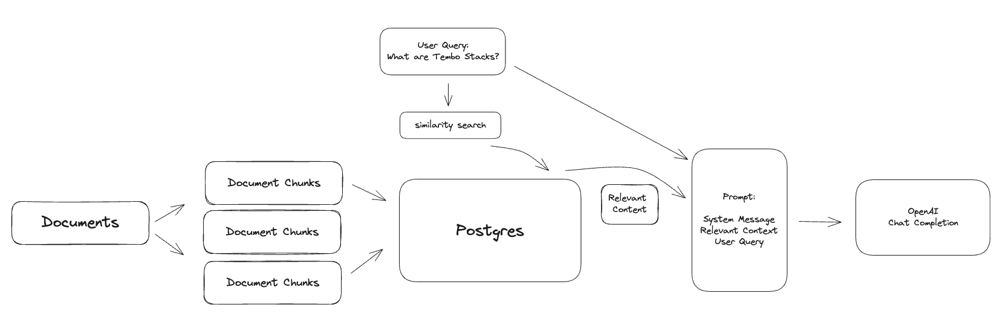

# Tembo RAG

Build LLM applications without deploying new infrastructure or changing your application's language stack. Tembo's RAG Stack gives you a SQL API to building LLM applications using Retrieval Augmented Generation (RAG) techniques. In short, RAG is a technique used to provide your own data as context to a chat model as a means to provide a chat experience tailored to your application's needs.

This guide will walk through building an application to support users with questions about Tembo's products and services.
 The application will ingest a collection of documents into Postgres as chunks of text, generate embeddings from that text using a sentence transformer from [Hugging Face](https://huggingface.co/sentence-transformers) and index it using [pgvector](https://github.com/pgvector/pgvector).
 Finally, a SQL interface to execute the RAG pipeline will be provided to generate responses to user questions using [tembo-py](https://github.com/tembo-io/tembo/tree/main/tembo-py) and [pg_vectorize](https://github.com/tembo-io/pg_vectorize).



## Features

- text to embedding transformers: supports any Hugging Face sentence transformer model, privately hosted Hugging Face model, and OpenAI embedding models
- define custom prompt templates with SQL
- mix-and-match embedding models and chat-completion models by changing SQL configurations

## Build a support agent with Tembo RAG

### Setup

Navigate to [https://cloud.tembo.io](cloud.tembo.io) and create a new RAG Stack instance.

### Prepare documents

First you will need a collection of documents. In this example, Tembo's docs and blogs will be used as the contextual basis for the application.

```bash
git clone https://github.com/tembo-io/website.git
```

Let's write a minimal script to copy all the markdown documents out of the repo and into a temporary directory.

```bash
mkdir tembo_docs

find "website/docusaurus/docs" -type f -name "*.md" -exec cp {} "tembo_docs" \;
find "website/landing/src/content/blog" -type f -name "*.md" -exec cp {} "tembo_docs" \;
```

There should be somewhere around 80 documents in the `tembo_docs` directory:

```bash
ls -l tembo_docs | wc -l
```

```console
79
```

Now all the contextual documents are in the `./tembo_docs` directory, which will make the next steps easier.

### Chunk documents

Most chat-completion models, like [chatgpt-3.5-turbo](https://platform.openai.com/docs/models/gpt-3-5-turbo) for example, have limits to the amount of data they can receive in a single request.
 OpenAI's gpt-3.5-turbo model only accepts 4096 tokens per request, while OpenAI's [gpt-4-turbo](https://platform.openai.com/docs/models/gpt-4-and-gpt-4-turbo) accepts 128,000 tokens.
 Therefore, the documents that are submitted to the chat completion model should fit into that context window limit.

It is also important to be aware for these context windows for cost reasons. As of this writing, GPT-4 costs $0.03 per 1k input tokens and $0.06 per output 1k token.
 Assume a question like "how do I build a message queue on Postgres?" is submitted to the agent, and it submits a 1,000 token document to GPT-4 as part of the request and a 100 token response is received.
 That's approximately $0.04 per question (this also assumes usage of Tembo's self hosted transformer models for generating embeddings, which would normally accrue a cost per token on embedding the question itself).
 Generally, using the full context window will achieve a better response, but comes at increased cost.

Load the documents into memory and process them into chunks using the official Python sdk for Tembo, tembo-py. This library's `rag` module currently wraps the major chunking functionality from the llama-index library, but all transformation and
 search functionality is handled within Tembo Postgres.

```bash
pip install tembo-py
```

```python
from tembo_py.rag import TemboRAG

rag = TemboRAG(
    project_name="tembo_support",
    chat_model="gpt-3.5-turbo",
    connection_string="postgresql://postgres:<password>@<yourTemboHost>:5432/postgres"
)

chunks = rag.prepare_from_directory("./tembo_docs")
```

The original 80 documents are now split into nearly 500 chunks, where each chunk is <= to the context window size of the `gpt-3.5-turbo` model.

```python
> print("number of chunks: ", len(chunks))
number of chunks:  475
```

### Insert documents into Postgres

Loading the chunks into Tembo Postgres is a one-line command:

```python
rag.load_documents(chunks)
```

### Initialize the agent

Now initialize the RAG project. This starts the process of generating embeddings for each chunk using the `sentence-transformers/all-MiniLM-L12-v2` model. This happens within Postgres on Tembo, and not in the environment where the python scripts are executed. This could take some time depending on how many chunks and documents are in the project.

```python
rag.init_rag(transformer="sentence-transformers/all-MiniLM-L12-v2")
```

It is safe to close the connection to the Tembo Postgres instance at this point.

### Ask a question

Connect to Postgres using any sql client.

```bash
psql 'postgresql://postgres:<password>@<yourTemboHost>:5432/postgres'
```

The chat completion model only supports OpenAI (embeddings can come from more sources), for now. Enter the OpenAI API key into the configuration below.

```sql
ALTER SYSTEM SET vectorize.openai_key TO '<your api key>';

SELECT pg_reload_conf();
```

Now call `vectorize.rag()` passing in the name of the agent we set up earlier (tembo_support) and a question.
 The full response is a JSON object that includes the chat response and the context passed to the chat model.
 Select just the chat resposne by adding `-> 'chat_response'` to the end of the query.

```sql
select vectorize.rag('tembo_support', 'what are tembo_stacks?') -> 'chat_response';
```

The response should be something like:

```console
"Tembo Stacks are pre-built, use case specific Postgres deployments that are designed to quickly deploy specialized data services in order to replace external, non-Postgres data services."
```

### Create a custom prompt

An important step to RAG is creating the prompt. It involves crafting questions or commands in a way that guides the LLM to understand the context and generate accurate, relevant, and useful responses.
 Therefore, its important to define a prompt template that is specific to the application and use case. The prompt is broken into two parts; the system message and the user message.
 Both messages are sent to the LLM, but the system message is sent first and used to set the stage and tone of the LLM. The user message follows the system message and is used to provide
 the LLM with the user's question along with the additional context that is provided from the relevant documents.

For the Tembo support agent, we'll define a prompt template that gives the. Use `{{ context_str }}` to specify where the relevant contextual documents should be placed and `{{ query_str }}` to specify where the user's question should be placed.

```sql
INSERT INTO vectorize.prompts (prompt_type, sys_prompt, user_prompt) VALUES (
    'tembo_support_task',
    'You are a Postgres expert and are tasked with helping users find answers in Tembo documentation. You should prioritize answering questions using the provided context, but can draw from your expert Postgres experience where documentation is lacking. Avoid statements like "based on the documentation..."',
    'Context information is below.\n---------------------\n{{ context_str }}\n---------------------\nGiven the Tembo documentation information and your expert Postgres knowledge, answer the question.\n Question: {{ query_str }}\nAnswer:'
);
```

Then, call rag() again but specify the new prompt:

```sql
select vectorize.rag(
    agent_name => 'tembo_support',
    query => 'what are tembo_stacks?',
    chat_model => 'gpt-3.5-turbo',
    task => 'tembo_support_task'
) -> 'chat_response';
```

```console
 "Tembo Stacks are a feature provided by Tembo that allows users to create and deploy custom-built versions of Postgres with extensions tailored for specific enterprise needs. These Stacks are designed to accelerate development by eliminating the need to set up new databases repeatedly. With Tembo Stacks, users can replace external non-Postgres data services. The Tembo General stack is a specific Stack provided by Tembo that offers a tuned Postgres instance suitable for general-purpose computing. Users have full control over compute resources, configuration settings, and the installation of extensions when using the Tembo General stack."
```

### Limitations

RAG can be a very powerful technique for building an LLM application, but the effectiveness of the chat model is highly dependent on a few factors:

- the contextual documents provided in RAG need to be relevant. This means that relevant documents must not only exist, but the similarity search also needs to find them.
- the prompt needs to be well-crafted to guide the LLM to generate accurate and relevant responses. Even with a highly tailored prompt, chat responses are still subject to "hallucinations".
- context windows are a constraint, and are costly. Using a chat model with a higher context window is more likely but not guaranteed to generate a better response, and it is guaranteed to be more expensive.

### Support

Join the Tembo Community and say hi and see how others are building on Tembo.
