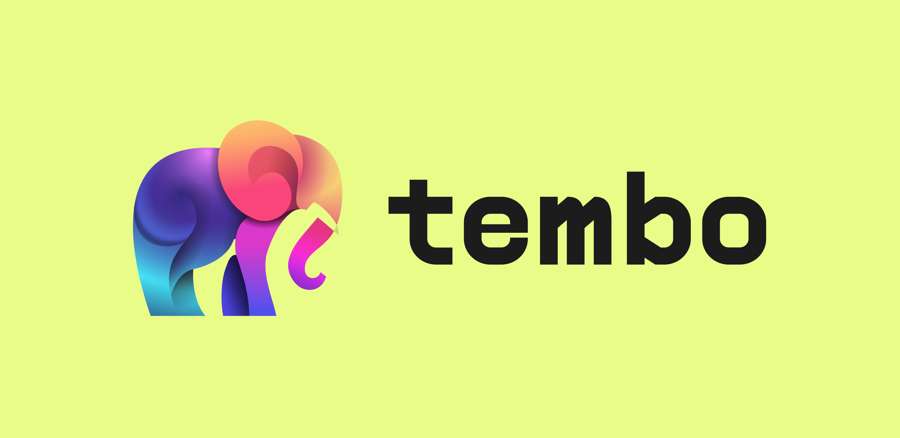
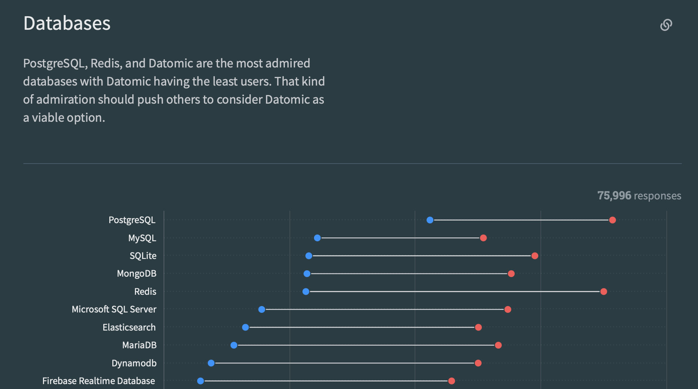

> January 10, 2024
> After a year of hard work by our amazing team, we [announced the general availability](https://tembo.io/blog/ga) (GA) of [Tembo Cloud](https://cloud.tembo.io), a managed Postgres service that unlocks the full power of the Postgres ecosystem. Please [give it a try](https://cloud.tembo.io)!

## Vendor sprawl and data islands

Organizations typically store their data across various databases, generally grouped into transactional and analytical systems. There's roughly 10x more transactional than analytical data, mostly in Oracle, MySQL, and Postgres, and there have been some sizable shifts to this landscape in recent years:

1. We saw some analytical workloads move to the cloud. This was the big data era, resulting in the rise of platforms like Snowflake and Databricks.
1. Some transactional workloads moved to streaming and real-time data. This required transactional and analytical processing platforms to be managed by app developers, not database admins.
1. Application infrastructure has been abstracted, allowing developers to build and scale applications more efficiently. Services like Vercel and Netlify have streamlined the development lifecycle, but tend to build on top of databases rather than dealing with the databases themselves.

The net result? Exactly what we see around us—an ever-expanding menagerie of innovative apps and services built upon an increasingly complex database ecosystem. The modern data stack is more complicated and expensive than it's ever before, and with the normalization of AI, the trend is accelerating. How can we cope?

## Postgres as a Platform

Developers would love an open-source, multi-functional data platform to simplify their lives and work—as long as it doesn't restrict their freedom. Companies, meanwhile, want reliability, flexibility, and a pathway out of the spiraling costs and vendor lock-in attempts that they're currently saddled with.
At face value, there's an obvious solution that ticks all the necessary boxes:
Postgres.

Postgres, the world's favorite database with millions of deployments, features a liberal OSS license and a large community. It efficiently manages SQL and JSON queries across diverse workloads, and handles low latency, high throughput analytical cases, offering HTAP-lite capabilities through window functions and foreign data wrappers. Known for its extensibility and ACID compliance, it stands out as a reliable and cost-effective system.

Even better, its extensibility has resulted in a wide ecosystem of add-ons and plugins for GIS data, image processing, vector databases, and more, with some extensions evolving into companies like CitusDB and Timescale. In short, everything you’d want and then some.

*Source: [Stack Overflow Developer Survey 2023](https://survey.stackoverflow.co/2023/#section-admired-and-desired-databases)*

Problem solved, right? Not so fast.

## Overwhelment​

*(It's a word now. Go with it.)*

Companies are typically hesitant to adopt databases due to costs, complexity, and risk. The effort required to build, configure, and optimize a new system often makes the transition value negligible at best. For these companies (especially large enterprises that spend billions per year on a fragmented database architecture), Postgres and its assimilation of database innovations should be an ideal solution. Open source, extensible, free from vendor lock-in and ever-increasing costs—it should be a no-brainer.
“What's the holdup?” you might ask. Well, Postgres is... complicated.

To create a self-managed cluster of Postgres clusters, DBAs have to consider infrastructure, environment, security, data management, backups, and workload-specific tuning., Maintaining and scaling Postgres also involves meeting high availability requirements, managing data storage, updating schemas, optimizing query performance, and managing failover protection and caching. And while extensions exist to support additional functionality in Postgres, they are hard to discover, evaluate, certify and deploy.

Put simply, Postgres is the solution… if you can tame it and make it manageable.

## Our Vision

This is where Tembo comes in. Tembo is the managed cloud to run Postgres and its entire ecosystem—extensions, applications, tools, and more—all within a single unified platform.

Tembo simplifies deploying Postgres with a virtualized runtime experience, enabling one-click migrations and access to the Postgres ecosystem. Developers can control the data model lifecycle, and deploy to multiple zones and clouds. Advanced options will include autoscaling, hybrid transactional and analytical processing (HTAP), and edge caching.

Additionally, Tembo invests in the Postgres extension ecosystem, aiming to standardize and simplify the use and creation of extensions. By unbundling and decoupling the database into services and abstraction layers, Tembo enables new simplicity and capability.

## Tembo Cloud

Tembo Cloud is Postgres the way it *should* be. With Tembo, you don't have to be a database expert to build an expert database. We are building a dev-first, fully-extensible, fully-managed, secure, and scalable Postgres service. Available on all clouds and bare metal providers, Tembo Cloud provides the largest curated library of easily installed extensions, allowing our customers to expand their use cases of Postgres.

## Tembo Stacks

Stacks accelerate your development by enabling you to quickly create and deploy custom-built "flavors" of Postgres + extensions that are tailor-made for key enterprise needs. No need to spin up new databases and endure the pain and associated sprawl—Stacks enable you to replace external, non-Postgres data services.

## What Does This Mean?

No matter who you are or what you're trying to build, three things are true about Tembo:

* True Managed Open Source: You don't have to settle for a complex web of OSS data services or a restrictive, locked-in, expensive managed contract with one of the large cloud providers. Tembo is committed to making true open-source Postgres manageable and accessible.
* Developer Centric: You can have the flexibility and control you've dreamed of. Tembo is made by developers, for developers. We give you fast deployment, automatic migration, and a clear path to genuine value. We win when you win.
* Future Proof: Postgres is beloved by developers. It isn't going anywhere, and with the constantly growing ecosystem of extensions and applications, it's only getting better. With Tembo, you get all the potential of that ever-growing network, right at the click of a button.

## $100B going on $200B

That's the expected size of the global database market in 2023 and 2027. The amount of data being generated, stored, and leveraged is growing exponentially, as is the need for applications to operate at a global scale. We're producing more data, we need it faster, and the uses for it are more and more complex by the day.

:::tip Try it out

We invite you to sign up for [Tembo Cloud](https://cloud.tembo.io), and unlock the full power of the Postgres ecosystem.

:::
