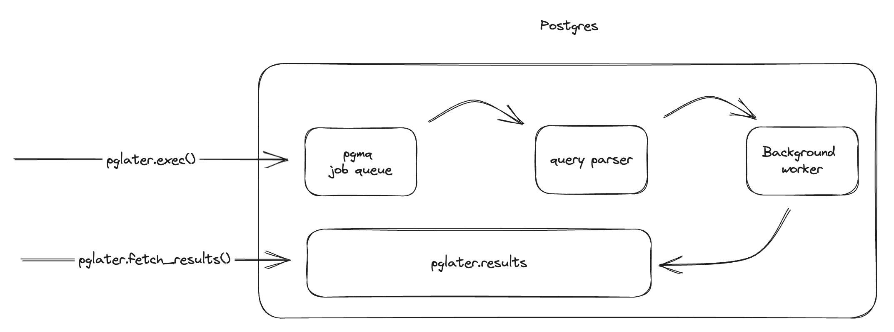

import Callout from '../../../components/Callout.astro';


We've released a new Postgres extension called [pg_later](https://github.com/tembo-io/pg_later), which enables asynchronous query execution in Postgres. If you've used [Snowflake's asynchronous queries](https://docs.snowflake.com/developer-guide/python-connector/python-connector-example#examples-of-asynchronous-queries), you might already be familiar with this capability. Submit your queries to Postgres now, and come back later and get the query's results.

You can try pg_later on [Tembo Cloud](https://cloud.tembo.io/) as part of our [Machine Learning Stack](https://tembo.io/docs/tembo-stacks/machine-learning).

<Callout variant='info' title='Machine Learning Stack'>
[Tembo Cloud](https://cloud.tembo.io/)'s Machine Learning Stack is powered by [postgresml](https://github.com/postgresml/postgresml) and pg_later, but also ships with Postgres configurations optimized for message queue workloads. We also provide additional metrics and data visualizations specific to message queues.
</Callout>

## Why async queries?

Imagine that you've initiated a long-running maintenance job. You step away while it is executing, only to come back and discover it was interrupted hours ago due to your laptop shutting down. You don't want this to happen again, so you spend some time googling or asking your favorite LLM how to run the command in the background with screen or tmux. Having asynchronous query support from the beginning would have saved you a bunch of time and headache!

Asynchronous processing is a useful development pattern in software engineering. It has advantages such as improved resource utilization, and unblocking of the main execution thread.

Some examples where async querying can be useful are:

* DBAs running ad-hoc maintenance.
* Development in interactive environments such as a Jupyter notebook. Rather than submit a long-running query only to have your notebook hang idly and then crash, you can use asynchronous tasks to avoid blocking your notebook, or simply come back later to check on your task.
* Long-running analytical queries. For example, fulfilling an ad-hoc request like seeing how many new users signed up each day overthe past month. You can submit that query and have it run in the background while you continue other work.

## Extending Postgres with async features

pg_later is similar, you can dispatch a query to your Postgres database and rather than waiting for the results, your program can return and retrieve the results at your convenience.

A common example is manually executing `VACUUM` on a table. Typically, one might execute VACUUM in one session and then use another session to check the status of the VACUUM job via `pg_stat_progress_vacuum`. pg_later gives you the power to do that in a single session. You can use it to queue up any long-running analytical or administrative task on your Postgres database.

## Stacking Postgres Extensions

pg_later is built on top of [PGMQ](https://tembo.io/blog/introducing-pgmq), another one of Tembo's open source extensions. Once a user submits a query, pg_later seamlessly enqueues the request in a Postgres-managed message queue. This mechanism then processes the query asynchronously, ensuring no unnecessary wait times or hold-ups.

A [Postgres background worker](https://www.postgresql.org/docs/current/bgworker.html) picks up the query from the queue and executes it. The results are persisted by being written to a table as [JSONB](https://www.postgresql.org/docs/current/functions-json.html) and can be easily retrieved using the pg_later API. You can simply reference the unique job id given upon query submission and retrieve the result set, or query the table directly. By default, the results are retained forever. However, we are building retention policies as a feature into pg_later.



## Using pg_later

To get started, check out our project's [README](https://github.com/tembo-io/pg_later/blob/main/README.md) for a guide on installing the extension.

### Initializing the Extension

First, you need to initialize the extension. This handles the management of PGMQ objects like a job queue and some metadata tables.

```sql
select pglater.init();
```

### Dispatch queries

You're now set to dispatch your queries. Submit the query using pglater.exec, and be sure to take note of the `job_id` that is returned. In this case, it's the first job so the `job_id` is 1.

```sql
select pglater.exec(
  'select * from pg_available_extensions limit 2'
) as job_id;
```

```text
 job_id
--------
     1
(1 row)
```

### Retrieving results

And whenever you're ready, your results are a query away:

```sql
select pglater.fetch_results(1);
```

```text
{
  "query": "select * from pg_available_extensions limit 2",
  "job_id": 1,
  "result": [
    {
      "name": "pg_later",
      "comment": "pg_later:  Run queries now and get results later",
      "default_version": "0.0.6",
      "installed_version": "0.0.6"
    },
    {
      "name": "pgmq",
      "comment": "Distributed message queues",
      "default_version": "0.10.1",
      "installed_version": "0.10.1"
    }
  ],
  "status": "success"
}
```

## Up next

`pg_later` is a new project and still under development.

A few features that we are excited to build:

* Status and progress of in-flight queries
* Security and permission models for submitted queries
* Cursor support for finished jobs (fetch results row by row)
* Kill a query that is in the queue or is currently in flight
* Support for transactions
* Configurable concurrency levels for background works to increase the throughput of jobs
* Push notifications for completed and failed jobs
* Retention policies for completed jobs

Give us a [star](https://github.com/tembo-io/pg_later) and try out pg_later by running the example in the README. If you run into issues, please create an [issue](https://github.com/tembo-io/pg_later/issues). We would greatly welcome contributions to the project as well.

You can also try pg_later on [Tembo Cloud](https://cloud.tembo.io/) for free as part of our [Machine Learning Stack](https://tembo.io/docs/tembo-stacks/machine-learning).
