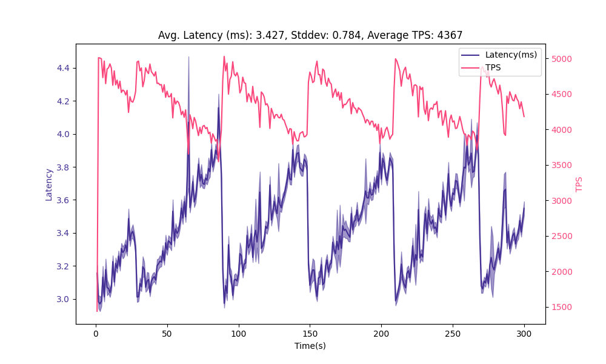
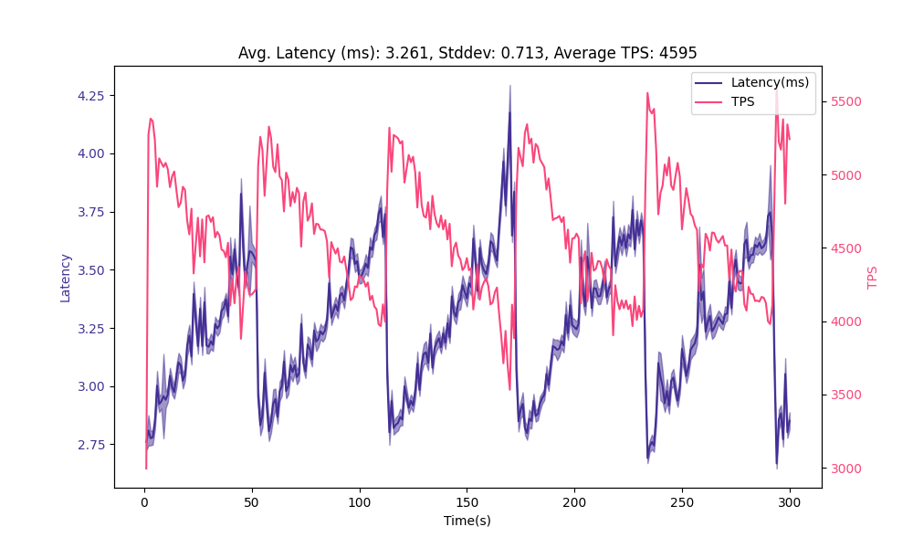
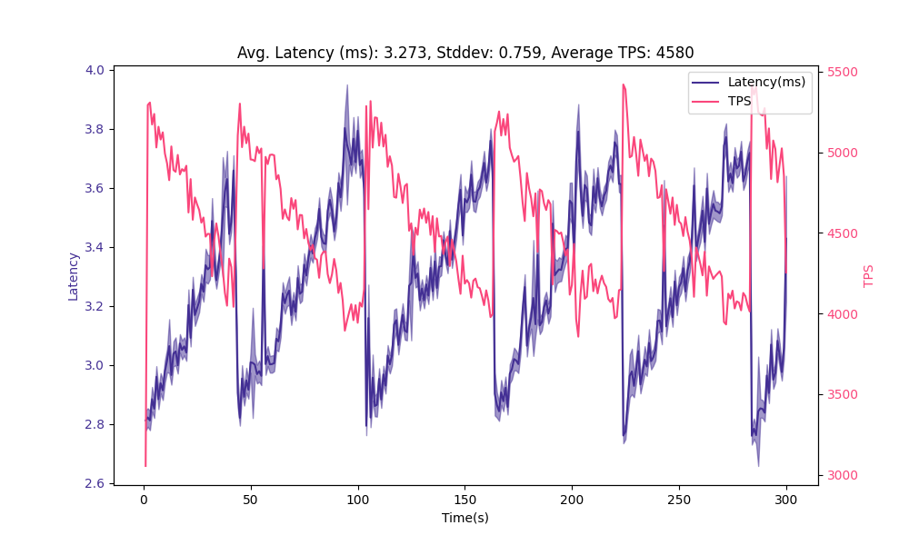
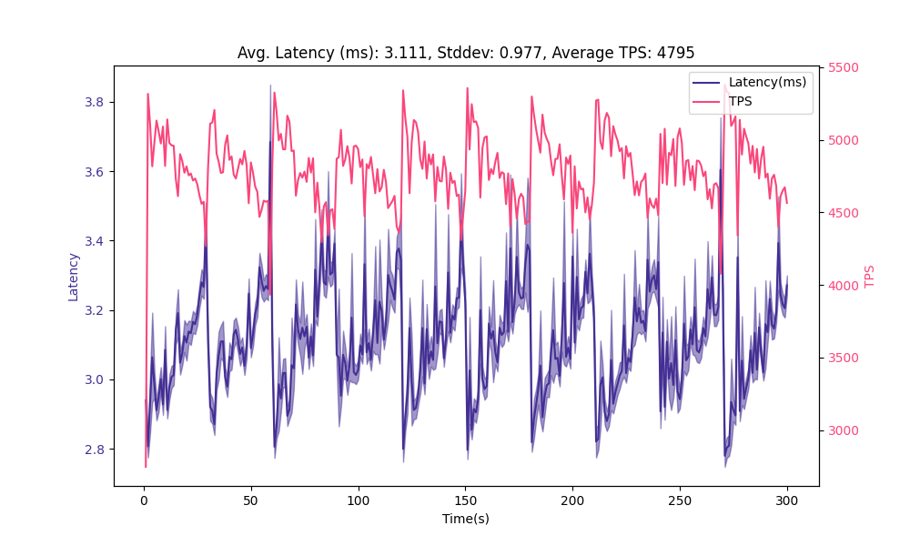
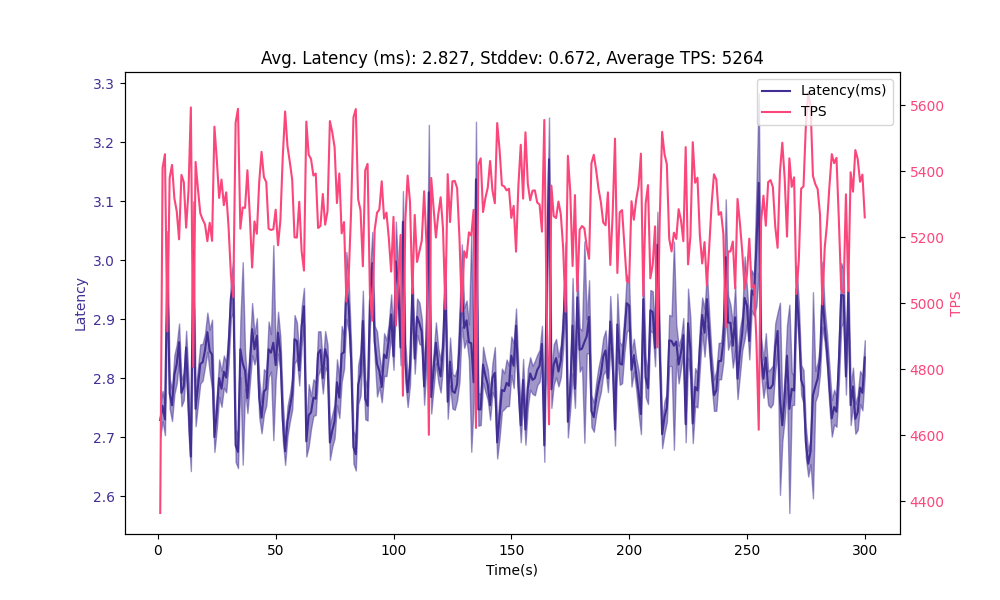

Database systems use various techniques to ensure transactionality and performance. For Postgres, this is called MVCC (Multi-Version Concurrency Control). MVCC allows Postgres to provide great performance even when multiple clients could be working with the same table concurrently.

It is useful to be aware of Postgres' MVCC implementation to understand how Postgres manages a table's physical storage. Internally, Postgres refers to rows as “tuples”. And as a baseline, there are two big ideas to keep in mind about how Postgres implements changes to rows in a table:

- An UPDATE operation in Postgres is equivalent to a DELETE of the previous tuple, plus an INSERT of the new one.
- A DELETE operation in Postgres does not cause the data to be removed from physical storage. It only causes it to be marked as deleted.

This is why Postgres has the [autovacuum](https://www.postgresql.org/docs/current/routine-vacuuming.html#AUTOVACUUM) process: It is the automatic process in charge of cleaning up and optimizing table storage for Postgres. You can follow this blog post with a local test environment of Postgres. I will demonstrate with code how MVCC and VACUUM features work, and how to tune the Auto-vacuum process.

## Why does it matter?

Vacuum is not just about cleaning up storage space. In environments where data undergoes constant change, Postgres tables often experience an excessive amount of Inserts, Updates, and Deletes. This activity can lead to table bloat. Table bloat happens when a table's physical footprint far exceeds the size of the data that it actually holds.

Table bloat is a condition that if not managed, will likely hamper performance of our database. And so, this takes us back to the autovacuum process: to extract its maximum benefits, you may need to fine-tune its settings.

Postgres's default autovacuum settings are pretty good. If you're like me, it could have been years into your postgres journey before having a negative experience with bloat. However, when the time came I found it challenging to understand and tune these configuration settings. That's why we will study them safely in a dev environment.

## Unraveling the Mystery of Bloat & Vacuum's Role

PostgreSQL's mechanism for handling bloat is unique due to its adherence to MVCC. Contrary to immediate space reclamation after data is deleted or becomes obsolete, Postgres tags these rows as "dead", or “dead tuples”. However, even though they are dead they still occupy disk space and will degrade the performance of your queries. Many queries will continue to scan through these tuples, despite their “dead” status. The auto-vacuum steps in here, ensuring that these rows are removed and both the table and its associated indexes are streamlined for performance. You can't scan the dead tuples if they no longer exist!

To illustrate, let us create some bloat and see how it affects a rowcount query:

Create a table we can easily manipulate, and let's disable autovacuum so we can observe the consequences.

```sql
CREATE TABLE bencher (
  record_id bigserial,
  updated_at timestamp with time zone
);
ALTER TABLE bencher SET (autovacuum_enabled = false);
SELECT pg_reload_conf();
```

Now insert 10 million rows of example data.

```sql
INSERT INTO bencher(updated_at)
SELECT now()
FROM generate_series(1, 10000000);
```

We just created the table, and have only inserted records, so there are currently no dead tuples.

```sql
SELECT
    schemaname,
    relname,
    n_dead_tup,
    n_live_tup
FROM pg_stat_user_tables
WHERE relname = 'bencher';

 schemaname | relname | n_dead_tup | n_live_tup
------------+---------+------------+------------
 public     | bencher |          0 |   10000000

```

Let's see how long it takes to get a rowcount with no bloat.

```sql
\timing

select * from bencher where record_id = 5000000;
record_id | updated_at
-----------+-------------------------------
5000000 | 2023-08-30 14:42:05.584778+00
(1 row)

Time: 191.006 ms
```

Great, 191ms. Slow, yes but we have no indices because we're demonstrating bloat. Now lets create a bunch of dead tuples. This can take a minute or so.

```sql
DO $$
DECLARE
i integer;
BEGIN
FOR i IN 1..5 LOOP
  UPDATE bencher SET updated_at = now();
END LOOP;
END $$;
```

Now, lets see how long it takes to fetch the same record:

```sql
select * from bencher where record_id = 5000000;
record_id | updated_at
-----------+-------------------------------
5000000 | 2023-08-30 14:42:58.964919+00
(1 row)

Time: 283.728 ms
```

It's getting closer to 300ms now. Let's check how many dead tuples are on the table.

```sql
SELECT
    schemaname,
    relname,
    n_dead_tup,
    n_live_tup
FROM pg_stat_user_tables
WHERE relname = 'bencher';


schemaname | relname | n_dead_tup | n_live_tup
------------+---------+------------+------------
public | bencher | 50000000 | 10000000
```

Now let's manually clean up the dead tuples and restore our query performance.

```sql
VACUUM FULL bencher;
```

And check the dead tuple count, there are no dead tuples.

```sql
SELECT
    schemaname,
    relname,
    n_dead_tup,
    n_live_tup
FROM pg_stat_user_tables
WHERE
    n_dead_tup > 0 --needed to avoid division by zero
and relname = 'bencher';
 schemaname | relname | n_dead_tup | n_live_tup
------------+---------+------------+------------
 public     | bencher |          0 |    10000000
```

Finally, let's retrieve the record. Performance restored!

```sql
select * from bencher where record_id = 500000;
record_id | updated_at
-----------+-------------------------------
500000 | 2023-08-30 14:42:58.964919+00
(1 row)

Time: 194.101 ms
```

## Setting up a benchmarking environment

The rest of the examples will be run on Postgres in [Tembo Cloud](https://cloud.tembo.io). We'll use 8 vcore and 16Gb of memory and execute all the `psql` and `pgbench` commands from an EC2 instance within the same region as Postgres.

Let's set up a script that will create an absurdly large amount of churn on our table and be able to execute it with `pgbench`. For every iteration, let's insert a row to our “bencher” table. Then, let's read and update a single record. Finally, let's delete the same record. This will create a situation similar to many queue implementations ([like PGMQ](https://github.com/tembo-io/pgmq)), where there are at least 2 transactions for every 1 insert. Additionally, the total record count on the table will typically be low - for every record we insert, we also delete one.

This creates a situation where a table consists of primarily dead tuples!

```sql
-– churn.sql
DO $$
DECLARE
rec_id INT;
BEGIN
    INSERT INTO bencher(updated_at)
SELECT now();

-- read and update a row
WITH cte AS
(
    SELECT record_id
    FROM bencher
    WHERE updated_at < now()
    ORDER BY record_id ASC
    LIMIT 1
FOR UPDATE SKIP LOCKED
)


UPDATE bencher
SET
    updated_at = now()
WHERE record_id in (select record_id from cte)
RETURNING record_id INTO rec_id;


-- Delete the row with the returned ID
DELETE
FROM bencher
WHERE record_id = rec_id;
END $$;
```

Set Postgres to all the default vacuum configurations;

```sql
ALTER SYSTEM SET autovacuum_vacuum_scale_factor = 0.2;
ALTER SYSTEM SET autovacuum_vacuum_cost_delay = '20ms';
ALTER SYSTEM SET autovacuum_vacuum_cost_limit = '-1';
ALTER SYSTEM SET vacuum_cost_limit = 200;
ALTER SYSTEM SET autovacuum_naptime = '1min';
SELECT pg_reload_conf();
```

Let's run a benchmark to get a baseline. We will reuse this benchmark through the process.

```sh
pgbench 'postgresql://postgres:pw@host:5432' -c 100 -j 1 -P 1 -T 300 -r -f churn.sql
```



Average latency is about 3.4 ms. We are benchmarking an expensive set of queries, and you've probably noticed the sawtooth pattern in the plot and a high standard deviation relative to the latency. This is a symptom of bloat accumulating on our table. Query latency grows until the vacuum process clears dead tuples, and then grows once again. This also has an inverse impact on transactions per second (TPS). Ideally we can reduce and provide some stability to latency.

## Balancing Vacuum Delay for Optimal System Performance

Vacuuming is indispensable. However, it is not free and if left unchecked, it can burden your system. The balance lies in `autovacuum_vacuum_cost_delay` and `autovacuum_vacuum_cost_limit`. `autovacuum_vacuum_cost_delay` is the amount of time that the autovacuum process will halt processing when the `autovacuum_vacuum_cost_limit` is reached. Imagine this series of events - a table reaches 10% bloat, meaning 10% of the tuples are dead. When the 10% threshold is reached, the autovacuum worker begins to work and starts accruing cost. When that cost reaches `autovacuum_vacuum_cost_limit`, it will pause for the duration specified by `autovacuum_vacuum_cost_delay`, and then continue working until it is complete.

Modifying these can craft the perfect balance between seamless vacuuming and system efficiency. Let's increase the cost limit to the max, and reduce the delay by  half. This will let the autovacuum process run longer and pause for a shorter period of time when it does reach the cost limit, to ideally reduce bloat faster and reduce query latency.

```sql
ALTER SYSTEM SET autovacuum_vacuum_cost_delay = '10ms';
ALTER SYSTEM SET autovacuum_vacuum_cost_limit = 10000;
SELECT pg_reload_conf();
```



We have a slight reduction in average latency, but we can still see that the obviously grows in latency over time and decrease in TPS. It clears roughly every 60 seconds.

## Fine-Tuning Auto Vacuum Scale Factors

In the previous example, we manually vacuumed our table. But postgres gives us an automated way to configure the vacuum process. One of the most critical parameters is the `autovacuum_vacuum_scale_factor`; it denotes the portion of the table size that, when surpassed by "dead" rows, prompts a vacuum action. For tables that see frequent data changes, it might be beneficial to lessen this value.

```sql
ALTER SYSTEM SET autovacuum_vacuum_scale_factor = 0.1;
SELECT pg_reload_conf();
```



Reducing the scale factor had minimal impact on our result, so allowing the autovacuum to trigger sooner did not help. We can see that the period of the sawtooth pattern is still about 60 seconds, which means there we are probably limited by `autovacuum_naptime`, which we'll talk about next.

## A Quick Siesta for Your System

The `autovacuum_naptime` parameter in Postgres specifies the minimum delay between autovacuum runs on any given database. The default (which we set earlier) is `1min`. Generally, depending on just how high-churn your workloads are, it might be necessary to decrease this value, whereas a longer interval could be suited for environments that are not churning at such a high rate. But our table has a crazy amount of churn.

We want to reduce the height of the latency peaks. One way to do this is to make the vacuum more aggressive and tell it to run sooner. We tried to influence that by setting the `autovacuum_vacuum_scale_factor`, but we can also lower the `autovacuum_naptime` value, which will also allow it to run sooner. Let's cut it in half.

```sql
ALTER SYSTEM SET autovacuum_naptime = '30s';
SELECT pg_reload_conf();
```



Allowing the autovacuumer to run more frequently reduced our average latency and increase TPS. However, we're still seeing a noticeable sawtooth pattern and high standard deviation of latency. Let's completely disable the cost limitations to the vacuum process, let it have as much compute as it needs.

```sql
ALTER SYSTEM SET autovacuum_vacuum_cost_delay = '0';
SELECT pg_reload_conf();
```


Finally, reduce naptime to 10s

```sql
ALTER SYSTEM SET autovacuum_naptime = '10s';
SELECT pg_reload_conf();
```



Overall, we've iterated on autovacuum settings and reduced the average latency from 3.4ms to 2.8ms and stddev from 0.8ms to 0.7ms, which helped increase TPS from 4.3k to about 5.3k.

Configuring the autovacuum settings can be a lot of fun and the appreciated values are wildly dependent on the workload. We covered the absurdly high churn use case on a single-table today, which is very similar to what we see when running applications using PGMQ. Vacuum is complicated and can be [tuned differently](https://www.enterprisedb.com/blog/postgresql-vacuum-and-analyze-best-practice-tips) when considering multiple tables with different workloads. Other OLTP use cases will call for different settings, and OLAP workloads may be less influenced by the vacuum settings . Follow us, and sign up for [Tembo Cloud](https://cloud.tembo.io) because we will surely be writing about these other topics soon.

## More on this topic

Watch the video on [Optimizing autovacuum: PostgreSQL's vacuum cleaner by Samay Sharma](https://www.youtube.com/watch?v=D832gi8Qrv4).
