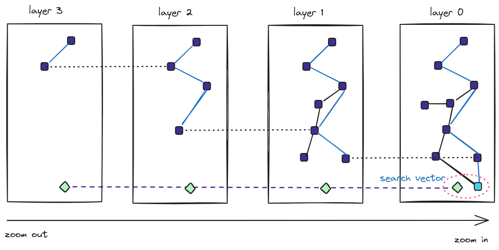
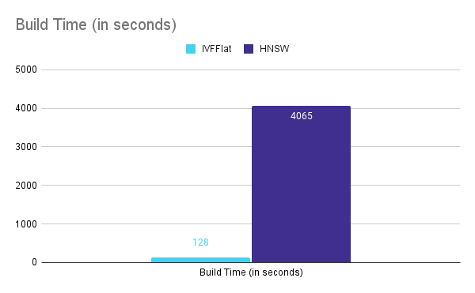
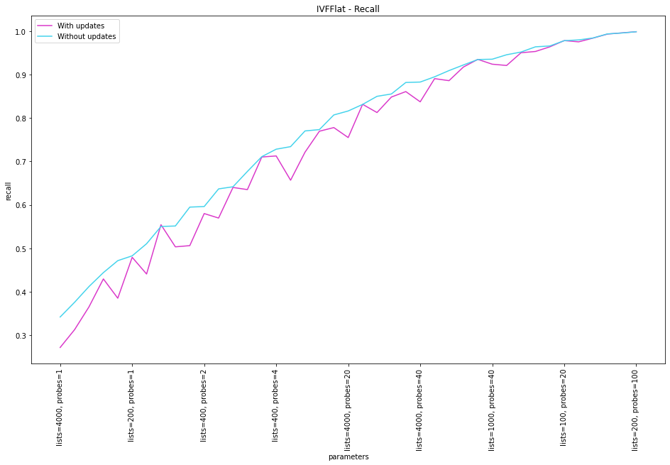
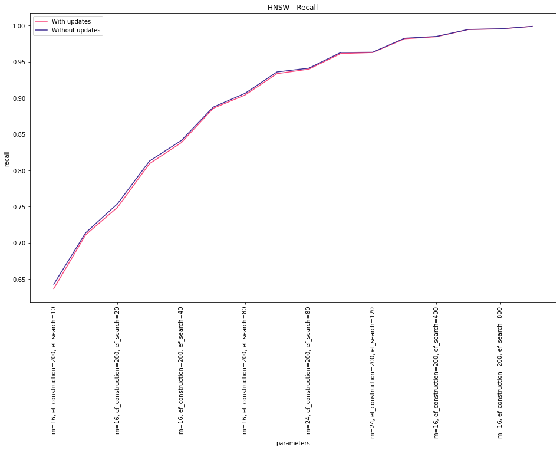

import Callout from '../../../components/Callout.astro';

<p align="right" style={{color: 'grey'}}><em>
Image credit: Generated with Bing Image Creator
</em></p>

In databases, indexes are data structures that speed up finding specific values in a table column. The analogous task in vector databases consists of finding the (approximate) nearest-neighbors of a given vector. So, to accomplish this task fast, we can similarly create specialized vector indexes.

But, speeding up a query is not just about blindly creating an index. When deciding whether to create one or more indexes on a table, several factors need to be considered—for example, the size of the tables, whether the table is modified frequently, how the table is used in queries, and so on. Similar considerations apply to vector indexes.

In today's post, let us explore vector indexes and their tradeoffs in the context of Postgres and [Pgvector](https://github.com/pgvector/pgvector). In particular, let us compare their build time, size, and speed, and, based on that, derive some guidelines to decide which one to choose for a given application.


## Indexes in Pgvector

Pgvector is an open-source Postgres extension for similarity search. It allows for exact and approximate nearest-neighbor search. In particular, for ANN it offers two types of indexes: IVFFlat and HNSW. Let us briefly discuss them.

### IVFFlat

The IVFFlat (Inverted File with Flat Compression) index works by dividing the vectors in the table into multiple lists. The algorithm calculates a number of **centroids** and finds the **clusters** around those centroids. So, there is a list for each centroid, and the elements of these lists are the vectors that make up its corresponding cluster.

When searching for the K nearest vectors, instead of calculating the distance to all vectors, the search space is narrowed to only a subset of the lists, thus reducing the number of computations. Which lists are the candidates? The ones whose centroid is closer to the search vector.


<p align="right" style={{color: 'grey'}}><em>
IVFFlat generates lists based on clusters.
</em></p>

So, we can infer that the effectiveness of the index depends on two parameters: the number/size of the lists and the number of lists that need to be examined during the search (aka probes).

In pgvector, these two parameters are selected in two distinct moments. First, the number of lists is chosen when creating the index, for example:

```sql
CREATE INDEX ON items USING ivfflat (embedding vector_cosine_ops) WITH (lists = 1000)
```

Second, the number of lists to be explored is established during execution, e.g.:

```sql
SET ivfflat.probes = 32
```

The [pgvector documentation](https://github.com/pgvector/pgvector#ivfflat) suggests the following:

> Choose an appropriate number of lists - a good place to start is rows / 1000 for up to 1M rows and sqrt(rows) for over 1M rows
>
> When querying, specify an appropriate number of probes (higher is better for recall, lower is better for speed) - a good place to start is sqrt(lists)


So, imagine that we have a dataset of 1M vectors. With the parameters above, pgvector would generate 1,000 lists of _approximately_ 1,000 vectors. When executing a query, it would only query ~32 of such lists and execute ~32,000 comparisons to find the closest neighbors to a search vector. That is, only 0.032X compared to a full scan.

Of course, you can choose different parameters to achieve the desired recall. More on that later in this post.


### HNSW

The [Hierarchical Navigable Small Worlds (HNSW)](https://arxiv.org/pdf/1603.09320.pdf) index creates a graph with multiple layers. The nodes in the graph represent vectors, and the links represent distances. Finding the ANN consists of traversing the graph and looking for the shorter distances.

We can think of these layers as different zoom levels of the graph. Zooming out, we see a few nodes (vectors) and links. But as we zoom in, we see more and more nodes and more and more links.

The traversal of the graph resembles a [skip list](https://en.wikipedia.org/wiki/Skip_list) in that if no more candidate nodes are found in the current layer of the graph, the search continues in the next layer (zoom in), where more links should exist.


<p align="right" style={{color: 'grey'}}><em>
HNSW creates a graph with multiple layers
</em></p>


For HNSW, two tuning parameters are decided at creation time: the maximum number of connections per layer (`m`) and the size of the dynamic candidate list for constructing the graph (`ef_construction`):

```sql
CREATE INDEX ON items USING hnsw (embedding vector_cosine_ops) WITH (m = 16, ef_construction = 64)
```

A bigger value for `m` means that each node would have more links in each layer of the graph. A big `m` affects negatively during query time since more connections need to be checked, but it also improves recall.

`ef_construction` is also used during the build phase of the index, and it indicates the entry points in layer i+1. That means that bigger values would lead to heavier indexes.

Pgvector does not mention any particular [recommendation for HNSW](https://github.com/pgvector/pgvector#hnsw), but the defaults are `m=16`  and `ef_construction=64`.

Another parameter, `ef_search`, determines the size of the dynamic candidate list of vectors. In pgvector, the default is `ef_search=40`, but can be modified as follows at query time:

```sql
SET hnsw.ef_search = 100;
```


## Impact of Approximation on Recall

In the previous sections, I mentioned a couple of times that the build parameters affect recall. What do we mean by that?

Well, `Recall` measures how many retrieved neighbors are indeed in the true kNN group. For example, a recall of 1.0 means that all calculated neighbors are really the closest. Whereas a recall of 0.5 means that only half of the computed neighbors are the closest. Recall is an important metric because it helps measure the approximation errors and tune the index parameters.

IVFFlat and HNSW are approximate indexes that work with heuristics. That means that there could be errors in their search results.

Take IVFFlat as an example. When deciding which lists to scan, the decision is taken based on the distance to the centroid of the list. Depending on the data and the tuning parameters, the closest vector to the search vector could correspond to a list that was not selected for probing, thus reducing the accuracy of the result.

One way to mitigate this problem and boost recall is to increase the number of lists to probe. But that, of course, would incur a performance penalty. So, **improving the recall is not for free**, and careful evaluation and tuning of the parameters is paramount.


## IVFFlat vs HNSW in the pgvector arena

Now, let us examine the two types of indexes quantitatively. We will use the [ANN benchmark](https://github.com/erikbern/ann-benchmarks/), which we modified to have [both algorithms available](https://github.com/binidxaba/ann-benchmarks).

For pgvector, the benchmark creates a table with a vector column, taking the chosen dataset and inserting the items into the table. Then, it builds the selected type of index, and after that, it executes a bunch of queries. The dataset contains both train and test data. The benchmarking program uses the test data to evaluate the recall for each algorithm.

For this comparison, let us use a [small dataset](https://github.com/erikbern/ann-benchmarks/#data-sets) of around 1M vectors of 50 dimensions. The test set consists of 10K queries, and we want to obtain the 10 nearest neighbors.

The aspects that we want to evaluate are:

- Build Time
- Size
- Recall
- Speed

For these experiments, let us ask ourselves: How are the different parameters affected if I want a recall of X? In particular, let us set a recall of 0.998.

In pgvector, such recall is achieved with the following settings:


| Index type | Parameters |
| ------- | ------------------------- |
| **IVFFlat** | Lists = 200, Probes = 100 |
| **HNSW**    | m = 24, ef_construction = 200, ef_search = 800   |


### Build Time

For the chosen parameters, IVFFlat indexes can be created quicker (128 seconds) compared to HNSW (4065 seconds). HNSW creation is almost 32X slower.




### Size

In terms of index size, IVFFlat is again the winner. For a recall of 0.998, IVFFlat requires around 257MB, whereas HNSW requires about 729MB. HNSW requires 2.8X more space.


### Speed

<Callout variant='info'>
The benchmark uses one thread to execute the vector queries.
</Callout>

It is in speed where HNSW shines. With a recall of 0.998, HNSW can achieve a throughput of 40.5 QPS, whereas IVFFlat can only execute 2.6 QPS. HNSW is 15.5X better in this aspect.


### Recall vs Index Updates

Another weakness of the IVFFlat index is that it is not resilient to index updates in terms of recall. The reason for that is that the centroids are not recalculated. So, the different regions in the vector space remain the same if vectors are added or removed. If, after a series of updates, the real centroids (if they were recomputed) are different, the previous mapping would be less effective, leading to a worse recall.

In fact, in `psql` you will get the following messages if you attempt to create an IVFFlat index when there are only a few rows in the table:

```console
postgres=# CREATE TABLE items (id bigserial PRIMARY KEY, embedding vector(3));
CREATE TABLE

postgres=# INSERT INTO items (embedding) VALUES ('[1,2,3]'), ('[4,5,6]');
INSERT 0 2

postgres=# CREATE INDEX ON items USING ivfflat (embedding vector_l2_ops) WITH (lists = 100);
NOTICE:  ivfflat index created with little data
DETAIL:  This will cause low recall.
HINT:  Drop the index until the table has more data.
CREATE INDEX

postgres=# drop index items_embedding_idx;
DROP INDEX
```

The solution to this problem would be to recalculate the centroids and the lists... which effectively means rebuilding the index.

HNSW doesn't show that:

```console
postgres=# CREATE INDEX ON items USING hnsw (embedding vector_l2_ops);
CREATE INDEX
```

To exercise this behavior, I modified the benchmark to set up the database as follows:

1. Insert 1/100 of the training dataset
2. Build the index
3. Insert the rest of the training dataset
4. Execute the queries using the test dataset

For the chosen parameters, we can see that the recall is more sensitive to index updates for IVFFlat. For HNSW, the change is negligible.






## Picking the right index for your use case

As a quick summary, these were there results that we obtained from our experiments:

|                                   | **IVFFlat** | **HNSW**   |
|-----------------------------------|-------------|------------|
| **Build Time (in seconds)**       |         128 |      4,065 |
| **Size (in MB)**                  |         257 |        729 |
| **Speed (in QPS)**                |         2.6 |       40.5 |
| **Change in Recall upon updates** | Significant | Negligible |

With the results above, we can then make the following recommendations:

- If you care more about index size, then choose IVFFlat.
- If you care more about index build time, then select IVFFlat.
- If you care more about speed, then choose HNSW.
- If you expect vectors to be added or modified, then select HNSW.

Let us see some examples.

Imagine a case of a database of Constellations for Astronomy. Data updates would be infrequent (inverse of guideline #4), so IVFFlat would be a good candidate. The index would remain of modest size (guideline #1) and give good recall by tuning only two parameters.

Let's take another example. Imagine a system of Facial Recognition. You'd likely want a fast response time (guideline #2) with good accuracy. You may also be OK with the size of the index (inverse of guideline #1). So, HNSW would be the best choice.

The case of an IoT Sensor Data Database where read values keep changing (e.g., temperature, position, etc.) would also be a good candidate for HNSW (guideline #4). IVFFlat could not handle the index changes properly.

Finally, imagine a database of vector embeddings obtained from your company's knowledge base to generate a chatbot. If the knowledge base rarely changes (inverse of guideline #4) and rebuilding the index is acceptable (if recall ever degrades) (guideline #3), you may choose IVFFlat.


## Wrapping up…

In this post, we discussed the two types of indexes currently available in pgvector: IVFFlat and HNSW. We discussed their build parameters and how they affect recall.

With the help of a benchmark, we compared the indexes quantitatively in terms of build time, index size, QPS, and recall. We derived some general guidelines for choosing the appropriate index type based on our results.

I invite everyone to try out the benchmarking program, which can be found [here](https://github.com/erikbern/ann-benchmarks/), and the modified version, which is [here](https://github.com/binidxaba/ann-benchmarks).

What other elements should we consider when choosing a vector index? Let us know your thoughts at [@tembo_io](https://twitter.com/tembo_io).


## Appendix

The experiments in this post were carried out using a machine with the following characteristics:

| | |
| ---------------- | ------------------------------------------------------------------------------ |
| **CPU**              | Intel(R) Core(TM) i7-8565U CPU @ 1.80GHz 8th Generation                        |
| **Number of Cores**  | 4 (8 threads)                                                                  |
| **Cache**            | Level 1: 256KiB write-back, Level 2: 1MiB write-back, Level 3: 8MiB write-back |
| **Memory**           | 16 GB SODIMM DDR4 2400MHz                                                      |
| **Disk**             | 150GB SSD                                                                      |
| **Operating System** | Ubuntu 22.04.3 LTS, Linux 5.15.0-79-generic (x86_64)                           |
| **Postgres**         | 14                                                                             |

