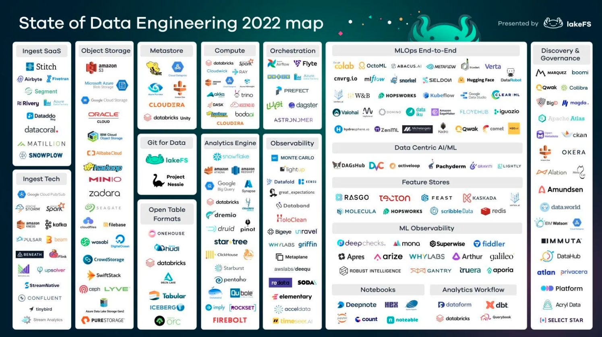
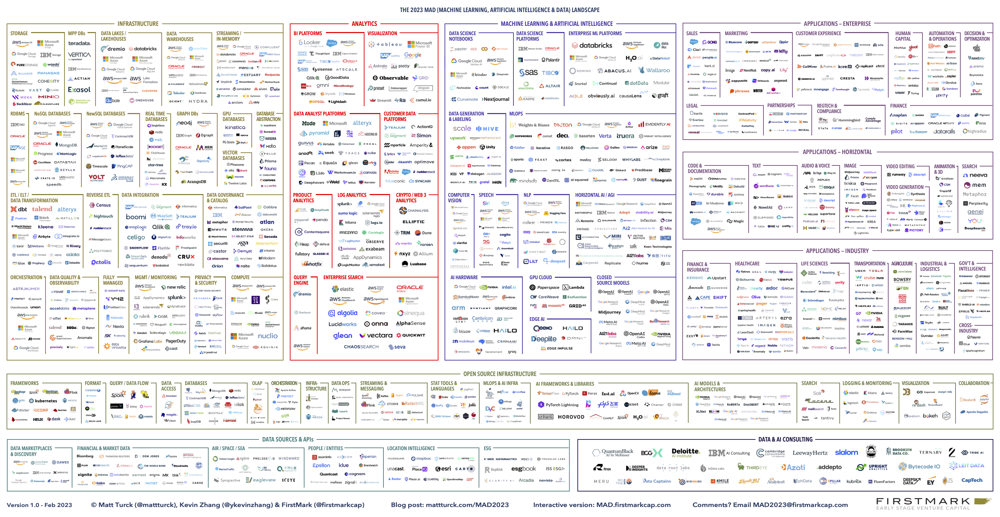

Every area of the modern data landscape is absolutely flooded with VC-funded data tools. Your inbox is crammed full of marketing emails from reps offering to demo great new software. You _already_ have more tools at your disposal than you need. And worst of all, you probably have a gnawing suspicion that there are better tools—maybe even a better _way_—out there somewhere.

Good luck finding it though. You’re stuck digging through the chaotic sprawl of the modern data stack, which looks something like this, right?

_Source: [LakeFS, "The State of Data Engineering 2022"](https://lakefs.io/blog/the-state-of-data-engineering-2022/)_

Well, that’s one way to look at it. The reality is actually something more like this:

_Source: [Matt Turck, "The 2023 Machine Learning, AI, and Data (MAD) Landscape"](https://mattturck.com/landscape/mad2023.pdf)_

Put simply, the modern data stack looks less like a plan and more like a Jackson Pollock painting.

# How?

So how did this crazy bloat all come about? It’s a layered origin story, but it started with increased lower-barrier-to-entry VC funding due to ‘cheap’ capital from ZIRP (Zero-Interest Rate Policy) coming out of COVID. This in turn, generated an overwhelming number of companies with access to funding. YCombinator alone now generates hundreds of new data companies each batch. As more and more of these companies have fragmented the stack into ever-smaller slices, the overall landscape has gotten exponentially more complex. Of course, they start simple—often with just one core feature. But then they metastasize, sprawling out to provide adjacent features, all to bolster an aggressive 'land and expand' sales strategy. You buy a data warehouse tool, and before you know it, they're tacking on data transformation or dashboarding capabilities. Soon enough, these tools begin to overlap, their secondary features clashing, and your teams are running similar workloads in multiple, redundant places.

In larger organizations, the bloat becomes outright contagious. Different data teams end up using different tools to isolate their tribe, and data becomes increasingly siloed. To combat this fragmentation and reduce the errors that stem from siloed workflows, companies buy even more software for data monitoring, providence, lineage, cataloging, and pipelining. Monitoring and data quality assurance is necessary regardless of the complexity of your stack, but the more tools you use, the higher the risk. A bloated data stack goes hand-in-hand with increased costs and complexity, and creates an urge for new teams to try to silo away from the mess (which, ironically, only makes it worse).

No single person or company is really to blame for the overabundance of data tools. It’s not your CTO or engineering manager’s fault that the database is sprawling, or that you’re struggling to figure out how to manage your relational, NoSQL, MapReduce, cloud, columnar, wide column, object-oriented, key value, hierarchical, document/JSON, text search engine, message queue, graph, vector, and time series databases all at once. On top of it all, vendors are perpetually on the hunt for new territory (and they’re very good at selling/upselling their stuff), so Frankenstacks are somewhat inevitable. And it’s not all bad news - competition in the database solutions space has driven major sophistication. But the inevitable consequence that we all now face is major complexity.

So what do we do about it? At Tembo, we want to offer [a different solution](https://tembo.io/blog/tembo-manifesto). Simply doing the same thing—adding more vendors to the sprawl—isn’t solving _anything_.

We believe the solution—Postgres as a data platform rather than just a database—has been right in front of us all along. It’s time to take an entirely new approach.
