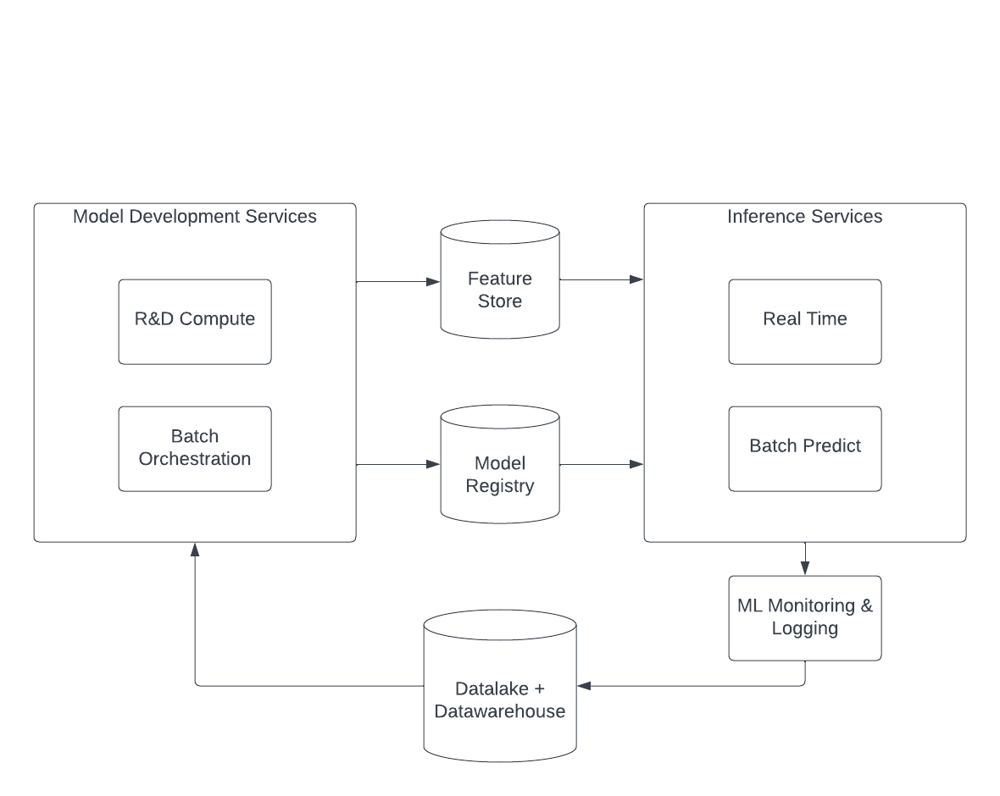
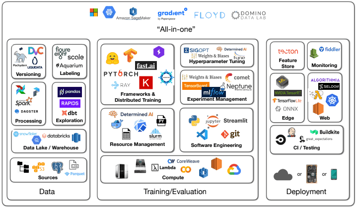

At [Tembo](https://tembo.io), we're building a platform that gives developers a Postgres experience optimized for their application. Today's applications are growing in complexity, especially with the rise of large language models (LLMs), but also due to classical supervised and unsupervised machine learning (ML). For those who have been working in the ML space for a while, you know that the ML lifecycle is a complex process. Today we are launching the Tembo Machine Learning Stack to fight back at some of that complexity!

An ML platform consists of all the tools and systems to manage the lifecycle of data science and machine learning projects. That lifecycle is a continuous and iterative process, from defining a business problem through ML model development, deploying for inference, and continuous monitoring and analysis. This incredibly complex process can become a barrier to entry for many teams. That’s why we built the [Tembo ML Stack](https://tembo.io/docs/tembo-stacks/machine-learning), which offers a Postgres configuration equipped with the tools to make ML lifecycle efficient and easy, all from Postgres. You can try it out today by signing up for [Tembo Cloud](https://cloud.tembo.io).



## Primer on ML Ops

Building an ML Platform can quickly go off the rails with creeping scope. Today, a lot of companies make the decision on whether to go with an all-in-one tool or bootstrap with best-in-class component solutions. If you’re new to ML, Google has some [great reference architectures](https://cloud.google.com/architecture/mlops-continuous-delivery-and-automation-pipelines-in-machine-learning), and for each component in Google’s architecture, there is a start-up or framework that specializes in it.

The landscape for ML Ops overlaps with and is just as complicated as the [overall data ecosystem](https://tembo.io/blog/modern-data-stack-mess). The hyperscaler cloud providers offer all-in-one solutions but typically have a high learning curve, poor developer experience, and lock you in to the cloud provider. Bootstrapping a solution with best-in-class components has the benefit of allowing you to iterate the growth of the platform, but comes at the cost of high complexity.



_Source: [Mihail Eric, “MLOps Is a Mess But That's to be Expected](https://www.mihaileric.com/posts/mlops-is-a-mess/)”_

## Frictionless ML Development with Postgres

ML workflows are generally split into three phases; exploration, model training, model serving. Exploring data within Postgres is a familiar process to many scientists, developers, and engineers. But model training and serving models is often done outside of Postgres, requiring additional infrastructure and engineering work. Serving is typically done outside Postgres, whether it’s hosting a model HTTP server or the dreaded 'rewrite' of the model training from Python into another language. This often results in the people doing exploration and model training being different from the people who are responsible for serving the model, which leads to a lot of friction and inefficiency in the ML workflow.

The Tembo ML Stack brings the entire ML workflow into Postgres, making it easier to build and deploy ML models. It puts operations and model serving in the hands of the model developer. And with pl/python, you can write your Python transformations directly in Postgres.

The [Tembo ML Stack](https://cloud.tembo.io) ships with several extensions which enable you to build an end-to-end solution for machine learning applications:

- [PostgresML](https://github.com/postgresml/postgresml) - a SQL API with hooks into the most popular Python machine learning libraries, and management of the trained model artifacts

- [pg_cron](https://github.com/citusdata/pg_cron) - schedule cron jobs directly from Postgres

- [PostgREST](https://postgrest.org/) - call functions in your database via external HTTP requests

- [pl/python3u](https://www.postgresql.org/docs/current/plpython.html) - write functions in Python and execute them directly from Postgres

## Model training with `pgml`

Tembo Cloud comes pre-configured with the most popular open-source machine learning extension for Postgres: [PostgresML](https://github.com/postgresml/postgresml).

You can use this extension to train both supervised and unsupervised models with SQL, while still using a workflow that feels comfortable to most scientists. Rather than building a data frame in R or Python, build a Postgres table with your training data. Then, pass that data into the train function from `pgml`. If you've worked with pytorch, xgboost, or scikit-learn, this is akin to `.train()` or `.fit()`. Training the model on Postgres uses the compute already provisioned for your database. There is no additional setup needed.

```sql
SELECT * FROM pgml.train(
    project_name => 'clickbait_classifier',
    algorithm => 'xgboost',
    task => 'classification',
    relation_name => 'click_train_array',
    y_column_name => 'is_clickbait',
    test_sampling => 'random'
);
```

## A model registry native to Postgres

A model registry is vital in a ML platform, as it centralizes model management, enhancing organization and accessibility. It ensures governance and compliance through detailed records of model development and performance — essential for audits. Additionally, it promotes team collaboration by streamlining model sharing and reuse, improving project efficiency. A registry is essential for maintaining order, transparency, and efficiency in machine learning workflows.

With the ML Stack, every model you train with the `pgml` extension is saved to Postgres. There is no need to deploy another registry such as [MLFlow](https://mlflow.org/).

View those models by simply querying the `pgml.trained_models` table.

```sql
select id, name, algorithm from pgml.trained_models;

 id |            name            | algorithm
----+----------------------------+-----------
  1 | clickbait_classifier       | xgboost
```

## Orchestrating training jobs with pg_cron

A model's performance can decay over time, which means it needs to be retrained as the business evolves and data changes. For example, many teams retrain their forecasting models nightly, weekly, or monthly as new data rolls in. Similarly, recommendation models are often retrained as customers and market preferences change, and as new products are released. Model developers can use the pg_cron extension to schedule training jobs. This is a simple way to orchestrate training jobs without having to implement and maintain a separate scheduler — and is intuitive to set up.

First, create a function that cron can call.

```sql
CREATE OR REPLACE FUNCTION model_train()
RETURNS void AS $$
BEGIN
    SELECT * FROM pgml.train(
        project_name => 'clickbait_classifier',
        algorithm => 'xgboost',
        test_sampling => 'random'
    );
END;
$$ LANGUAGE plpgsql;
```

Then schedule the job with `pg_cron`. This example runs the `model_train` function every Sunday at midnight.

```sql
SELECT cron.schedule(
    job_name => 'weekly-retrain',
    schedule => '0 0 * * 0',
    command => 'SELECT model_train()'
);
```

We can see all of our scheduled jobs in the `cron.job` table.

```sql
SELECT jobid, schedule, command, jobname FROM cron.job;


 jobid | schedule  |      command         |    jobname
-------+-----------+----------------------+----------------
     1 | 0 0 * * 0 | SELECT model_train() | weekly-retrain
```

There's no need to run an external scheduler such as [dagster](https://dagster.io) or [airflow](https://airflow.apache.org/); we can schedule everything directly from Postgres.

## Native model serving in Postgres

Once a model is trained, it can be served directly from Postgres. If you can write SQL, you can get predictions out of your model.

Let's see how the model works. We'll ask it to predict whether the headline "Hottest weather in 100 years" is clickbait or not.

```sql
SELECT pgml.predict(
    project_name => 'clickbait_classifier',
    features => (select pgml.embed('all-MiniLM-L12-v2',
        'Hottest weather in 100 years'
    ))
);
 predict
---------
       0
(1 row)
```

And just for good measure, let's try a clickbait headline.

```sql
SELECT pgml.predict(
    project_name => 'clickbait_classifier',
    features => (select pgml.embed('all-MiniLM-L12-v2',
        'Once A Huge Star, Today He Lives Alone in Westlake.'
    ))
);
 predict
---------
       1
(1 row)
```

## Share publicly with PostgREST on Tembo Cloud

On Tembo Cloud, a REST API for your database is available with a single click. We deploy a dedicated instance of PostgREST next to your database, which allows you to call functions in your database via external HTTP requests. This is a great way to share your model with other teams, or to integrate it into your existing applications where establishing a database connection is not possible. Initializing PostgREST is as simple as clicking a button in the Tembo Cloud UI, but it is also available via our API and Terraform provider.


Configuring it is simple, we just need to create a function and make it available to PostgREST.

We'll set up a function using a SQL function that takes our potentially clickbait title as an input, and returns a prediction.

```sql
CREATE OR REPLACE FUNCTION predict_clickbait(
    input_string text
) RETURNS TABLE(is_clickbait REAL) LANGUAGE sql AS $$
    SELECT pgml.predict(
        project_name => 'clickbait_classifier',
        features => (select pgml.embed(
            'all-MiniLM-L12-v2',
            input_string
        ))
    )
$$;
```

And finally PostgREST to reload the schema so that our function can be discovered by invoking a NOTIFY command:

```sql
NOTIFY pgrst, 'reload schema';
```

Now we can call our function from anywhere. Your `TEMBO_DATA_DOMAIN` and `TEMBO_TOKEN` can be found in the Tembo Cloud UI.

```bash
curl -X POST \
    -H "Authorization: Bearer ${TEMBO_TOKEN}" \
    -H "Content-Type: application/json" \
    https://${TEMBO_DATA_DOMAIN}/rest/v1/rpc/predict_clickbait \
    -d '{"input_string": "Once A Huge Star, Today He Lives Alone in Westlake."}'

[{"is_clickbait":1}]
```

## Try it now on Tembo Cloud

The Tembo ML Stack is available on Tembo Cloud. You can try it out for free by signing up at [Tembo](https://cloud.tembo.io). Stay tuned for a step-by-step guide on training this clickbait classifier on Postgres!
