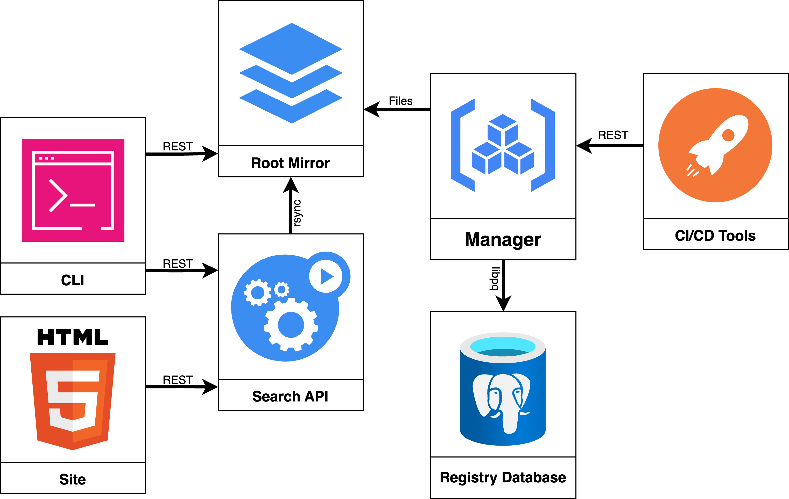

At Tembo, we firmly believe extensions are the key to the "just use Postgres"
future. In fact, along with workload-specific infrastructure, new extensions and
combinations of tools power the success of [Tembo Stacks].

We want to see the usage of extensions continue, and indeed to grow, which is
why we've made a significant investment to improve the Postgres extension
distribution ecosystem. We want to work with the Postgres community to design,
build, and benefit from the best possible system of extension design,
development, and distribution as we can.

I do, too, which is why I was happy to [join the team] and work toward that
vision.

As we start collaborating with the community and thinking through the [jobs and
tools] required of the extension ecosystem of the future, we thought it would be
useful to learn about some of the distribution architecture that exists today.

To that end, I put together a presentation on the [PGXN] architecture: its
distributed JSON file design, its component services, and how they interact.
This diagram illustrates the PGXN components and how they interact with each
other:

*   [PGXN Manager] maintains the registry Postgres database, handles user
    registration and extension releases, and updates the static files on the
    [root mirror]
*   The [search API] regularly `rsync`s from the root mirror to index new
    releases
*   The [main site][PGXN] is a think layer over the API, providing a nice
    interface for searching extensions, reading documentation, and downloading
    releases
*   The [pgxn client] uses the search API or, optionally the root mirror or any
    mirror to find, download, build, and install extensions
*   CI/CD tools like [pgxn-tools] automate testing, bundling, and releasing
    extensions via the Manager's REST interface

For the details, take in the presentation I made to the Tembo team, which we're
happy to share more widely:

  <iframe
    style={{ position: 'absolute', top:'10px', width: '100%', height: '100%' }}
    width="100%"
    height="400px"
    src="https://www.youtube.com/embed/sjZPA3HA_q8"
    title="YouTube video player"
    frameBorder="0"
    allow="accelerometer; autoplay; clipboard-write; encrypted-media; gyroscope; picture-in-picture"
    allowFullScreen>
  </iframe>

Links:

*   [Video (YouTube)](https://www.youtube.com/watch?v=sjZPA3HA_q8)
*   [Keynote](./pgxn-architecture/pgxn-architecture.key "“PGXN Architecture” Keynote deck")
*   [PDF (one page per slide)](./pgxn-architecture/pgxn-architecture.pdf)
*   [PDF (one page per stage)](./pgxn-architecture/pgxn-architecture-stages.pdf)

[Tembo Stacks]: https://tembo.io/docs/category/tembo-stacks
[join the team]: /blog/welcoming-david-wheeler
"PGXN creator David Wheeler joins Tembo to strengthen PostgreSQL extension ecosystem"
[jobs and tools]: https://gist.github.com/theory/898c8802937ad8361ccbcc313054c29d
  "Extension Ecosystem: Jobs and Tools"
[David Wheeler]: https://justatheory.com "Just a Theory"
[PGXN]: https://pgxn.org "PGXN — PostgreSQL Extension Network"
[PGXN Manager]: https://manager.pgxn.org/howto "PGXN How To"
[root mirror]: https://master.pgxn.org/ "PGXN Root Mirror"
[search API]: https://github.com/pgxn/pgxn-api/wiki "PGXN API"
[pgxn client]: https://pgxn.github.io/pgxnclient/ "PGXN Client documentation"
[pgxn-tools]: https://hub.docker.com/r/pgxn/pgxn-tools "pgxn/pgxn-tools Docker image"
