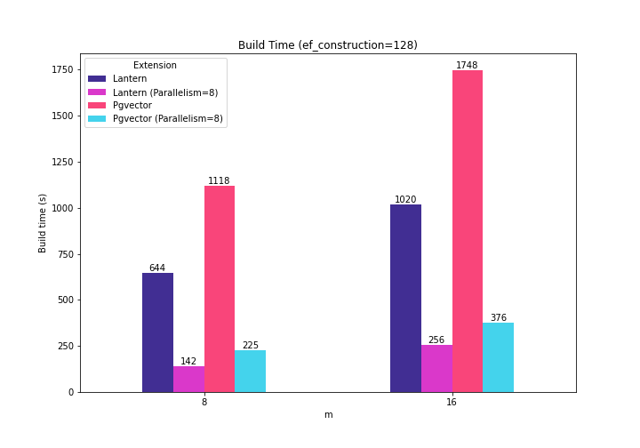

Three weeks ago, we wrote a [blog comparing pg_vector and lantern](https://tembo.io/blog/postgres-vector-search-pgvector-and-lantern) on index creation and search speed, and also mentioned that this is a fast evolving space with great momentum.

Just last week, we saw the release of Pgvector v0.6.0, which contains improvements in HWSW build time thanks to the ability to [build indexes in parallel](https://github.com/pgvector/pgvector/issues/409).

<iframe
	border={0}
	frameborder={0}
	height='400px'
	width='100%'
	src='https://twitframe.com/show?url=https://twitter.com/jkatz05/status/1752060288814420168'
></iframe>

And so, we had to try it out!

But then, while preparing the benchmark, I learned that Lantern can also build HNSW indexes in parallel via their external tool [lantern-cli](https://github.com/lanterndata/lantern_extras).

So, this means that we can compare both extensions in a more fair manner.

## How do they work?

The invocation of the two indexers is different.

For Lantern we have to use the [external indexer](https://lantern.dev/blog/hnsw-index-creation). It enables parallelism by spawning `N` additional threads (where `N` is determined by using [`std::thread::available_parallelism`](https://doc.rust-lang.org/std/thread/fn.available_parallelism.html)). From a quick look at the code, we can see that the main thread queries rows from the base table in chunks of 2K rows and sends them through a [sync channel](https://doc.rust-lang.org/std/sync/mpsc/fn.sync_channel.html). At the other end of the channel, one of the `N` threads receives the rows and calls the appropriate [usearch](https://github.com/unum-cloud/usearch) API to append them to the index.

In contrast, PgVector uses Postgres parallel workers. To activate the parallel build, we must set a value for [`max_parallel_maintenance_workers`](https://github.com/pgvector/pgvector?tab=readme-ov-file#index-build-time). Skimming through the code, we see that a parallel context is initialized with the target function `HnswParallelBuildMain()` and a dynamic shared memory segment (DSM). A portion of this segment is used as a shared scratchpad for the parallel workers. Each parallel worker scans a portion of the base table and executes a callback function to append a new element to the index in the shared area.

## A quick benchmark

We ran a quick test with `parallelism = 8` to see how much things changed in terms of build time. Here are the results for `m={8, 16}`, `ef_construction=128` and `ef_search=128` with the sift-128-euclidean dataset.

This time I used:

|||
|-----------------|---------------------------------------------------------------------------------------------------------------------------------------------------------------------------------------------------------------------------------|
| **Postgres Config** | `maintenance_work_mem=8GB;  work_mem=2GB;  shared_buffers=12GB; max_worker_processes = 11; max_parallel_workers = 11` |
| **PgVector** | `SET max_parallel_maintenance_workers = 7; -- plus leader` |
| **Lantern** | Max parallelism automatically detected by `lantern-cli` (8). |
| **Docker Config**   | `cpu_limit=8; shm_size=9G`                                                                                                                                                                                                        |

The rest of the parameters are the same as the [previous post](https://tembo.io/blog/postgres-vector-search-pgvector-and-lantern).

The following plot shows the new numbers along with the numbers we presented last time.

So, when multiple cores are used to create the indexes, Lantern continues to beat Pgvector in index creation time (36% faster for m=8, 31% faster for m=16).

I find it quite remarkable how both extensions improve the index creation time (3.98X-4.53X in Lantern, and 4.64-4.96X in Pgvector) when parallelism is used.

## Try it out!

PgVector 0.6.0 is already available in [Tembo’s](https://tembo.io/) [Vector DB Stack](https://tembo.io/docs/tembo-stacks/vector-db). You can try it for free!

And, if you are interested in running the benchmark yourself, check out the modified [ann-benchmarks fork](https://github.com/binidxaba/ann-benchmarks).

