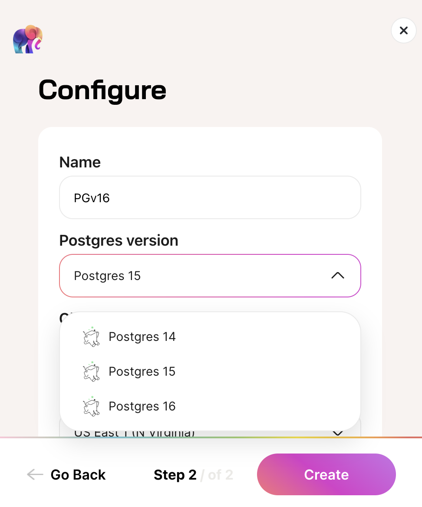

We're thrilled to announce the addition of support for Postgres versions 14, 15, and 16 in Tembo Cloud, broadening the horizons for developers and businesses seeking the best in database technology.

Starting today, you can select from Postgres 14, 15, and 16 when creating a Tembo Cloud instance. This flexibility ensures that you can choose the version that best fits your project's needs.

## Postgres 16 features

- More SQL/JSON syntax, like `JSON_ARRAY()`, `JSON_ARRAYAGG()`, and `IS JSON`, simplifies working with JSON data.
- Improved readability with the use of underscores in numeric literals (e.g., `5_432_000`) and support for non-decimal integer literals (e.g., `0x1538`, `0o12470`, `0b1010100111000`).
- The `pg_stat_io` view for detailed I/O statistics, aiding in performance tuning.
- Stronger security features for robust data protection.
- Increased parallelism in query execution for better performance.

For more information, refer to the [Postgres 16 release notes](https://www.postgresql.org/docs/current/release-16.html).

## Postgres 14 compatibility for simpler migration to Tembo Cloud

Many prospective customers are using Postgres 14. Now, users can more easily move their workloads onto Tembo Cloud. You can find the Postgres 14 release notes [here](https://www.postgresql.org/docs/14/release-14.html).

## Expanding Extension Support for Postgres 14 and 16

To complement the introduction of new Postgres versions, we've expanded our extension ecosystem. This includes the ability to link and build extensions for different Postgres versions, enhancing the flexibility and capabilities of your databases.

Here's a quick overview of the number of extensions supported by each Postgres version, as of March 13th, 2024, but we're always adding more!

| Postgres Version | Number of Supported Extensions |
|------------------|--------------------------------|
| 14               | 181                            |
| 15               | 204                            |
| 16               | 148                            |

Browse the free and open source [Trunk](https://pgt.dev) project to learn more about Postgres extensions.

If you want a programmatic means to find which extensions are supported on which Postgres versions, or other metadata about extensions, you can query the [Trunk API](https://registry.pgtrunk.io/swagger-ui/#/).

## Try it out and Join the Herd

We invite you to explore the new features and improvements of Tembo Cloud with Postgres 14 and 16. [Sign up](https://cloud.tembo.io) to try it for free, with no credit card required.

Your feedback is crucial as we continue to enhance our service. Join our [Slack community](https://join.slack.com/t/tembocommunity/shared_invite/zt-277pu7chi-NHtvHWvLhHwyK0Y5Y6vTPw) and be part of the conversation shaping the future of data management.

Stay tuned for more updates, and happy coding!
