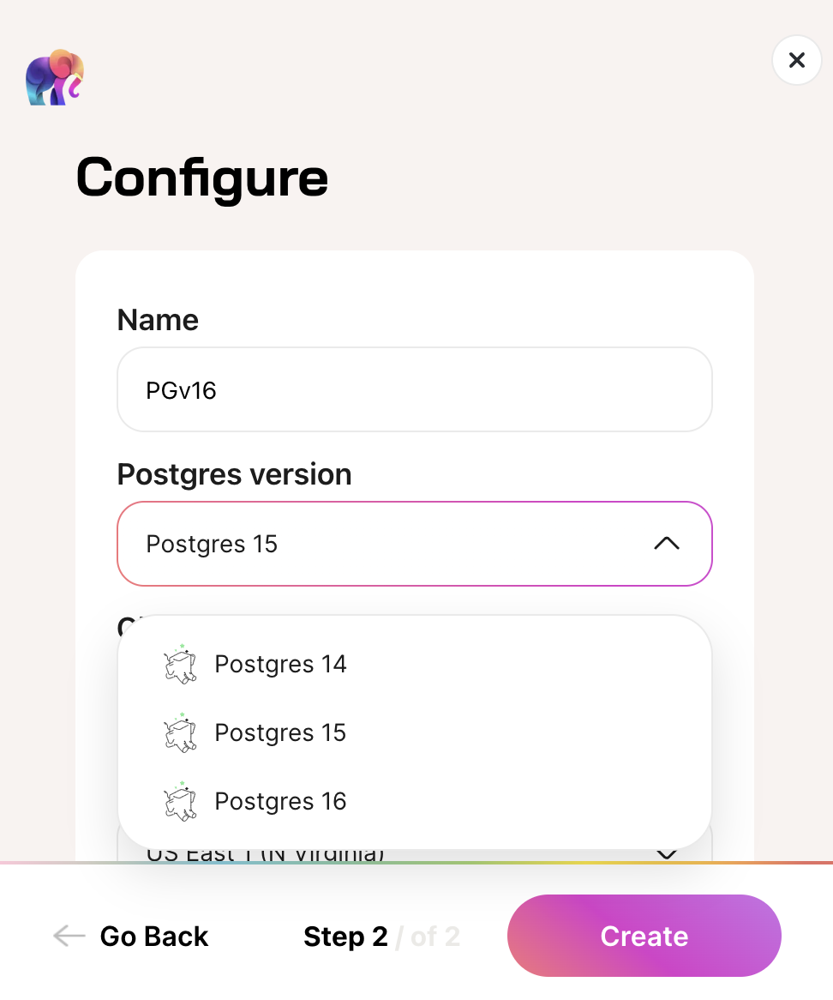

We're thrilled to announce the addition of support for Postgres versions [14](https://www.postgresql.org/about/news/postgresql-14-released-2318/) and [16](https://www.postgresql.org/about/news/postgresql-16-released-2715/) in Tembo Cloud, broadening the horizons for developers and businesses seeking the best of Postgres on our platform.

Starting today, you can select from Postgres 14, 15, and 16 when creating a Tembo Cloud instance. This flexibility ensures that you can choose the version that best fits your project's needs.

## Postgres 16 features

Postgres 16, which was released earlier this year, came with a host of features around logical replication, performance, developer experience, monitoring and security. Some notable ones include:

- Logical replication improvements such as replication from standby and parallel apply of large transactions.
- More SQL/JSON syntax, like `JSON_ARRAY()`, `JSON_ARRAYAGG()`, and `IS JSON`, simplifies working with JSON data.
- The `pg_stat_io` view for detailed I/O statistics, aiding in performance tuning.
- Stronger security features for robust data protection.
- Increased parallelism in query execution for better performance.

For more information, you can refer to the [Postgres 16 release notes](https://www.postgresql.org/docs/current/release-16.html) or our blog to read more about [its exciting features](https://tembo.io/blog/postgres-16).

## Postgres 14 compatibility for simpler migration to Tembo Cloud

A lot of Postgres users are still using Postgres 14. Given that major Postgres versions aren't always compatible, upgrading Postgres versions is not always straightforward. Therefore, adding Postgres 14 has been one of our most commonly requested features for Tembo Cloud. Now, users can easily migrate their workloads onto the platform.

For more information about the Postgres 14 release, including added features and bug fixes, reference the release notes [here](https://www.postgresql.org/docs/14/release-14.html).

## Expanding Extension Support for Postgres 14 and 16

To complement the introduction of new Postgres versions, we've expanded the extension ecosystem in [Trunk](https://pgt.dev). Feature additions include the ability to link and build extensions for different Postgres versions, enhancing the flexibility and capability of your databases.

Here's a quick overview of the number of extensions supported on Tembo Cloud by each Postgres version (as of March 13th, 2024), but we're always adding more!

| Postgres Version | Number of Supported Extensions |
|------------------|--------------------------------|
| 14               | 181                            |
| 15               | 204                            |
| 16               | 148                            |

Browse the free and open source PostgreSQL extension project, [Trunk](https://pgt.dev), to learn more.

If you want a programmatic means to find which extensions are supported on which Postgres versions, or other metadata about extensions, you can query the [Trunk API](https://registry.pgtrunk.io/swagger-ui/#/).

## Join the Herd

[Sign up](https://cloud.tembo.io) to use Tembo Cloud for free, with no credit card required.

Your feedback is crucial as we continue to enhance our service. Join our [Slack community](https://join.slack.com/t/tembocommunity/shared_invite/zt-277pu7chi-NHtvHWvLhHwyK0Y5Y6vTPw) to be part of the conversation.

Stay tuned for more updates, and happy coding!
