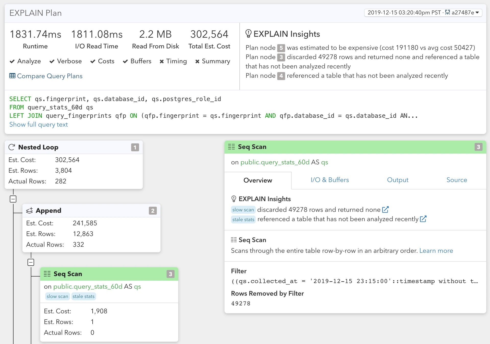

At Tembo, we’ve been hard at work building a unique, world-class managed Postgres solution.
We’re excited to announce Tembo Cloud now supports integration with pganalyze - a powerful tool that helps
you understand and optimize your Postgres database. With this integration, you can now easily monitor and analyze your
Tembo Cloud Postgres instance with pganalyze.

# What is pganalyze?
pganalyze is a powerful tool that helps you understand and optimize your Postgres database. It provides detailed insights
into your database performance, and helps you identify slow queries, track query performance over time, and understand
the overall health of your database. With pganalyze, you can easily monitor and analyze your Postgres database, and make
informed decisions to optimize your database performance.

## Key Features
- Detailed query performance insights
- Index Advisor
- VACUUM Advisor
- EXPLAIN Plans
- Schema Statistics
- Log Insights
- Connection Information
- Configuration Settings
- System Metrics
- Alerts and Check-Up

# Connecting your Tembo Instance to pganalyze
Connecting your Tembo Cloud instance to pganalyze is simple. You can connect your instance to pganalyze in just a few clicks.

[//]: # (TODO: Add screenshots for each step)

## Step 1: Sign up for pganalyze
If you don’t already have a pganalyze account, you can sign up for a free trial at [pganalyze.com](https://pganalyze.com/).

## Step 2: Obtain your pganalyze API Key
Once you have signed up for pganalyze, you will need to obtain your pganalyze API key. You can find your API key in the
pganalyze dashboard under the “Settings” section. Copy your API key to use in the next step.

## Step 3: Activate the pganalyze App in Tembo Cloud
To connect your Tembo Cloud instance to pganalyze, you will need to activate the pganalyze App for your instance.

1. Log in to Tembo Cloud at [cloud.tembo.io](https://cloud.tembo.io/).
2. Select the instance you want to connect to pganalyze.
3. Click on the “Apps” tab in the instance details page.
4. Submit your pganalyze API key in the “API Key” section and click “Activate”.

Once activated, pganalyze will start collecting and analyzing your database performance data. You can access your pganalyze
dashboard by clicking on the “pganalyze app” button.

Once connected, pganalyze will automatically start collecting and analyzing your database performance data, and provide you
with detailed insights into your database performance.

# Log Insights
pganalyze provides detailed insights into your database logs, including slow queries, errors, and other important events.
To make this possible on Tembo Cloud, we've made some contributions to the open source [pganalyze collector](https://github.com/pganalyze/collector/).
This allows pganalyze to collect logs from your Tembo Cloud instance and provide you with detailed insights into your database logs.

With Log Insights enabled, we can make use of other powerful features, such as EXPLAIN Plans.

[//]: # (TODO: Add a screenshot of the pganalyze dashboard showing log insights)

# EXPLAIN Plans

# Alerts and Check-Up
pganalyze provides powerful alerting and notification features that help you stay on top of your database performance.
You can set up custom alerts based on query performance, system metrics, and other important events. pganalyze will
notify you when an alert is triggered, so you can take action to resolve any issues.

Alerts can be configured to send notifications via email, Slack, and PagerDuty, so you can stay informed about your Tembo
instance no matter where you are.

# Conclusion
We’re excited to bring pganalyze to Tembo Cloud, and we’re confident that this integration will help you better understand
and optimize your Postgres database. With detailed insights into your database performance, you can make informed decisions
to optimize your database performance and improve the overall health of your database.

If you have any questions or need help getting started with pganalyze on Tembo Cloud, please don’t hesitate to reach out to
our support team. We’re here to help you get the most out of your Tembo Cloud Postgres instance.
