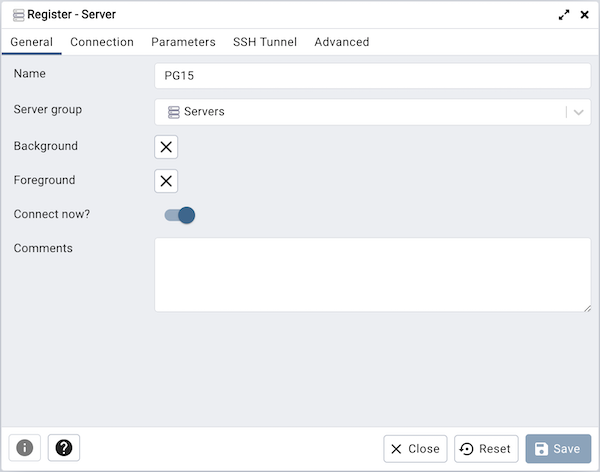
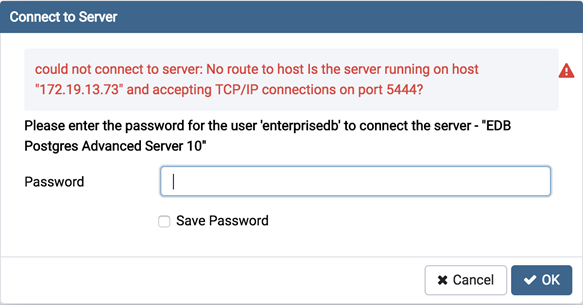

# How to connect to Postgres (and how to exit from psql)

PostgreSQL is recognized both as a popular and versatile data storage option. Boasting a rich ecosystem, this relational database management system is enhanced by tools that abstract away complexities relating to connectivity and management. While there are many exciting tools available, we want to highlight two of the most popular:

- psql - a command-line tool that comes bundled with Postgres.
- pgAdmin - an open-source database management tool with a user-friendly interface for connecting to, querying, and managing PostgreSQL databases.

## Connect using psql

According to the [official documentation](https://www.postgresql.org/docs/current/app-psql.html), psql is “a terminal-based front-end to PostgreSQL. It enables you to type in queries interactively, issue them to PostgreSQL, and see the query results”. It is perhaps the most popular way to connect to Postgres out there.

Once you have opened your preferred terminal, you can connect using this command:

``` sh
psql postgresql://$HOST:$PORT/$DB_NAME -U $USER_NAME
```

If your database is running locally, you can omit most of this command, as psql will know to connect via Unix-sockets or via TCP to localhost. You can just run:

``` sh
psql -U $USER_NAME
```

After you run this command, Postgres will prompt you for your password, which you can type in.

:::important
If you will be connecting to the same database frequently, it makes sense to have a `~/.pgpass` file ([learn more](https://www.postgresql.org/docs/current/libpq-pgpass.html)), which is a simple text file that contains lines of the following form:

```
hostname:port:database:username:password
hostname:port:database:username:password
…
```

:::

Note that psql is a rich, highly configurable tool. Check out the [psql manual page](https://www.postgresql.org/docs/current/app-psql.html) if you want to dive deeper!

:::note
Why doesn’t psql accept the password next to the other connection parameters when starting it? Well, this is a _security risk_! If someone can list the processes in your machine, they could see the password in plaintext. To avoid this pitfall, psql does not allow passwords as command line parameters.
:::

### How to exit psql

Now, let us dive into one of the most asked questions in all of the Postgres ecosystem - _how the heck_ do I exit the psql tool, back into my command line?

psql was designed to be a very quick tool to use. For that reason, a lot of its commands are short ones. This includes the commands to exit the tool. Here are the main ways to exit psql:

- The main way is the command `/q`. You can type `/q` and press Enter.
- As with many shell tools, you can type `Ctrl+D`.

**Thankfully**, as of Postgres 11, the community addressed this usability issue, and now the `exit` and `quit` commands both exit psql.

## Connect using pgAdmin

pgAdmin ([website](https://www.pgadmin.org/)) is another popular tool for postgres that provides a graphical interface to manage and maintain database objects. To figure out how to run pgAdmin, check out their [Desktop Deployment](https://www.pgadmin.org/docs/pgadmin4/latest/desktop_deployment.html) or [Server Deployment](https://www.pgadmin.org/docs/pgadmin4/latest/server_deployment.html) docs, depending on what your preference is.

pgAdmin is **highly customizable**. It can run as a local server, or remotely. It supports Postgres’ various methods for authentication, including password-based, but also LDAP, Kerberos, multi-factor authentication, etc.

You **must create a server connection**. To do that, you can go to the Server dialog, which you can open from the Servers icon in pgAdmin.

The Server dialog looks like this:



This dialog allows you to configure every aspect of a connection to a specific database server. In the _Connection_ tab you can specify host, port, username, database name, etc.


Once you have created a connection object, you will see it appear under the Servers section in the administration menu of pgAdmin. You can right click on it, and click on _Connect_.

### Connection errors

If you see errors when trying to connect to Postgres, pgAdmin will return a detailed error message. We recommend that you **review the error message carefully**, as it usually contains the key to resolving the issue.



## Conclusion

By reading this guide, we hope you've become familiar with two popular methods by which users can connect and interact with their Postgres databases.

If you're interested in learning more, check out the well-crafted documentation of [pgAdmin](https://www.pgadmin.org/docs/pgadmin4/latest/index.html) and [psql](https://www.postgresql.org/docs/current/app-psql.html).

Still interested in the many Postgres clients out there? [Check out this list](https://wiki.postgresql.org/wiki/PostgreSQL_Clients).

Finally, if you're interested in developing your Postgres proficiency even further, we invite you to check out other guides on our website.
