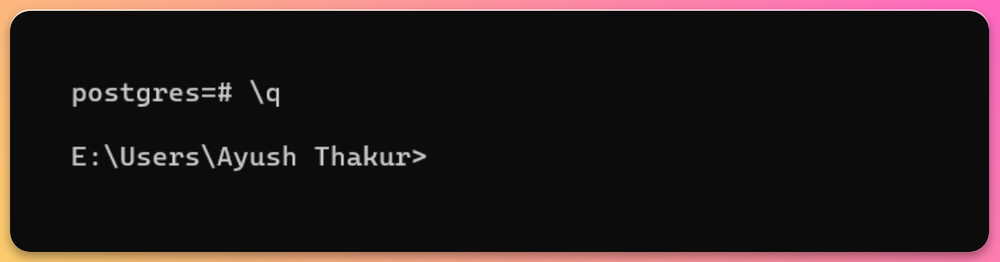
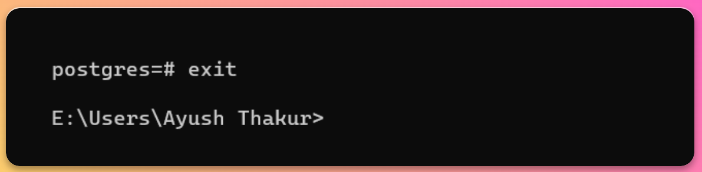

This guide is designed to demystify the process of quitting the PSQL utility. In a succinct manner, we will explore the various methods to gracefully exit PSQL, ensuring that you can seamlessly transition in and out of this indispensable command-line environment.

## Using \q command

You can simple execute the `\q` command in the psql prompt to exit the psql utility. The **q** in \q stands for quit.

```
\q
```



:::important
Make sure to exit to your database after you have performed every operation that you want to perform in it. Once you exit, you have to perform the whole process again to connect to the database
:::

## Using Keyboard shortcuts

Psql also comes with an option to quit the psql utility with some defined keyboard shortcuts. These keyboard shortcuts varies depending upon the operating system you are using

-   For Windows → `Ctrl + C`

-   For Mac and Linux → `Ctrl + D`

## Using exit command

Just like `\q` command, you can also use the exit command to make an `exit` from the psql utility. Just type **exit** in your terminal and hit enter

```
exit
```



# Conclusion

In this guide, we covered the different methods a user can go for to quit or exit the psql utility.

To keep exploring more about useful stuff about Postgres, we recommend you to check out our well-written [blogs](https://tembo.io/blog/)

To know how you can integrate Tembo’s useful extensions in your project, we suggest you to read our [guides](https://tembo.io/docs/).
