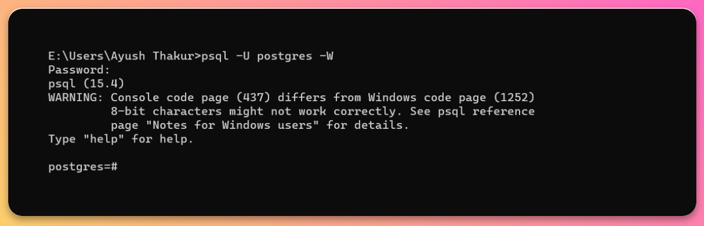
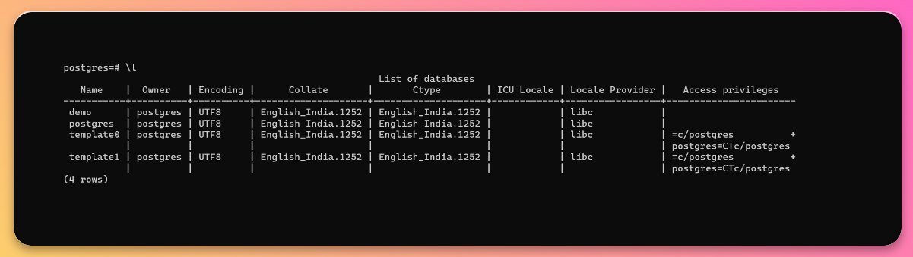
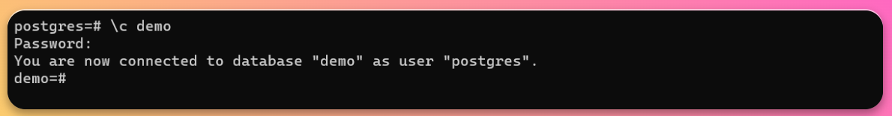
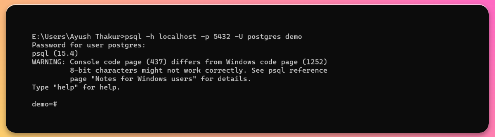

Databases are the foundations upon which your data is organized and stored in Postgres. While PostgreSQL offers a robust environment for database management, the process of selecting a database may not always be as intuitive as one might hope.

In this guide, we'll explore 2 different methods to connect to specific Postgres databases using psql. We will also take a look at the step-by-step process to connect to a particular database.

## Selecting after logging in

**Step 1** - Connect the terminal to your desired Postgres database. Follow our guide to see the whole process, [click here](https://tembo.io/docs/postgres_guides/how-to-connect-to-postgres/)



**Step 2** - Use `\l` command to list down all the databases present in that user account

```
\l
```



You are free to choose any of database from the list for the purpose to establish a connection.

**Step 3** - Now to connect to your desired database, use `\c database_name` command. Enter your password and hit enter

```
\c database_name
```



Make sure to replace the “database_name” with the name of your desired database

## Selecting when logging in

**Step 1** - Use the given below command to directly connect to your desired database. Then, enter your password and hit enter

```sh
psql -h hostname -p port postgres database_name
```



Do replace the hostname, port and database_name with the name of your host, port number and your desired database respectively.

# Conclusion

In this guide, we discussed how you can select a specific database in Postgres and build a connection with it.

Do check out our well-written and super easy to understand blogs to know about our Postgres extensions, [click here](https://tembo.io/blog/)

To know how you can use our extensions and gather benefits from it, check out [our guides](https://tembo.io/docs/).
