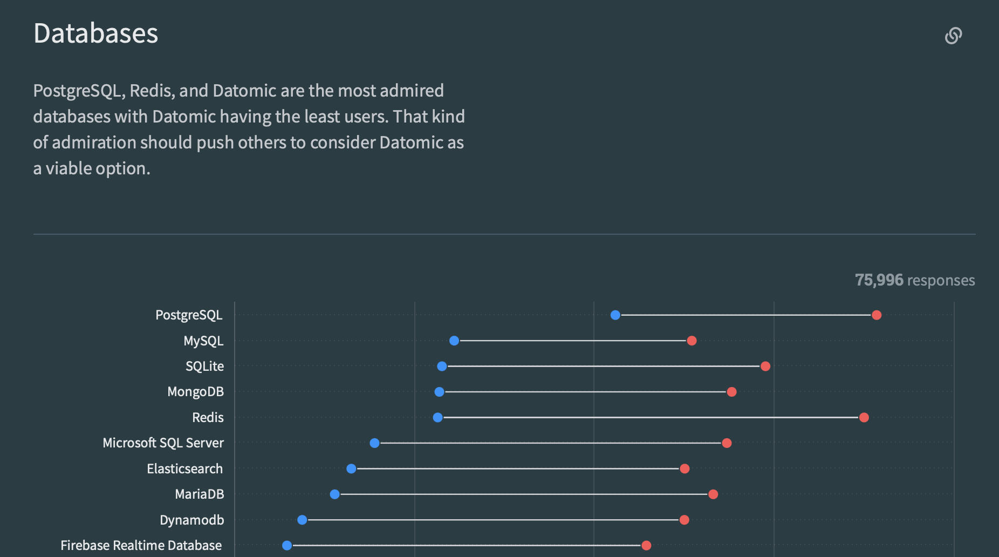
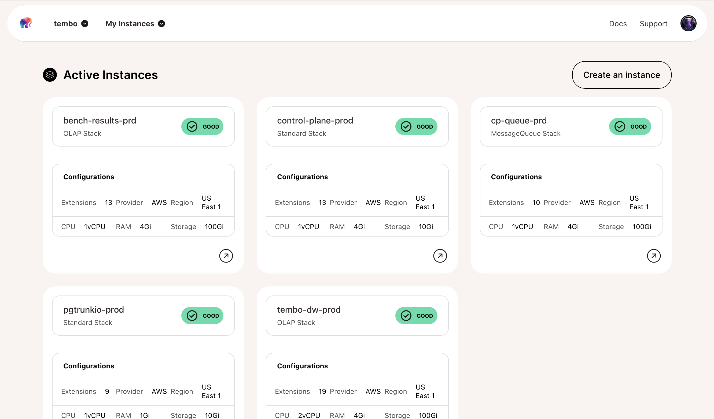
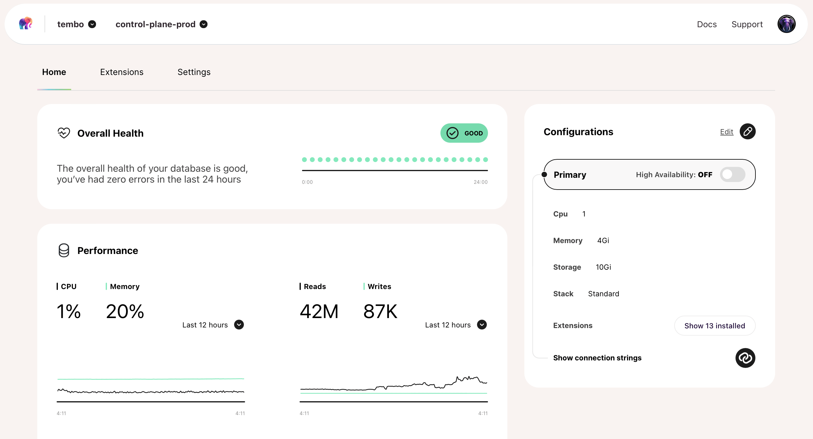

import Callout from '../../../components/Callout.astro';

<Callout title='Update: Tembo Cloud is Generally Available' variant='info'>
    In January 2024, we [shipped Tembo Cloud](https://tembo.io/blog/ga), a managed service to unlock the full power of the Postgres ecosystem, after a year of work by our amazing team. We have a free-forever hobby tier available. [Please try it for free](https://cloud.tembo.io). 
</Callout>

## Vendor sprawl and data islands

Organizations now store their data across a growing number databases, generally grouped into transactional, analytical, and AI systems. There's roughly 10x more transactional than analytical data, mostly in Oracle, MSSQL Server, MySQL, and Postgres. There have been some sizable shifts to this landscape in recent years:

1. We've seen a lot of analytical workloads move to the cloud. This started with the big data era, and more recently the rise of platforms like Snowflake and Databricks.
1. Some transactional workloads moved to streaming and real-time data. This puts more pressure on application developers to get involved in management of both transactional and analytical processing platforms, not just dedicated, diligent database admins.
1. Application infrastructure has been abstracted, along with the rise of AI-based code gen, allowing developers to build and scale applications more quickly and efficiently. Services like Vercel and Netlify have streamlined the development lifecycle.

The net result? An ever-expanding menagerie of innovative apps and services built upon an increasingly complex database setup. The modern data stack is more complicated and expensive than ever before, and with the productization of AI workloads, the trend will accelerate. How can we cope?

## Postgres as a Platform

We believe that many developers would love an open-source, multi-workload data platform to simplify their lives and work, as long as it doesn't restrict their freedom. 

Organizations, meanwhile, want reliability, flexibility, and a options out of the spiraling costs and vendor lock-in attempts. We belive there's an obvious solution that ticks all the necessary boxes: Postgres.

Postgres, the world's favorite database with millions of deployments, features a permissive OSS license, and a huge community. It efficiently manages SQL and JSON queries across diverse workloads, handles low latency, high throughput analytical cases, offering HTAP-lite capabilities through window functions and foreign data wrappers. 

Known for its extensibility and ACID compliance, it stands out as a reliable and cost-effective system.

Even better, its extensibility has resulted in a wide ecosystem of add-ons and plugins for GIS data, image processing, vector databases, and more, with some extensions evolving into companies like CitusDB and Timescale. In short, everything you'd want and then some.

*Source: [Stack Overflow Developer Survey 2023](https://survey.stackoverflow.co/2023/#section-admired-and-desired-databases)*

Problem solved, right? Not so fast.

## Overwhelment​

*(Yes, that is a word.)*

Organizations are hesitant to adopt databases due to costs, complexity, and risk. The effort required to build, configure, and optimize a new system often reduces the transition value. 

For these organizations (especially large enterprises that spend billions per year on a fragmented database architecture), Postgres and its assimilation of database innovations should be an ideal solution. Open source, extensible, free from vendor lock-in and ever-increasing costs—it should be a no-brainer.

“What's the holdup?” you might ask. Well, Postgres is... complicated.

To create a self-managed cluster of Postgres clusters, we have to consider infrastructure, environment, security, data management, backups, and workload-specific tuning. Maintaining and scaling Postgres also involves meeting high availability requirements, managing data storage, updating schemas, optimizing query performance, and managing failover protection and caching. 

And while extensions exist to support additional functionality in Postgres, they are hard to discover, evaluate, certify and deploy. Put simply, Postgres is the solution… but it needs a better developer experience when access its extended capabilities.

## Our Vision

And this is where Tembo comes in. 

We are building a managed cloud along with self-hosted software, to run Postgres and its entire ecosystem—extensions, applications, tools, and more. **All within a single unified platform that comes with world-class support.**

Tembo simplifies using Postgres, enabling one-click deployments of as much of the entire Postgres ecosystem as possible. Developers can easily deploy different flavors of Postgres to multiple zones and clouds. Advanced options will include auto-scaling, auto-pausing, auto-tuning, and edge caching.

Additionally, Tembo invests in the Postgres extension ecosystem, aiming to standardize and simplify the use and creation of extensions.

## Tembo Stacks

Tembo Stacks accelerate your development by enabling you to quickly deploy "flavors" of Postgres + extensions that are tailor-made for key use cases. No need to spin up new vendors and endure the pain and associated sprawl—Tembo Stacks enable you to replace external services.

## Tembo Cloud

Tembo Cloud is managed Postgres the way it *should* be. With Tembo, you don't have to be a database expert to build an expert database. We are building a dev-first, fully-extensible, fully-managed, secure, and scalable Postgres service. Tembo Cloud provides the largest curated library of easily installed extensions, packaged into "Tembo Stacks"—allowing you to greatly expand their use cases of Postgres.

## Tembo Self-Hosted 

Tembo Self-Hosted is a self-hosted version of the Tembo Platform that runs in your own Kubernetes cluster. It allows you to benefit from the same features as Tembo Cloud, but with the added control and security of running the software in your own environment.

Tembo Self-Hosted is made up of the same components as Tembo Cloud, but packaged and distributed in a way that allows for easy installation and management. Instead of running in separate Kubernetes clusters, the components run in a single Kubernetes cluster. This keeps your total cost of ownership low and makes for a simple and easy-to-manage deployment.

## What Does This Mean?

No matter who you are or what you're trying to build, three things are true about Tembo:

* True Managed Open Source: You don't have to settle for a complex web of OSS data services or a restrictive, locked-in, expensive managed contract with one of the large cloud providers. Tembo is committed to making true open-source Postgres manageable and accessible.
* Developer Focused: You can have the flexibility and control you've dreamed of. Tembo is made by developers, for developers. We give you fast deployment, automatic migration, and a clear path to genuine value. We win when you win.
* Future Proof: Postgres is beloved by developers. It isn't going anywhere, and with the constantly growing ecosystem of extensions and applications, it's only getting better. With Tembo, you get all the potential of that ever-growing network, right at the click of a button.

## Join the movement

 The easiest way to get started is to [try Tembo Cloud for free](https://cloud.tembo.io) or [learn more about Tembo Self Hosted](https://tembo.io/docs/product/software/tembo-self-hosted/overview). 