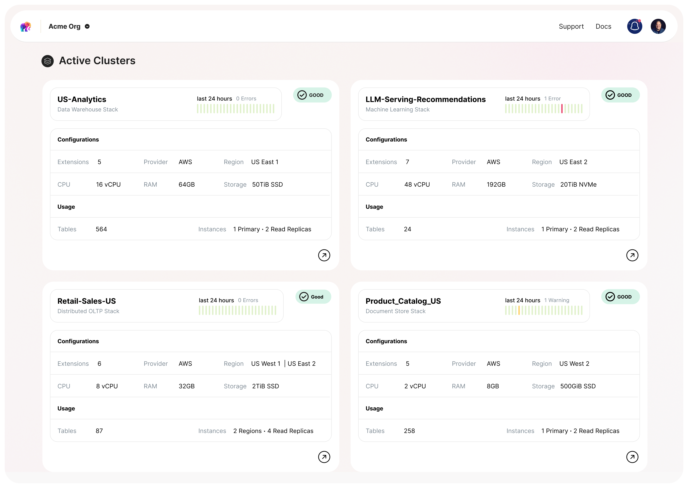

# Evolution of Postgres

For years, Postgres has been considered among the most popular and advanced open source OLTP databases. Interestingly, 20 years ago, it was a competition between Postgres and MySQL and this debate is still going on [today](https://news.ycombinator.com/item?id=35906604). 🙂 Over the last few years, Postgres added more features and its ecosystem added more extensions and now the comparison list keeps growing. After adding support for [jsonb](https://www.postgresql.org/docs/release/9.4.0/) in 9.4, Postgres began to be compared with MongoDB as users started using Postgres to store unstructured data. With [Citus](https://github.com/citusdata/citus), people started using Postgres over other distributed SQL technologies for use cases such as multi-tenancy and analytics. And this phenomenon continues to grow with [pgvector](https://github.com/pgvector/pgvector), [timescaledb](https://github.com/timescale/timescaledb) and others.

# Use Postgres for Everything

Postgres has evolved to where people have started talking about using “Postgres for everything.” There’s strong agreement that it’s wise to use Postgres until you find a strong reason for why you can’t use it anymore - either a very specialized use case, or scale which can’t be achieved by Postgres. This topic was well-discussed on [hacker news](https://news.ycombinator.com/item?id=33934139) thanks to a [blog](https://www.amazingcto.com/postgres-for-everything/) by a friend, Steven Schmidt.

And to clarify, when I say Postgres, I mean the entire Postgres ecosystem - this includes Postgres, its extensions and ecosystem tooling for high-availability, backups, connection pooling, etc. All of these together turn Postgres into a powerful data platform which you can use to run diverse workloads. However, it’s easier said than done.

## Making “Postgres for Everything” real

Advanced users may know the recipe which turns Postgres into a distributed database, a vector database, an OLAP database or a search store, but this is still inaccessible to most developers. Over years of working with Postgres users, I’ve realized that even tuning Postgres for OLTP (which is a fairly well known use case) is very hard for most developers. For example: OLTP deployments often have badly chosen indexes, over / under provisioned hardware, insufficiently tuned autovacuum etc. even though they are running on managed services which do the heavy lifting for them.

So, expecting developers to be able to figure out how to use Postgres for all these use cases when there are other databases focused on user experience for one particular use case is unrealistic. Even though developers know that dealing with 5 different databases is a pain in the medium to long run, when they are starting, they care about getting off the ground fast. So, to expect everybody to use Postgres for everything, we need to make it possible for every user to have easy access to the recipes which turn Postgres into the database for the data service of their choice.

# Enter Tembo Stacks

Tembo stacks are pre-built use-case-specific Postgres deployments which are optimized and tuned to serve a specific workload. They aim to be a replacement for other databases which you actually don’t need, but you are considering because you don’t know how to solve that problem using Postgres. They help you avoid the pains associated with learning, managing and deploying other database systems. Some examples of Stacks are: OLTP, Message Queue, Data Warehouse, Enterprise LLM and Document Store.

## Defining a stack

A stack is a recipe of how to run an optimized Postgres for a workload, expressed as a spec file. The spec includes the following components:

* Docker Base Image containing a particular version of Postgres
* Curated set of extensions which turn Postgres into best-in-class for that workload.
* Hardware profile which is best suited for that workload
* Postgres configs optimized according to hardware and workload
* Use-case specific metrics, alerts and recommendations
* On-instance sidecar - Kubernetes Services to Deploy a containerized application near Postgres to expand capabilities while minimizing network latency

Let’s look at an example of a stack spec for a [Message queue](https://github.com/tembo-io/tembo/blob/main/tembo-operator/src/stacks/templates/message_queue.yaml) stack - an [SQS](https://aws.amazon.com/sqs/) / [RabbitMQ](https://www.rabbitmq.com/) replacement based on Postgres.

It has the following components:

* A standard Postgres 15 base image
* Curated extensions: [pgmq](https://github.com/tembo-io/pgmq), [pg_partman](https://github.com/pgpartman/pg_partman) and [pg_stat_statements](https://www.postgresql.org/docs/current/pgstatstatements.html)
* Optimized Postgres configs: Aggressive autovacuum settings, reduced random_page_cost and Checkpoint and WAL configs tuned for a high throughput Postgres instance
* CPU::Memory ratio recommendations for hardware
* Message queue specific metrics like queue length, oldest message age, newest message age
* (Coming soon) pg_bouncer

This and many other such stack specifications are [open source](https://github.com/tembo-io/tembo/tree/main/tembo-operator/src/stacks/templates) and can be used to deploy a stack locally on a self-managed instance or fully managed on Tembo Cloud. This is a reflection of one of our core values - to always put developers first. We open source our stacks to create the best development experience: locally and on the cloud, and to invite community feedback and collaboration.

## Deploying a stack on Tembo Cloud

[Tembo Cloud](https://cloud.tembo.io/) is a dev-first, fully-extensible, fully-managed, secure, and scalable Postgres service. It has the ability to take this stack spec and deploy a Postgres instance which is built using this stack spec. With Tembo Cloud, you can get all the benefits of a managed service like: backups, high availability, scaling of storage and compute, metrics and alerts with an easy to use UI and CLI. And you get access to an ever growing list of [extensions](https://pgt.dev/) which you can add to your stack or bring your own extensions to deploy on Tembo Cloud.

# Evolving Postgres to be the data platform for everything

We know we’ve embarked on a challenging journey to turn Postgres into the data platform for Everything. But, we strongly believe that with the power of Postgres and its ecosystem, it’s possible to replace most deployments of esoteric databases with just a flavor of Postgres and save developers a lot of time and effort.

We’ll be building many stacks, benchmarking them against “competitive” solutions, and making sure Postgres grows to tackle these workloads. We’ll have to optimize Postgres, support a wide variety of extensions, write several new extensions to close feature and performance gaps with other databases and also evolve Postgres. But, we have no doubt that we, along with the Postgres community can make this happen!

