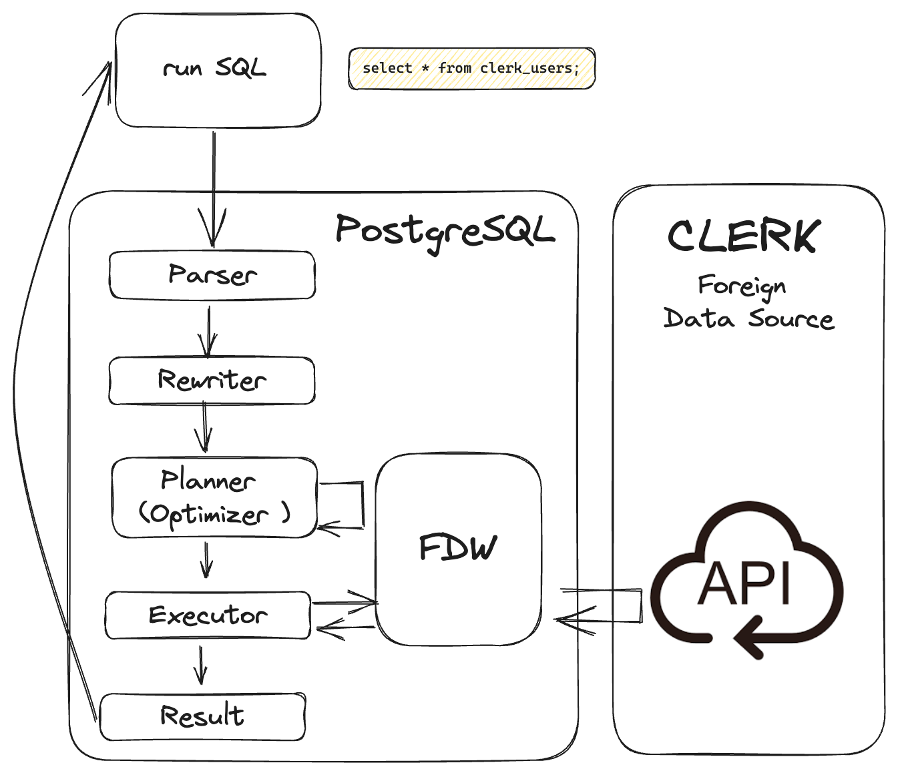
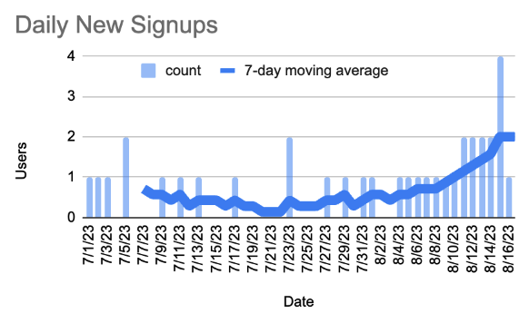
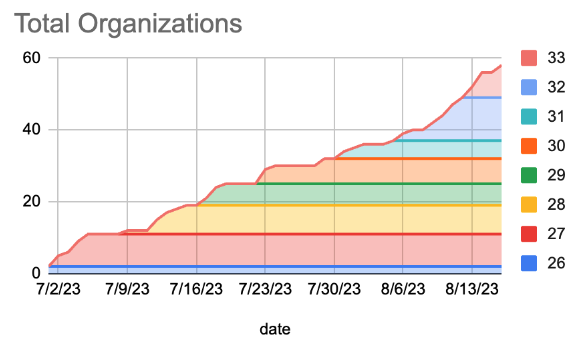

# Unlocking value from your Clerk User Management platform with Postgres

The maxim of building a product is to know your user. However, any company big or small will often have user data spread around in various systems. A data platform team will often deploy various pipelines that can sync data from various sources into a data warehouse. As an alternative, Postgres supports the concept of a Foreign Data Wrapper. Let’s dive into what this is and how it can help us.

In this blog, we'll look at [clerk_fdw](https://github.com/tembo-io/clerk_fdw)—a tool that bridges the gap between [Clerk](https://clerk.com/), a leading user management solution, and your very own Postgres Database. By the end, you'll discover how this integration can empower you to make data-driven decisions, optimize your pricing strategy, and refine your market approach. Let's get started!

## What’s a Foreign Data Wrapper?

A foreign data wrapper is an extension available in PostgreSQL that allows you to bring ‘foreign data’ (i.e. data in a different Postgres DB, a different database like DB2, or even a different kind of data source, like an API) and query it the same way you would query a normal Postgres table. They are particularly useful when your data may be segregated into different databases, but are still related in ways that you could gather some useful information from them. In building a foreign data wrapper for Clerk.com, we have used [Supabase Wrappers](https://supabase.github.io/wrappers/) that make it easier to build Foreign Data Wrappers and interact with third-party data using SQL.

If you should take something away from this blog, is that Postgres’ Foreign Data Wrappers are a great tool to build an analytics platform based on Postgres. See examples of other [FDWs in Trunk](https://pgt.dev/?cat=connectors)

## What’s Clerk?

[Clerk](https://clerk.com/) is a user management tool. With Clerk, users experience a seamless sign-up and sign-in flow, whether they prefer using email, SMS, or even their favorite social media accounts. Its versatility and developer-friendly APIs make it an excellent choice for us at Tembo for both efficiency and a superior user experience.

## The Power of Integration

Being able to access data from a User Management Tool like Clerk as part of your data platform is especially useful because it enables you to have a 360-degree view of the user experience on your product, without having to set up any complex data export pipelines from Clerk into other systems.

In fact, we built `clerk_fdw` at Tembo to address needs in our internal analytics pipeline . Here are some of the ways we are using it:
- Run advanced analytics that combine internal data with user data from Clerk.
- Understand user interaction patterns with our product.
- Identify and engage with top users.



## Setting up `clerk_fdw`

The first step would be installing the `clerk_fdw` extension. You can [install this extension using trunk](https://tembo-io.github.io/trunk/#trunk-install).
```bash
trunk install clerk_fdw
```
The next step would be to enable the extension in your postgres instance. You can do so using the following command:
```sql
create extension if not exists clerk_fdw;
```

### Create the foreign data wrapper for clerk
```sql
create foreign data wrapper clerk_wrapper
  handler clerk_fdw_handler
  validator clerk_fdw_validator;
```

### Connect to Clerk using your credentials
```sql
create server my_clerk_server
  foreign data wrapper clerk_wrapper
  options (
    api_key '<clerk secret Key>');
```

### Create Foreign Table:
#### User table
This table will store information about the users.
> Note: The current limit is 500 users. We are working to increase this limitation in future releases.
```sql
create foreign table clerk_users (
  user_id text,
  first_name text,
  last_name text,
  email text,
  gender text,
  created_at bigint,
  updated_at bigint,
  last_sign_in_at bigint,
  phone_numbers bigint,
  username text
  )
  server my_clerk_server
  options (
      object 'users'
  );
```

#### Organization Table
This table will store information about the organizations.
> Note: The current limit is 500 organizations. We are working to increase this limitation in future releases.
```sql
create foreign table clerk_organizations (
  organization_id text,
  name text,
  slug text,
  created_at bigint,
  updated_at bigint,
  created_by text
)
server my_clerk_server
options (
  object 'organizations'
);
```

#### Junction Table
This table connects the `clerk_users` and `clerk_orgs`. It lists out all users and their roles in each organization.
```sql
create foreign table clerk_organization_memberships (
  user_id text,
  organization_id text,
  role text
)
server my_clerk_server
options (
  object 'organization_memberships'
);
```

## Dive into the Data

Now you can query through your database and get useful information like:
- How many organizations have been created each week in the past
- How many users have signed up in the past 30 days
- What organizations is a user part of
- All users and their roles in an organization
- And more….

Here are some of the charts we were able to make from the clerk foreign data wrapper using some synthetic data.




## Conclusion

In conclusion, we believe that Postgres’ concept of Foreign Data Wrappers is more than just a technical integration—it's a game-changer that allows Postgres users to build data warehouse platforms that reach across all data sources in the business. It paves the way for businesses to harness critical insights directly from their operational databases, making informed decisions easier than ever before. See examples of other [FDWs in Trunk](https://pgt.dev/?cat=connectors)

Give us a star and try out [clerk_fdw](https://github.com/tembo-io/clerk_fdw) by running the example in the README. If you hit any snags, please create an issue. We would greatly welcome contributions to the project as well.
