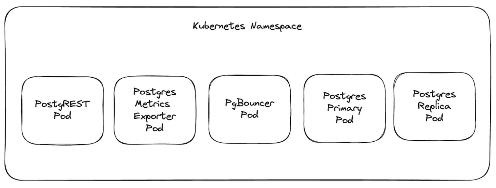

So you have a database, and that database does something. (Probably several somethings, if we're honest). However, today, you need it to do something else.

Simple enough...you just create a tool to give it that new functionality. Job done.

Except it isn't. Because the requests for new "things" never stop. They get complicated. They slow things down. They conflict with one another. Sometimes they even screw up your database along the way. And if we're honest, you don't really want to be constantly building new tools for every new need anyway. Before you know it, all of these "things" you're asking the database to do are starting to get in the way of its core performance.

The good news is that Postgres has a rich ecosystem of tools and services built by the community. Many of these run in the database as Postgres extensions, while others run outside the database as external services. Some of the most well known examples are [PostgREST](https://postgrest.org/en/stable/), an out-of-the box REST API for Postgres and [pgbouncer](https://www.pgbouncer.org/usage.html), a production ready connection pooler. A scalable way to run these pieces of software with the Tembo operator is to utilize a new feature called Application Services, which runs these applications in containers next to postgres.

## Understanding the Essence of Tembo Operator

We have developed the Tembo Operator looking to add new capabilities for developers and enterprises. We believe that it stands out from other techniques in many ways, and in particular, one important feature is that it lets users deploy applications in containers right alongside their PostgreSQL instances, ensuring efficient connection to Postgres with very low latency.

## The Advantage of Running Applications in Separate Containers

PostgreSQL is a very powerful piece of software. When running in Kubernetes, a useful pattern is to run important applications in a separate container, in the same namespace. By running these applications in separate containers, we isolate application requirements, such as resource allocations. This means that each container can have dedicated CPU and Memory, ensuring there's no competition with the resources reserved for running PostgreSQL. This segregation ensures that the Postgres database and other applications can function and scale efficiently.

## Spotlight on PostgREST: A Prime Example

PostgREST is a perfect example where an application can run with this pattern. PostgREST serves as a standalone web server that turns your database directly into a RESTful API. The immediate advantage? Developers can use the auto-generated API to build robust applications without writing any code. By simplifying the process and reducing the need for middleware, PostgREST has become a popular tool in the Postgres ecosystem.

However, let’s remember that  the main advantage of this method is not just resource allocation. It's about ensuring the optimal performance of Postgres without bogging it down with additional tasks.

Let’s look at an example of a spec that would run the workload that we just described. This will look familiar if you’ve worked with the [Kubernetes Pod spec.](https://kubernetes.io/docs/concepts/workloads/pods/)

```yaml
apiVersion: coredb.io/v1alpha1
kind: CoreDB
metadata:
  name: my-postgres-deployment
spec:
  image: "quay.io/tembo/standard-cnpg:15.3.0-1-1096aeb"
  appServices:
    - name: postgrest
      image: postgrest/postgrest:v10.0.0
      routing:
        - port: 3000
          ingressPath: /
      env:
        - name: PGRST_DB_URI
          valueFromPlatform: ReadWriteConnection
        - name: PGRST_DB_SCHEMA
          value: public
        - name: PGRST_DB_ANON_ROLE
          value: postgres
```

The Tembo operator always starts postgres with default configurations, so let’s focus on the `appServices` section of the spec, which will tell us what and how we’ll run an application container.

We can run any number of applications in containers near the Postgres instance. Only the `name` and `image` parameters are required, but you can configure commands, arguments, environment variables, CPU and memory, and readiness and liveness probes for the application.

If you need network communication, you can also configure the ingress by specifying a port and a path. In our example, postgREST runs on port 3000 and expects traffic routed to the root path. appServices also support various Middleware configurations, but we will cover those in a future blog.

Environment variables also have some advanced configuration. The Tembo operator creates a few roles in Postgres, and tracks those credentials in a Kubernetes secret. If we want to pull those credentials into an application, we can do so by using the `valueFromPlatform` option. The service currently supports pulling in credentials for `ReadWriteConnection`, `ReadOnlyConnection` but we’ll be building out more role assignments soon.

## Arbitrary container deployments

The Tembo operator is not limited to postgREST; it can run nearly any containerized application. For example, run your Rails application, or FastAPI web server. Specify the image, and other configurations as necessary and the Tembo operator will provision the resources.

```yaml
apiVersion: coredb.io/v1alpha1
kind: CoreDB
metadata:
  name: my-postgres-deployment
spec:
  appServices:
    - name: my-app
      image: quay.io/myImage:latest
      routing:
        - port: 3000
          ingressPath: /
      command: [ "python", "-m", "myapp.py" ]
      env:
        - name: MY_ENV
          value: my_value
```

**Kubernetes Footprint**

Let’s take a look at what actually gets created when you specify an appService; we’ll use the postgREST example as an illustration.

Every application service gets its own Kubernetes Deployment. If the appService has any ingress requirements, then a Kubernetes Service and an ingress resource (Tembo currently uses [Traefik](https://doc.traefik.io/traefik/middlewares/overview/)) is created for that appService. Middleware is also created (also Traefik) if the appService has any middleware configuration specified. Here’s an image of the pods you’d likely see in the namespace you create for Postgres.





## More to follow

The Tembo operator is under continuous development and runs the entire Postgres Stack, which is not limited to just the core Postgres engine. It also includes auxiliary container services that run outside of Postgres. These auxiliary services augment the Postgres experience by running complex applications outside of Postgres which isolates their workload from your database. Running this with the Tembo Operator makes it simple to get these services up and running.

And if you want to try out the full power of Postgres without being concerned with how it will run, try out [Tembo Cloud](https://cloud.tembo.io/).Drop into our [Slack](https://join.slack.com/t/tembocommunity/shared_invite/zt-20dtnhcmo-pLNV7_Aobi50TdTLpfQ~EQ) channel to ask questions and get help from the Tembo team and other community members.
