Vector search in Postgres is a space that has seen very active development in the last few months. While Pgvector is known to most people, a few weeks ago we came across Lantern, which also builds a Postgres-based vector database. So, we thought about benchmarking both to compare the two approaches. In this post, we'll cover:

- Quick background on doing vector search in PostgreSQL.
- Comparing Pgvector and Lantern in terms of syntax and ease of use.
- Benchmarks comparing index creation time, size, latency, throughput, and recall.
- Summary of the results

## Intro to Vector Search in PostgreSQL

One of the reasons for the popularity of Vector Search these days has to do with the emergence of powerful [embedding models](https://tembo.io/blog/pgvector-and-embedding-solutions-with-postgres/) and their use in AI. You have probably witnessed how many people, startups, and big companies are [exploring](https://tembo.io/blog/secure-embeddings-in-postgres/) how to take advantage of vectors and incorporate them into [their products](https://hn.algolia.com/?dateRange=all&page=0&prefix=false&query=vector%20search&sort=byDate&type=story).

Such enthusiasm has also attracted the Postgres community. [Pgvector](https://github.com/pgvector/pgvector) arose with the ability to create [IVVFlat indexes](https://tembo.io/blog/vector-indexes-in-pgvector) on existing tables with a simple DDL statement. And so, people were given the ability to easily perform similarity queries.

But Pgvector is not the only one in this space. The community has come up with other alternatives as well. One such example was [pg_embedding](https://github.com/neondatabase/pg_embedding). In July, [Neon](https://neon.tech/) published a [post](https://neon.tech/blog/pg-embedding-extension-for-vector-search) where they showed how its extension was 20x faster than Pgvector by using HNSW indexes . However, Pgvector quickly caught up and introduced the HNSW index as well. Around that time, on September 29th, Neon stopped supporting `pg_embedding` and suggested migrating to Pgvector.

Another Postgres extension in the vector search domain is [Lantern](https://github.com/lanterndata/lantern), developed by a [company of the same name](https://lantern.dev/). In October, a [post](https://lantern.dev/blog/hnsw-index-creation) on their blog claimed that their extension could outperform Pgvector by 90x in index creation time. That was an outstanding achievement!

So, I spent some time playing with Lantern, and I'd like to share some of my findings in this blog post. I divided it into two parts: the first one is a quick qualitative comparison, and the second one is a quantitative comparison using a popular benchmark.

Let's dive in.

## PGVector vs Lantern: Similarities and differences

The following table summarizes some aspects of both extensions:

|                                  | **Pgvector**                                                                                    | **Lantern**                                                                                                |
|----------------------------------|-------------------------------------------------------------------------------------------------|------------------------------------------------------------------------------------------------------------|
| **Current Version (date)**       | v0.5.1 (Oct 10, 2023)                                                                           | v0.0.11 (Dec 16, 2023)                                                                                     |
| **Repo popularity (# of stars)** | 7.6K                                                                                            | 435                                                                                                        |
| **Index Type**                   | IVVFlat, HNSW                                                                                   | HNSW                                                                                                       |
| **Distance Metrics**             | L2, Inner, Cosine                                                                               | L2, Cosine, Hamming                                                                                        |
| **Sample Index Creation**        | `CREATE INDEX ON items USING hnsw (embedding vector_l2_ops) WITH (m = 16, ef_construction = 64);` | `CREATE INDEX ON small_world USING hnsw (vector dist_l2sq_ops) WITH (M=2, ef_construction=10, ef=4, dim=3);` |
| **Sample Query**                 | `SELECT * FROM items ORDER BY embedding <-> '[3,1,2]' LIMIT 5;`                                   | `SET enable_seqscan = false; SELECT * FROM small_world ORDER BY vector <-> ARRAY[0,0,0] LIMIT 1;`            |

My takeaway is that if you are familiar with one of the extensions, you can easily understand how to use the other. No major complications are expected on that front.

## Leveraging ANN-Benchmarks

For a quantitative comparison, I took the [ANN-Benchmarks](https://github.com/erikbern/ann-benchmarks) and [extended it](https://github.com/binidxaba/ann-benchmarks) to support the Lantern extension. It was just a matter of creating a copy of the Pgvector directory, naming it Lantern and making a few adjustments to use the corresponding API.

The benchmark starts a container that has Postgres 15 installed and then it enables the corresponding extension. Then, it inserts a dataset into a table and builds a vector index (in both cases an HNSW index). After that, it executes a bunch of queries and evaluates the recall.

Along the way, the benchmark collects several metrics, such as:

- Build Time
- Index Size
- Recall
- Throughput
- Latencies (p50, p95, p99 and p999)

So, we can compare the two extensions along these axes.

As for the HNSW parameters, I used the following:

|||
|---------------------|----------------------------------------|
| **ef_construction** | {[128], 200}                           |
| **m**               | {[8, 16,] 24}                          |
| **ef_search**       | {10, 20, 40, 80, 120, [128,] 200, 400} |

## Comparing Index Creation, Recall, Latency and Throughput

Although I tried different datasets, for brevity, let us only discuss the results of the SIFT 128 dataset, which was also used in one of [Lantern’s posts](https://lantern.dev/blog/hnsw-index-creation).

These are the numbers I got by following the instructions in the blog post, using similar construction and search parameters (e.g. `m={8, 16}`, `ef_construction=128` and `ef_search=128`). Here I used Lantern’s external indexer. First, let us see the build time:

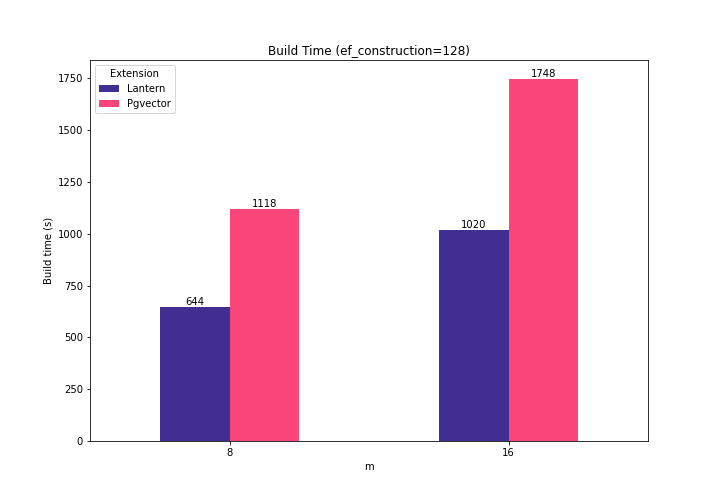

Pgvector takes between 1.71x and 1.73x to build the same index with the same parameters. The resulting index is between 13% and 15% bigger in Pgvector:

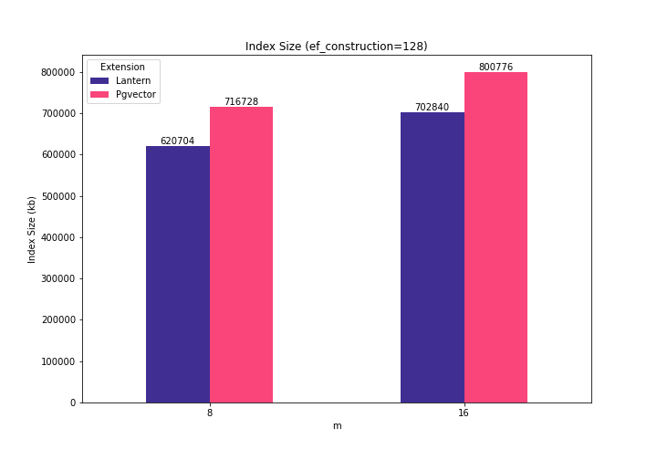

That’s cool… And what about the resulting throughput, latency and recall? Here are the results:

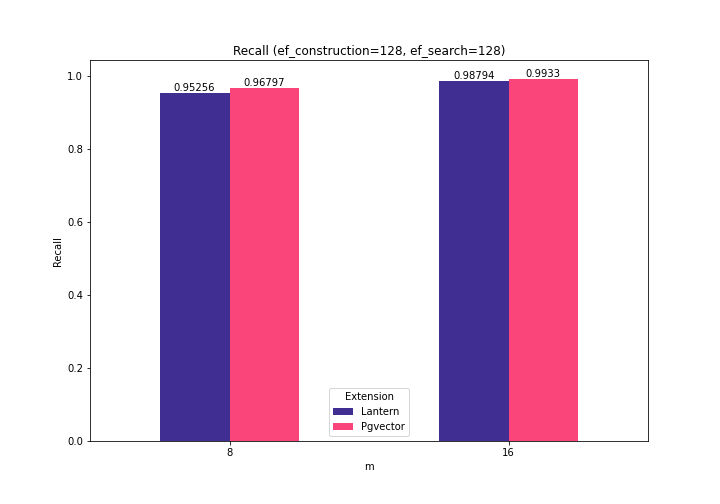
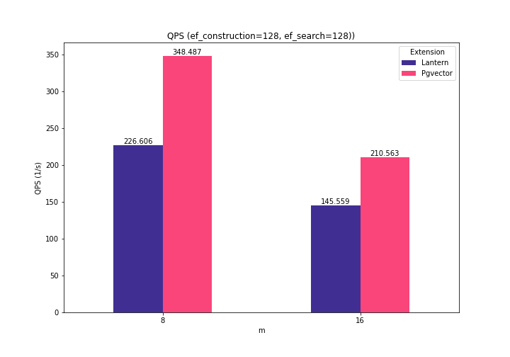
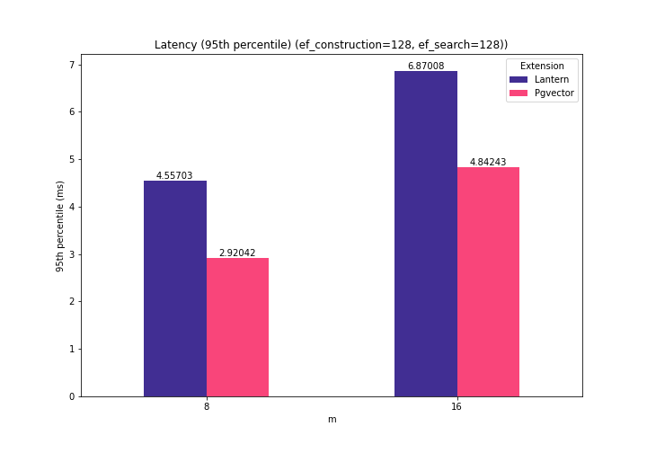

Ok, the recall is similar, however Pgvector outperforms Lantern in QPS and latencies. Specifically, Pgvector can process between 44% and 53% more queries per second, and it's latencies are between 29% and 35% smaller.

So, it seems that Lantern sacrifices throughput in exchange of index creation time and index space.

Hold on… but is this true for other data points as well? Let’s see.

With the construction parameters `m = {16, 24}` and `ef_construction = {200}`, the creation time is still better with Lantern: between 1.9X and 2.3X. And the resulting index is bigger in Pgvector: between 1.13X and 1.20X compared to Latern’s index.

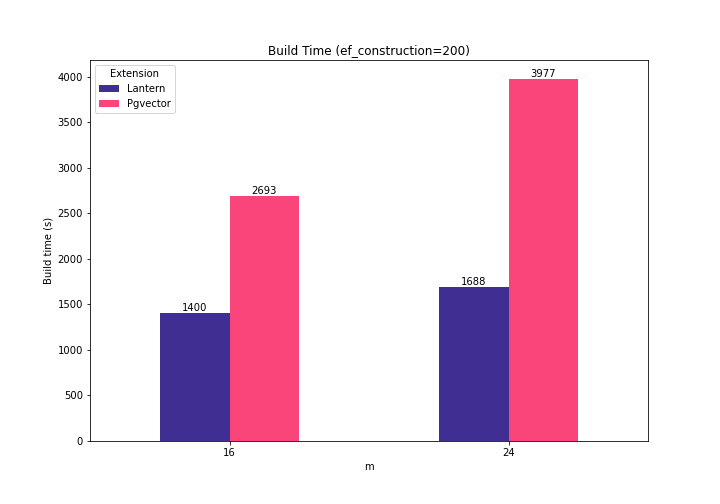
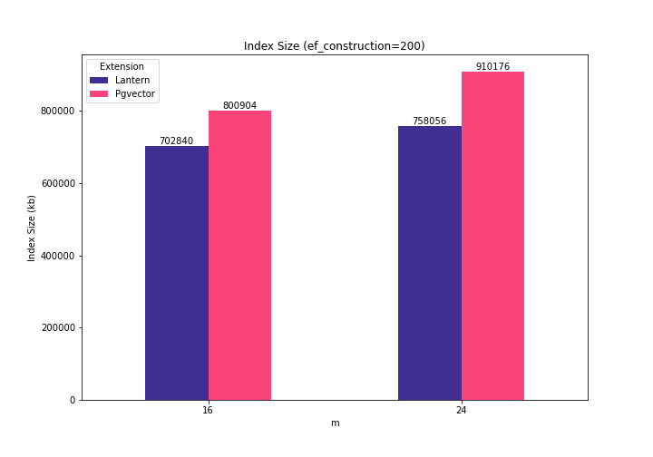

Also, as before, the recall is similar when `ef_search` varies (although Pgvector’s is a bit better). This is the graph for construction parameters `ef_construction=200` and `m=16`. As the `ef_search` is increased, the recall of both indexes get closer.

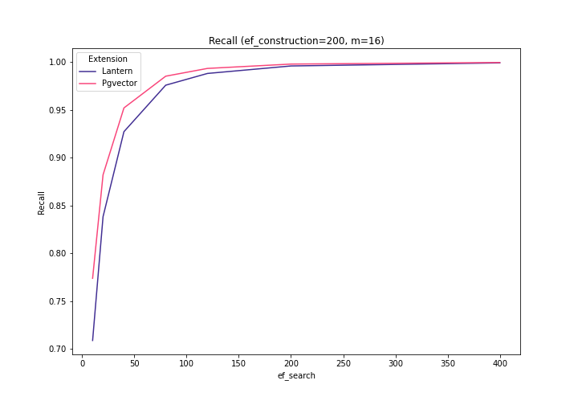

Pgvector has 62-84% better throughput and 38-45% better latencies:

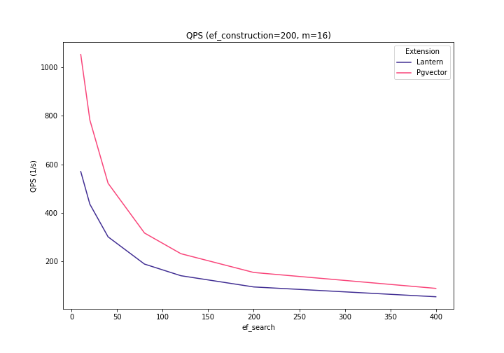
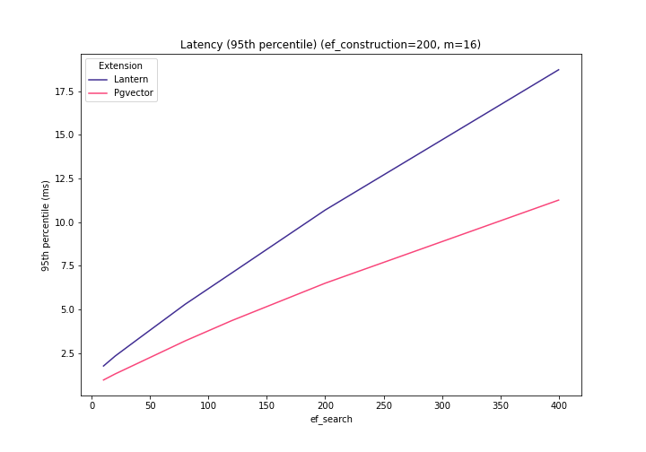

Increasing the m parameter to 24, we get similar conclusions:

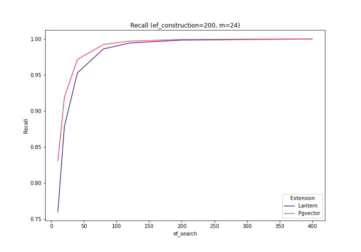

And once again, Pgvector has 42-58% higher throughput and 30-39% better latencies for all values of `ef_search`:

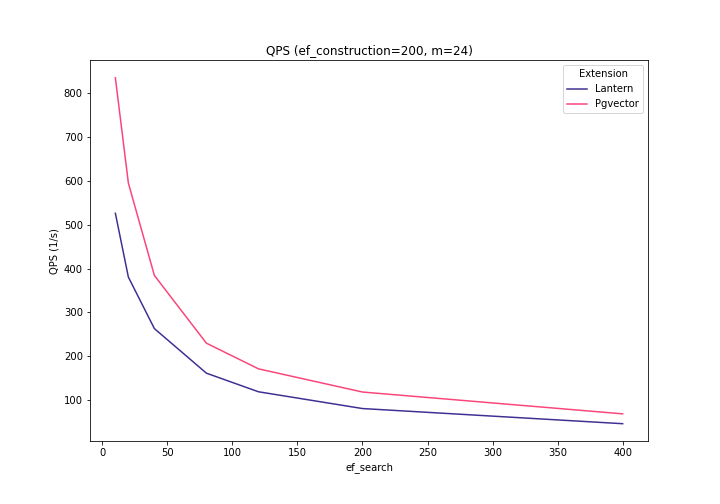
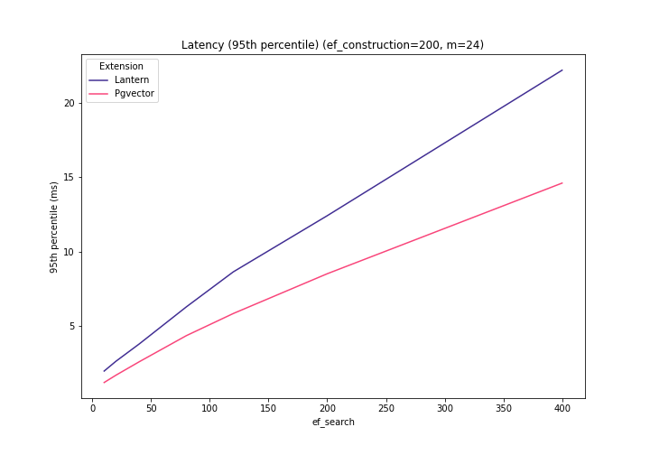

The general trends were consistent with my observations when using Gist-960 and Glove-200. You can see more results [here](https://github.com/binidxaba/lantern-pgvector-comparison/tree/main).

## Conclusions

For convenience, the following table summarizes the above results using relative numbers (i.e. `pgvector/lantern`):

|                | **m={8,16};  ef_construction=128;  ef_search=128** | **m={16,24};  ef_construction=200;  ef_search=[10-400]** | **Notes**                                      |
|----------------|----------------------------------------------------|----------------------------------------------------------|------------------------------------------------|
| **Build Time** | 1.71X-1.73X                                        | 1.92X-2.35X                                              | Lantern yields better results                  |
| **Index Size** | 1.13X-1.15X                                        | 1.13X-1.20X                                              | Lantern yields better results                  |
| **Latency**    | 0.64X-0.70X                                        | 0.54X-0.69X                                              | Pgvector yields better results                 |
| **Throughput** | 1.44X-1.53X                                        | 1.42X-1.84X                                              | Pgvector yields better results                 |
| **Recall**     | 1.00X-1.01X                                        | 1.00X-1.09X                                              | Recall is similar, Pgvector is slightly better |

Pgvector is the most popular Postgres extension for vector search. At the time of this writing, the github repository counts 7.6K stars and is actively being discussed on the web. It is also supported on most managed Postgres providers (including [Tembo Cloud](https://cloud.tembo.io/)) so is easier for you to access.

Lantern is a young project that leverages the popular [USearch engine](https://github.com/unum-cloud/usearch/). As of today, the extension has been starred more than 400 times in github and is in very active development.

Both extensions offer similar API and support the HNSW index. According to my experiments (Pgvector 0.5.1 and Lantern 0.0.11), Lantern's index creation is faster and produces smaller indexes. However, Pgvector provides better recall, latency and throughput.

We should keep an eye on both projects and see how they evolve. I am confident that we'll see several improvements in the following months.

Oh, and if you are interested in quickly integrating vector searches in your app, make sure to check out [pg_vectorize](https://tembo.io/blog/introducing-pg_vectorize) to see how to do that with only two function calls in Postgres.

## Appendix

The experiments in this post were carried out using a machine with the following characteristics:

|||
|----------------------|-----------------------------------------------|
| **VM**               | E2-standard-8 (8 vCPUs, 4 cores, 32GB memory) |
| **Storage**          | 100GB                                         |
| **Operating System** | Debian 11.8                                   |
| **Postgres**         | 15                                            |
| **Postgres Config ** | `maintenance_work_mem=5GB; work_mem=2GB; shared_buffers=12GB` |
| **Lantern**          | 0.0.11                                        |
| **PGVector**         | 0.5.1                                         |

For information about other results, please see [here](https://github.com/binidxaba/lantern-pgvector-comparison/tree/main).
