Creating a connection to your Postgres database to execute a short-lived query is expensive. Several people have measured the overhead of Postgres connections and some locate them in the range of [1.3MB of memory per connection](https://stackoverflow.blog/2020/10/14/improve-database-performance-with-connection-pooling/) and others in the range of [2MB](https://blog.anarazel.de/2020/10/07/measuring-the-memory-overhead-of-a-postgres-connection/). In addition, there is also the overhead of having to [fork a new process](https://www.postgresql.org/docs/current/connect-estab.html) in the database server.

To alleviate these problems, typically people use a connection pooler. However, for Postgres, there are several options available. Some popular ones are [Pgbouncer](https://www.pgbouncer.org/), [Pgcat](https://github.com/postgresml/pgcat), [Odyssey](https://github.com/yandex/odyssey), [pgagroal](https://github.com/agroal/pgagroal), [Pgpool-II](https://www.pgpool.net/mediawiki/index.php/Main_Page) and [Supavisor](https://github.com/supabase/supavisor).

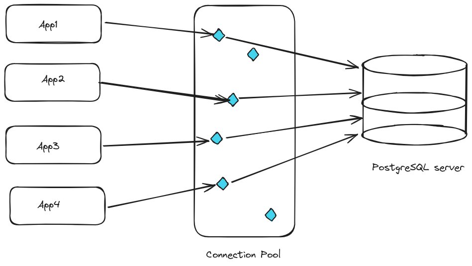

But which one should you choose? Should you go with the battle-tested Pgbouncer? Or should you go with the internet-scale, cloud-native Supavisor? Or the sharding and load balancing aware pgCat?

In this post, we will compare these three popular alternatives:

- PgBouncer
- PgCat
- Supavisor

Let’s quickly describe each of them.

## Quick overview of PgBouncer, PgCat and Supavisor

### PgBouncer

[PgBouncer](https://www.pgbouncer.org/) is a *lightweight connection pooler* and probably the most popularly used.

It can be quickly installed with your OS package manager (e.g. apt) and the configuration involves adjusting two files: pgbouncer.ini and an authentication file. After that, you just need to change your connection strings to point to the PgBouncer instance.

One of its limitations often discussed on the internet is its lack of support for replica failover and its limited support for load balancing.

### PgCat

PgBouncer’s limitations are addressed in [PgCat](https://github.com/postgresml/pgcat), which is described as a *connection pooler and proxy that allows sharding, load balancing, failover and mirroring*.

In contrast with Pgbouncer, PgCat allows spreading queries to a sharded database. Plus, it is multithreaded, thus allowing to easily exploit hardware potential.

The [README](https://github.com/postgresml/pgcat/blob/main/README.md) is well-written, making the installation easier. Like PgBouncer, you just need to update a configuration file (in this case, pgcat.toml); and then redirect your application to PgCat.

### Supavisor

Another option is [Supavisor](https://github.com/supabase/supavisor), the connection pooler developed by Supabase.

It is described as a *scalable, cloud-native Postgres connection pooler*. In the launching [post](https://supabase.com/blog/supavisor-1-million), it is mentioned that it can handle millions of connections and will replace PgBouncer in Supabase’s managed Postgres offering as it is [intended](https://github.com/supabase/supavisor/blob/main/README.md) to provide zero downtime when scaling a server, and handling of modern connection demands such as those seen in serverless environments.

Its setup is a bit more involved, as it requires an additional auxiliary database to store tenants information, plus there are more listening ports in play. Here is a diagram I drew to better understand the architecture:

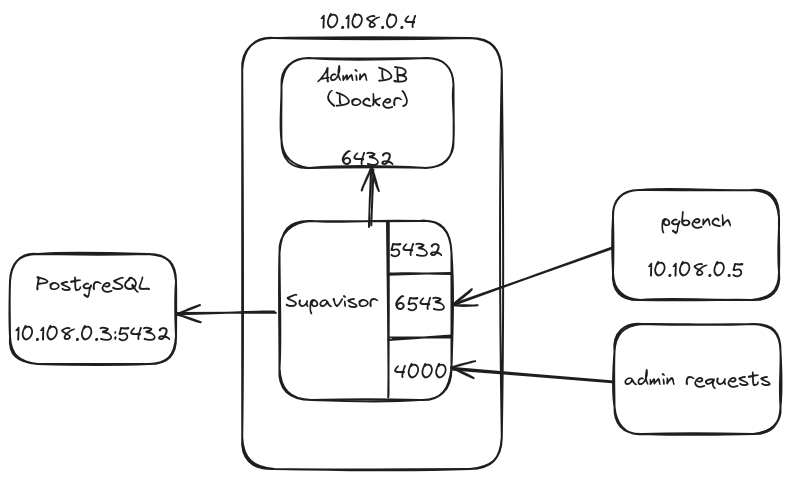

## Criteria for comparing PostgreSQL connection poolers

Choosing a connection pooler requires careful consideration of various factors.

The first one is how easy it is to set it up. Do you need to play with a bunch of knobs just to get started? Do you need to change your application code, or do you just need to change a connection string?

The second one is how much it can scale. Can it handle hundreds, thousands, or a million concurrent connections?

A third one is the overhead. How much memory does it require for each connection in the pool (e.g., what metadata does it save)? What’s the latency of acquiring a connection when available connections are in the pool?

One more could be: Can it adapt to a varying number of concurrent connections and gracefully handle a spike in the number of connection attempts?

We try to answer some of these questions in the sections below.

## Description of experiments

To compare the three connection poolers, I set up a couple of VMs in Google Cloud. My intention was to evaluate some of the factors I described above.

So, my setup was as follows:

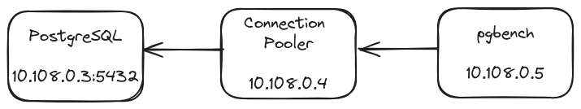

I used separate machines to give the connection pooler and pgbench enough CPU/Memory resources.

The VMs were Google Cloud’s E2-standard-8 (8 vCPUs, 4 cores, 32GB memory), all in the same zone. The OS was Debian 11.8. Postgres version was 15.5.

I configured the three poolers to create a pool of 100 connections and the workload was generated using PgBench. In all cases, the pooler was configured for **Transaction mode**. I collected the outputs and analyzed them. For the exact details of my experiments to replicate them, please refer to this [github repository](https://github.com/binidxaba/postgres-conn-poolers-comparison).

## Results

### Throughput and Latency for small connection count

The first thing I wanted to see was whether using a connection pooler could mitigate the need to create new connections every time the app executed a query.

The following two graphs show the behavior of the connection poolers when the number of clients (<=100) is smaller than the number of connections in the pool. As a baseline, I am considering direct connections to the database (i.e., no pooler in between). For that, I added the numbers of: (1) when clients connect only once and execute all their workload, and (2) when clients directly connect to Postgres, execute some workload, and then disconnect.

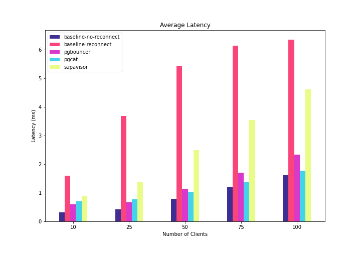

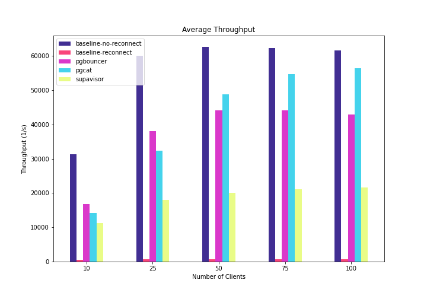

A few things to notice:

- The baselines serve as lower and upper bounds for the poolers’ behavior.
- All connection poolers had worse latency than connecting the client directly to the database once and leaving the connection open for the duration of its workload. That’s expected because, in contrast, the poolers need to execute additional logic to hand connections to the client application.
- All connection poolers had better latency numbers than connecting the client directly to the Database, running a query, and then disconnecting. This is because the poolers remove the time-to-connect from the application’s execution path.
- For lower connection counts, PgBouncer has the lowest latency and best throughput. But as we go over 50 clients, PgCat starts having better latency and throughput.
- Since PgBouncer is single-threaded, maybe beyond 25 connections, it is necessary to spawn another PgBouncer instance.
- In contrast, PgCat and Supavisor continue to deliver more throughput, although PgCat performs better up to this point (number of clients <= 100).
- For all cases, PgCat and PgBouncer have somewhat comparable latency (in the range of **-17% and +24% difference**), but Supavisor has much higher compared to the other two (in the range of **80-160%**).

### Throughput and Latency for large connection count

Let’s see what happens when we stress the connection poolers using more clients. The following two graphs show my results when the number of concurrent clients varied in the range of 250-2500:

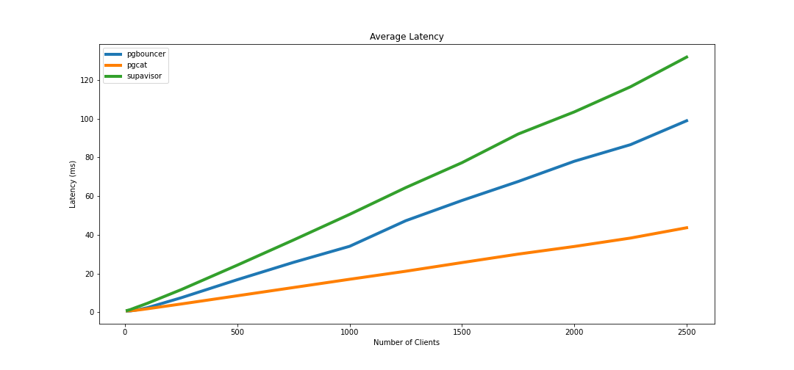

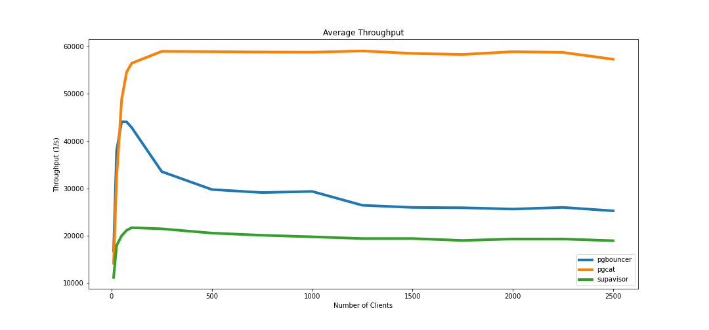

For the three poolers, the latency of executing a simple query continues to grow. This is because, beyond a certain point, the CPU becomes a bottleneck, and connection requests begin to pile up. I suspect this could be mitigated with a more powerful machine.

We can see that PgCat performs better (higher throughput, lower latency), reaching **59K tps**. In contrast, PgBouncer peaks at **44,096 tps** and degrades to a steady state of **25,000-30,000** tps beyond 75 concurrent connections. Supavisor peaks at about  **21,700 tps**, but remains in steady state.

As suggested in Supabase’s [blog post](https://supabase.com/blog/supavisor-1-million), beyond this point, one alternative is to scale Supavisor horizontally by adding more instances. This case, though, is beyond the scope of my experiments.

### Latency at maximum throughput

Now, let us see what happens with the latency when each of  the poolers are exercised at their maximum throughput. For PgBouncer that is 50 clients; for PgCat, 1250 clients; and for Supavisor, 100 clients.

PgBouncer’s latency (clients = 50) is generally below **4 ms for 99%** of the connection requests, and (as shown earlier) the mean is around 1 ms.

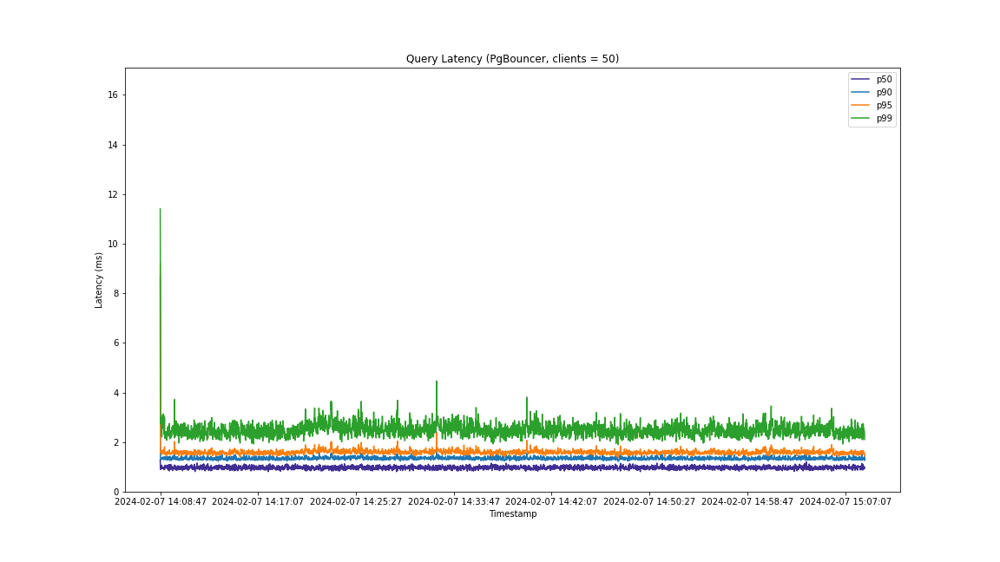

For PgCat (clients=1250), the latency at maximum throughput is higher than PgBouncer’s, as shown in the following picture, but it is also dealing with a much larger number of connections:

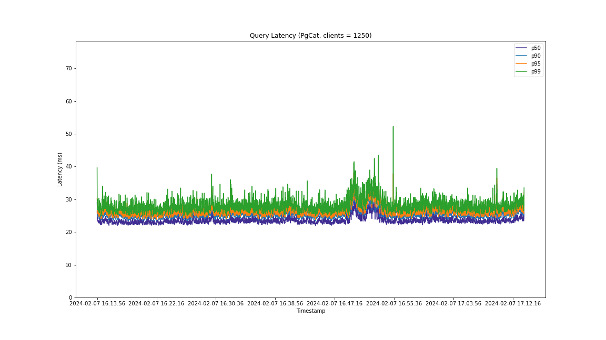

But of the three poolers, the worst latency was obtained with Supavisor (clients=100):

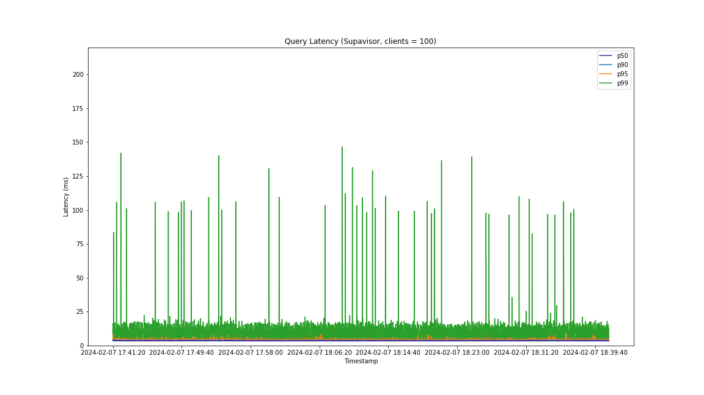

Interestingly, when considering the 99 percentile, the latency sees some frequent spikes. Pgbench shows that in the form of standard deviation:

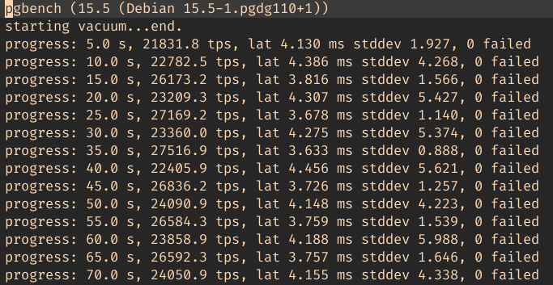

I don’t have enough knowledge to understand the root cause of this. One hypothesis could be the inherent complexity of Supavisor’s architecture. The other one is that I may be misusing the pooler 🙂

### CPU Utilization at maximum throughput

During the experiments, I also collected information about CPU utilization. Let’s see how the poolers use the CPU when exercised at their maximum throughput.

The following plot demonstrates that with 50 clients, PgBouncer’s CPU utilization reaches **~100%** (i.e., full utilization in one core). We again see the downside of its single-threaded implementation. The mitigation could be to add more PgBouncer instances.

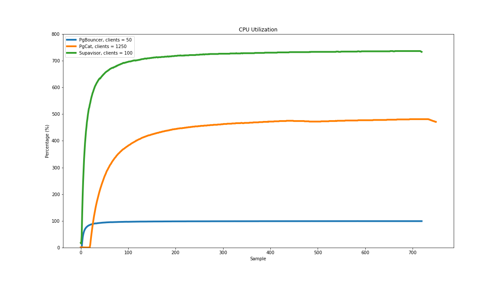

In contrast, PgCat uses CPU most efficiently by being able to support 1,250 connections within **400%** CPU utilization, whereas Supavisor uses **700%** for 100 clients. In theory, PgCat and Supavisor have more room for better scalability due to their ability to utilize more cores.

### Latency with 1250 clients

Before finishing, let me show you what the latencies look like when we use 1250 clients with all the poolers. PgCat has the maximum throughput with this number of clients, and so the following graph shows a fair comparison with similar workload.

Even for the median, Supavisor shows the noisy behavior I mentioned previously. PgCat exhibits the best latency.

The following graph shows the latency for p99, and we see the same trend:

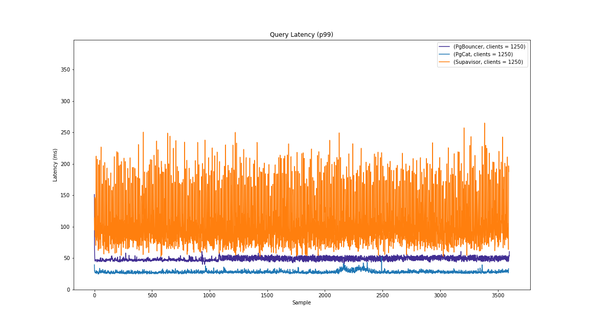

## Summary of Results

For convenience, the following table summarizes the qualitative attributes of the three poolers:

|                                                                    | **PgBouncer**                           | **PgCat**                            | **Supavisor**                          |
|--------------------------------------------------------------------|-----------------------------------------|--------------------------------------|----------------------------------------|
| **Current Version (Maturity)**                                     | v1.21                                   | v1.1.1                               | v1.1.13                                |
| **Repo**                                                           | [pgbouncer](https://github.com/pgbouncer/pgbouncer)  | [pgcat](https://github.com/postgresml/pgcat)  | [supavisor](https://github.com/supabase/supavisor)  |
| **Repo Popularity (Stars in GH)**                                  | 2.5K                                    | 2.4K                                 | 1.4K                                   |
| **Language of implementation**                                     | C                                       | Rust                                 | Elixir                                 |
| **Installation/Setup Complexity**                                  | Easy                                    | Easy                                 | Medium, several moving parts.          |
| **Multi-threaded**                                                 | No                                      | Yes                                  | Yes                                    |
| **Application Changes**                                            | Connection string                       | Connection string                    | Connection string                      |

And this table summarizes the results from my experiments with the E2-standard-8 vms:

|                                                                    | **PgBouncer**                           | **PgCat**                            | **Supavisor**                          |
|--------------------------------------------------------------------|-----------------------------------------|--------------------------------------|----------------------------------------|
| **Max Concurrent Clients Tested**                                  | 2500                                    | 2500                                 | 2500                                   |
| **Max Throughput**                                                 | 44,096 tps @ 50 clients                 | 59,051 tps @ 1,250 clients           | 21,708 tps @ 100 clients               |
| **Latency @ 1,250 concurrent clients**                             | 47.2 ms                                 | 21.1 ms                              | 64.37 ms                               |

In this post, we compared connection poolers for Postgres across different axes.

Of the three, Supavisor is the one that requires more steps to begin using it. However, the way it handles tenants is convenient for modern cloud environments. Other than that, once the poolers are adequately set up, the only change required in your application is the connection string.

From my experiments, I found that PgCat performs better as it delivers higher throughput while supporting more concurrent clients. With more than 750 clients, PgCat achieves more than 2X qps compared to PgBouncer and Supavisor.

PgBouncer offers the best latency for low (<50) connection counts. However, its downsides are: (1) it is single-threaded, preventing it from fully utilizing the machine with a single instance, and (2) if there is a surge in the number of connection requests, clients would right away notice some performance degradation (at least in my environment). In comparison, PgCat and Supavisor keep their tps numbers when more clients are added.

So, according to these experiments, PgCat shows like it’s the best option when you have high connection counts.

Thank you for reading until this point, dear reader. I hope you find these insights helpful. In a follow up post, we shall compare the three connection poolers using **prepared statements**. In the meantime, I am curious: which connection pooler are you currently using and why? What other factors did you consider before making that decision? Let us know your comments at [@tembo_io](https://twitter.com/tembo_io).

**Update (2024/02/14): Made it clear that the experiments use Transaction mode and added note about prepared statements.**

## Appendix

If you are interested in the exact details of the configurations used for the experiments presented in this post, please refer to the [github repository](https://github.com/binidxaba/postgres-conn-poolers-comparison).

