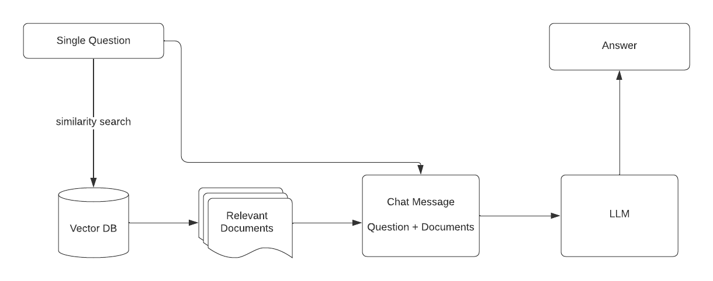
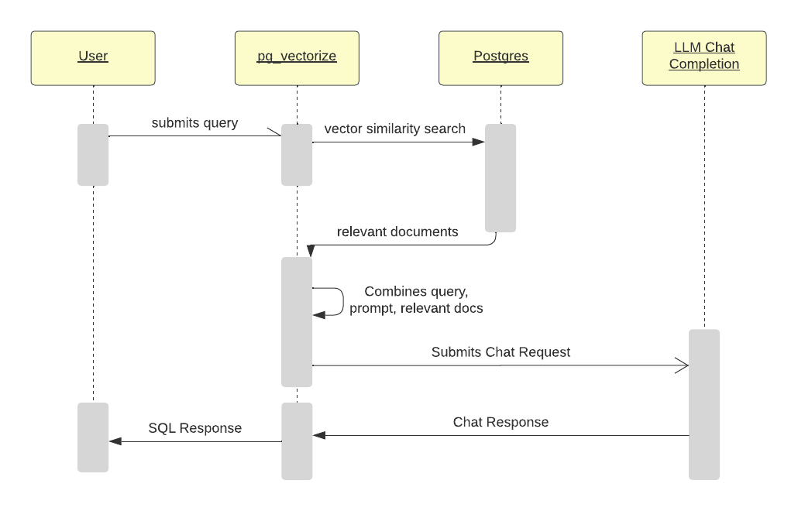

Building applications on LLMs is normally a complicated process that involves moving data between data stores, running infrastructure, and orchestrating API calls across multiple transformer models and LLMs. This is a boilerplate process that can be abstracted, and by using extensions such as [pg_vector](https://github.com/pgvector/pgvector) and [pg_vectorize](https://github.com/tembo-io/pg_vectorize) done directly from SQL.

Today, we are launching the Tembo RAG stack which allows you to natively build Q&A bots on Postgres. You can try it out on your own by using our [Kubernetes Operator](https://github.com/tembo-io/tembo/blob/main/tembo-stacks/src/stacks/specs/rag.yaml), deploy it with a single click on [Tembo Cloud](https://cloud.tembo.io/), or run it locally with [docker-compose](https://github.com/tembo-io/pg_vectorize?tab=readme-ov-file#rag-example).

## Your data improves LLM responses

LLMs responses improve significantly when provided additional context. The leading technique for [adding context to LLM prompts](https://platform.openai.com/docs/guides/prompt-engineering) is Retrieval Augmented Generation, commonly known as RAG. It was first introduced in a [2020 paper](https://arxiv.org/pdf/2005.11401.pdf) that explored a technique for overcoming limitations of generative text models. Since then, RAG has become a popular technique when building applications on LLMs and has been written about [extensively](https://research.ibm.com/blog/retrieval-augmented-generation-RAG). Several frameworks have also been developed for building RAG applications including [LangChain](https://github.com/langchain-ai/langchain) and [LLamaIndex](https://github.com/run-llama/llama_index).

## Components of RAG

RAG starts with a question or query that is submitted to an LLM. Then it uses that query to conduct a similarity search against an existing source of data, and returns the documents that are most relevant to the query. The query is then combined with  relevant documents and any other specific instructions and is submitted to the LLM. The LLM’s chat response is returned as the answer. Think of it like asking an LLM to answer a question on a homework assignment, but giving the LLM the relevant chapters from the textbook and telling the LLM to use the chapters to provide an answer.



## Extending Postgres to Support RAG

Developers typically need to create a bunch of infrastructure to run a workflow like this. Often, this means building an implementation with LangChain or LlamaIndex, setting up a vector database in Chroma or Pinecone or hand rolling their implementation with pgvector. Then, writing a load of code to bootstrap it all together. However, once the data is in Postgres there is no good reason to move it out. Postgres extensions bring this functionality close to the data, saving developers both time and complexity.

This functionality has been built into [pg_vectorize](https://github.com/tembo-io/pg_vectorize), a Postgres extension that was released earlier this year. It has features like integrations into sentence transformer models, background jobs and triggers for keeping embeddings updated as documents change, and complete integration with [pgvector](https://github.com/pgvector/pgvector) for vector indices and similarity search algorithms. Now, it also has the ability to define custom prompts and submit the results of vector similarity search to OpenAI’s LLMs.



## The fastest way to build RAG applications

pg_vectorize provides a simple SQL API to set up a RAG application. Assuming a table exists with a new document or part of a document on each row, generating embeddings and initializing a project is straightforward. Give the RAG agent a unique name and point it at the table and column within that table that contains the relevant documentation. `transformer` can be any [Hugging Face Sentence Transformer](https://huggingface.co/sentence-transformers) or OpenAI embedding model.

```sql
select vectorize.init_rag(
   agent_name => 'tembo_chat',
   table_name => my_documents,
   unique_record_id => 'document_name',
   "column" => 'content',
   transformer => 'sentence-transformers/all-MiniLM-L12-v2'
);
```

Asking questions using RAG is also a single function call. Reference the same `agent_name` as set during `vectorize.init_rag()`, provide a question and specify the desired OpenAI chat completion model.

```sql
select vectorize.rag(
   agent_name => 'tembo_chat',
   query => 'what are tembo stacks?',
   chat_model => 'gpt-3.5-turbo'
);
```

Calling vectorize.rag() conducts similarity search on the data in Postgres and crafts the prompt to OpenAI’s chat completion model of choice. There is an end-to-end guide in [Tembo’s documentation](https://tembo.io/docs/tembo-stacks/rag) to build a question-answer bot using these functions on the RAG stack.

## Cost planning and management

All chat-completion models, like [chatgpt-3.5-turbo](https://platform.openai.com/docs/models/gpt-3-5-turbo), have limits to the amount of data they can receive in a single request. OpenAI's gpt-3.5-turbo model only accepts 4096 tokens (or approximately words) per request, while OpenAI's [gpt-4-turbo](https://platform.openai.com/docs/models/gpt-4-and-gpt-4-turbo) accepts 128,000 tokens. Therefore, the documents that are submitted to the chat completion model should fit into that context window limit.

But simply filling up the context window may not always produce the desired result. As of this writing, GPT-4 costs $0.03 per 1k input tokens and $0.06 per 1k output tokens. Assume a question like "how do I build a message queue on Postgres?" is submitted to the agent. In response, it submits a 1,000 token document to GPT-4 as part of the request and a 100 token response is received. That's approximately $0.04 per question! This also assumes usage of Tembo's self hosted transformer models for generating embeddings, which would normally accrue a cost per token on embedding the question itself. Generally, using the full context window will achieve a higher quality response, but comes at increased cost.

As a note, caching questions and responses can be an effective tool to control costs. For example, a question like “What are Tembo Stacks?” might be something that is frequently asked, and the responses can be saved. If a question like that has been asked, it may be better to serve a cached response. Over time as responses are cached, developers can build up a corpus of responses. Then, you could use pg-vectorize’s vector search capability to retrieve the most relevant response, and only when the similarity score of the cached response falls below a threshold, make an expensive call to an LLM to generate a new response.

## Run it locally with Docker, or try it now on Tembo Cloud

This is just the beginning of the Tembo RAG Stack. In-database document chunking and text-splitting, conversational workflows, and privately hosted chat-completion models are some of the features that are coming soon!  

Follow the open source project pg_vectorize’s [README](https://github.com/tembo-io/pg_vectorize?tab=readme-ov-file#rag-example) to try this workflow locally using Docker or review the official Tembo Cloud [documentation](https://tembo.io/docs/tembo-stacks/rag) for a guide on building a support question-answer bot from scratch using the RAG stack.
