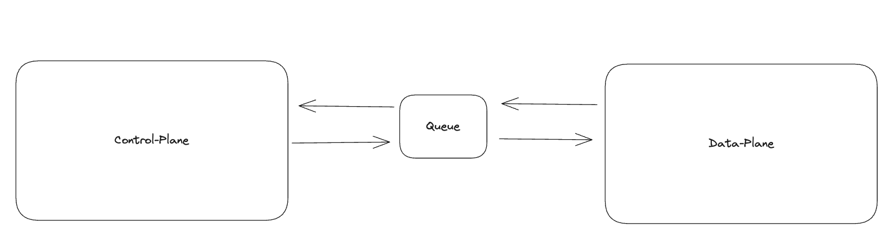
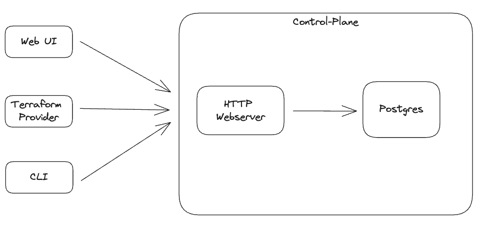
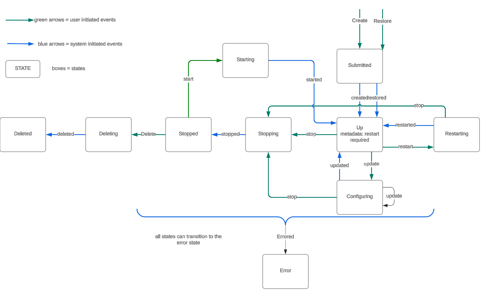
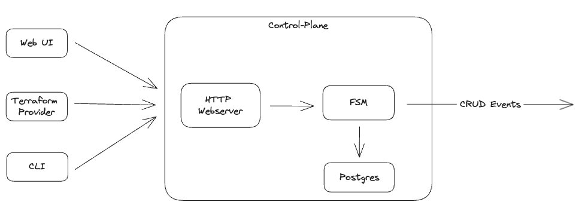
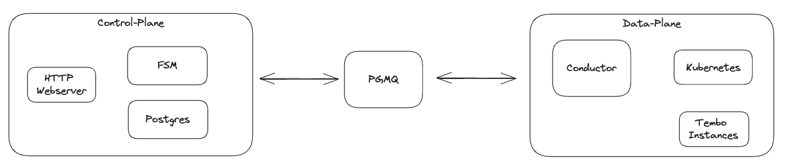

Tembo was founded in December 2022 with a mission to make the best Postgres service to deploy extensions. That mission has evolved since then to provide [optimized Postgres instances](https://tembo.io/blog/tembo-stacks-intro) for your workload, but let's go back to the start. At the very minimum, we wanted our users to be able to come to [Tembo Cloud](https://cloud.tembo.io), create a new Postgres instance, install Postgres extensions into that instance, and connect to that Postgres instance over the public internet.

With this early vision in place, we started to sketch out an architecture for our product. Drawing inspiration from other [cloud platforms](https://developer.confluent.io/courses/confluent-cloud-networking/overview/#:~:text=There%20are%20two%20main%20ways,maintenance%2C%20and%20operations%20take%20place.), we quickly decided that we would architect the platform with two high-level components—a control-plane and a data-plane. Two early assumptions were that 1) there could be  many data-planes per control-plane, and 2) the control-plane may not always be able to reach the data plane (for example if the data-plane's network is private, dedicated for one customer). So, these two components must stay highly decoupled. Making the decision to decouple the infrastructure enabled us to move quickly in the control-plane without risk of impacting the managed infrastructure in the data-plane.



## The Control Plane

The initial version of the control-plane consisted of just a web UI and a HTTP server. The HTTP server serves the purpose of handling Create, Read, Update, and Delete (CRUD) requests for Tembo instances. The server’s GET endpoints do things like list all the instances that belong to an organization or list all the attributes and configurations for a specific instance. PATCH routes handle updating instances with operations like restarting, installing an extension, or changing a configuration.

All state is persisted in a Postgres instance dedicated to the control-plane. This includes all metadata related to instances in the platform such as their infrastructure requirements (cpu / mem / storage), Postgres extensions installed, and any custom configurations applied to the instance.

Tembo’s clients, the web UI (hosted at [cloud.tembo.io](https://cloud.tembo.io)), the [Tembo Terraform provider](https://github.com/tembo-io/terraform-provider-tembo), and the [Tembo CLI](https://github.com/tembo-io/tembo/tree/main/tembo-cli) all communicate with the control-plane through an [HTTP interface](/docs/development/api).



## A Finite State Machine

Managing the lifecycle of Postgres, infrastructure, and its related services is complex. For example, many operations in Postgres require restarts (e.g. changing `shared_preload_libraries`) and can be highly disruptive. Other changes should be multi-step; for example, a user may be required to suspend or pause an instance before deleting it. Simple HTTP request validation was not enough to model the state changes, and transitions would not only happen on requests. [Others have implemented](https://www.citusdata.com/blog/2016/08/12/state-machines-to-run-databases/) state machines to help facilitate the management of databases, which originally led us down this path.

Transitions are events that move an instance from one state to another. These can be thought of as events. For example, when instances are first created they are in the “Submitted” state. When that instance receives a “Created” event back from the data-plane, it can transition to “Up”. Likewise, “Up” instances can move to a “Configuring” state when they receive “Update” events, and do not transition back to “Up” until their configuration is reported as complete via an “Updated” event. Error events can transition an instance into an error state and instances can recover out of an error state when recovered.

The early iterations of the platform were more restrictive on state transitions. We modeled our state transition, as shown below, before implementing the first version of our state machine. As we've added more functionality, it has significantly evolved and become less restrictive. For example, instances can now be deleted and configuration changes can be requested from any state. The Stopping and Stopped states were temporarily disabled during the migration from our own Postgres operator to the CNPG Operator. Read more on the Operator decision in our [Tembo Operator blog post](https://tembo.io/blog/tembo-operator). The ability to suspend or stop a Tembo instance is also being added soon.



## FSM in Rust

The majority of the Tembo platform is written in Rust, and the state machine is no different. All possible states of a Tembo instance are represented as variants of a single Enum. At any moment in time, a Tembo instance is in exactly one state. This state is persisted in a Postgres instance dedicated to the control-plane.

```rust
pub enum State {
   Configuring,
   Deleted,
   Deleting,
   Error,
   Restarting,
   Starting,
   Stopped,
   Stopping,
   Submitted
   Up,
}
```

The transitions between states can be arbitrarily complex. For example, installation of certain extensions requires Postgres to be restarted, while others do not. Therefore, an Update event on an instance in the Up state could result in an instance transitioning to either a Configuring state or the Restarting state. Invalid state transitions result in an error and no transition in state.

Below is a subset of the transition definitions implemented into the Tembo finite state machine that were created with these complexities in mind. Any existing State can attempt to transition to the next state by calling next() on itself, along with the event type and the instance itself. The transition is defined as the pair of the current state and the Event type. As mentioned earlier, arbitrary transition logic can be applied on the transitions but it is not required. For example, `(State::Up, Event::Restarted) => Ok(State::Up)` defines the transition from Submitted to Up, via a Restarting event.

```rust
impl State {
   pub fn next(
       self,
       event: Event,
       instance: &Instance,
   ) -> Result<State, StateError> {
       match (self, event) {
           (State::Up, Event::Restarted) => Ok(State::Up),
           (State::Up, Event::Update) => {
               let desired = Some(instance.clone().desired_spec);
               let actual = instance.clone().actual_spec;
               match restart::restart_expected(&desired, &actual).await {
                   true => Ok(State::Restarting),
                   false => Ok(State::Configuring),
               }
           }
           (State::Up, Event::Updated) => Ok(State::Up),
           (State::Restarting, Event::Restarted) => Ok(State::Restarting),

           … other state transitions …

           (State::Deleted, _) => Err(StateError::IllegalTransition(
               format!("instance {} is deleted", instance.instance_id).to_owned(),
           )),
           // undefined states
           (s, e) => Err(StateError::UndefinedTransition(format!(
               "Invalid state-event combination: state: {s:#?} => event:{e:#?}"
           ))),
       }
   }
}
```

With a finite state machine in place, all CRUD requests pass through basic HTTP request validation and state transitions are validated before any database change is applied. All valid state change requests are emitted as a CRUD event to the data-plane.



## Buffer tasks between the planes

The task duration for processing events in the data-plane is quite variable. For example, creating a new instance could take seconds to minutes depending on whether an image is cached on a node or whether Kubernetes needs to add a new node to the cluster in order to deploy the instance. Once an instance is created, events like installing an extension could happen within seconds for a small extension. Changing a configuration could happen in milliseconds for a simple change like changing the `search_path`. In the case of a `shared_preload_libraries` change, it could take several seconds to over a minute since Postgres will also need to be restarted.

Implementing a queue for these tasks allows us to buffer these requests, and allows the data-plane to determine when and how often tasks are retried. Further, implementing a queue means that complete outages in either the control-plane or the data-plane do not immediately cause system failures (though the queues will begin to build up).

As a Postgres company, like many others ([Dagster](https://dagster.io/blog/skip-kafka-use-postgres-message-queue) and [Crunchy Data](https://www.crunchydata.com/blog/message-queuing-using-native-postgresql) as a couple examples) we implemented the queue on Postgres. It was initially built as a Rust crate to fit with our tech stack, but we quickly realized that we could share the implementation with all Postgres users if it lived as an extension, so we [released it as PGMQ](https://tembo.io/blog/introducing-pgmq).


## Conducting events in the data-plane

After the control-plane sends CRUD events to PGMQ, [Conductor](https://github.com/tembo-io/tembo/tree/main/conductor), the service that handles all execution of orders from the control-plane and into the data-plane, processes them. Conductor has a critical job but a narrow set of responsibilities. It reads the Spec for an instance from the queue, then applies the updated resources by communicating with the Kubernetes API. It may create new Tembo instances or otherwise can update, restart, or delete instances. All of the operations applied by Conductor are ultimately applied to Tembo instances via the [Tembo Operator](https://github.com/tembo-io/tembo/tree/main/tembo-operator).

Read more about our Kubernetes footprint in the [Tembo Operator Blog Post](https://tembo.io/blog/tembo-operator) from October 2023.

## Closing the loop

The control-plane receives state events from the data-plane via the queue. These state events are then persisted to the control-plane’s Postgres database. Additionally, further reconciliation between the user’s desired state of an instance and the actual state of the instance happens here. For certain transitions, when the desired state does not equal the actual state, events are resent to the data-plane. In other cases, errors are logged and alerts are triggered.



We continue to iterate on our platform. The Kubernetes operator, Conductor and rest of the services that make up the data-plane are open source and can be explored on [Github](https://github.com/tembo-io/tembo/).

## Moving forward

Enjoying learning about the decisions and thought processes behind building a managed Postgres service using Rust? There’s more to come - stay tuned for the next blog post in this series.

We are hiring for a variety of platform and product roles. If making decisions and solving challenges like these sounds interesting to you, reach out to us at careers@tembo.io to apply. If you have suggestions on how we could improve our platform, reach out and talk to us on [Slack](https://join.slack.com/t/tembocommunity/shared_invite/zt-293gc1k0k-3K8z~eKW1SEIfrqEI~5_yw).

