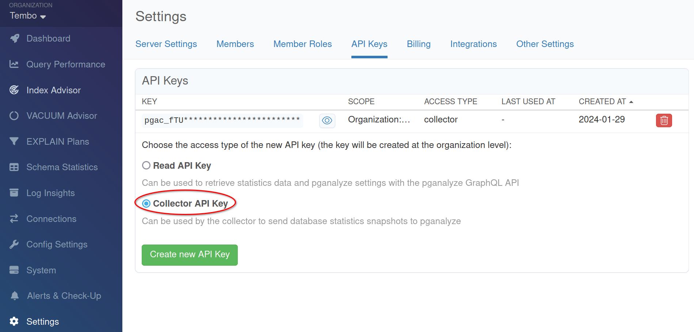
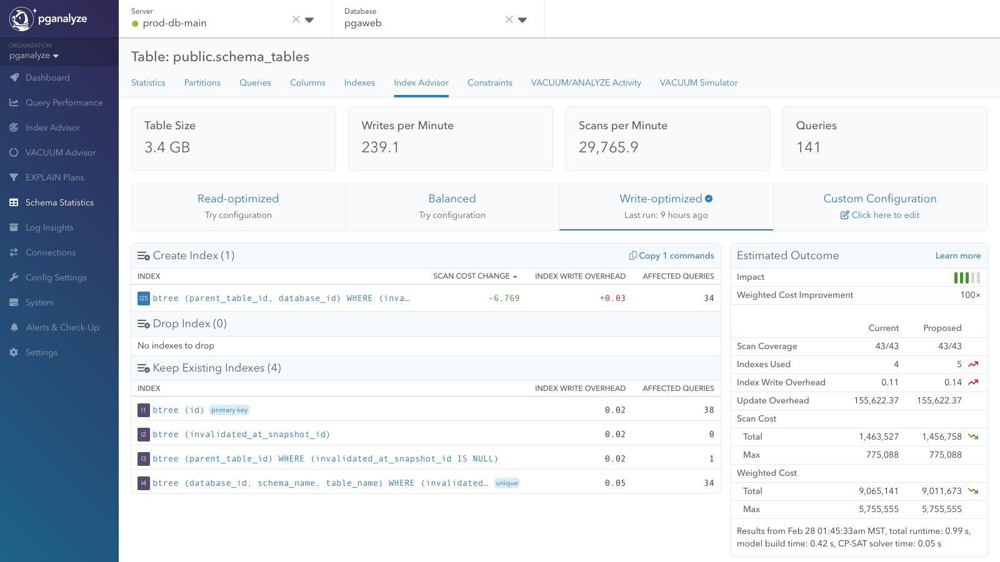
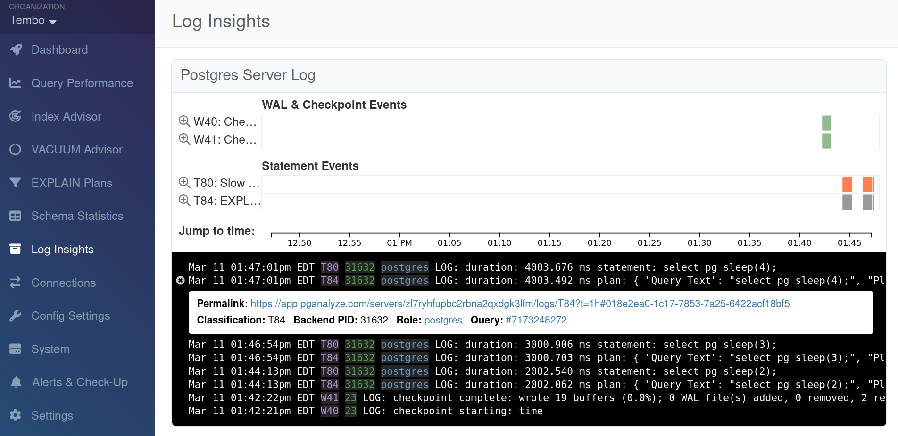

At Tembo, we’ve been building a world-class, developer friendly managed Postgres solution. We’re excited to announce
Tembo Cloud now integrates seamlessly with pganalyze - a powerful tool that helps you understand and optimize your
Postgres performance. With this integration, you can now easily monitor, analyze your Tembo Cloud Postgres instance with
detailed insights into your database performance and configure alerts to receive notifications about the same.

# What is pganalyze?
pganalyze helps you deliver consistent database performance and availability through intelligent tuning advisors and
continuous database profiling. It provides Postgres configuration recommendations, helps identify slow queries, track
query performance over time, and understands the overall health of your database.

pganalyze has a wide range of features that help you understand and optimize your Postgres database. Key features
include:

- Index Advisor
- EXPLAIN Plans
- Log Insights
- System Metrics
- Alerts and Check-Up

# Connecting your Tembo Instance to pganalyze
Connecting your Tembo Cloud instance to pganalyze is simple and can be done in a few clicks.

[//]: # (TODO: Add screenshots for each step)

## Step 1: Sign up for pganalyze
If you don’t already have a pganalyze account, you can sign up for a free trial at [pganalyze.com](https://pganalyze.com/).

## Step 2: Obtain your pganalyze API Key
Once you have signed up for pganalyze, you will need to obtain your pganalyze API key. You can find your API key in the
pganalyze dashboard under the “Settings” section. Copy your API key to use in the next step.

## Step 3: Activate the pganalyze App in Tembo Cloud
To connect your Tembo Cloud instance to pganalyze, you will need to activate the pganalyze App for your instance.

1. Log in to Tembo Cloud at [cloud.tembo.io](https://cloud.tembo.io/).
2. Select the instance you want to connect to pganalyze.
3. Click on the “Apps” tab in the instance details page.
4. Submit your pganalyze API key in the “API Key” section and click “Activate”.

Once activated, pganalyze will start collecting and analyzing your database performance data. You can access your pganalyze
dashboard by clicking on the “pganalyze app” button.

pganalyze will automatically start collecting and analyzing your database performance data, and provide you
with detailed insights into your database performance.

# Tuning Advisors
Some of the most useful features in pganalyze are its tuning advisors. The Index Advisor and VACUUM Advisor help you optimize
your database performance by providing recommendations for creating and maintaining indexes and optimizing table bloat.

## Index Advisor
The pganalyze Index Advisor automatically detects missing indexes and recommends single and multi-column indexes that
improve query performance across your databases. These index recommendations are based on your database schema, statistics,
and query workload. In addition to recommending new indexes, the Index Advisor also provides insights into existing indexes
and why they may actually be ignored. This can be particularly useful for identifying whether a slow query is indexed
properly.

## VACUUM Advisor
Optimizing VACUUM is critical for maintaining peak Postgres performance, but it can be a complex and time-consuming task.
The VACUUM Advisor provides insights and recommendations based on the following key metrics such as autovacuum
efficiency, dead rows, and table bloat. It does this by scanning each table's statistics and combining them with the
Postgres logs to provide you with a holistic view of bloat, freezing and individual tables. To ensure proactive monitoring,
pganalyze provides alerts related to these insights.

[//]: # (screenshot)

# Log Insights
pganalyze provides detailed insights into your database logs, including slow queries, errors, and other important events.
To make this possible on Tembo Cloud, we've made some contributions to the open source [pganalyze collector](https://github.com/pganalyze/collector/).
This allows pganalyze to collect logs from your Tembo Cloud instance and provide you with detailed insights into your database logs.

With Log Insights enabled, we can make use of other powerful features, such as EXPLAIN Plans.

# EXPLAIN Plans
pganalyze simplifies viewing EXPLAIN plans by integrating with the auto_explain extension. It highlights crucial
information in query plans, making important data more noticeable. To make this integration as seamless as possible, we
automatically modify configs and extensions in your Tembo instance. More details about this feature can be found in the 
[pganalyze documentation](https://pganalyze.com/docs/explain).

# Alerts and Check-Up
pganalyze also provides powerful alerting and notification features that help you stay on top of your database performance.
You can set up custom alerts based on query performance, system metrics, and other important events. pganalyze will
notify you when an alert is triggered, so you can take action to resolve any issues.

Alerts can be configured to send notifications via email, Slack, and PagerDuty, so you can stay informed about your Tembo
instance no matter where you are.

# Conclusion
We’re excited to bring pganalyze to Tembo Cloud, and we’re confident that this integration will help you better understand
and optimize your Postgres database. With detailed insights into your database performance, you can make informed decisions
to optimize your database performance and improve the overall health of your database.

If you have any questions or need help getting started with pganalyze on Tembo Cloud, please don’t hesitate to reach out to
our support team. We’re here to help you get the most out of your Tembo Cloud Postgres instance.
