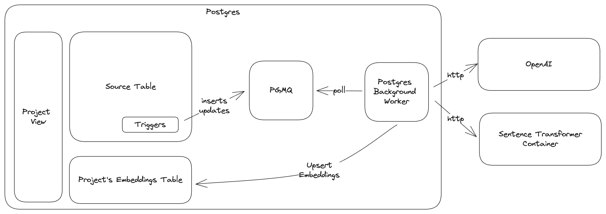
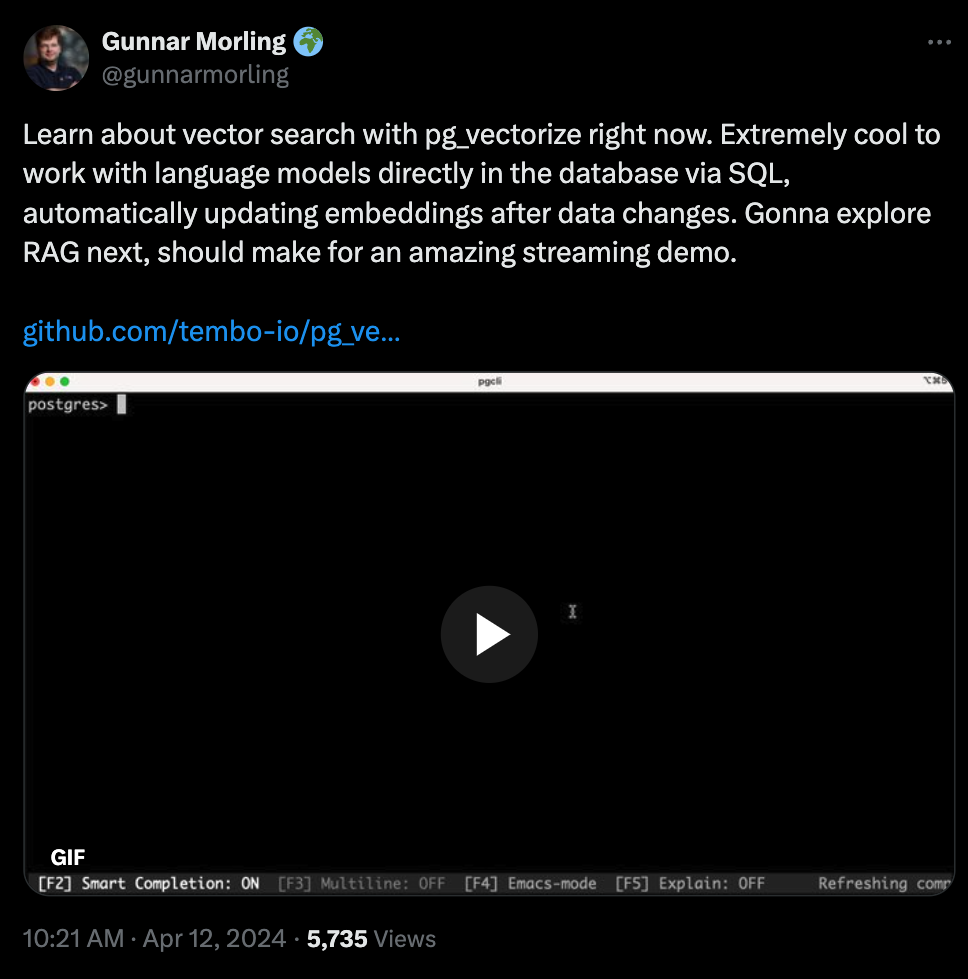

Why do we need vector databases? The proliferation of embeddings immediately brought forth the need to efficiently store, index, and search these arrays of floats.
 However, these steps are just a small piece of the overall technology stack required to make use of embeddings.
 The task of transforming source data to embeddings and the serving of the transformer models that make this happen is often left as a task to the application developer.
 If that developer is part of a large organization, they might have a machine learning or data engineering team to help them.
 But in any case, the generation of embeddings is not a one-time task, but a lifecycle that needs to be maintained.
 Embeddings need to be transformed on every search request, and inevitably the new source data is generated or updated, requiring a re-compute of embeddings.

## Consistency between model training and inference

Traditionally, machine learning projects have two distinct phases: training and inference.
 In training, a model is generated from a historical dataset.
 The data that go into the model training are called features, and typically undergo transformations.

At inference, the model is used to make predictions on new data.
 The data incoming into the model for inference requires precisely the same transformations that were conducted at training.
 For example in classical ML, imagine you have a text classification model trained on [TF-IDF](https://en.wikipedia.org/wiki/Tf%E2%80%93idf) vectors.
 At inference, any new text must undergo the same preprocessing (tokenization, stop word removal) and then be transformed into a TF-IDF vector using the same vocabulary as during training.
 If there's a discrepancy in this transformation, the model's output will be unreliable.

Similarly, in a vector database used for embedding search, if you're dealing with text embeddings, a new text query must be converted into an embedding using the same model and preprocessing steps that were used to create the embeddings in the database.
 Embeddings stored in the database using OpenAI's text-embedding-ada-002 model must also be searched using the same text-embedding-ada-002 model in order to produce a comparable embedding vector for search.

It is not enough to just store embeddings in a database. To operationalize the vector database, you must also have a process to transform new data into embeddings and to serve the embeddings for search.

### Generating and searching embeddings

[pg_vectorize](https://github.com/tembo-io/pg_vectorize) solves this problem by keeping track of the transformer model was used to generate embeddings.


___
To follow along with code, you can start a VectorDB instance for free on [Tembo Cloud](https://cloud.tembo.io) or run the [docker-compose](https://github.com/tembo-io/pg_vectorize?tab=readme-ov-file#installation) example locally.
 Refer to our [detailed guide](https://tembo.io/docs/product/stacks/ai/vectordb) for a more in-depth walkthrough of pg_vectorize and the VectorDB Stack
___

If you want to generate embeddings using an open source the Apache-2.0 licensed [all-MiniLM-L6-v2](https://huggingface.co/sentence-transformers/all-MiniLM-L6-v2) sentence transformer, you can initialize your project like so:

```sql
SELECT vectorize.table(
    job_name    => 'my_product_search_project',
    "table"     => 'products',
    primary_key => 'product_id',
    columns     => ARRAY['product_name', 'description'],
    transformer => 'sentence-transformers/all-MiniLM-L6-v2',
    schedule    => 'realtime'
);
```

This will create a new table in the `vectorize` schema and immediately begin to fill it with the embeddings generated by the `all-MiniLM-L6-v2` model.

To search the table using the embeddings, you can use the `vectorize.search` function:

```sql
SELECT * FROM vectorize.search(
    job_name       => 'my_product_search_project',
    query          => 'accessories for mobile devices',
    return_columns => ARRAY['product_id', 'product_name'],
    num_results    => 3
);
```

```plaintext
                                    search_results                                        
---------------------------------------------------------------------------------------------
{"product_id": 13, "product_name": "Phone Charger", "similarity_score": 0.8147814132322894}
{"product_id": 6, "product_name": "Backpack", "similarity_score": 0.7743061352550308}
{"product_id": 11, "product_name": "Stylus Pen", "similarity_score": 0.7709902653575383}
```

pg_vectorize keeps track of which transformer is used for each job_name, so when we want to search `my_product_search_project`, it will use the same transformer to generate embeddings for the query.

If you want to view all your source data and the embeddings side-by-side, pg_vectorize creates a view for you.

```sql
SELECT * FROM vectorize.my_product_search_project
```

The view contains everything from your original table, plus the embeddings and the last time they were updated.

```plaintext
\d vectorize.my_product_search_project;
                        View "vectorize.my_product_search_project"
        Column         |           Type           | Collation | Nullable | Default 
-----------------------+--------------------------+-----------+----------+---------
product_id            | integer                  |           |          | 
product_name          | text                     |           |          | 
description           | text                     |           |          | 
last_updated_at       | timestamp with time zone |           |          | 
embeddings            | vector(384)              |           |          | 
embeddings_updated_at | timestamp with time zone |           |          | 
```

As an application developer, you can move the `vectorize.table` call into your SQL migration scripts, then call `vectorize.search` in your application code to search the embeddings.

## Day 2 operations for embeddings

Inevitably, the source data will change. New data will be added, old data will be updated, and the embeddings will need to be re-computed.
 The process of transforming source data into embeddings is not a one-time task, but a continuous cycle that needs to be managed.

pg_vectorize provides two ways of managing transformations; an interval-based cron-like schedule via pg_cron, or a real-time trigger-based approach.
 In both methods, pg_vectorize enqueues jobs into a queue using [pgmq](https://github.com/tembo-io/pgmq) and a background worker handles the transformations.
 In the case of OpenAI embeddings, that means HTTP requests to OpenAI's public API. For Hugging Face Sentence Transformers, HTTP requests are made to a container that hosts the sentence-transformer models.
 On Tembo Cloud, this container runs in a pod in the same namespace as your Postgres instance. If you're running the open-source pg_vectorize project on your own, the [docker-compose](https://github.com/tembo-io/pg_vectorize/blob/main/docker-compose.yml) file
 will start this container next to Postgres for you. In both cases, pg_vectorize is pre-configured to reach these endpoints.

Below is the process of updating embeddings with a trigger-based flow. The cron based update flow is identical, except that a pg_cron job checks for updates rather than a trigger.



Many thanks to [Gunnar Morling](https://twitter.com/gunnarmorling/status/1778805731933790225) who recently demonstrated this trigger based update flow on X.

[](https://twitter.com/gunnarmorling/status/1778805731933790225)

## Flexibility and rapid iteration

The ability to quickly change the transformer model used to generate embeddings is highly valuable.
 New transformer models are constantly being developed embeddings need to be consistent between initial project set up and search time.
 As of this writing, OpenAI has three [embedding models](https://platform.openai.com/docs/guides/embeddings),
 and [Hugging Face](https://huggingface.co/models) supplies hundreds of open source text embedding models.

### Text Embedding Model Sources

pg_vectorize supports all of OpenAI's transformer models and all [Sentence Transformer](https://huggingface.co/sentence-transformers) models available on Hugging Face — including any private models you may have trained and updated to the model hub.

To take our example above and instead use one of OpenAI's embedding models, we simply change the `transformer` parameter.
 Note, OpenAI also requires an API key, so we will set that first:

```sql
ALTER SYSTEM SET vectorize.openai_key TO '<your api key>';
SELECT pg_reload_conf();
```

```sql
SELECT vectorize.table(
    job_name    => 'product_search_openai',
    "table"     => 'products',
    primary_key => 'product_id',
    columns     => ARRAY['product_name', 'description'],
    transformer => 'openai/text-embedding-ada-002',
    schedule    => 'realtime'
);
```

Now we can search our data using the same `vectorize.search` function call as before, but specifying the new `job_name`.

```sql
SELECT * FROM vectorize.search(
    job_name        => 'product_search_openai',
    query           => 'accessories for mobile devices',
    return_columns  => ARRAY['product_id', 'product_name'],
    num_results     => 3
);
```

Meanwhile, our original embeddings are still available.

```sql
SELECT * FROM vectorize.search(
    job_name        => 'my_product_search_project',
    query           => 'accessories for mobile devices',
    return_columns  => ARRAY['product_id', 'product_name'],
    num_results     => 3
);
```

### Transforming text to embeddings directly

We can also transform text directly by calling `vectorize.transform_embeddings`.

```sql
select vectorize.transform_embeddings(
    input       => 'the quick brown fox jumped over the lazy dogs',
    model_name  => 'sentence-transformers/all-MiniLM-L6-v2'
);
```

```plaintext
{0.032561734318733215,0.09281901270151138, ... ( omitted for formatting), 0.07227665930986404}
```

Using `transform_embeddings` directly is useful if you want to do any complex joins or further transformations on your query.
 For example, we can manually re-create the underlying SQL that is executed when we call `vectorize.search`:

```sql
SELECT 
    product_name,
    description,
    1 - (
        product_search_all_MiniLM_L6_v2 <=>
        vectorize.transform_embeddings('mobile electronic devices', 'sentence-transformers/all-MiniLM-L12-v2')::vector
    ) as similarity
FROM products
ORDER by similarity DESC
LIMIT 3;
```

## What's next?

We are continuing to work on improving pg_vectorize and the VectorDB Stack at Tembo.
 Additional embedding model sources (such as Ollama) and a more complete RAG API are in the works.
 The pg_vectorize extension is open source and available on [GitHub](https://github.com/tembo-io/pg_vectorize).
 If you find any issues or just want to talk to us, open an issue, pull request, or join our community [Slack](https://join.slack.com/t/tembocommunity/shared_invite/zt-293gc1k0k-3K8z~eKW1SEIfrqEI~5_yw).

Join us at the [Silicon Valley Postgres Meetup](https://www.meetup.com/silicon-valley-postgres/events/300397011) on April 30th, 2024 if you're interested in learning more on this topic.
