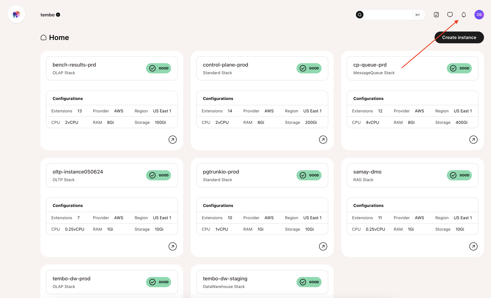
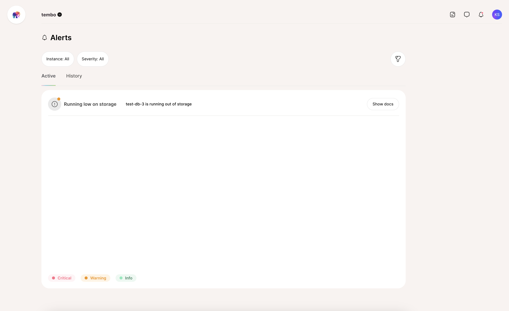
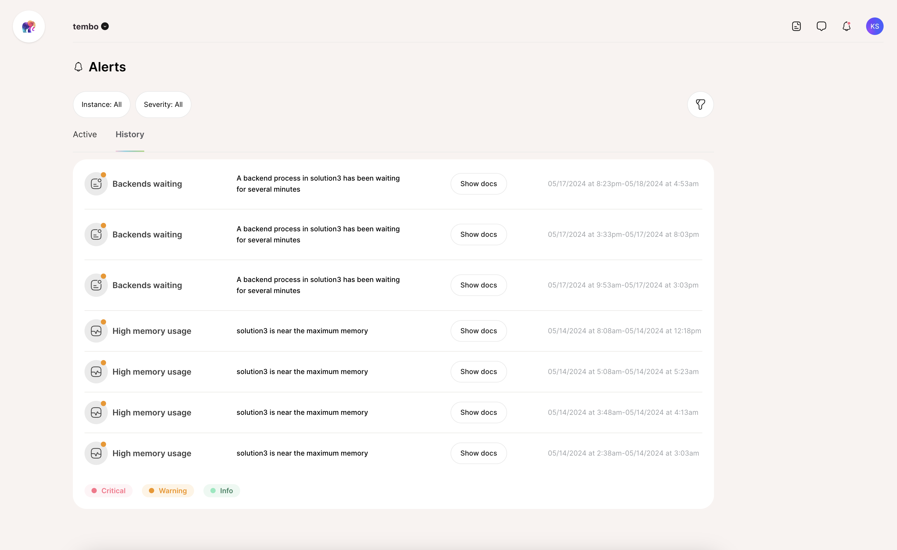
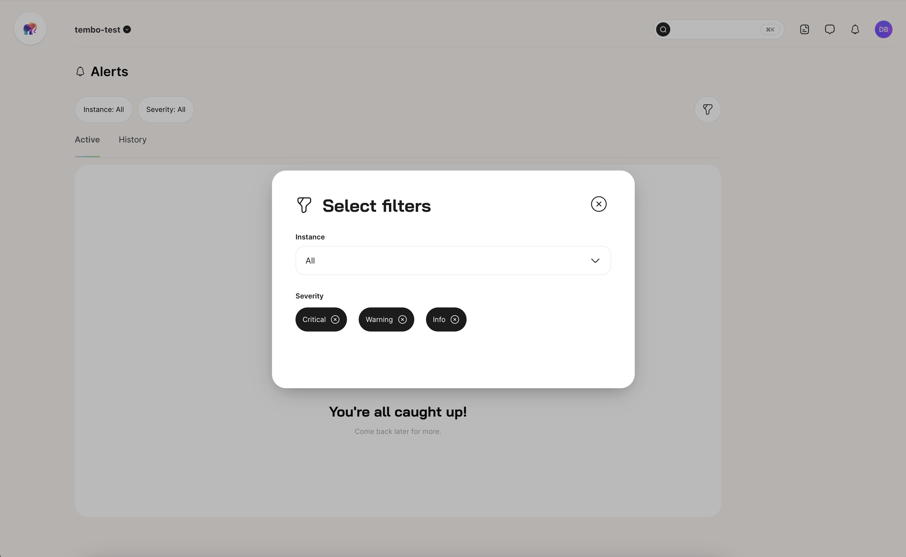

We at Tembo know it's not always easy to keep track of the many components behind a busy cloud application stack. With Postgres filling the critical role of application data storage, it's important to always know everything is working properly. DBAs, devs, and product owners of all description _need_ the ability to preemptively address potential concerns before they cause an outage.

So we are proud to announce that we're bringing an alert management UI to our cloud platform. Our [Performance metrics dashboard](/docs/product/cloud/metrics) has been available for a while now, and is crucial to monitoring instances at a glance. Now our library of standard [Alerts](/docs/product/cloud/alerts) will be part of the big, happy family as well.

Let's discuss a bit of how some of these work---especially some of the more esoteric fare!

## The tried and true

Like all good system monitoring and alerting stacks, Tembo provides a common baseline of alerts many have come to expect. Some examples include:

-   Low storage space
-   High CPU usage
-   High RAM usage

These are the normal items admins tend to consider purely as a general measure of health. Is storage running low? Are we saturating the CPU or RAM on the system and need to increase the instance size? No? Great! If any one of these alerts have been triggered, it's probably time to investigate further.

## Dominant database disclosures

Next we consider the less obvious alerts commonly associated with databases. While not exactly cryptic, those unfamiliar with database engines or Postgres specifically, may need a bit of additional context. So let's discuss a few of these.

### Backends waiting

Postgres likes to proclaim that readers cannot block writers, and writers cannot block readers thanks to its implementation of [Multi-Version Concurrency Control](https://www.postgresql.org/docs/current/mvcc-intro.html). Unfortunately for us, writers can still block other writers, and actions that require an exclusive lock such as structurally modifying a table, may need to wait to acquire that lock.

Left unchecked, this can sometimes lead to a kind of logjam effect where a process waiting for an exclusive lock will block further sessions, and suddenly everything stops. Wouldn't it be nice if the platform told us when that might be happening?

This alert ensures we're informed if any query is "stuck" for more than five minutes, and we can step in and intervene before things reach that point.

### Replication lag

Many clients choose to leverage the Tembo [high availability](/docs/product/cloud/configuration-and-management/high-availability) feature and deploy two or more database instances in the same cluster. The goal here is to have a standby step in for the primary if there's ever some kind of outage. It's also possible such a standby can fulfill [read requests](/docs/product/cloud/configuration-and-management/read-from-standby) to reduce traffic to the primary instance.

But this becomes less and less effective if the standby isn't fully synchronized with the primary. The primary tries to transmit all changes to the standby so it can apply them, but this doesn't always happen in a timely manner. The more lag the standby incurs, the less accurate read-queries on the standby may become. Failing over to a standby with high amounts of lag may also result in data loss.

This alert will let us know if a standby system is over 400s, or just over six minutes behind the primary node. This usually indicates there's a problem that needs intervention.

### Failover detected

Assuming we've deployed a standby node, it's probably also a good idea to know if we've ever needed to use it! In the event of a failover, the Tembo cloud platform will terminate any connections to the old primary node and promote the standby to primary status. This process has [several implications](https://www.postgresql.org/docs/current/warm-standby-failover.html), so it's important we know any time this has happened.

If we have a client SLA or guarantee a specific uptime, it's important to know how many times the database was down, and for how long. Failovers count against this total, even if the transition is very quick.

### Deadlock conflicts

Deadlocks have been the [bane of developers](https://en.wikipedia.org/wiki/Deadlock) since the dawn of programming. Like many other database engines, Postgres has a [deadlock detection system](https://www.postgresql.org/docs/current/runtime-config-locks.html#GUC-DEADLOCK-TIMEOUT) where it will terminate any queries which hold mutually exclusive locks too long. It will continue to do this until no deadlocks are detected.

This alert will let us know when ten deadlocks are detected in any database. This is often a sign we're not locking objects in the same order in all places where they're used, or not using enough preemptive optimistic locking to prevent deadlocks. This is an important alert to watch!

## Postgres Particular

Lastly come the truly arcane alerts which fall under the domain of well-versed Postgres practitioners. These alerts are specific to Postgres in a way that its implementation directly influences what the alert means, and why it exists. Let's explore...

### Excessive WAL size

The Postgres data directory contains a folder named `pg_wal` where it stores the Write Ahead Log (WAL) files necessary for crash recovery. These files are also used for backup, restore, Point in Time Recovery (PITR), logical replication, and several other uses. They're the proverbial Swiss-Army knife of Postgres data integrity, and all data must be written to the WAL before it is ever committed to the database.

So it's no surprise that Tembo monitors the WAL directory fairly closely! In normal circumstances, the size of WAL folder will remain lower than [max_wal_size](https://www.postgresql.org/docs/current/runtime-config-wal.html#GUC-MAX-WAL-SIZE). This alert exists for the rare exceptions where the WAL folder represents a disproportionate amount of the entire database instance.

This alert should trigger if the WAL directory ever eclipses 30% of the total pod size.

### Frozen XIDs

Postgres is extremely serious about [routine maintenance](https://www.postgresql.org/docs/16/routine-vacuuming.html) for a few reasons. Due to the Postgres implementation of MVCC, database files contain both old and new row versions. Row versions are marked with the transaction id (XID) that created them, making it trivial to determine row visibility by transaction.

This is done with a signed 32-bit integer, so there are normally only about 2-billion available transaction ID markers. Postgres doesn't run out of these because it continuously cycles this list of 2-billion values in a giant loop. In order to do this, Postgres has a concept of "frozen" rows that works like this:

1. A `VACUUM FREEZE` process starts and is assigned a transaction ID.
2. If a row is not visible to transactions older than this, its XID identifier is purged.
3. This makes the row visible as if it were the first version introduced.

Thus if we had row versions with transactions 1, 500, and 10000, and we start a vacuum freeze at 10001, they would all be reset to an effective transaction number of 0. That would make 10001 the new "0" since we can use values 10002 to 2-billion, and 2-billion to 10000. Neat, eh?

But imagine if a transaction never commits and sits idle for hours or days. Or maybe there's a rogue query that is missing a join condition or critical predicate and becomes a [Cartesian Product](https://en.wikipedia.org/wiki/Cartesian_product). Perhaps an application bug didn't clean up a [prepared transaction](https://www.postgresql.org/docs/current/sql-prepare-transaction.html). Any of these can effectively "hold" old transactions so the `VACUUM FREEZE` can't reclaim these old XIDs. If that happens, our effective XID horizon can reach 1-billion or higher. If our system is a high transaction OLTP service, that could be a huge problem! Postgres will preemptively shut down at a certain point to prevent XID wraparound, and then fixing it requires manual intervention.

This alert will go off once the effective XID age reaches 1-billion transactions. At that point, we need to check for old transactions, queries, and other sources that could be preventing cleanup. We may even need to run `VACUUM FREEZE` manually if we're close to the theoretical 2-billion emergency limit and want to prevent Postgres from enacting a defensive shutdown.

## Viewing your Alerts on Tembo Cloud

The [Tembo Cloud dashboard UI](https://cloud.tembo.io) has a page made specifically for viewing your entire organizations Alerts. Navigate to it via the "bell" icon in the upper right of the dashboard nav:

### Active Alerts

"Active Alerts" are alerts that currently have a "firing" state in the last 15 minutes.

### Historical Alerts

"Historical Alerts" are alerts that fired within the past 30 days.

### Filtering

If you wish to view your Alerts at an even deeper level of specificity, they can also be filtered by their level (`Critical`, `Warning`, `Info`) or per database instance.

## Final Words

This wasn't an exhaustive list of the alerts we support in the Tembo cloud platform. But we feel this is a good assortment of common and _critically important_ alerts where familiarity pays unexpected dividends. Combined with our Metrics, you should have all the necessary tools to ensure a healthy and happy Postgres database environment long into the future.

If you think there are other alerts we should include that are not already part of our [Alerts documentation](/docs/product/cloud/alerts), please let us know at [support@tembo.io](mailto:support@tembo.io)!
