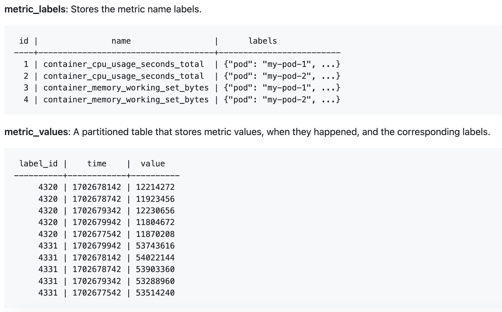

On [Tembo Cloud](https://cloud.tembo.io), you can see the status of your database with a **Good** or **Error** icon.


We needed a simple and efficient way to store metrics data in our PostgreSQL database.

### Prometheus data

At Tembo, we are using Prometheus to collect metrics data from our systems.

Prometheus collects metrics data by performing HTTP GET requests to metric endpoints on a schedule. Metrics endpoints display current metric values, and Prometheus remembers the data collected on each GET request.

```
pg_isready{"instance_id"="inst_1704307947520_WRlT82_1"} 1
pg_isready{"instance_id"="inst_1710645460091_zDBrD1_5"} 0
```
- _Example metrics endpoint, returning one metric with two sets of labels. This data represents the Postgres availability status at the the current time for two Tembo instances._

Prometheus stores metrics as **time series data**, where each time series is a timestamp and value tuple associated to a set of labels. In the below example, we can see an excerpt of a Prometheus API response, which includes a time series for each instance, each with a timestamp and value.

```json
[
  {
    "metric": {
      "name": "pg_isready",
      "instance_id": "inst_1704307947520_WRlT82_1"
    },
    "values": [
      [1711997495, "0"],
      [1711997595, "1"],
      [1711997695, "0"]
    ]
  },
  {
    "metric": {
      "name": "pg_isready",
      "instance_id": "inst_1710645460091_zDBrD1_5"
    },
    "values": [
      [1711997495, "0"],
      [1711997595, "0"],
      [1711997695, "1"]
    ]
  }
]
```

## Storing metrics data in Postgres

In order to power Tembo Cloud features based on our metrics data, we needed a simple and efficient way to store Prometheus data in PostgreSQL.

A simple data model for storing any Prometheus data looks like this:



This data model allows us to store all metrics data in a table **metric_values**, which we can optimize for time series data. Each row includes the timestamp, metric value, and a reference to the set of labels and metric name for that data point. In the **metric_labels** table, each row is unique by `(name, labels)`, so that we know which metric name and set of labels each data point has.

### Cardinality

If you're familiar with metrics systems like Prometheus, you are likely familiar with _Cardinality_. Cardinality means how many different sets of labels there may be for any given metric.

For example, consider a hypothetical metric like this
```
failed_queries{"instance_id"="inst_1704307947520_WRlT82_1", database="postgres"} 11
failed_queries{"instance_id"="inst_1704307947520_WRlT82_1", database="foobar"} 1
failed_queries{"instance_id"="inst_1704307947520_WRlT82_1", database="example"} 1
failed_queries{"instance_id"="inst_1704307947520_WRlT82_1", database="another-db"} 1
```
In this case, the metric is tracking the number of failed queries per instance, per database within each instance. This metric may have high _cardinality_ because of the label **database**. If an instance has a lot of different databases, for example hundreds or thousands, this could be a lot of unique label sets. Consider how many values for database would impact the table **metric_labels**. There would need to be a unique row for each set of labels.

```
1 | failed_queries | {"instance_id"="inst_1704307947520_WRlT82_1", database="postgres"}
2 | failed_queries | {"instance_id"="inst_1704307947520_WRlT82_1", database="foobar"}
3 | failed_queries | {"instance_id"="inst_1704307947520_WRlT82_1", database="example"}
4 | failed_queries | {"instance_id"="inst_1704307947520_WRlT82_1", database="another-db"}
```

We can reduce cardinality by only aggregating our data by the dimensions we care about most. In this case, we can aggregate by **instance_id**, so we don't need to have a separate set of labels for each `(instance_id, database)`.

### Creating our metrics tables

To manage and control cardinality, we focus on specific labels required by our application. Here's our simplified model, only remembering the metric name and instance ID in order to keep our metrics simple:

```
metric_labels table:

 id |               name                |      instance_id
----+-----------------------------------+------------------------
  1 | pg_isready                        | inst_1704307947520_WRlT82_1
  2 | pg_failed_queries                 | inst_1704307947520_WRlT82_1
  3 | pg_isready                        | inst_1710645460091_zDBrD1_5
  4 | pg_failed_queries                 | inst_1710645460091_zDBrD1_5
  ... delete label sets that don't correspond to any metric values


metric_values table:

 label_id |        time         |   value
----------+---------------------+-----------
        1 | 2024-05-15 10:01:00 | 1
        2 | 2024-05-15 10:01:00 | 15
        3 | 2024-05-15 10:01:00 | 1
        4 | 2024-05-15 10:01:00 | 0
        1 | 2024-05-15 10:00:00 | 1
        2 | 2024-05-15 10:00:00 | 11
        3 | 2024-05-15 10:00:00 | 0
        4 | 2024-05-15 10:00:00 | 0
        ... data older than 90 days can be deleted
```

Queries are efficient on [partitioned data](https://www.postgresql.org/docs/current/ddl-partitioning.html) because queries that specify a time-based filter, for example "find instances that have been down in the last day" can skip all the partitions of **metric_values** that are outside of that range. We use [pg_partman](https://pgt.dev/extensions/pg_partman) for managing partitions in PostgreSQL.

We will also use [pg_cron](https://pgt.dev/extensions/pg_cron) to clean up unused rows in the **metrics_labels** table.

Here's exactly how those tables were set up:

```sql
-- Create the metric_labels table, unique by (metric name, instance ID)
CREATE TABLE metric_labels (
    id SERIAL PRIMARY KEY,
    name TEXT NOT NULL,
    instance_id TEXT NOT NULL REFERENCES instances (instance_id),
    CONSTRAINT unique_metric_label UNIQUE (name, instance_id)
);

CREATE INDEX idx_metric_labels_name ON metric_labels (name);
CREATE INDEX idx_metric_labels_instance_id ON metric_labels (instance_id);

CREATE TABLE metric_values (
    label_id INTEGER REFERENCES metric_labels (id),
    time TIMESTAMP NOT NULL,
    value INTEGER NOT NULL
) PARTITION BY RANGE (time);

-- Index on the partition key
CREATE INDEX idx_metric_values_time ON metric_values (time);
CREATE INDEX idx_metric_values_label_id ON metric_values (label_id);

-- Enable automatic partitioning with pg_partman
SELECT create_parent('public.metric_values', 'time', 'native', '1 day');

-- Configure retention policy for metric_values to keep partitions for 90 days
UPDATE part_config
    SET retention = '90 days',
        retention_keep_table = false,
        retention_keep_index = false,
        infinite_time_partitions = true
    WHERE parent_table = 'public.metric_values';
```

The **pg_partman** configuration automatically deletes metric values that are older than 90 days old. To keep the `metric_labels` table clean, we schedule a daily job to delete unused labels using **pg_cron**:

```sql
CREATE OR REPLACE FUNCTION delete_unused_metric_labels() RETURNS void AS $$
BEGIN
    DELETE FROM metric_labels
    WHERE id NOT IN (
        SELECT DISTINCT label_id
        FROM metric_values
    );
END;
$$ LANGUAGE plpgsql;

-- Schedule the delete_unused_metric_labels function to run daily at 8:00 AM
SELECT cron.schedule('0 8 * * *', 'SELECT delete_unused_metric_labels()');
```

Leveraging **pg_partman** and **pg_cron**, we now have a simple way of efficiently storing metrics.

## Tembo Timeseries Stack

Postgres can efficiently store and query time series data. However, it's a lot of boilerplate code you are likely to repeat in each case to manage your partions. That's where the [Tembo Time Series Stack](/docs/product/stacks/analytical/timeseries) comes in.

The **Tembo Time Series Stack** can help you set up partitioned tables in a simpler way compared to using **pg_partman** directly. This is powered by the extension [pg_timeseries](https://pgt.dev/extensions/pg_timeseries).

```sql
-- Creating our partitioned table in the same way as the previous example
CREATE TABLE metric_values (
    label_id INTEGER REFERENCES metric_labels (id),
    time TIMESTAMP NOT NULL,
    value INTEGER NOT NULL
) PARTITION BY RANGE (time);

-- Optimize a partitioned table for time series,
--   in a simpler way than the previous example
SELECT enable_ts_table(
  'metric_values',
  partition_duration := '1 day',
  initial_table_start := '2020-01-01');
```

The Time Series Stack also includes commonly required time series features, for example compression of old data, promoting data to S3, querying data from S3, and time-based metric queries. Please read more about the Time Series Stack in our [documentation](/docs/product/stacks/analytical/timeseries).
