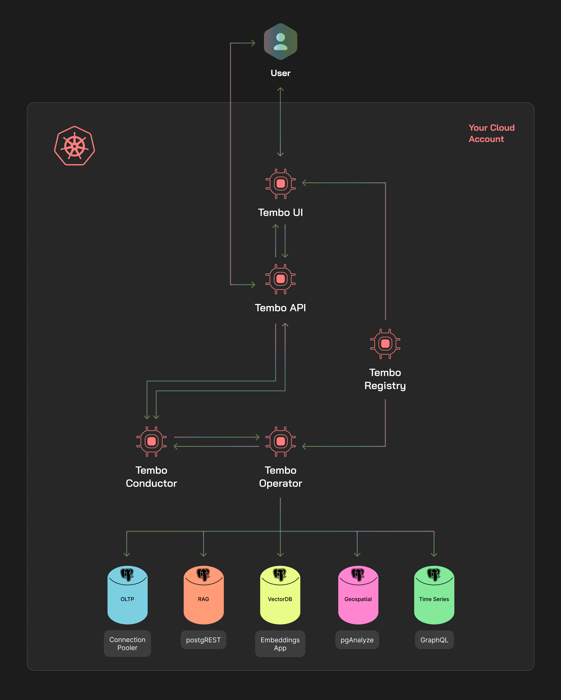

There are several benefits to running your databases on a fully-managed database platform like [Tembo Cloud](https://cloud.tembo.io/). You don’t
have to manage the infrastructure, your provider can optimize the database and its operations, and you reduce the amount
of time and resources you need to spend to run your databases. While this works for a number of users, many still
prefer to run databases in an environment they control.

At Tembo, we want to enable _every_ Postgres user to use the [extended Postgres ecosystem](https://tembo.io/blog/tembo-manifesto) to its fullest. With that goal
in mind, we are excited to announce [Tembo Self Hosted](https://tembo.io/docs/product/software/tembo-self-hosted/overview),
a new product that brings the full power of Tembo Cloud to your
Kubernetes cluster. Tembo Self Hosted allows you to easily spin up 'flavored' PostgreSQL instances i.e.
[Stacks](https://tembo.io/docs/product/stacks/intro-to-stacks) across multiple
versions using its intuitive UI, [API](https://tembo.io/docs/development/api) and [CLI](https://tembo.io/docs/development/cli/getting_started).
This allows you to configure, scale and monitor Postgres instances with access to [200+ extensions](https://pgt.dev/)
and 10+ Stacks and Apps. All this with flexibility and full control over:

-   Infrastructure and Application Configuration
-   Cloud / Kubernetes Provider
-   Cloud Region and Locality
-   Standards Adherence
-   Compliance and Network Security

In other words, it's now possible to run the Tembo Platform anywhere you have a [Kubernetes](https://kubernetes.io/) cluster. **_Fill out
our [contact form](https://forms.gle/8hSZMaNSjZ8gihh77) to get started!_**

## Tembo Self Hosted - A new way to consume all Tembo features

Tembo Self Hosted is a derivative of our SaaS, Tembo Cloud. Packaged and distributed as a
[Helm chart](https://github.com/tembo-io/tembo-self-hosted), it is designed to
be easily installed and managed within your Kubernetes cluster. With Self Hosted, you'll have access to the same
features you know and love from Tembo Cloud, but with the added control and security of running the software your way.
The platform includes the following components and features:

-   **Modern UI**: The web-based user interface for managing your Postgres instances.
-   **Developer friendly API**: The REST API for programmatic access to the Tembo Platform.
-   **Tembo CLI**: The command-line interface for interacting with the Tembo Platform.
-   **Tembo Operator**: The Kubernetes operator that manages the lifecycle of your Postgres instances.
-   **Tembo Monitoring**: Monitoring and alerting for your Postgres instances.
-   **Tembo Logging**: Log aggregation and analysis for your Postgres instances.
-   **Tembo Terraform Provider**: The Terraform provider for managing your Postgres instances as code.
-   **Trunk Extension Registry**: The extension registry that provides access to 200+ Postgres extensions.
-   **Tembo Stacks**: 'Flavored' Postgres instances for a variety of use-cases
-   **Tembo Apps**: Add-on applications that run alongside your Postgres instances

All of these features come together in a user-friendly way that lowers the bar for you
to address all your data use cases from [transactional](https://tembo.io/docs/product/stacks/transactional/oltp),
[vector](https://tembo.io/docs/product/stacks/ai/vectordb), [time series](https://tembo.io/docs/product/stacks/analytical/timeseries),
[machine learning](https://tembo.io/docs/product/stacks/ai/machine-learning),
[geospatial](https://tembo.io/docs/product/stacks/analytical/geospatial),
[OLAP](https://tembo.io/docs/product/stacks/analytical/olap), [data warehousing](https://tembo.io/docs/product/stacks/analytical/data-warehouse), and more.

### Simple Deployment in a Single Kubernetes Cluster

Tembo Self Hosted is designed to run in a single Kubernetes cluster, keeping the total cost of ownership low and making
for a simple and easy-to-manage deployment. The installation includes all the components you need to
run the Tembo Platform, so there's no need to consider things like ingress controllers, monitoring solutions, or logging
solutions.

_Tembo Self Hosted architecture. All operations run within your cloud account, offering the
experience of Tembo Cloud; this including the availability of extensions and Stacks, that can be augmented by utilizing
pre-packaged apps, such as pganalyze or postgREST._

## Deploy Tembo As You Choose

Both Tembo Cloud and Self Hosted leverage the same source code, which means that both options share the same interface
and feature set. However, depending on your requirements, one of them maybe the right fit.

If you prefer to have the least management overhead and the most optimized Tembo experience, then Tembo Cloud is the best
option. We manage your infrastructure, simplify your costs and wear the pager for when there are issues.

Alternatively, Tembo Self Hosted might be a better fit if you want high configurability, support for any cloud provider
or have specific security and compliance expectations. With Tembo Self Hosted, you can:

### Configure your environment

Tembo Self Hosted allows you to configure your environment as you see fit. While we ship with defaults,
you will be able to customize:

-   Kubernetes cluster sizing and scaling
-   Monitoring, alerting and logging configurations
-   Auth provider integration, such as Okta or AzureAD
-   Network policies
-   Resource limits and scaling parameters
-   Node assignments

### Use the Cloud Provider of Your Choice

Tembo Cloud does have support for [multiple clouds](https://roadmap.tembo.io/roadmap?id=2798765b-6a5e-41eb-876a-971d360966b4)
on its roadmap. However, Tembo Self Hosted can be used on any cloud provider (major or minor)
that supports Kubernetes.

### Your Standards and compliance

If you're in a regulated industry which has specific expectations around geographic placement, compliance, access
or data residency, Tembo Self Hosted might be a better fit. You can control who has access and how environments
are setup to meet your specific needs.

### Dedicated Support

While you manage your infrastructure, the Tembo team is still there to help. Tembo Self Hosted comes with a dedicated support
plan, which is prioritized according to case severity. This includes 24/7 coverage on the highest priority items to make sure you
and your team can leverage our expertise.

## Try Tembo Self Hosted Today!

Tembo Self Hosted is available now and several users are working with us to deploy Tembo in their Kubernetes clusters! If you're interested
in running the Tembo Platform in your own environment, **_fill out our [contact form](https://forms.gle/8hSZMaNSjZ8gihh77) or [schedule some time with us](https://calendly.com/ian-tembo) to get started!_** Our
team will work with you to understand your needs and help you get up and running.
