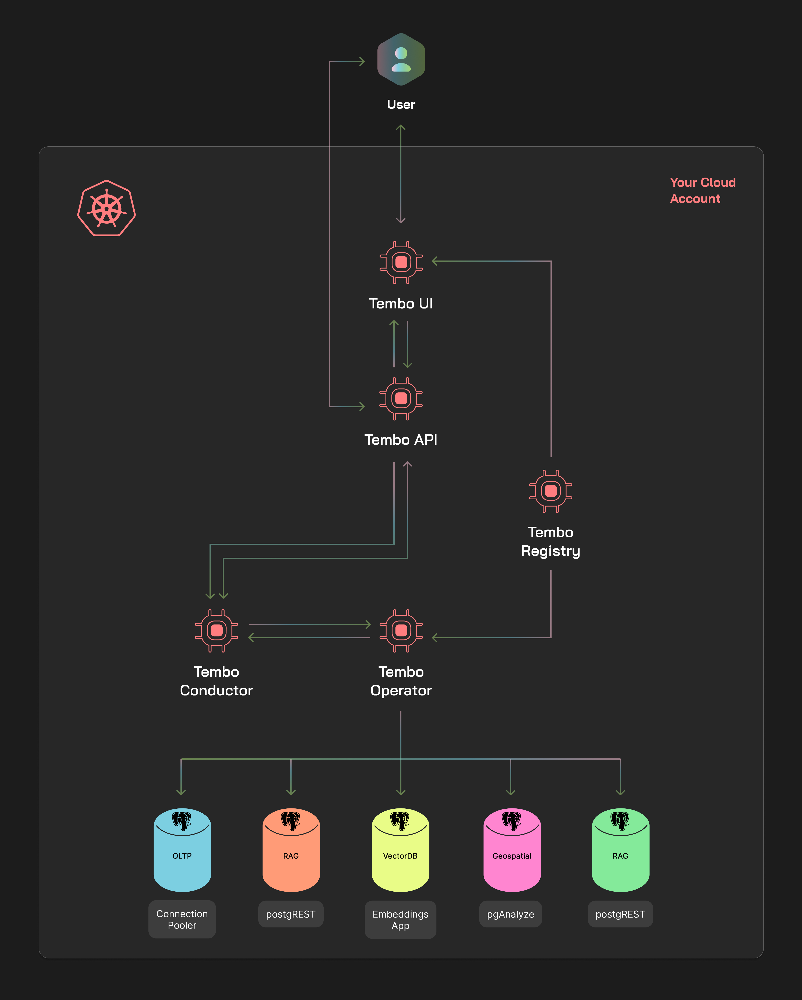

[//]: # (GOOD)
There are several benefits to running your databases on a fully-managed database platform like Tembo Cloud. You don’t
have to manage the infrastructure, your provider can optimize the database and its operations, and you reduce the amount
of time and resources you need to spend to run your databases. While this works for a large number of users, many still
prefer to run databases in an environment they control. This could be due to security and compliance requirements,
control over the infrastructure, predictable costs, or the desire to debug low level issues on their own.

At Tembo, we want to enable _every_ Postgres user to use the extended Postgres ecosystem to its fullest. With that goal
in mind, we are excited to announce Tembo Self Hosted, a new product that brings the full power of Tembo Cloud to your
Kubernetes cluster. Tembo Self Hosted allows you to easily spin up 'flavored' PostgreSQL instances across multiple
versions using its intuitive UI, API and CLI. This allows you to configure, scale and monitor Postgres instances with
access to 200+ extensions and 10+ Stacks and Apps. All this with flexibility and full control over:
- Infrastructure and Application Configuration
- Cloud / Kubernetes Provider
- Cloud Region
- Standards Adherence
- Compliance and Network Security

In other words, it's now possible to run the Tembo Platform anywhere you have a Kubernetes cluster!

## What's Included?

### Tembo Self Hosted Architecture
Tembo Self Hosted is a derivative of our SaaS, Tembo Cloud. Packaged and distributed as a Helm chart, it is designed to
be easily installed and managed within your Kubernetes cluster. With Self Hosted, you'll have access to the same
features you know and love from Tembo Cloud, but with the added control and security of running the software your way.
The platform includes the following components and features:

- **Tembo UI**: The web-based user interface for managing your Postgres instances.
- **Tembo API**: The REST API for programmatic access to the Tembo Platform.
- **Tembo Operator**: The Kubernetes operator that manages the lifecycle of your Postgres instances.
- **Tembo Monitoring**: Monitoring and alerting for your Postgres instances.
- **Tembo Logging**: Log aggregation and analysis for your Postgres instances.
- **Tembo CLI**: The command-line interface for interacting with the Tembo Platform.
- **Tembo Terraform Provider**: The Terraform provider for managing your Postgres instances as code.
- **Trunk Extension Registry**: The extension registry that provides access to 200+ Postgres extensions.
- **Tembo Stacks**: 'Flavored' Postgres instances with specific extensions and configurations.
  - **Vector**: Postgres optimized for vector data.
  - **Time Series**: Postgres optimized for time series data.
  - **Machine Learning**: Postgres optimized for machine learning.
  - **Geospatial**: Postgres optimized for geospatial data.
  - **OLAP**: Postgres optimized for online analytical processing.
  - **Data Warehousing**: Postgres optimized for data warehousing.
  - **And more!**
- **Tembo Apps**: Add-on applications that run alongside your Postgres instances.
  - **pganalyze**: A performance monitoring tool for Postgres.
  - **postgREST**: A REST API for Postgres.
  - **GraphQL**: A GraphQL API for Postgres.
  - **Embeddings**: Create open-source vector embeddings in Postgres.
  - **And more!**

Combined, these allow you to make use of use-case specific Stacks, which range from vector, time series, machine
learning, geospatial, OLAP, data warehousing, and more. Paired with Stacks are select add-on apps that you can run next
to your database, GraphQL, Rest API and even an embeddings model from Hugging Face. All of this comes together in a
user-friendly interface that both lowers the bar and grants more flexibility for you to configure as you like.

### One Simple Deployment
Tembo Self Hosted is designed to run in a single Kubernetes cluster, keeping the total cost of ownership low and making
for a simple and easy-to-manage deployment. The Tembo Self Hosted installation includes all the components you need to
run the Tembo Platform, so there's no need to consider things like ingress controllers, monitoring solutions, or logging
solutions.

_Tembo Self Hosted architecture. All operations run within your cloud account, offering the
experience of Tembo Cloud; this including the availability of extensions and Stacks, that can be augmented by utilizing
pre-packaged apps, such as pganalyze or postgREST._

Both Tembo Cloud and Self Hosted leverage the same source code, which means that both options share the same interface
and feature set. However, there are distinguishing factors that allow each offering to excel, according to user criteria.
Take Tembo Cloud, for example. If you prefer to have the least management overhead and the most optimized Tembo
experience, then this might be the best option for you. In Tembo Cloud, we're working on adding more regions and working
on SOC2-Type2 compliance to strengthen its capacity for even more workloads.

Alternatively, Tembo Self Hosted grants users an extra degree of autonomy. This is best if you or your team want
more control over your infrastructure. If your organization prefers a specific cloud provider or region, our Self Hosted
solution can help you achieve those goals. For those who operate in a regulated industry where data residency and other
branches of compliance are paramount, Self Hosted offers flexibility that allows for meeting those requirements.

## Deploy Tembo As You Choose

### Highly Configurable
With any self-hosted application, configurability is key. Tembo Self Hosted is no exception. The platform comes with a
set of default configurations and components for convenience, but you can easily customize them to suit your needs.

Enjoy custom configurations such as:
- Kubernetes cluster sizing and scaling
- Monitoring, alerting and logging configurations
- Auth provider integration, such as Okta or AzureAD
- Network policies
- Resource limits and scaling parameters
- Node assignments

Users will also have the ability to apply more broad adjustments, such as enabling a private extension registry or using
existing ingress, monitoring, and logging solutions. Not to mention this all being conducted on-premise, which allows
for a heightened security profile.

### Use the Cloud Provider of Your Choice
While deployments on Tembo Cloud have multi-vendor selection on its roadmap, Tembo Self Hosted can be used on any cloud
service that supports Kubernetes. This means if you prefer a certain cloud vendor, but Tembo Cloud doesn't support it at
this time, you can self-deploy Tembo Self Hosted! This extends both to major and minor cloud providers, as long as they
provide Kubernetes as a service.

### Your Region, Your Standards
Standards and compliance are critical for any production-grade operation. While many of these standards are related to
the technology itself, often the discussion of geographic placement comes to light. Tembo Self Hosted is flexible in the
region in which it is deployed, offering data residency requirements.

### Dedicated Support When You Need It
As part of Self Hosted, users gain access to a dedicated support plan, which is prioritized according to case severity.
This includes 24/7 coverage on the highest priority items to make sure you and your team have support when it's needed
most.

## Try Tembo Self Hosted Today!
Tembo Self Hosted is available now! If you're interested in running the Tembo Platform in your own environment, fill out
the contact form below to get started. Our team will work with you to understand your needs and
help you get up and running with Tembo Self Hosted.
