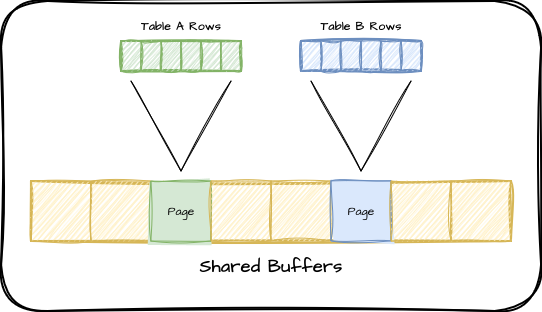
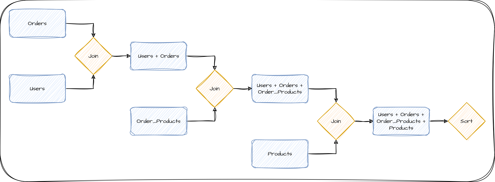
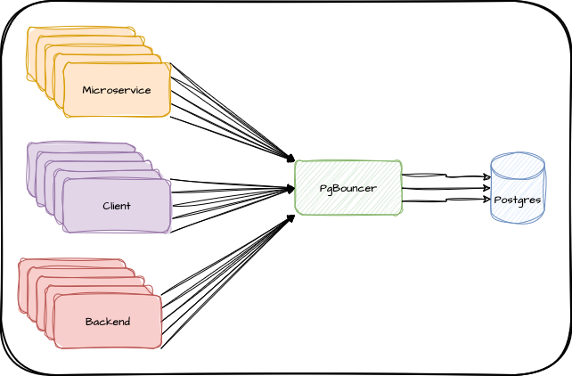
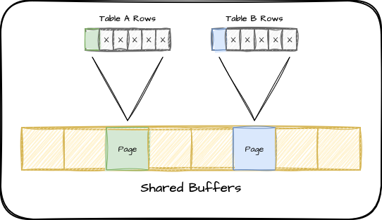

import Callout from '../../../components/Callout.astro';

It's no secret that databases use _a lot_ of RAM. When Postgres needs to build a result set, a very common pattern is to match against an index, retrieve associated rows from one or more tables, and finally merge, filter, aggregate, and sort tuples into usable output. Every one of these steps relies on memory, and Postgres may handle thousands of such queries simultaneously.

Given the memory-hungry nature of databases like Postgres, how can we manage that voracious appetite to best utilize what's actually available? How do we tackle the arduous task of wrangling the different types of memory allocation Postgres needs to operate efficiently? How can we prevent the operating system from defensively terminating a Postgres process that is using _too much_?

Measuring Postgres RAM usage is important, and less trivial than we might expect. Read along to learn how Postgres uses memory, and what steps you can take to get the best bang for your RAM buck. It's extremely tempting to simply reach for that "upgrade instance" button, but there may be _another_ way.

## Sharing is Caring

The first and by far the largest segment of RAM associated with a Postgres service is called [shared buffers](https://www.postgresql.org/docs/current/runtime-config-resource.html#GUC-SHARED-BUFFERS). It represents the most frequently retrieved rows from all tables and indexes, backed by a scoring heuristic based on use frequency. Essentially the more often a page is referenced, the more likely it is already located in shared buffers and does not need to be requested from the operating system. It tends to look something like this:



It's a static value that must be allocated when Postgres starts, and it won't get any bigger, so we don't have to worry about this contributing to _unexpected_ memory problems. It's important to size this properly, because it can only be changed when Postgres starts or restarts.

<Callout variant='warning'>
While Postgres considers this memory allocated up-front, the operating system might not. As a result, it's possible to specify extremely high values up to the amount of RAM in the instance. This kind of dangerous over-allocation implicitly over-commits RAM since it does not account for other usage described in this article. Doing so will eventually lead to an out-of-memory scenario and a subsequent crash.
</Callout>

The default Postgres [page size](https://en.wikipedia.org/wiki/Page_\(computer_memory\)) is 8kb, and each page represents several index records or table rows. Before Postgres can use an index or row, it must first retrieve the corresponding page into RAM. If those pages are in shared buffers, their "score" increases and they're less likely to be evicted later. Given that we want as much data as possible to be cached by Postgres, it may seem that higher settings are _always_ better.

The default value Postgres uses for this parameter is 128MB. The most frequently cited recommendation for production systems is to use 25% of available RAM, which also happens to be what we use here at Tembo. This rule of thumb is an excellent starting point and works for _most_ systems because it scales with hardware. A large database is likely exceptionally busy and requires many CPU threads, and these are usually accompanied by lots of RAM, especially in cloud environments. It's most important that the busiest portion of the database fits in RAM when possible, and 25% is a good starting point when you don't know the exact value.

What if we want a more precise value to avoid reserving too much, however? Constantly sweeping large extents of RAM unnecessarily adds system overhead, after all. How do we find the amount of RAM used by the most active tables and indexes? This is where the [`pg_buffercache`](https://www.postgresql.org/docs/current/pgbuffercache.html) extension comes in handy. It provides a view into the shared buffers so we can figure out exactly which tables and indexes are allocated, including the relative score of every page. For the purposes of tuning `shared_buffers`, we only really need to know how much of the buffer is full using a query like this:

```sql
WITH state AS (
  SELECT count(*) FILTER (WHERE relfilenode IS NOT NULL) AS used,
         count(*) FILTER (WHERE relfilenode IS NULL) AS empty,
         count(*) AS total
    FROM pg_buffercache
)
SELECT *, round(used * 1.0 / total * 100, 1) AS percent
  FROM state;
```

Such a query shows how many pages of the buffer are used out of the total. If our database has been running for a while and the buffer cache isn't 100% utilized, our setting may be too high and we can reduce the size of the instance or the value of `shared_buffers` to compensate. If it's at 100% and only small fractions of many tables are cached, it may be beneficial to assign sequentially higher values until we see diminishing returns. It's possible to perform this tuning without the aid of `pg_buffercache`, but it certainly eases the process!

<Callout variant='info'>
Postgres 16 has added a new [`pg_stat_io`](https://www.postgresql.org/docs/current/monitoring-stats.html#MONITORING-PG-STAT-IO-VIEW) view which can also provide some insight for tuning `shared_buffers`. This query can show the hit ratio as well as client backend reads and writes.

```sql
SELECT (hits / (reads + hits)::float) AS hit_ratio,
       reads, writes
  FROM pg_stat_io
 WHERE backend_type = 'client backend'
   AND context = 'normal'
   AND object = 'relation';
```

As explained by [Melanie Plageman](https://www.youtube.com/watch?v=rCzSNdUOEdg&t=1094s), a read to write ratio close to 1 may indicate Postgres is constantly cycling the same pages in and out of `shared_buffers`. We'd want to increase `shared_buffers` to reduce this kind of thrashing if possible.
</Callout>

If we start crossing past 50% of system RAM, we should consider increasing the size of the instance instead. Postgres still needs memory for user sessions and associated queries after all. Speaking of...

## Working Memory

The other half of the memory balancing act falls under the memory Postgres uses to actually get things done, known as work memory. The parameter that controls this is&mdash;appropriately enough&mdash;named [`work_mem`](https://www.postgresql.org/docs/current/runtime-config-resource.html#GUC-WORK-MEM). The default is 4MB and this is one of the first values a user might modify in an attempt to make a query run faster.

<Callout variant='warning'>
Be wary here! It might be tempting to increase `work_mem` if the operating system terminates Postgres due to an "out of memory" message, but that will just exacerbate the problem. This will _increase_ the amount of RAM Postgres uses and make it _more_ likely to face such terminations. Pay special attention to this section to avoid that fate!
</Callout>

However, this name is actually something of a misnomer. Many interpret "work memory" as a single allocation assigned to all work Postgres might perform while working on a query, but it can actually be _far more than that_. Consider the simplified execution diagram for a fairly basic query which is retrieving all products ever ordered by a certain user, and then sorting the results by order line item:



Each step requires combining only two items, and the product of that combination is then sent through further steps. Most databases refer to each of these steps as a "node", and queries are commonly comprised of multiple nodes. This example in particular requires four nodes to produce the end result. When considering memory usage in a Postgres server, it's **critically important** to understand that each node is allocated a **separate** instance of `work_mem`. So if we were using the `work_mem` default of 4MB, this query could consume up to 16MB of RAM.

If we have a moderately busy server with 100 of these queries running simultaneously, we could use up to 1.6GB of RAM simply to calculate results. More complex queries would require even more RAM depending on how many nodes are necessary to execute the query. The [`max_connections`](https://www.postgresql.org/docs/current/runtime-config-connection.html#GUC-MAX-CONNECTIONS) parameter also plays a part here, as it defines how many concurrent sessions may be executing a query.

<Callout variant='info'>
Use the [`EXPLAIN`](https://www.postgresql.org/docs/current/sql-explain.html) command to see the execution plan of a query. It will show how Postgres will execute the query and all of the nodes necessary to produce output. Used in conjunction with the `pg_stat_statements` extension, it becomes possible to isolate the most active queries and estimate overall memory use due to `work_mem`.
</Callout>

This is one of the major reasons behind the 25% recommendation for `shared_buffers`. Until a database is closely profiled for query concurrency and complexity, it may not be safe to allocate a higher value. To do so could risk the operating system rejecting memory requests or terminating Postgres itself.

Conversely, if `work_mem` is set too low, any rows or intermediate results that won't fit in RAM will spill to disk, which is orders of magnitude slower. Thankfully this is easy to detect by checking the `pg_stat_database` view with a query like this:

```sql
SELECT datname, pg_size_pretty(temp_bytes / temp_files) AS overflow
  FROM pg_stat_database
 WHERE temp_files > 0;

 datname  | overflow 
----------+----------
 mytestdb | 6017 kB
```

Postgres keeps track of the cumulative size and count of all temporary files written to disk. We can use that to find a coarse average and if the size is reasonable, we can increase `work_mem` by this amount. Afterwards, the majority of queries will no longer require disk storage as temporary working space. It's not uncommon for `work_mem` to be 2-4MB short of pure memory execution, resulting in queries that are much slower than they could be.

<Callout variant='info'>
What if we have "plenty" of RAM, or this is a reporting system that isn't likely to have a high active connection count? In that case, we can skip most of this in favor of a more liberal estimation method. Try this: ( (total RAM - shared_buffers) / max_connections) * 0.8. So if we have 16GB of RAM, 4GB of shared buffers, and 100 max connections, we'd end up with about 96MB for `work_mem`. We have a different formula for extremely busy servers with high connection counts later in the article.
</Callout>

## Ongoing Maintenance

The last of the tunables for Postgres RAM usage is similar to work memory, but associated specifically with maintenance. Consequently it has a similar parameter name in [`maintenance_work_mem`](https://www.postgresql.org/docs/current/runtime-config-resource.html#GUC-MAINTENANCE-WORK-MEM). This specifies the amount of RAM dedicated to perform operations such as `VACUUM`, `CREATE INDEX`, and `ALTER TABLE ADD FOREIGN KEY`, with a default of 64MB.

Because this is limited to one operation per session, and it's unlikely many concurrent such actions will occur, it's considered safe enough to use higher values. It's very common to set this as high as 1GB or even 2GB, as these maintenance operations can be very memory intensive and complete much faster if they can operate entirely in RAM.

One important caveat here is the Postgres autovacuum process which marks dead tuples for later reuse. Autovacuum launches background tasks until the limit of [`autovacuum_max_workers`](https://www.postgresql.org/docs/current/runtime-config-autovacuum.html#GUC-AUTOVACUUM-MAX-WORKERS), and _each of these_ may use a full instance of `maintenance_work_mem`. Most servers with RAM to spare will be safe with 1GB of maintenance work memory, but if RAM is scarce, we should be more judicious. There's a specific [`autovacuum_work_mem`](https://www.postgresql.org/docs/current/runtime-config-resource.html#GUC-AUTOVACUUM-WORK-MEM) parameter if we want to restrict the autovacuum workers in particular.

<Callout variant='info'>
Note that the Postgres autovacuum workers cannot use more than 1GB, so configuring `autovacuum_work_mem` over this value will have no effect.
</Callout>

## Session Pooling

The easiest way to reduce memory consumption is to put a logical cap on potential allocations. Postgres is currently a process-based engine, meaning every user session is assigned a physical process rather than a thread. This means every connection comes with a certain amount of RAM overhead, and contributes to context switching. As a result, one common recommendation is to set `max_connections` no higher than 4x the amount of available CPU threads. This minimizes the amount of time spent switching active sessions between CPUs and naturally limits the amount of RAM sessions can collectively consume.

Remember, if every session is executing a query, and each node represents one allocation of `work_mem`, our theoretical maximum work memory usage is: `connections * nodes * work_mem`. It's not always possible to reduce query complexity, but we can _usually_ reduce connection count. In cases where applications always open a certain inflated amount of sessions, or a multiple separate microservices rely on Postgres, this may be easier said than done.

<Callout variant='info'>
Remember this formula: `work_mem * max_connections * 5`

It's a rough estimate of the maximum amount RAM a Postgres instance might allocate to user sessions simply for processing basic queries, assuming all connections are active. If the server doesn't have enough RAM for this value, consider decreasing one of the factors, or increasing RAM.

Our estimate of five nodes per average query may not be accurate for your application, so adjust it as necessary once you have a better grasp of your query execution plans.
</Callout>

That means the next step is to introduce a [connection pooler](/docs/product/cloud/apps/connection-pooler/) like PgBouncer. This decouples client connections from the database and reuses the expensive Postgres sessions between them. When properly configured, several hundred clients can share a few dozen Postgres connections with no impact to the application.

We're left with something like this:



We've seen PgBouncer multiplex over 1000 connections to 40-50 this way, dramatically reducing the overall amount of memory consumption caused by process overhead.

## Reducing Bloat

Quite possibly the most difficult aspect of memory usage to track is that of table bloat. Postgres uses Multi-Version Concurrency Control ([MVCC](https://www.postgresql.org/docs/current/mvcc.html)) to represent data in its storage system. This means any time a table row is modified, Postgres creates another copy of the row somewhere in the table, marked with a new version number. The Postgres [`VACUUM`](https://www.postgresql.org/docs/current/routine-vacuuming.html) process marks old row versions as "unused" space so that new row versions can be placed there.

Postgres has an automatic vacuum background process that continuously finds these reusable allocations and tries to make sure tables don't grow without bound. Sometimes the default configuration for this is not sufficient for especially high volume systems however, and such maintenance can fall behind. As a result, tables may slowly fill with more _dead_ rows than _live_ ones, resulting in a table that is "bloated" full of old data. 

<Callout variant='info'>
Our CTO Samay Sharma has [a great talk](https://www.youtube.com/watch?v=D832gi8Qrv4) on optimizing autovacuum, and we have an [in-depth article](/blog/optimizing-postgres-auto-vacuum/) from Adam Hendel as well. Properly tuning autovacuum is an incredibly subtle topic that deserves an equally thorough explanation. Even experienced Postgres DBAs could do with an occasional refresher.
</Callout>

Consider what this means for our shared buffers if a table is extremely bloated. Remember our earlier depiction of shared buffers? What happens if each page only contains one live row and several dead rows? We'd end up in a situation like this:



If a particular query requires 10 rows in this scenario, we'd have to fetch 10 pages into shared buffers and end up wasting a lot of memory that could have been used for something else. If these rows are in particularly high demand, the usage count would keep them in shared buffers and make our cache much less efficient.

There are a lot of queries floating around the internet which can estimate table bloat, but the only way to get a concrete view of how pages look in a table is to use the [`pgstattuple`](https://www.postgresql.org/docs/current/pgstattuple.html) extension. Once that extension is installed, we can see _exactly_ how bloated a particular table may be using a query like this:

```sql
SELECT tuple_percent, free_percent
  FROM pgstattuple('my_table');
```

If the `free_percent` is greater than 30%, it may be necessary to modify autovacuum to be more aggressive. If it's _significantly_ greater than 30%, it's probably a good idea to remove the bloat entirely. Unfortunately there's currently no easy way to do this. Currently the only supported method is to essentially rebuild the table using a command like this:

```sql
VACUUM FULL my_table;
```

A `VACUUM FULL` rewrites the entire table by relocating all live rows to a new location and discards the old bloated copy. This process allocates an access exclusive lock for its duration, so requires some kind of downtime in almost all cases.

An alternative to this is the [`pg_repack`](https://reorg.github.io/pg_repack/) extension supported by Tembo. This command-line tool can also reorganize a table to remove bloat, but does so without an exclusive lock and in an entirely online manner. Because this tool exists outside the Postgres core and modifies table and index storage, it's often considered advanced usage. We recommend copious tests in a non-production environment before using it.

## The Balancing Act

Getting all of these parameters and resources configured properly is both an art and a science. We've seen how we can measure the actual usage of our shared buffers, and we can determine if work memory is too low. But what if&mdash;as in most cases&mdash;we're constrained by our available hardware or budget? As a good example of this, what happens if we encounter a memory usage alert or the operating system terminated our service in the past? This is where the "art" comes in.

In some situations where memory is scarce, we may need to reduce `shared_buffers` slightly to make room for more `work_mem`. Or perhaps we must reduce both. If our application requires high session counts, it may make more sense to reduce `work_mem` or introduce a connection pool to prevent concurrent sessions from racking up extensive RAM allocations. It may make more sense to reduce `maintenance_work_mem` if we'd increased it in the past under the assumption we had sufficient RAM for everything. It's a lot to consider!

If you followed along with our recommendations through the article, your `shared_buffers`, `work_mem`, `maintenance_work_mem`, and `autovacuum_work_mem` are likely more precisely tuned for your workload. However, it's still possible&mdash;especially in low-memory instances&mdash;the above recommendations aren't quite enough. In situations like that, we recommend following this order of operations to both maximize memory use and _avoid resource exhaustion_:

1. If you're not already using one, add a connection pooler and reduce `max_connections`. It's often the quickest and easiest way to cut maximum resource consumption.
2. Use `EXPLAIN` on your most frequent queries reported by `pg_stat_statements` to find the *maximum* amount of nodes in queries rather than the average. Then set `work_mem` no higher than 80% of `(total RAM - shared_buffers) / (max_connections * max plan nodes)`. The cumulative effect of `work_mem` is multiplicative, so controlling this is one of the easiest ways to prevent over-consumption.
3. Revert `maintenance_work_mem` and `autovacuum_work_mem` back to the default of 64MB. Consider increasing by 8MB increments if maintenance tasks are too slow and more RAM is available. These parameters don't require restart, so are a bit more flexible for experimentation.
4. Use the `pg_buffercache` extension to see how much of which tables are stored in `shared_buffers`. Examine each table and index closely and see if there's a way to reduce this by archiving data, revising queries to use less information, and so on. This may also include `VACUUM FULL` or `pg_repack` to compact pages used by active bloated tables. This may allow you to reduce `shared_buffers` accordingly, since the active data set is now smaller.
5. If `pg_buffercache` shows `shared_buffers` is full and can't be reduced any further without evicting active pages, use the `usagecount` column to prioritize the most active pages. The value for this column goes from 1-5, so if we focus on pages used 3-5 times, we can reduce `shared_buffers` without significantly impacting performance. Remember, shared buffers work alongside operating system and filesystem caches but can't be purged in the same way when memory pressure is high. Rather than Postgres having direct knowledge of cached pages, smaller shared buffers rely on the operating system to cache frequently used data. As such, it can be a good option when RAM is especially scarce.
6. Last but not least, provision more capable hardware. This could be purchasing a larger server or moving up to the next larger cloud instance size. If the database truly needs more RAM for its current workload and reducing the above parameters would adversely affect system performance too dramatically, it usually makes more sense to upgrade.

As you can see, upgrading doesn't have to the only, or even the _first_ option to consider when configuring a Postgres cluster for optimal memory use. A busier and more popular application will require more database resources in general, but in many cases there is plenty of runway to leverage between hardware upgrades.

In the end, we hope you learned a bit about how Postgres uses memory, and the best ways to ensure a well-balanced database instance on _any_ hardware allocation. Postgres performance is great out of the box, but it's even better with a bit of informed TLC!


