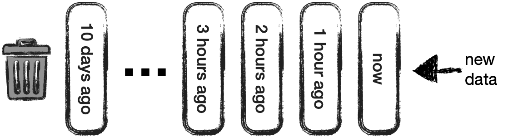

# Using Tembo's Time-Series Stack at Home

Tembo's Time-Series Stack is now available, but as an author of its underlying extension, I've struggled with the same problem I hit any time I contribute to a [time-series](CloudWatch) or [database project](Citus): I've spent more time making and testing this tool than I will spend using it.

Sure, there are public data sets at places like [Kaggle](https://www.kaggle.com/datasets), and I like the bike-sharing data set we use in [our time-series guide](https://tembo.io/docs/product/stacks/analytical/timeseries), but really digging into the data becomes much easier when it's something of personal interest.

Suddenly it dawned on me: I have a novel IoT use-case of my own… I _live_ in this use-case. My personal hobby of home automation has resulted in a [Home Assistant](https://www.home-assistant.io) installation with around 350 entities, and I have over a year of statistics!

## Upgrading to Tembo Time-Series

So now the goal is clear: we'll be migrating an existing time-series system over to a Tembo Time-Series stack. So readers can follow along, I'm providing a [sanitized version of my IoT dataset](tbd). Once we have our stack up and running, we'll cover some interesting time-series queries and finish with some stack benchmarks.

To get started, we'll need an instance of the [Tembo Time-Series Stack](tbd), so launch one if you haven't already. We'll use a GP-4 instance, but the data should fit just fine in the Hobby tier as well.

## Creating the Time-Series Tables

The two tables you'll need to create are as follows:

```sql
CREATE TABLE public.states_ts (
    state_id bigint NOT NULL,
    entity_id text,
    state text,
    attributes text,
    event_id bigint,
    last_changed timestamp with time zone,
    last_changed_ts timestamp without time zone,
    last_updated timestamp with time zone,
    last_updated_ts timestamp without time zone NOT NULL,
    old_state_id bigint,
    attributes_id bigint,
    context_id text,
    context_user_id text,
    context_parent_id text,
    origin_idx smallint,
    context_id_bin bytea,
    context_user_id_bin bytea,
    context_parent_id_bin bytea,
    metadata_id bigint
) PARTITION BY RANGE (last_updated_ts);

CREATE TABLE public.states_meta (
    metadata_id bigint NOT NULL,
    entity_id text
);
```

This application stores metric attributes in a separate table from the actual time-series data, a fairly common approach. Specifically, while `states` stores state transition information, `state_attributes` and `states_meta` are used to keep track of event names, device descriptions, etc. As these tables are not time-series data, they can remain regular PostgreSQL tables.

### Time-Series "Rollups"

Additionally, Home Assistant—like _many_ time-series applications—"pre-aggregates" rows, "rolling up" raw data (`states`) first into five-minute data (`statistics_short_term`) and eventually into hourly rows (`statistics`). Automatically handling this rollup is on the `timeseries` extension's roadmap, but for now, we'll let Home Assistant do its thing.

The data set contains ten days of `states`… we'll leave analyzing pre aggregated data for another time.

### Time-Series Partition Sizing

As a vague rule of thumb, it's best to size your time partitions so that the active set (from all tables) fills roughly one quarter of the PostgreSQL server memory. Because this is a demo data set of raw state data, we'll just use hourly partitions, but in real-world use it is always good to tune your partition size.

## Time-Series Enable and Load Data

At this point we're good to tell timeseries about our partition sizes and load the data set. We'll start by creating enough partitions to cover the date range of our data…

```sql
SELECT enable_ts_table('states_ts', '1 hour', initial_table_start => '2024-05-12');
```

And with the partitions created, data can be loaded. Download it from [here](https://tembo-demo-bucket.s3.amazonaws.com/states.csv) and load it with the following:

```sql
\copy states_ts from 'states.csv' with (format csv);
```

## Time-Series Scheduling

Our `states` table only carries ten days of data, max, before rows are rolled up into hourly rows for statistics. Wouldn't it be nice if PostgreSQL could stay on top of this rule for us?

The time-series stack is designed to do just that! If you imagine your partitions as being created at the present moment and then shifting leftward as they "age", the principle is pretty easy to understand. At a given offset from `now`, `timeseries` can take certain actions. At the moment, these actions are "compress" or "drop" (retention policy). You can imagine partitions "aging out" by shifting away from "now" until they hit their policy (such as the "drop" policy depicted below):



We'll set the ten-day retention on `states`:

```sql
SELECT set_ts_retention_policy('states_ts', '10 days');
```

In a future release, the "scheduling" concept will include additional actions, perhaps aggregating rows, or even moving partitions to "cold storage" in some cloud solution.

## Additional Tables

In most time-series workloads, only a few tables store time-series data; others may store repetitive metadata, user information, etc. We have a few of those in this workload, so load them up, too. The data can be found [here](https://tembo-demo-bucket.s3.amazonaws.com/states_meta.csv).

```sql
\copy states_meta from 'states_meta.csv' with (format csv);
```

## Exploring the Data

Now that everything is loaded up, we can finally get to the important task of exploring our data. As I work from home, it can sometimes be annoying when my office is outside of my comfort zone. Let's find the hours of the day when my upper floor landing is above 75°F or beneath 65°F…

```sql
WITH metadata_ids AS (
  SELECT metadata_id
    FROM states_meta
    WHERE entity_id = 'sensor.upstairs_landing_ecobee_current_temperature' ),
temp_stats AS (
  SELECT date_trunc('hour', last_updated_ts) as hour,
         MIN(state::numeric) AS min,
         MAX(state::numeric) AS max
    FROM states_ts
    WHERE metadata_id IN (
      SELECT metadata_id
        FROM metadata_ids )
    GROUP BY 1 )
SELECT *
  FROM temp_stats
  WHERE min < 65 OR max > 75
  ORDER BY max DESC, min ASC, hour;
```

But if my office is uncomfortable, where should I go? If I had a list of which rooms were hottest and coldest during each hour, answering this question would be easy…

### `first` and `last`

This is where the `first` and `last` functions come in: we want to group temperature readings by hour, but within each hour we want to select the room name corresponding to the highest and lowest value of temperature. In other words, we're sorting the groups by temperature and selecting the _first_ or _last_ row within each group, based on that sub-sort.

```sql
WITH temp_sensors AS (
  SELECT metadata_id,
         entity_id
    FROM states_meta
    WHERE entity_id LIKE '%temperature' AND
          entity_id NOT SIMILAR TO '%(attic|backyard|coffee|garage)%' )
SELECT EXTRACT(HOUR FROM last_updated_ts) as hour,
       first(ts.entity_id, state::numeric) as coldest,
       last(ts.entity_id, state::numeric) as hottest
  FROM states_ts s JOIN temp_sensors ts ON (s.metadata_id = ts.metadata_id)
  WHERE s.state <> 'unavailable'
  GROUP BY 1
  ORDER BY 1;
```

### Fine Granularity/Imputation

One thing you may notice in this data set is all sensors only emit data every once in a while, even for continuous properties such as temperature. This may vary by sensor type, software integration, and even things such as sensor availability. Even things such as server updates might result in gaps in our data.

So what if we wanted to produce a dense (having no gaps) data series at a finer-granularity than most of our sensors, say, every minute? This is where the `date_bin_table` and `locf` (_last observation carried forward_) functions come in handy.

First, write a `SELECT` query against `states_ts`, but in the `FROM` clause, wrap `states_ts` with a call to `date_bin_table`. The second and third arguments are the desired granularity and a range for the start and end of the date range.

```sql
SELECT * FROM date_bin_table(NULL::states_ts, '1 second', '[2024-05-20,2024-05-21]') LIMIT 100;
```

If you run this query, you'll notice two things:

  - All rows' time values are binned to the specified granularity
  - Any missing time ranges will have a row emitted with `NULLs`

With the above characteristics, it becomes possible to add aggregates and end up with a row for every date bin. Let's filter for `metadata_id` 229, my backyard weather sensor.

```sql
SELECT avg(state::numeric), date_trunc('minute', last_updated_ts)
  FROM date_bin_table(NULL::states_ts, '1 second',
                      '[2024-05-20,2024-05-21]')
  WHERE metadata_id IS NULL OR metadata_id = 229
  GROUP BY 2 ORDER BY 2;
```

But there's still one problem: our data contains these `NULL` values! By adding in a call to `locf`, we can fill all `NULL` entries with the most-recent non-`NULL` entry:

```sql
WITH minute_data AS (
  SELECT avg(state::numeric) avg,
         date_trunc('minute', last_updated_ts) reported_at
  FROM date_bin_table(NULL::states_ts, '1 second',
                      '[2024-05-20,2024-05-21]')
  WHERE metadata_id IS NULL OR metadata_id = 229
  GROUP BY 2 ORDER BY 2 )
SELECT locf(avg) OVER (ORDER BY reported_at),
       reported_at
  FROM minute_data;
```

Now our data series is ready for immediate use in a dashboard.

### `LEAD` use

Apart from the "poll"-like sensors in an IoT workload, "event"-like sensors are also common. These only emit a record any time an event occurs. Examples in this application might be opening doors, turning on lights, setting a security system, or starting the coffee maker.

Let's say we want to see the longest times a door or window has been open in the recent past. How would we do that? A simple approach is using the `LEAD` aggregate function in a window clause.

To understand how `LEAD` works, consider the following query:

```sql
WITH squares AS (
  SELECT i * i s FROM generate_series(1, 100) gs(i)
)
SELECT LEAD (s, 1) OVER (ORDER BY s) - s FROM squares;
```

If it's not yet clear, this query generates the first 100 square numbers and displays the differences between consecutive squares. This allows users to do arithmetic and other operations between these two rows.


For our event-oriented system, these rows might correspond to a door being opened or closed. With this understanding, it becomes trivial to write a query turning events at points in time into the interval those states were active:

```sql
WITH doors AS (
  SELECT metadata_id,
         replace(entity_id, 'binary_sensor.', '') AS sensor
    FROM states_meta
    WHERE entity_id LIKE 'binary_sensor.%door_sensor' ),
durations AS (
  SELECT s.last_updated_ts AS start_time,
         replace(d.sensor, '_sensor', '') AS door,
         s.state AS state,
         LEAD(s.last_updated_ts, 1) OVER (
           PARTITION BY d.metadata_id
           ORDER BY s.last_updated_ts
         ) - s.last_updated_ts state_duration
    FROM states_ts s
    JOIN doors d ON (s.metadata_id = d.metadata_id) )
SELECT * FROM durations
  WHERE state = 'on'
  ORDER BY state_duration DESC;
```

Using `LEAD` (and its corresponding function `LAG`) can be syntactically challenging, but being able to wield it against an IoT workload is very powerful.

## Wrap-Up

If you've made it to this point, I hope you can see the potential uses of Tembo's Time-Series Stack and its corresponding extension. We started with an unknown time-series data set, created a time-series stack, set it up for use with an existing application, and wrote several queries to reach important conclusions from our data.

Time-Series is under active development and we are always looking for the next feature that will help our users most. Keep an eye on this space to make sure you're the first to know about what's added next!
