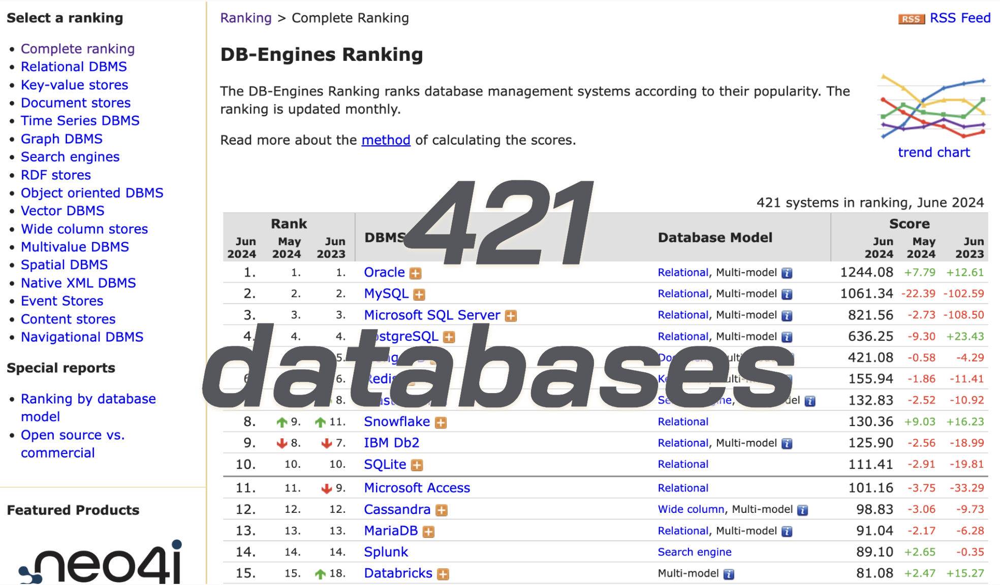
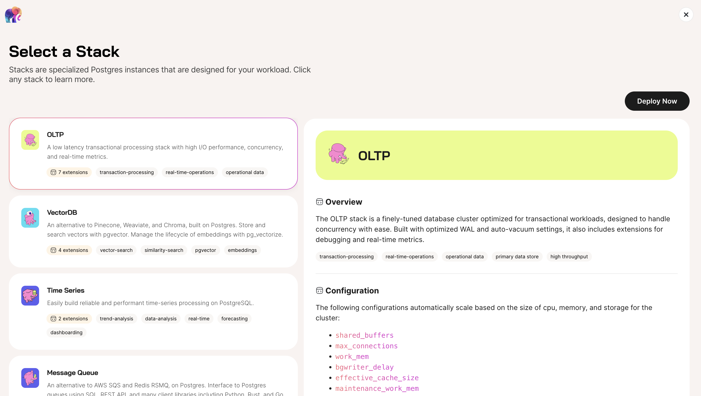

We're excited to announce that Tembo has raised a $14M Series A round, 
to continue our mission to make it as easy as possible for developers 
to access the entire Postgres open source ecosystem. We aim to provide 
an exciting alternative to the limited managed Postgres offerings, and 
a sprawl of database tools offered by the major clouds.

We are thankful to:

* [DJ Patil](https://www.gpv.com/team/dj-patil), general partner at 
  [GreatPoint Ventures](https://www.gpv.com/), who led the round 🔥
* [Ethan Batraski](https://www.venrock.com/teammember/ethan-batraski/), 
  partner at [Venrock](https://www.venrock.com/), who also led our seed round 🔥🔥
* [Harsh Patel](https://x.com/harsh1), 
  managing director at [Wireframe Ventures](https://www.wireframevc.com/),
  who also participated in our seed round
* [Nathan Owen](https://grandvcp.com/team/member/1104), 
  general partner at [Grand Ventures](https://grandvcp.com/)
* [Mark Trevitt](https://www.linkedin.com/in/marktrevitt), 
  managing partner at [Defined](https://www.definedvc.com/)
* [JB Kropp](https://www.linkedin.com/in/kropp/), 
  managing director at [Cintrifuse Capital](https://cintrifuse.com/)
* other prominent angels

## The sprawl is vast

There are now hundreds of databases available in the market, in fact 
[db-engines](https://db-engines.com/en/ranking) lists 421.

Just use Postgres.

## The AI/LLM explosion demands a data platform rethink

Due to the explosion of AI and its data demands, 
every organization is rethinking their data platform.

So...

## Developers want to choose Postgres

They really do. Postgres grew up as a transactional database, but devs know that 
it can now be used for analytical and AI workloads.

But the sad news is that for non-OLTP use cases, Postgres doesn't win many bake-offs, 
vs. specialized tools. It's a shame. Nobody had been working to give developers the 
product and the ammo they need to choose Postgres for all the newer data use cases.

Until now....

## One Postgres platform to rule them all

Tembo is available as a fully-managed SaaS and as self-hosted Kubernetes-based
software, providing a single unified platform that comes with unprecedented
Postgres expertise and support across a wide range of use cases.

And we've added convenience features such as:

* 200+ available Postgres extensions
* columnar data storage
* tiered storage
* in-cluster embedding and LLM services
* a lot more

This provides teams the ability to build modern data products with maximum security, 
real time data access, and absolute data sovereignty.

Developers will easily be able to deploy different flavors of Postgres
to multiple clouds and regions, with advanced options such as auto-scaling,
auto-pausing, and auto-tuning under active development.

## Join the movement—some closing talking points

Our vision isn't complete, but it's compelling and includes:

* Postgres isn't just a database; it's a powerful platform capable of anything
  from simple applications to complex data ecosystems. 
* Tembo provides a Postgres-managed service that enables organizations to 
  harness the full power of the popular open-source database Postgres for 
  transactional, analytical and AI workloads across any cloud, anywhere. 
* By making it easy for developers to access the entire Postgres open source 
  ecosystem, we're also enabling organizations, from Fortune 500 to startups, 
  to feel confident going “all in” on Postgres, achieving unprecedented stability
  and efficiency across various applications and use cases.

LFG.

-Ry