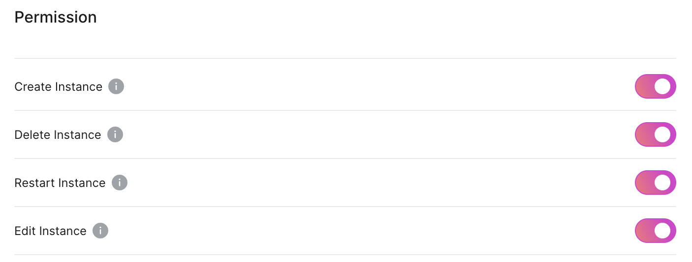
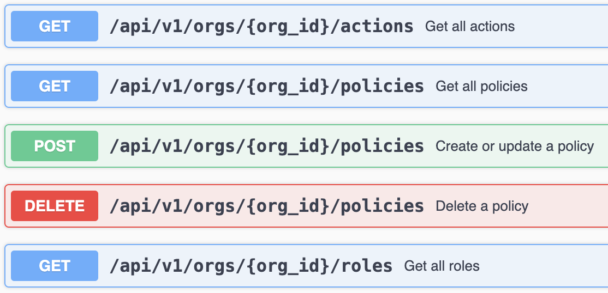

Role-Based Access Control (RBAC) is a method of configuring access to resources based on the roles of individual users within a system. This post details how Tembo Cloud designed a simple and scalable RBAC system to manage permissions effectively.



## Deciding on the resource types

We want users of Tembo Cloud to be able to manage permissions within their account in an easy-to-understand way. We also want to be able to grow the system into a fully-featured RBAC system based on future user requests.

[AWS IAM](https://aws.amazon.com/iam/) is a mature RBAC system, so we started there for inspiration. AWS IAM includes resource types for Users, Groups, Roles, Policies, Actions, Conditions, and more.

At Tembo, we are using an authentication provider called [Clerk](https://clerk.com/). Clerk already has two roles defined by default for our users: Admin and Member. Clerk recently added a feature to support [user-defined roles](https://clerk.com/docs/organizations/roles-permissions#custom-role).

Comparing with AWS IAM, we can start with the minimal set of resource types to support basic RBAC: **Roles**, **Actions**, and **Policies**. Roles will at first be limited to the Admin and Member roles only. Later, we can introduce user-defined roles. Actions have the same meaning as in AWS, and Policy is similar in that it connects Actions with Roles.

Example Role:

```json
{
	"id": "admin",
	"name": "Admin"
}
```

Example Action:

```json
{
	"id": "PostgresReadOnly",
	"name": "Postgres Read Only",
	"description": "Access to the readonly user password."
}
```

Example Policy, allows admin to access the Postgres readonly password:

```json
{
	"action": "PostgresReadOnly",
	"role": "admin",
	"allowed": true
}
```

## Data model and API

For the RBAC API, we provide read endpoints for Roles, Actions, and Policies and provide update and delete endpoints for Policies.



Because currently Roles and Actions are unchanging, we have them defined as `enum` types in our code, only creating a table for Policies. We define a table like this in our Postgres database.

```
 id | organization_id |     role     |      action       | allowed
----+-----------------+--------------+-------------------+---------
  1 | org_123         | admin        | CreateInstance    | t
  2 | org_456         | basic_member | DeleteInstance    | f
```

In our initial design, we require Policies to be unique by (`organization_id`, `role`, `action`). This differs from the design of AWS IAM, where you can create multiple policies for the same Role and Action. We believe it is easier to understand Policies when there is only one Policy associated with a particular Role for each Action. This data model better represents a UI that shows a toggle on/off state for each Action when toggling permissions on or off per Role.

By default, we initialize full permissions for both the Admin and Member roles, for backwards compatibility and so that RBAC is opt-in. Also, we disallow revoking the permission to manage permissions from the Admin role to avoid users locking themselves out by accident.

## Policy conditions

In a future version of Tembo Cloud's RBAC, we will introduce the concept of Policy Conditions, so we need to plan for that ahead of time. For example, you may wish to allow users t odelete any instance except for production instances. We picture this feature as a "Configure" button near the Action toggles.


To support that feature, we would introduce a concept of Conditions, which would be attached to Policies.

Comparing with AWS IAM's structure for Conditions:

```json
{
...
  "Statement": {
    ...
    "Condition": {
      "StringEquals": {
        "aws:PrincipalTag/job-category": "iamuser-admin"
      }
    }
  }
}
```

In our case, we can use something like this:

```json
{
	"action": "PostgresReadOnly",
	"role": "basic_member",
	"allowed": true,
	"conditions": [
		{
			"operator": "NotEqual",
			"key": "instance_name",
			"value": "production"
		}
	]
}
```

When "allow" is true, we would evaluate Conditions with an "AND" operation between all conditions, and when "allow" is false, we would evaluate all Conditions with an "OR" operation between conditions. In this way, when a user toggles permissions off including some Conditions, then the Action is disabled for any matching Condition. When a user toggles permissions on including some Conditions, then the Action is allowed only when all Conditions are matching.

In the data model, we can represent conditions like this, where `policy_id` is a required foreign key to the policies table:

```
 id | policy_id |  operator   |  key           | value
----+-----------+-------------+----------------+---------
  1 |  1        |  NotEqual   |  instance_name | production
```

Both the operator and key columns would be enum types, where Tembo Cloud supports a specific set of each. The `value` column would be a user-provided input.

## Custom roles

Users may want more fine-grained control of specific users or groups of users. For this, we can introduce Custom Roles. Users would be able to add their own Roles, assigning users to those Roles, and attaching a different set of Policies to that Role.

## Try it out

Try this feature on [Tembo Cloud](https://cloud.tembo.io). Please refer to the [RBAC documentation](/docs/product/cloud/security/rbac) or reach out to [Tembo Cloud support](mailto:support@tembo.io) if you have any questions.

If you are interested in Custom Roles or Conditions, please vote for the feature on the [Tembo roadmap](https://roadmap.tembo.io/roadmap).
