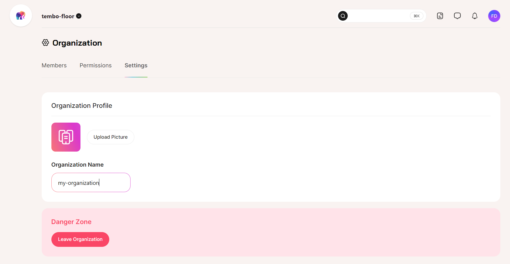
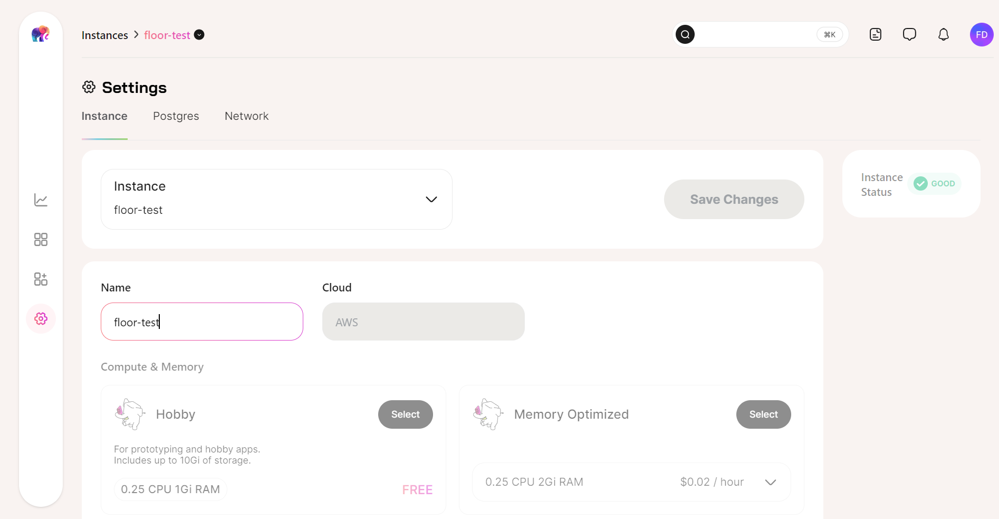
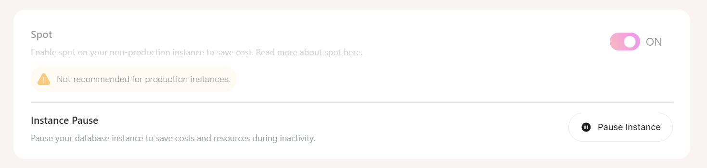
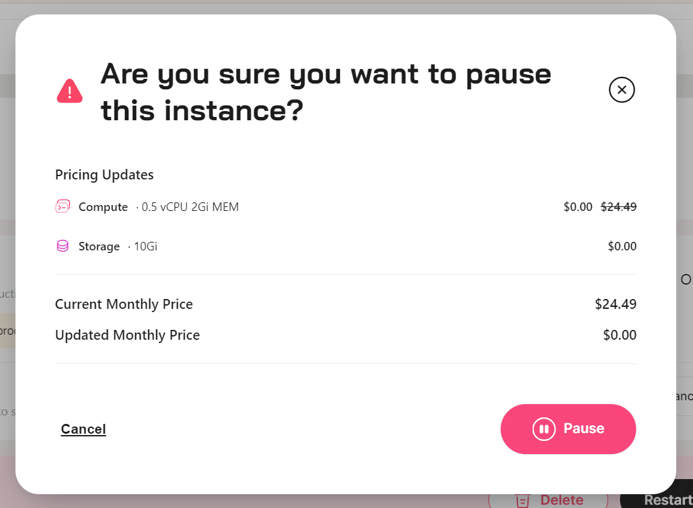
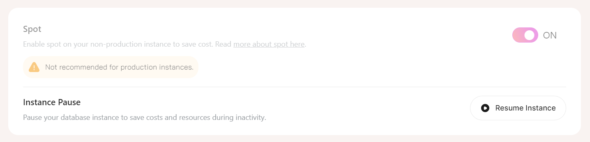

We've recently added functionality to Tembo Cloud, including the ability to rename and to temporarily pause instances, to give you greater control. 

You might want to rename your instance to follow naming conventions, or to better reflect the instance's application. Or - and we have all been there - you just made a typo when you first created your Instance. Let's dive in! 

## Rename Instances and Orgs 

You can now change the name of your Tembo Cloud instances and the name of your organization via the [Tembo Cloud UI](https://cloud.tembo.io/). To change the instance name, go into _Settings_, click on the _Name_ field and enter the new name for your instance.

Don't forget to select the _Save Changes_ button to apply the new name!

Renaming your instance will not cause downtime. Your instance will go into the Configuring status, and once the instance is successfully updated, you will receive a notification confirming the update. Renaming an instance will not require you to update your connection string, your existing connections will continue to work as before.

For your Organization’s name, that is found in _Organization settings_, which is located by clicking your profile icon in the top right of the screen.

## Pause and Resume Instances

Another new feature allows you to pause your Tembo Cloud instances when they are not being used actively. This way you can save costs when you're running experiments or benchmarks during the week that can be turned off during the weekend, or similar ephemeral use cases.

Instances can also be resumed with a single click, and resuming is more efficient in terms of setup than creating a new instance.

To pause an instance, go into Settings, and in Instance Settings select Pause Instance.

A pop-up screen will ask you to confirm your action.

While an instance is paused, you are only billed for storage.

To resume an instance, go into Settings, and in Instance Settings select Resume Instance.

There’ll be a short wait while Tembo Cloud resumes your instance.

### API actions

You can also pause instances with the [Tembo Cloud API](https://tembo.io/docs/development/api), using the [Lifecycle Events endpoint](https://api.tembo.io/redoc#tag/instance/operation/instance_event).

The instance states associated with pausing and resuming are known in the Tembo API as `Stopping`, `Stopped`, and `Starting`.

We love to hear from you about functionality that will make your life easier. Relevant to the functionality discussed in this blog post, maybe the option to auto-pause an instance is something you’d like to see us work on next. Please suggest and upvote features via [roadmap.tembo.io/roadmap](https://roadmap.tembo.io/roadmap).