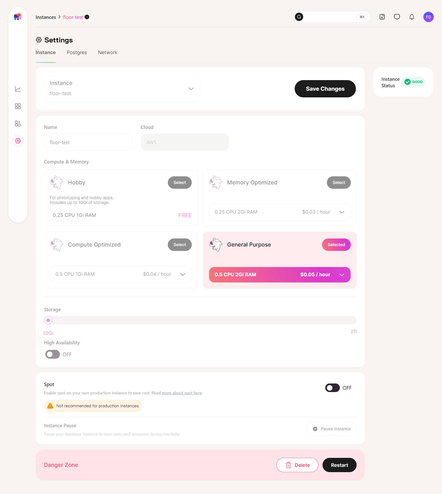
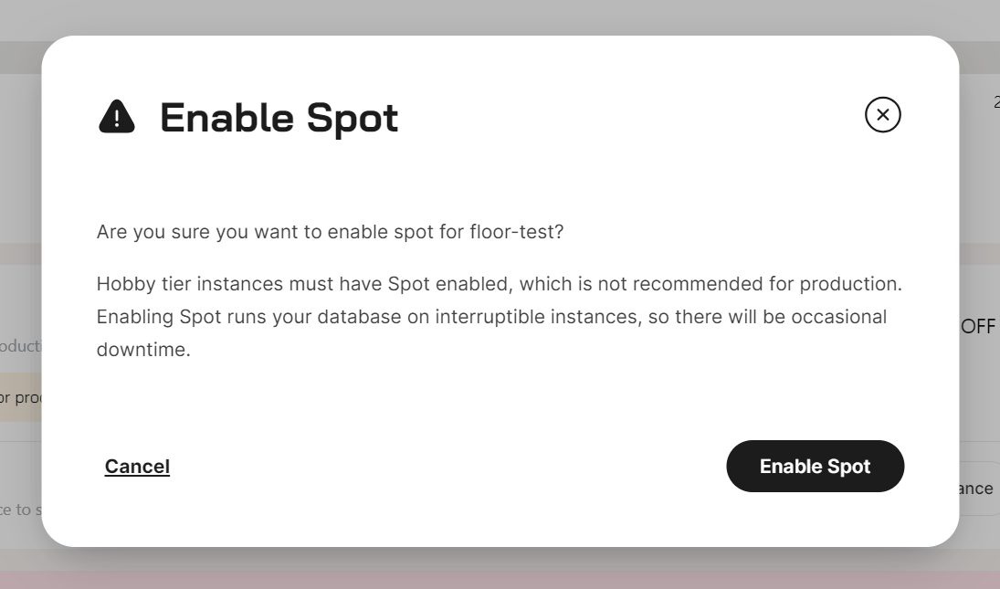

[Tembo Cloud](https://cloud.tembo.io/) now offers Spot for running your non-production instances at a cheaper cost. [Spot](https://aws.amazon.com/ec2/spot/) is an Amazon Web Services (AWS) feature that offers heavily discounted EC2 instances. 

## Spot and Tembo Cloud 

Amazon provides an EC2 server, but may reclaim the server with two minutes of warning. This means any workload running on a Spot server might get moved to a different server with only minimal upfront warning from AWS.

Tembo charges 30% less for CPU and Memory on instances with Spot enabled. If Spot instances are not available from AWS, we will automatically move your servers with Spot enabled to an on-demand EC2 instance with no additional charge.

[Tembo Apps](https://tembo.io/docs/product/cloud/apps/rest-api) associated with your instance will also run on Spot when Spot is enabled.

Our Hobby tier, recommended for prototyping and hobby apps, will now exclusively use Spot. This way we can continue to support our attractive pricing. 

## Tradeoffs for Spot

Spot relocation is typically less than 10 minutes when HA (High Availability) is not enabled. Downtime is minimized when HA is enabled.

Spot instances are recommended for non-critical or fault-tolerant workloads which can accept up to 10 mins of occasional downtime when Spot instances get reclaimed. These are a perfect fit for dev instances or for workloads where retrying your queries in ~10 mins is an option.

## Enabling Spot

Spot can be picked during instance provisioning or adjusted later in Settings.

To enable Spot for your instances, go to your Settings view, toggle the Spot setting, and then click Save.

You'll get a pop-up warning reminding you that Spot runs your database on interruptible instances, and that occasional downtime can be expected.

We like transparency, so cost savings are immediately reflected in your instance's overview!

For more information, please refer to [our documentation](https://tembo.io/docs/product/cloud/configuration-and-management/spot-instances).
