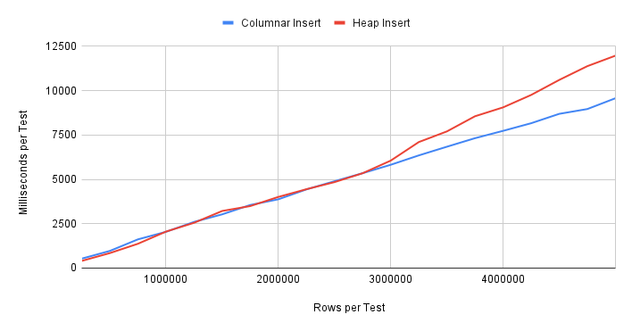

Tembo were recently invited to do a short presentation of the [pg_timeseries](https://github.com/tembo-io/pg_timeseries) extension to the [Chicago Postgres User Group](https://www.meetup.com/chicago-postgresql-user-group/). As expected, user questions popped up which didn't have an immediate obvious answer, mainly related to performance. Is [Hydra Columnar](https://github.com/hydradatabase/hydra) storage used by `pg_timeseries` faster than Heap when it comes to inserts? How about updates or deletes? Does the overall row count affect these results?

So why not run some tests? 

## Building the Benchmark

Any proper benchmark needs a testing procedure. We performed a few simple test runs which showed interesting results, but these initial findings were soon erased once the more objective and standardized process emerged.

Here's what we finally came up with as a test harness:

1. A `docker-compose.yaml` definition to bootstrap a fresh container using `pg_timeseries`. It also sets `shared_buffers` to 2GB and `max_wal_size` to `200GB`, mainly to avoid unwanted checkpoints caused by all of the write activity.
2. A function that will switch all test partitions to either columnar or heap storage.
3. An unlogged table to contain generated data prior to writing to the test partitions.
4. A function to generate test data.
5. A function to run the tests, which calls:
    * A separate function for inserts, updates, and deletes.
    * The previously mentioned storage switching function.
    * The data-generation function.

The word "function" is a bit of a misnomer here, as all code is written as stored procedures. Procedures in Postgres have full transaction control, so we can `COMMIT` after collecting each data point and see progress as it's generated instead of at the end of the entire test run. We can also do things like run `CHECKPOINT` between tests so each test has a fresh starting point and we're unlikely to cause an emergency checkpoint due to write activity.

All code used for these tests is available in [this GitHub directory](https://github.com/tembo-io/website/tree/main/src/content/blog/2024-08-02-columnar-heap-write-performance/_code) rather than inline with the blog. Including it here would be somewhat distracting, as it's a _lot_ of code. But we _can_ explore the function names, if only for amusement sake. The process works like this:

1. Create the `divvy_trips` partition tables.
2. Create the `sample_data` table to hold test results.
3. Create the `chungus` table to contain generated test data.
4. Execute `sp_run_tests` to run all of the tests, which will:
   - Call `sp_set_storage` to start with heap storage.
   - For the requested test count and chunk size:
     - Call `sp_scale_chungus` to generate data for that test iteration chunk size.
     - Truncate the `divvy_trips` table.
     - Call `sp_insert_test` for insert timings.
     - Call `sp_update_test` for update timings.
     - Call `sp_delete_test` for delete timings.
     - Repeat all insert, update, delete tests 5 times for accuracy.
   - Repeat entire test process for columnar storage.
5. Wait.

Yes, the data staging table is named `chungus`; depending on the requested chunk size, it can be pretty hefty. Truth in advertising is important after all!

## Starting Tables

We should begin with the test table. As the demonstration at the talk used the Chicago Divvy data, we elected to mimic that data for these tests as well. This approach should more closely reflect the real-world Divvy use case rather than some contrived scenario, and it's on-topic for the talk itself.

```sql
CREATE EXTENSION timeseries CASCADE;

CREATE TABLE IF NOT EXISTS divvy_trips (
    ride_id             TEXT NOT NULL,
    rideable_type       TEXT NULL,
    started_at          TIMESTAMP NOT NULL,
    ended_at            TIMESTAMP NOT NULL,
    start_station_name  TEXT,
    start_station_id    TEXT,
    end_station_name    TEXT,
    end_station_id      TEXT,
    start_lat           FLOAT,
    start_lng           FLOAT,
    end_lat             FLOAT,
    end_lng             FLOAT,
    member_casual       TEXT
) PARTITION BY RANGE (started_at);

SELECT enable_ts_table(
    target_table_id => 'divvy_trips',
    partition_duration => '1 month',
    initial_table_start => '2020-01-01'
);
```

The use of `enable_ts_table` is purely for convenience. This causes `pg_timeseries` to create all extensions from the beginning of 2020 until now. That will allow up to four years of data with `started_at` times at one-second granularity. That's 31 million data points if we test to the maximum capacity!

Then come the two tables for the tests themselves.

```sql
CREATE UNLOGGED TABLE chungus (LIKE divvy_trips);

CREATE UNLOGGED TABLE sample_data (
    id         INT PRIMARY KEY GENERATED ALWAYS AS IDENTITY,
    test_type  TEXT NOT NULL,
    storage    TEXT NOT NULL,
    row_count  INT NOT NULL,
    duration   INTERVAL NOT NULL
);
```

As previously mentioned, the `chungus` table purely exists for the test procedures to fill with generated data. Then that data is used for the insert step so we avoid adding the generation process to the timing results. The `sample_data` table is meant to track the tests themselves. This lets us categorize tests by row count, the type of test&mdash;as insert, update, or delete&mdash;and whether the storage type is heap or columnar.

These various labels give us quite a few options for analyzing the timing data.

## Storage Status

The `pg_timeseries` extension does have a built-in system for converting partitions to columnar storage once they surpass a configured duration. But rather than tricking it into applying this process to _all_ tables, we elected to build our own system. We initially started with an anonymous block like this:

```sql
DO $$
DECLARE
  part_tab REGCLASS;
BEGIN
    FOR part_tab IN 
        SELECT oid FROM pg_class
         WHERE relname LIKE 'divvy\_trips\_%'
           AND relkind = 'r'
    LOOP
        EXECUTE format($SQL$
          ALTER TABLE %I SET ACCESS METHOD %s;
        $SQL$, part_tab, 'columnar');
    END LOOP;
END;
$$ LANGUAGE plpgsql;
```

We can verify that the partitions were properly converted to `columnar` storage with this query:

```sql
SELECT c.relname AS table_name, 
       am.amname AS storage
  FROM pg_class c
  JOIN pg_am am ON (am.oid = c.relam)
 WHERE c.relname LIKE 'divvy\_trips\_%'
   AND relkind = 'r';
```

Then we converted that anonymous block to a function so we could swap to `heap` or `columnar` as required.

## To the Races

Just for the sake of convenience, we wrote all of the procedures to output helpful status messages. This includes the procedure that converts the partitions to heap or columnar storage however, and that can be fairly noisy. To keep the output from getting oppressive, it's possible to set the minimum client message level to `WARNING` to suppress all of the `INFO` output.

That means we can run our tests using however many chunks and iterations as we desire. For example:

```sql
SET client_min_messages = 'WARNING';
CALL sp_run_tests(20, 250000);
```

This would run 20 tests starting at 250,000 rows and ending at five million rows (250,000 * 20). This lets us see if row count affects timings and to what extent. The results are categorized by row count, storage type, and write action, so we can slice and dice it several different ways as well.

Here's an example that will provide an average execution time by row count and storage type, for inserts, updates, and deletes:

```sql
WITH adjusted AS (
    SELECT row_count, storage, test_type,
           extract(milliseconds FROM duration) AS total_ms
      FROM sample_data
)
SELECT row_count, storage,
       round(avg(total_ms) FILTER (WHERE test_type = 'INSERT')) AS insert_ms,
       round(avg(total_ms) FILTER (WHERE test_type = 'UPDATE')) AS update_ms,
       round(avg(total_ms) FILTER (WHERE test_type = 'DELETE')) AS delete_ms
  FROM adjusted
 GROUP BY row_count, storage
 ORDER BY row_count, storage;
```

Note that we're making use of our favorite [`FILTER` clause](https://www.postgresql.org/docs/current/sql-expressions.html#SYNTAX-AGGREGATES). It's a much simpler replacement for the old `sum(CASE WHEN x THEN 1 ELSE 0 END)` method when dealing with fractional aggregates.

## Performance Explored

The data we collected used the same parameters as in the above example: 20 samples at 250,000 rows per step, for a total maximum of 5 million rows on the last iteration. We split the results into inserts, updates, and deletes for both Heap and Columnar storage types and graphed the results.

Let's start with inserts:



We can see from these results that the heap and columnar results are practically identical until about 3M rows. We would almost expect this from the built-in column compression. As row density increases, new column data has more chances to integrate into an existing compression histogram.

Update performance is a bit different:


Columnar performance is still better, but not by much. Consider the implications here. Insert performance is clearly superior, but what about updates? Columnar data isn't generally designed to accommodate updates, so we observe a smaller margin of improvement over standard heap storage. Regardless, it's _still_ slightly faster.

Delete performance on the other hand, is a significant departure from either inserts or updates:


In this case, deletes are _immediately_ faster, and the gap simply widens as volume increases. We don't know what algorithm is at work here with the columnar storage, but there's clearly a benefit compared to heap.

## Final Words

Keep in mind that these tests are specific to Hydra columnar storage. It's entirely possible that other columnar storage engines will perform differently using this test suite. With this in mind, it's interesting to see that the results are _very close_ in most regards given the vastly different underlying storage techniques.

We were expecting write overhead to suffer given the inherent compression, but it appears the benefits slightly outweigh the costs for this particular data. Regardless, these measurements seem to indicate that there's no _performance_ risk to using pg_timeseries for managing columnar data. In fact, the end result will likely be slightly faster than using pure Postgres heap partitions.

That's not quite what we were expecting, but it's a welcome surprise. We'd love to expand the test routines to cover more usage patterns and try it against other Postgres storage engines and compare the results. Are there any others you would recommend? Let us know your thoughts on X at [@tembo_io](https://twitter.com/tembo_io) or Join the [Tembo Slack community](https://join.slack.com/t/tembocommunity/shared_invite/zt-293gc1k0k-3K8z~eKW1SEIfrqEI~5_yw) and let us know!
