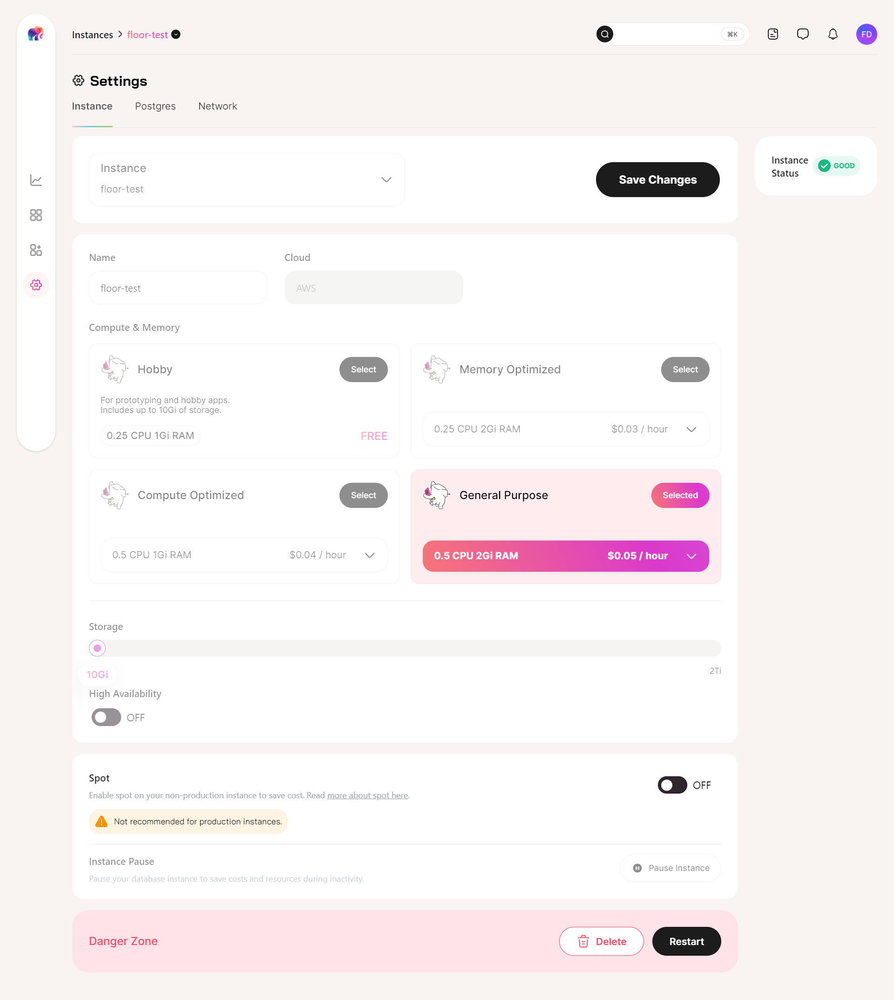
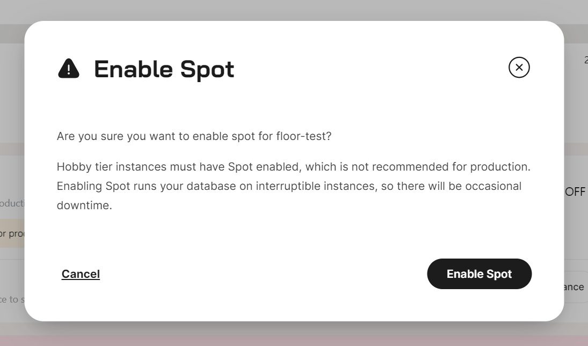

[Tembo Cloud](https://cloud.tembo.io/) now offers Spot instances for running your non-production workloads at a cheaper cost. [Spot](https://aws.amazon.com/ec2/spot/) is an Amazon Web Services (AWS) feature that offers heavily discounted EC2 instances.

## What are Spot instances?

Tembo Cloud uses AWS EC2 instances as compute for your Postgres instances. [Spot instances](https://docs.aws.amazon.com/AWSEC2/latest/UserGuide/how-spot-instances-work.html) are EC2 instances which are available for a significantly cheaper price than the On-demand price. However, the trade-off is that Amazon EC2 might [interrupt](https://docs.aws.amazon.com/AWSEC2/latest/UserGuide/spot-interruptions.html) your Spot instances with two minutes of warning due to capacity, cost, or other constraints.

## Spot instances on Tembo Cloud

When you run your Tembo instances on Spot, you get charged 30% less for CPU and Memory. [Tembo Apps](https://tembo.io/docs/product/cloud/apps/rest-api) associated with your instance will also run on Spot when Spot is enabled.

If Spot instances are not available from AWS, we will automatically move your servers with Spot enabled to an on-demand EC2 instance with no additional charge. In the case of an interruption, Spot relocation is typically less than 10 minutes when HA (High Availability) is not enabled. Downtime is even lesser when [HA is enabled](https://tembo.io/docs/product/cloud/configuration-and-management/high-availability).

Our Hobby tier, recommended for prototyping and hobby apps, will now exclusively use Spot allowing us to support it sustainably.

## When to use Spot?

Spot instances are ideal for non-critical or fault-tolerant workloads that can handle brief, occasional downtimes of up to 10 minutes when AWS reclaims the instances. They're perfect for development environments, experimental projects, or infrequently used instances where you can afford to retry queries after a short delay in exchange for significant cost savings.

Please do not use Spot for instances where you are running production workloads or where availability is critical.

## Enabling Spot

Spot can be picked during instance provisioning or adjusted later in [Settings](/docs/product/cloud/configuration-and-management/spot-instances).

To enable Spot for your instances, go to your Settings view, toggle the Spot setting, and then click Save.

You'll get a pop-up warning reminding you that Spot runs your database on interruptible instances, and that occasional downtime can be expected.

We like transparency, so cost savings are immediately reflected in your instance's overview!

For more information, please refer to [our documentation](https://tembo.io/docs/product/cloud/configuration-and-management/spot-instances).
