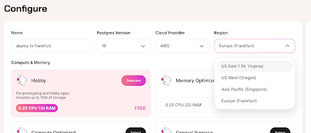

Following customer demand, we've now added the ability to deploy Instances to different Regions in [Tembo Cloud](https://cloud.tembo.io/). This of course is to reduce latency, to keep your data close to where you do your compute, but also because you might have requirements around data residency. 

With this update we've added support for US West (Oregon), Asia Pacific (Singapore) and Europe (Frankfurt), in addition to the already available US East 1 (N Virginia.) We soon plan to add support for all AWS Regions and other major cloud providers in time. 

## Deploying to Regions

When creating an Instance, you can pick a Region using the drop-down selector. 



After deploying an Instance, the Region cannot be changed.

### API
When using the [Tembo API](https://github.com/tembo-io/website/blob/725f4104f33f45fd18fb395a3a0b16fc4f4fedf2/docs/development/api), Providers and Regions are represented as Dataplanes. Dataplanes are where Instances are hosted. A Dataplane is uniquely identified by `provider_id`, `region_id`, and `index`.
Here is a sample of a Dataplane returned by the Tembo Cloud API. 
```
 {
    "index": "data-1",
    "provider_id": "aws",
    "provider_name": "AWS",
    "region": "us-east-1",
    "region_id": "use1",
    "region_name": "US East 1 (N. Virginia)"
  }
```

When you create an Instance, you may specify the Provider and Region using `provider_id` and `region_id`. Tembo decides which index to deploy your Instance into. By default, instances are deployed to `aws`, `use1`.

Some queries to Tembo's APIs involve fetching private data from your Instance, for example [Logs](https://github.com/tembo-io/website/blob/725f4104f33f45fd18fb395a3a0b16fc4f4fedf2/docs/product/cloud/troubleshooting/logs), [Metrics](https://github.com/tembo-io/website/blob/725f4104f33f45fd18fb395a3a0b16fc4f4fedf2/docs/product/cloud/troubleshooting/metrics), and [Secrets](https://github.com/tembo-io/website/blob/725f4104f33f45fd18fb395a3a0b16fc4f4fedf2/docs/product/cloud/security/update-postgres-password). These queries go to the [Dataplane API](https://api.data-1.use1.tembo.io/redoc), which has a different domain name for each Dataplane. This model allows for more secure handling of sensitive information.
Dataplane API domain names are structured like this: `api.< index >.< region_id >.tembo.io`, for example api.data-1.use1.tembo.io. 

For more information, please check the [interactive API documentation](https://api.tembo.io/swagger-ui/#/dataplane/get_all_dataplanes).

## What’s next?

When providers other than AWS are supported, we will include the `provider_id` in the domain name for Providers other than AWS. Supporting other clouds is on our [immediate roadmap](https://roadmap.tembo.io/roadmap/2798765b-6a5e-41eb-876a-971d360966b4) where you can also upvote for clouds you want us to add.

In addition, [Tembo Self Hosted](https://tembo.io/blog/tembo-self-hosted) is already available for you today on [EKS](https://tembo.io/docs/product/software/tembo-self-hosted/install-on-aws-eks), [AKS](https://tembo.io/docs/product/software/tembo-self-hosted/install-on-azure) and [GKE](https://tembo.io/docs/product/software/tembo-self-hosted/install-on-gcp-gke) bringing the full power of Tembo Cloud to your Kubernetes cluster.
